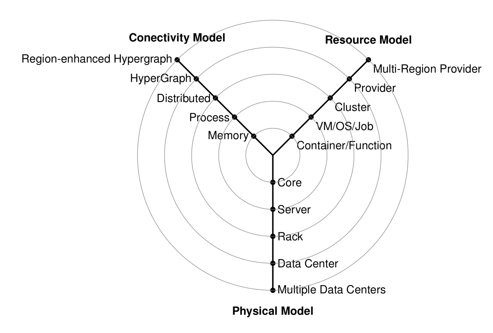

# The Y-Scheduling Architecture View {#sec:y-scheduling}

Previous architectural views, such as the NIST model, focused on high-level service interactions—specifically the distinction between infrastructure, platform, and application layers.

While useful for general categorization, those views often lack the granularity required to develop sophisticated services in a multi-cloud environment. To address this, von Laszewski introduced the **Y-scheduling model**, which more clearly illustrates the interactions between the various layers of resource management and scheduling.

This taxonomy focuses on how resources are mapped to physical models and how they are interconnected to support efficient scheduling algorithms. As shown in @fig:graph-y, the model integrates three primary dimensions:

*   **Physical Model**: Represents the hierarchy of physical resources, enabling scheduling strategies that span multiple data centers, racks, servers, and individual computing cores.
*   **Resource Model**: Defines the types of resources a scheduling algorithm must manage, including containers, serverless functions, virtual machines, batch jobs, virtual clusters, and provider-managed resources across multiple regions.
*   **Connectivity Model**: Defines the relationships and connectivity between components. This includes memory mapping, process communication, and the use of hyper-graphs to formulate hierarchies of provider-based resources. By abstracting connectivity, the model allows the application of both classical and specialized scheduling algorithms.

By adopting this layered approach, developers can separate concerns between the physical infrastructure and the logical resource management, utilizing abstract services to project models at each layer.

{#fig:graph-y}

