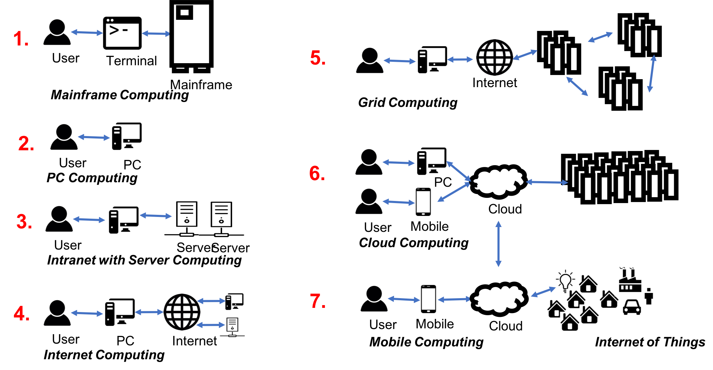
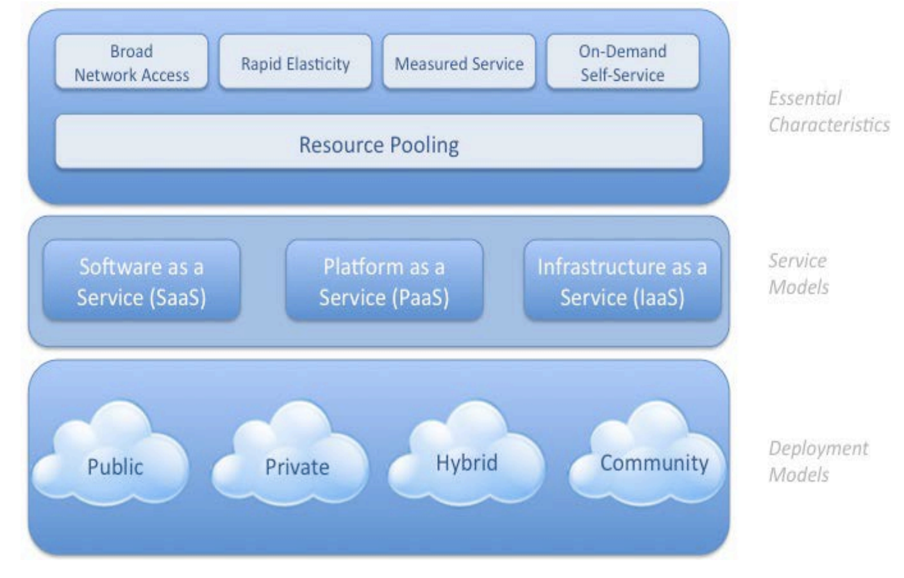
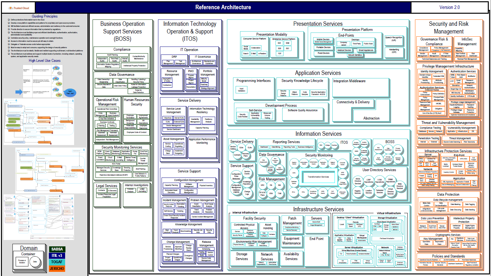
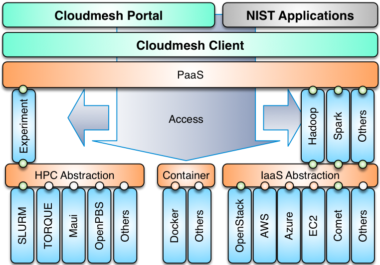

# Cloud Architectures {#sec:cloud-architectures}

!!! learning-outcomes
    **Learning Outcomes**

*   Review the evolution of compute architectures leading up to cloud computing.
*   Analyze major cloud architecture views (Service-based vs. Product-based).
*   Understand the NIST Cloud Computing Reference Architecture.
*   Explore the Cloud Security Alliance (CSA) Reference Architecture.
*   Discuss multi-cloud frameworks and the Cloudmesh architecture.

---

While basic definitions of cloud computing focus on the "as-a-Service" model, there are several alternative architectural views. These views provide different levels of abstraction necessary for detailed implementation and strategic planning.

## Evolution of Compute Architectures

The current state of cloud computing is the result of a long evolution of architectural models. This progression is depicted in @fig:evolution-computer-arch, moving from centralized massive computing to highly distributed edge environments.

{#fig:evolution-computer-arch}

### Mainframe Computing
Mainframe computing is based on the use of massive, highly reliable computers (such as the IBM System z series) to run critical applications, bulk data processing, enterprise resource planning (ERP), and high-volume transaction processing. 

Key attributes of mainframes include:
*   **High Throughput**: Optimized for massive I/O and data processing.
*   **Reliability**: Inbuilt redundancy and hot-swapping capabilities allow these machines to run for years without failure.
*   **Virtualization**: Early mainframes pioneered the use of virtualization to maximize hardware utilization.

### PC Computing
The era of Personal Computing shifted the focus to individual productivity. PCs require a local operating system (Windows, macOS, or Linux) and were initially stand-alone units without network connectivity.

### Intranet and Server Computing
This phase introduced private networks (intranets) within enterprises and homes. This allowed the connection of local resources across Local Area Networks (LAN) and Wide Area Networks (WAN), moving compute resources from the desktop to dedicated servers.

### Grid Computing
A computational Grid is a hardware and software infrastructure providing dependable, consistent, and inexpensive access to high-end computational capabilities. 

While early Grids were primarily used by scientific communities to access supercomputers, they introduced the concept of **Virtual Organizations**, allowing coordinated resource sharing across multiple institutions. This laid the groundwork for the cloud, though the cloud replaced specialized Grid protocols with unified platforms and standardized APIs.

### Internet Computing
With the emergence of WWW protocols, Internet Computing enabled global data sharing and communication facilities. This era saw the rise of early internet service providers (ISPs) and the popularization of web-based services.

### Cloud Computing
Cloud computing is the delivery of computing services—including servers, storage, databases, networking, and software—over the internet. It allows users to rent resources on-demand, reducing the need for maintaining physical data centers and shifting costs from CapEx (Capital Expenditure) to OpEx (Operating Expenditure).

### Mobile and IoT Computing
*   **Mobile Computing**: A diverse set of devices (smartphones, tablets) allowing users to access information from anywhere, dominated by the transmission of data, voice, and video over wireless networks.
*   **Internet of Things (IoT)**: A network of interconnected devices embedded in common objects. These devices use sensors and actuators to collect data and react to their environment.

### Edge and Fog Computing
To reduce latency and bandwidth use, computing is being pushed closer to the data source:
*   **Edge Computing**: Processing performed on the device itself or the very edge of the infrastructure. Only essential processed data is sent to the cloud.
*   **Fog Computing**: A layer of compute and storage located between the edge devices and the cloud. It provides local analytics and coordination for edge devices that lack sufficient power.

## Architectural Models

### The "As-a-Service" Model
The most common view of cloud architecture is the layered service model, which separates concerns between infrastructure providers, platform developers, and software architects.

*   **IaaS (Infrastructure as a Service)**: Provides raw compute, storage, and networking.
*   **PaaS (Platform as a Service)**: Provides a framework for developers to build and deploy applications without managing the underlying OS.
*   **SaaS (Software as a Service)**: Provides a complete software application delivered over the web.

](images/architecture-iaas.png){#fig:iaas-triangle}

### Product-Based Functional Model
Major providers (AWS, Azure, GCP) often present their services as a functional catalog rather than a service layer. This "Product View" groups hundreds of services by their purpose.

For example, in the AWS ecosystem:
*   **Compute**: EC2, Lambda, Fargate.
*   **Storage**: S3, EBS, EFS.
*   **Databases**: RDS, DynamoDB, Aurora.
*   **Machine Learning**: SageMaker.
*   **Networking**: VPC, Route 53, CloudFront.

While presented as products, these can still be mapped to the IaaS/PaaS/SaaS model. Most core AWS services are IaaS or PaaS, enabling others to build integrated SaaS offerings on top of them.

## Reference Architectures

### NIST Cloud Architecture
The National Institute of Standards and Technology (NIST) provides a standardized reference architecture that defines the roles (Cloud Consumer, Provider, Auditor, Broker, Carrier) and the conceptual framework for cloud services.

{#fig:nist-cloud-arch}

### Cloud Security Alliance (CSA) Reference Architecture
The CSA focuses on securing cloud environments. Their architecture is built on principles of trust, resiliency, and auditability. Key guiding principles include:
*   **Centralized Security Policy**: Centralizing oversight and maintenance.
*   **Federated Access**: Delegating access control where appropriate.
*   **Elasticity**: Ensuring security patterns support multi-tenant, resilient platforms.
*   **Layered Protection**: Addressing security at the network, OS, and application levels.

{#fig:csa-arch}

## Multicloud Architectures

To avoid **vendor lock-in**, organizations increasingly adopt multicloud strategies. This involves integrating services from multiple cloud providers into a single architectural framework.

### Cloudmesh Architecture
Cloudmesh is an early example of a multi-cloud framework designed to provide a unifying abstraction layer across different providers (e.g., AWS, GCP, OpenStack).

The Cloudmesh architecture provides:
*   **IaaS Abstraction**: A unified API to manage VMs and storage across different clouds.
*   **Container Integration**: Support for Kubernetes and Docker.
*   **Client API & Shell**: A command-line interface that allows users to switch between cloud providers using a single variable.

**Modern Cloudmesh (v4.0)**
The current version of Cloudmesh is being rebuilt from the ground up with a focus on:
*   **Python 3**: Full implementation using modern Python.
*   **OpenAPI**: REST services based on the OpenAPI specification for better interoperability.
*   **MongoDB**: Portable data management for service configurations.
*   **Containerization**: Deployment via containers to ensure cross-platform consistency.

{#fig:cloudmesh-arch}

## Resources

*   [AWS Cloud Best Practices](https://media.amazonwebservices.com/AWS_Cloud_Best_Practices.pdf)
*   [Oracle Cloud Reference Architecture](http://www.oracle.com/technetwork/topics/entarch/oracle-wp-cloud-ref-arch-1883533.pdf)
*   [NIST Cloud Computing Definition](https://nvlpubs.nist.gov/nistpubs/SpecialPublications/NIST.SP.800-145.pdf)