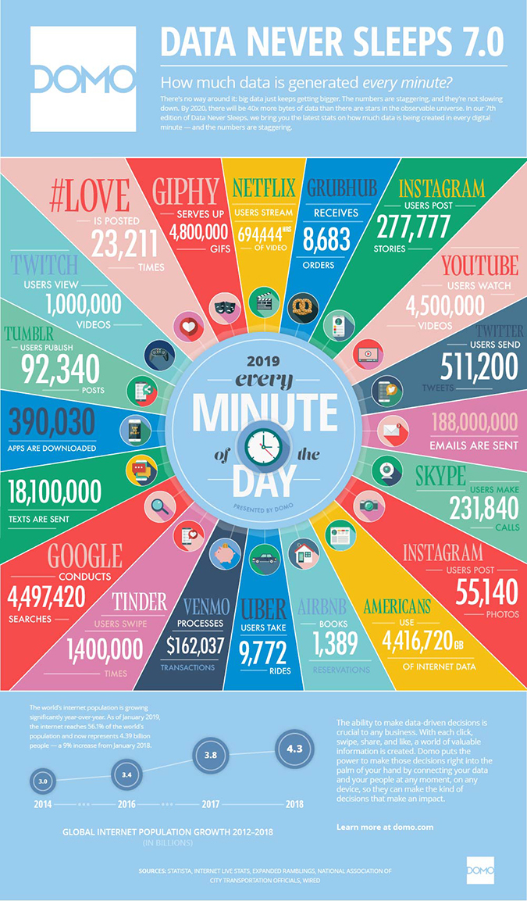
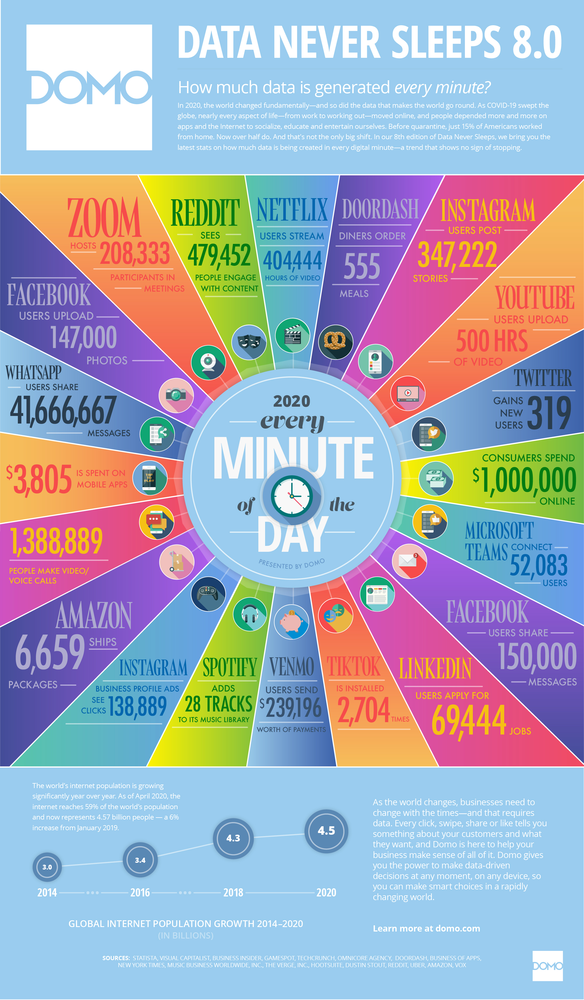

# Data Centers {#sec:data-center}

!!! learning-outcomes
    **Learning Outcomes**

*   Define what a data center is and its role in the cloud ecosystem.
*   Identify key operational and performance metrics, specifically Power Usage Effectiveness (PUE).
*   Distinguish between traditional enterprise data centers and hyperscale cloud data centers.
*   Analyze the physical and logical infrastructure required to support massive scale.

---

## Motivation: The Data Explosion

To understand why we need massive, specialized facilities, we must first comprehend the scale of data being generated globally. In the modern era, data is produced at an exponential rate by billions of IoT devices, social media platforms, and enterprise systems.

### Visualizing Global Data Flow: "Data Never Sleeps"

It is often difficult to conceptualize total annual data growth. Instead, industry analysts often use "per-minute" snapshots to visualize the scale of activity. The **"Data Never Sleeps"** series is a primary example, illustrating the volume of data generated by popular services every 60 seconds.

By analyzing these snapshots over time, we can identify critical shifts in how humanity generates and consumes data.

#### Historical Snapshots (2017–2020)

{#fig:data-never-sleeps}
*   **2017 Observations**: Dominated by traditional search (Google) and the rise of early mobile messaging. High volumes of weather and news requests.

{#fig:data-never-sleeps-7}
*   **2019 Observations**: A visible shift toward video consumption. YouTube and Netflix traffic grows significantly, while traditional text-based interactions begin to plateau.

{#fig:data-never-sleeps-8}
*   **2020 Observations**: The "Pandemic Effect." A massive surge in remote work and communication tools (Zoom, Teams) and the global explosion of TikTok, which fundamentally changed the "per-minute" data profile toward short-form video.

#### The Modern Era (2021–2026)

While the traditional "Data Never Sleeps" infographics have evolved, the trends from 2021 to 2026 show a clear progression toward **AI-generated data** and **hyper-connectivity**.

*   **2021–2022: The Short-Form Pivot**: This period saw the absolute dominance of TikTok and the aggressive response from Meta (Reels) and Google (Shorts). Data generation shifted from "searching for content" to "consuming algorithmic feeds," drastically increasing the bandwidth required per user.
*   **2023–2024: The Generative AI Surge**: The release of LLMs (like GPT-4) introduced a new type of data generation. We moved from human-created content to **synthetic data**. A single AI query can trigger a chain of data generation and retrieval far more complex than a traditional keyword search.
*   **2025–2026: The Edge and Spatial Computing Era**: With the proliferation of 5G-Advanced and Spatial Computing (VR/AR), data is no longer just "sent to the cloud." We see a massive increase in **Edge Data**—data processed locally at the device or tower level—reducing the latency for immersive experiences.

**Key Trend Summary:**
The evolution from 2017 to 2026 demonstrates a transition from **Structured Search** $\rightarrow$ **Algorithmic Feeds** $\rightarrow$ **Generative AI**. This trajectory is what necessitates the shift from traditional data centers to the hyperscale, AI-optimized facilities discussed in the following sections.

### The Trend Toward Exponential Growth
The growth of data is driven by several key shifts:
*   **From Desktop to Mobile**: Data generation moved from centralized PC use to ubiquitous mobile access.
*   **From Human to Machine**: The rise of the Internet of Things (IoT) means sensors now generate more data than humans.
*   **The AI Era**: The training and inference of Large Language Models (LLMs) have created a new surge in demand for specialized data centers equipped with GPUs and TPUs.

This exponential growth makes traditional on-premises server rooms obsolete for most organizations, driving the transition toward the hyperscale cloud data centers.

## Cloud Data Centers

A **data center** is a specialized facility that houses the IT infrastructure (servers, storage, and networking) necessary to serve a large number of customers. 

### Evolution of the Data Center
Data centers evolved from simple server rooms to massive industrial complexes:
1.  **Early Mainframes**: Large rooms dedicated to a single massive computer.
2.  **Enterprise Server Rooms**: Clusters of servers serving a specific organization.
3.  **Internet Data Centers (IDCs)**: Facilities focused on web hosting and early e-commerce.
4.  **Hyperscale Cloud Data Centers**: Massive facilities (like those operated by AWS, Google, and Azure) that provide on-demand, virtualized resources to millions of users.

### The "Long Tail of Science"
In academia, data centers often support a different model. While "leadership class" supercomputers serve the top 20% of high-impact researchers, the "long tail of science" comprises the remaining 80% who require smaller but still significant resources. This has led to the growth of research clouds and distributed clusters.

## Data Center Infrastructure

Regardless of size, most data centers share a common set of components:

### 1. Facility
The physical building. Requirements include:
*   **Security**: Perimeter fencing, biometric access, and surveillance.
*   **Environmental Controls**: Protection against fire, flood, and seismic activity.
*   **Location**: Often chosen based on cheap energy, cool climates, or proximity to fiber-optic backbones.

### 2. Support Infrastructure
The "non-IT" equipment that keeps the servers running:
*   **Power**: Uninterruptible Power Supplies (UPS) and diesel generators to prevent outages.
*   **Cooling**: Computer Room Air Conditioners (CRACs), chillers, and ventilation systems.
*   **Connectivity**: High-speed routers and switches connecting the facility to the global internet.

### 3. IT Equipment
The actual computing resources:
*   **Servers**: Rack-mounted blades or chassis.
*   **Storage**: SAN (Storage Area Networks) or NAS (Network Attached Storage) arrays.
*   **Networking**: Top-of-Rack (ToR) switches and core routers.

### 4. Operations Staff
Reliable operation requires specialized teams:
*   **IT Staff**: System administrators and network engineers.
*   **Facility Staff**: Electrical and HVAC engineers.
*   **Security Staff**: Physical security personnel.

## Data Center Metrics

### Power Usage Effectiveness (PUE)
PUE is the most common metric used to measure the energy efficiency of a data center. It compares the total energy used by the facility to the energy actually delivered to the IT equipment.

**The Formula:**
$$\mathrm{PUE} = \frac{\mathrm{Total~Facility~Energy}}{\mathrm{IT~Equipment~Energy}}$$

A PUE of **1.0** is the theoretical ideal, meaning 100% of the energy goes to the servers. In reality, energy is lost to cooling, lighting, and power conversion.

| PUE | Efficiency Level | Note |
| :--- | :--- | :--- |
| 3.0 | Very Inefficient | Legacy or poorly managed facilities |
| 2.0 | Average | Common in older enterprise data centers |
| 1.5 | Efficient | Modern standard for most providers |
| 1.2 | Very Efficient | Achieved by hyperscalers (Google, AWS) |
| 1.1 | World Class | Cutting-edge facilities with extreme cooling |

### Energy Costs: Demand vs. Consumption
Data centers are billed for two types of electricity:
1.  **Consumption (kWh)**: The total amount of energy used over time.
2.  **Demand (kW)**: The peak amount of power required at any single moment.

**Why Virtualization Helps:** By using virtualization to consolidate workloads, data centers can run fewer servers at higher utilization. This "levels out" the power demand, reducing the expensive peak-demand charges from utility companies.

## Thermal Management and Cooling

### The Physics of Cooling
Servers generate heat. If this heat is not removed, the CPU will **thermally throttle** (reduce clock speed) or shut down to prevent permanent damage. Cooling is based on the heat transfer principle:
$$q = h_c A (t_a - t_s)$$
Where $q$ is heat transfer, $t_a$ is the ambient air temperature, and $t_s$ is the surface temperature. To maximize $q$, we must maximize the temperature difference ($\Delta T$).

### Hot-Cold Aisle Configuration
To prevent hot exhaust air from mixing with cold intake air, engineers use a **Hot-Cold Aisle** layout.
*   **Cold Aisles**: The front of the servers face each other, and cold air is pumped into this aisle.
*   **Hot Aisles**: The backs of the servers face each other, and hot exhaust is collected and removed.

### Advanced Containment
*   **Cold Aisle Containment**: Physical barriers (curtains or glass) seal the cold aisle, ensuring the servers only draw in chilled air.
*   **Hot Aisle Containment**: The hot exhaust is captured in a sealed chimney-like structure and sent directly to the cooling system.
*   **Rear Door Heat Exchangers**: Water-cooled doors are installed on the back of racks to remove heat immediately before it enters the room.

## Example Data Centers

### Hyperscale Providers (AWS, Azure, GCP)
Modern cloud providers organize their infrastructure into a hierarchy:
*   **Regions**: Geographic areas (e.g., `us-east-1`) that are completely independent.
*   **Availability Zones (AZs)**: One or more discrete data centers within a region. They have redundant power and networking but are physically separated to protect against local disasters (e.g., fire or flood).

### Research and Academic Centers
*   **XSEDE / Jetstream**: These provide high-end cyberinfrastructure for scientists, often blending traditional HPC (batch queues) with cloud-like VM provisioning.
*   **Chameleon Cloud**: A specialized environment for cloud researchers to experiment with the underlying infrastructure (e.g., OpenStack).

## Innovative and Sustainable Approaches

### Project Natick (Underwater Data Centers)
Microsoft's Project Natick experimented with deploying data centers in sealed underwater vessels.
*   **Advantages**: Natural cooling from the ocean, proximity to coastal cities (reducing latency), and use of renewable energy (e.g., tidal or wind).
*   **Results**: The vessels achieved extremely low PUEs (around 1.07) and required almost no freshwater for cooling.

### Renewable Energy
To reduce their carbon footprint, hyperscalers are shifting toward:
*   **Solar and Wind**: Building massive farms to power their regions.
*   **Hydroelectric**: Locating data centers in regions with cheap, stable hydro power (e.g., Quebec, Norway).
*   **Waste Heat Recovery**: Using the heat generated by servers to warm nearby residential buildings.

## Assignments

!!! assignment "Assignment 1: PUE Analysis"
    Research a major cloud provider's sustainability report. Find their reported average PUE and compare it to the efficiency table in this section.

!!! assignment "Assignment 2: Thermal Calculation"
    Using the heat transfer formula, calculate how the cooling efficiency changes if the ambient air temperature ($t_a$) increases by 10 degrees. What is the impact on the maximum power a server can dissipate?

!!! assignment "Assignment 3: Region vs. AZ"
    Explain the difference between an AWS Region and an Availability Zone. Why would a developer deploy their application across multiple AZs?

!!! assignment "Assignment 4: Carbon Footprint"
    Use an online carbon footprint calculator to estimate the annual CO2 emissions of a small data center running 100 servers, each consuming 500W, assuming a standard US power grid mix.