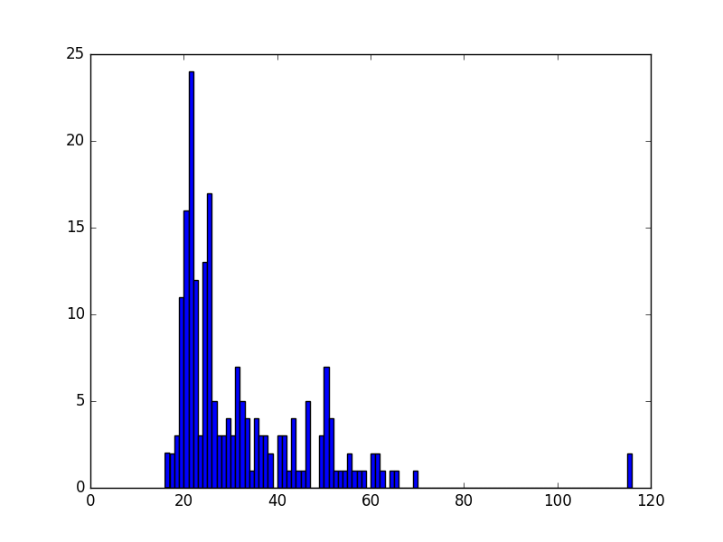

# Markdown

Markdown is a simple markup language; however, there is no single, uniform standard defined for it, and different implementations may have features not supported by others. Nevertheless, using the basic features provides a simple and easy way to quickly develop clean, structured documents. The emphasis here is on structure; in contrast to WYSIWYG editors, it is not only important that your document looks good, but that the structure of the document is reflected in its layout. Therefore, you must use proper headings rather than simply making text bold to simulate a heading.

## Markdown Format

### Quick Reference

| Element | Syntax | Result |
| :--- | :--- | :--- |
| Heading 1 | `# Text` | Largest Heading |
| Heading 2 | `## Text` | Section Heading |
| Heading 3 | `### Text` | Subsection Heading |
| Bold | `**Text**` | **Bold Text** |
| Italic | `*Text*` | *Italic Text* |
| Monospace | `` `Text` `` | `Code/Monospace` |
| Link | `[Text](URL)` | [Clickable Link] |
| Image | `` | Embedded Image |
| Quote | `> Text` | Blockquote |
| List | `* Item` | Bullet Point |

### Basic Syntax

To create headings, use the hash symbol:
~~~markdown
# Heading 1
## Heading 2
### Heading 3
~~~

Paragraphs are separated by a blank line. This is important; there must also be a blank line after a heading.

**Text attributes:**
~~~markdown
*italic*
**bold**
`monospace`
~~~

**Horizontal rule:**
~~~markdown
---
~~~

**Bullet list:**
~~~markdown
* Item 1
* Item 2
* Item 3
~~~

**Numbered list:**
~~~markdown
1. First
2. Second
3. Third
~~~

**Links:**
~~~markdown
[Example Link](http://example.com)
~~~

**URLs:**
~~~markdown
[Google](http://www.google.com)
or
<http://www.google.com>
~~~

**Images:**
Images must be stored locally and must not use HTTP references. All images must be placed in a directory called `images/`.
~~~markdown

~~~
Any figure used in the text must be referred to with a figure caption and label. Images cannot be embedded in itemized lists.

**Quotes:**
In our publications, quotes are indicated by placing a `>` in front of each quoted line. The source must be clearly indicated before or after the quote:
~~~markdown
> "This is a quote" [@label].
~~~
Note that the period follows the citation label. Alternatively, you can introduce a quote as follows:
~~~markdown
In [@label], we find the following list of properties:
> * Property 1
> * Property 2
~~~
In the case of lists, we avoid using additional quotation marks to prevent confusion, but the `>` symbol clearly indicates that the text is a quote.

**Common Errors to Avoid:**

* Missing empty lines before and after sections.
* Using `-` or `=` for section underlines instead of `#`.
* Using incorrect numbers of `#` for headings.
* Using `#` to simulate bold text.
* Missing empty lines before and after code block boundaries.
* Not left-indenting text in code blocks.
* Not ending code blocks properly.
* Using incorrect spacing in lists.
* Not using a spell checker.
* Having spaces in front of numbered list items.
* Not using 80-character block formatting (which ensures better display across different editors).

## Editors

Several tools make writing documents in Markdown easy. We recommend following structure guides rather than focusing solely on the visual output. Most editors do not render Markdown perfectly in real-time as they are not intended to be WYSIWYG editors. You must ensure that your Markdown is valid and follows our conventions, regardless of the editor used.

Recommended editors:

* **Emacs**: A powerful, universal editor with excellent Markdown support. For macOS, Aquamacs and CarbonEmacs are recommended.
* **PyCharm**: Highly recommended for Python programming; it includes a robust Markdown editing mode.
* **Visual Studio Code**: A lightweight but powerful editor from Microsoft with excellent Markdown support and extensions. Available at <https://code.visualstudio.com/>.

## Conversion

To convert Markdown to other formats, we recommend using `pandoc`.

You can often convert existing text to Markdown. However, be cautious: converted documents may not produce the clean Markdown required for our projects. You may need to manually clean up the text, fix character encoding, and correct spacing.

Pandoc is the most powerful converter available and can convert Markdown to and from various formats, including ePub, PDF, and HTML.

!!! warning
    While Pandoc can convert from MS Word (`.docx`), Word's character sets often introduce noise that requires manual cleanup. Experience shows it is faster and easier to write the document directly in Markdown using Emacs, PyCharm, or VS Code.

### Conversion with Pandoc

Pandoc is a versatile tool for converting file formats. It supports Markdown, reStructuredText, textile, HTML, DocBook, LaTeX, MediaWiki, TWiki, TikiWiki, Creole 1.0, Vimwiki, OPML, Emacs Org-Mode, Emacs Muse, txt2tags, Microsoft Word docx, LibreOffice ODT, ePub, and Haddock markup.

Website: <https://pandoc.org/>

To convert a file, use the `-o` option to specify the output file:
~~~markdown
pandoc filename.md -o filename.tex
~~~
In this example, a Markdown file is converted to LaTeX. As this document itself was created with Pandoc, we encourage you to review our `Makefile` to see how we utilize its advanced features.

#### Pandoc Cheat Sheet

| Flag | Description | Example |
| :--- | :--- | :--- |
| `-o` | Specify output file | `-o output.pdf` |
| `-f` | Specify input format | `-f markdown` |
| `-t` | Specify output format | `-t latex` |
| `--filter` | Apply a Pandoc filter | `--filter pandoc-crossref` |
| `--verbose` | Show detailed output | `--verbose` |
| `--standalone` | Create a full document | `--standalone` |

### Advanced Pandoc

Pandoc supports extensions and filters. Useful packages include:

* **Include files**: <http://pandoc.org/filters.html#include-files>
* **Integration of R**: <https://github.com/cdupont/r-pandoc>
* **Figure numbers**: <https://github.com/tomduck/pandoc-fignos>
* **Equation numbers**: <https://github.com/tomduck/pandoc-eqnos>
* **Table numbers**: <https://github.com/tomduck/pandoc-tablenos>
* **Cross-references**: <https://github.com/lierdakil/pandoc-crossref>
* **Section numbering**: <https://github.com/chdemko/pandoc-numbering>
* **CSV tables**: <https://github.com/baig/pandoc-csv2table>
* **Inline CSV tables**: <https://github.com/mb21/pandoc-placetable>

In our framework, we utilize `crossref` and `crosscite`.

#### Mermaid

Mermaid is a tool that allows you to create diagrams and graphs using a simple description language. It supports flowcharts, sequence diagrams, Gantt charts, and UML-like diagrams.

* **Live Editor**: [Mermaid Live Editor](https://mermaidjs.github.io/mermaid-live-editor/)
* **Pandoc Plugin**: [mermaid-filter](https://github.com/raghur/mermaid-filter)

**Installation:**
~~~markdown
npm install --global mermaid-filter
~~~

**Sequence Diagram Example:**
~~~mermaid
sequenceDiagram
    Alice->>John: Hello John
    John-->>Alice: Hello Alice
~~~

**Flowchart Example:**
~~~mermaid
graph LR
    Start --> End
~~~

## Presentations in Markdown

Below are several resources on how to use Markdown to create presentation slides:

* [Marp](https://yhatt.github.io/marp/)
* [Slidify](http://slidify.org/)
* [R Markdown Lesson 11](https://rmarkdown.rstudio.com/lesson-11.html)
* [GitPitch Slide Markdown](https://github.com/gitpitch/gitpitch/wiki/Slide-Markdown)

### Markdown to PPTX

`Pandoc` allows you to export Markdown directly to PowerPoint (`.pptx`).
~~~markdown
pandoc filename.md -o filename.pptx
~~~
This creates a basic PowerPoint presentation which you can then refine. We recommend using PowerPoint's "Outline View" to better organize bullet points and slides.

## Validating Markdown

While various tools exist for validating Markdown, they often lack the specific syntactic and semantic checks required for our academic papers. Therefore, we recommend manually inspecting your files.

Since Markdown is a simple format, validation is generally straightforward. We recommend performing a local checkout of the ePub, compiling it, and reviewing your specific section's contribution.

For automated linting, you can use:
* [remark-lint](https://github.com/remarkjs/remark-lint)

**Note:** We recommend copying your file to a separate directory before running `remark-lint`, as it may install additional dependencies in the current directory.

## References

* [Wikipedia: Markdown](https://en.wikipedia.org/wiki/Markdown)

## Writing Papers and Reports with Markdown

This section summarizes requirements specific to our academic submissions.

### Proper Use of `<>`

Avoid using "greater than" (`>`) and "less than" (`<`) characters without proper quoting, especially when referring to command-line parameters or keys. If not quoted, they may be interpreted as raw HTML. Always use backticks:
~~~markdown
`<key>` or `command <parameter>`
~~~

### URLs in Markdown

URLs must be wrapped in proper Markdown syntax:
~~~markdown
[text](url)
or
<url>
~~~

### Use Asterisks instead of Underscores

To avoid issues during document translation and conversion, please use asterisks (`*`) for emphasis:
~~~markdown
*italic*
**bold**
~~~

### Hyperreferences to Other Sections

Ensure the link target is correct and contains no spaces:
~~~markdown
# This is my header
...
[Section](#this-is-my-header)
~~~

### Code in Markdown

Use fenced code blocks with the appropriate language tag for syntax highlighting.

**Example Python block:**
~~~markdown
```python
# Example Python code
print("Hello World")
```
~~~

**Example Bash block:**
~~~markdown
```bash
$ ls -la
$ echo "Hello World"
```
~~~

#### Documenting Code Blocks (Raw Syntax)

To display the raw syntax of a code block without it being rendered, wrap the code block in a larger fence using more backticks than the inner block contains, or use tildes (`~~~`).

**Example using tildes:**
~~~markdown
~~~markdown
```python
print("This will be shown as raw text")
```
~~~
~~~

**Example using four backticks:**
~~~markdown
````markdown
```python
print("This will also be shown as raw text")
```
````
~~~

!!! note
    Please ensure there is an empty line both before and after every code block.

### Citations in Markdown

To avoid duplication, reuse references from other contributors. If you find an error in a shared reference, please fix it in both your own `.bib` file and the source file where you found it. Use consistent labels to ensure cross-referencing works correctly.

We strongly recommend using **JabRef** or **Emacs** to manage your bibliographies. Syntactically incorrect bibliographies will result in a deduction of points.

**File Naming Conventions:**
* **Papers**: Use `paper.md` and `paper.bib`.
* **Reports**: Use `report.md` and `report.bib`.
* **Images**: All images must be placed in an `images/` directory.

To cite a reference, use the `[@label]` syntax:
~~~markdown
Google [@www-google] is a company that offers cloud services.
~~~

**Example BibTeX entry:**
~~~markdown
```bibtex
@Misc{www-google,
    author = {{Google}},
    title = {Google Search},
    howpublished = {\url{https://www.google.com}},
    year = {2023}
}
```
~~~

### Markdown and BibTeX

We use Markdown instead of LaTeX for this class. We provide a centralized build process that generates the proceedings for you weekly (and often daily). We recommend checking the generated ePubs regularly.

Refer to the **Scientific Writing II** document for guidance on creating high-quality BibTeX entries:
<https://github.com/cloudmesh-community/book/blob/master/README.md>

You may also find this resource helpful:
http://cyberaide.org/papers/vonLaszewski-latex.pdf

#### Using BibTeX in MkDocs

You can use BibTeX in MkDocs by installing the `mkdocs-bibtex` plugin. This plugin processes Pandoc-style citations and generates a bibliography automatically.

**Prerequisites**
Pandoc must be installed on your operating system.

**Setup Instructions**

1. **Install the Plugin**
   ~~~markdown
   pip install mkdocs-bibtex
   ~~~

2. **Configure `mkdocs.yml`**
   ~~~yaml
   plugins:
     - search
     - bibtex:
         bib_file: "refs.bib"
         cite_style: "pandoc"
   ~~~

3. **Use Citations in Markdown**
   * Standard citation: `[@cite_key]`
   * Multiple citations: `[@first_cite; @second_cite]`
   * Inline citation: `@cite_key`

4. **Render the Bibliography**
   By default, the plugin appends a reference list to the bottom of pages. To manually place it:
   ~~~text
   \bibliography
   ~~~

**Important Formatting Reminder:**
Always include an empty line before and after headings, quotes, lists, and paragraphs. Paragraphs should not be indented with tabs or spaces.

### BibTeX Validation

Using Emacs or JabRef ensures that commas and brackets are placed correctly. If you use the command line, we recommend running `biber` to validate your files.

Ensure that:
1. Labels contain no spaces.
2. Entry types are correct.
3. Company authors are enclosed in double brackets (e.g., `author = {{Google}}`).

### Using Pandoc for Local Validation

You can verify your documents locally using Pandoc. For a directory with `report.md`, `report.bib`, and `images/test.png`, use:

~~~markdown
pandoc --verbose --filter pandoc-crossref -f markdown+header_attributes -f markdown+smart -f markdown+emoji --indented-code-classes=bash,python,yaml -o paper.epub paper.md
~~~

**Samples for reference:**
* [Sample Project Report](https://github.com/cloudmesh-community/proceedings-fa18/tree/master/project-report)
* [Sample 2-Page Paper](https://github.com/cloudmesh-community/proceedings-fa18/tree/master/paper)

### Final Submission Checklist

Before submitting your work, ensure you have verified the following:
- [ ] **File Naming**: Is the markdown file named `paper.md` or `report.md` and the bibliography `paper.bib` or `report.bib`?
- [ ] **Images**: Are all images stored locally in an `images/` directory?
- [ ] **Syntax**: Did you use asterisks (`*`) for italics and bold instead of underscores (`_`)?
- [ ] **Structure**: Are there empty lines before and after every heading, quote, list, and code block?
- [ ] **Citations**: Are all technology references cited? Do citation keys contain no spaces or underscores?
- [ ] **Validation**: Have you compiled your document locally (e.g., using Pandoc) to check for rendering errors?

## Original References are a Must

It is mandatory to cite the original references for the technologies you use. The first mention of a technology is the ideal place for the citation.

**Example:**
~~~markdown
Google [@www-google] is a company that offers cloud services.
~~~
In this case, `www-google` is the label in the BibTeX entry representing the Google homepage.