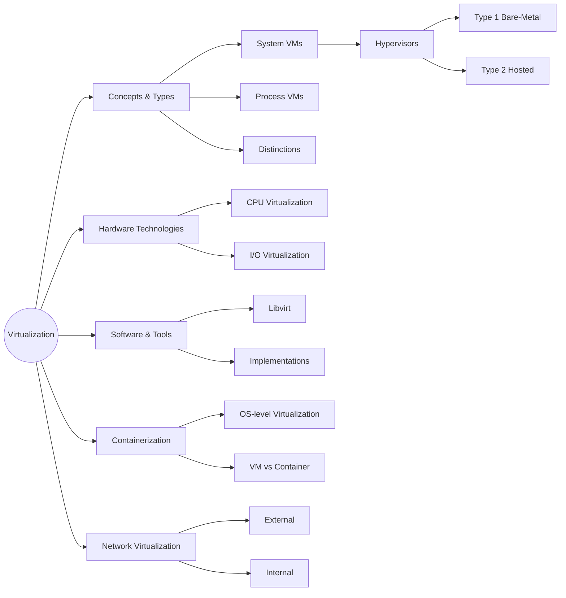

```mermaid
graph LR
    V((Virtualization)) --> CT[Concepts & Types]
    V --> HW[Hardware Technologies]
    V --> ST[Software & Tools]
    V --> CON[Containerization]
    V --> NV[Network Virtualization]

    CT --> SV[System VMs]
    CT --> PV[Process VMs]
    CT --> DST[Distinctions]

    SV --> HYP[Hypervisors]
    HYP --> T1[Type 1 Bare-Metal]
    HYP --> T2[Type 2 Hosted]

    HW --> CPU[CPU Virtualization]
    HW --> IO[I/O Virtualization]

    ST --> LB[Libvirt]
    ST --> IMP[Implementations]

    CON --> OSV[OS-level Virtualization]
    CON --> VMC[VM vs Container]

    NV --> EXT[External]
    NV --> INT[Internal]
```
