# Introduction to Cloud Computing 
Presenter: Gregor von Laszewski

!!! note "Learning Outcome"
    
    - **Goal:** Provide a comprehensive, practical view of cloud computing, from fundamentals to day‑to‑day operational best practices.  
    - **Outcomes for attendees:**  
    1. Accurately describe core cloud concepts and terminology.  
    2. Select the proper service and deployment model for a given workload.  
    3. Navigate the console of a major cloud provider.  
    4. Apply security and cost‑optimization best practices.  


---  
## Agenda  

|     |     |     |
| --- | --- | --- |
| 1. | Poll  | Test Piazza |
| 2. | What is Cloud Computing?  | Definition, evolution, business value |
| 3. | Service Models (IaaS / PaaS / SaaS)  | Explain differences and use‑cases |
| 4. | Deployment Models  | Public, Private, Hybrid, Community |
| 5. | Core Enabling Technologies |  Virtualization, Containers, Serverless |
| 6. | Architecture & Design Principles |   Scalability, resilience, automation |
| 7. | The Big Three Providers  | AWS, Azure, GCP – high‑level comparison |
| 8. | Storage Services  | Object, Block, File, Archive |
| 9. | Networking in the Cloud | VPC, subnets, load balancers, CDN |
| 10. | Security & Compliance  | IAM, encryption, shared responsibility, checklist |
| 11. | Monitoring, Logging & Operations | Metrics, alerts, log aggregation, drift detection |
| 12. | Cost Management & Optimization  | Pricing models, tagging, rightsizing, TCO tools |
| 13. | Migration Strategies  | Lift‑and‑Shift, Re‑platform, Refactor, Hybrid |
| 14. | Emerging Trends  | Edge, Multi‑cloud, Generative AI, Quantum, Sustainability |
| 15. | Case Studies  | Success‑story snapshots |
| 16. | Q&A & Wrap‑up  | Answer questions, next steps  |

# 1. Introductory Poll

1. Who has already used a cloud service? (show of hands in Zoom). 

2. Which cloud services have you used? (Piazza).

3. What cloud services are you most interested in? (We may not have the time to cover them, but let's list them here. Use Zoom.)


---  
# 2. What is Cloud Computing?  

- **NIST definition:** “A model for enabling ubiquitous, convenient, on‑demand network access to a shared pool of configurable computing resources….”  
- **Core attributes:** On‑Demand Self‑Service, Broad Network Access, Resource Pooling, Rapid Elasticity, Measured Service.  
- **Evolution timeline:** 
Mainframe → Client‑Server → Metacomputing → Grid Computing → Virtualization → Cloud (2006‑present).  

## Era Breakdown: Evolution of Computing


<!--
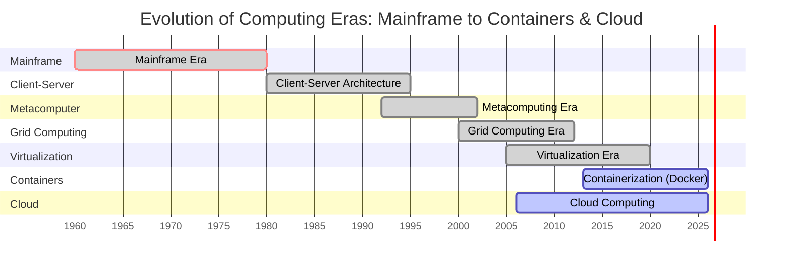
```mermaid
%%{init: { "flowchart": { "useMaxWidth": false } } }%%
gantt
    title Evolution of Computing Eras: Mainframe to Containers & Cloud
    dateFormat  YYYY
    axisFormat %Y
    tickInterval 5year

    section Mainframe
    Mainframe Era               :crit, done, 1960, 1980

    section Client-Server
    Client-Server Architecture  :done, 1980, 1995

    section Metacomputer
    Metacomputing Era           :done, 1992, 2002

    section Grid Computing
    Grid Computing Era          :done, 2000, 2012

    section Virtualization
    Virtualization Era          :done, 2005, 2020

    section Containers
    Containerization (Docker)   :active, 2013, 2026

    section Cloud
    Cloud Computing             :active, 2006, 2026
```
Because it may not render correctly here, the PNG is provided as follows:

-->

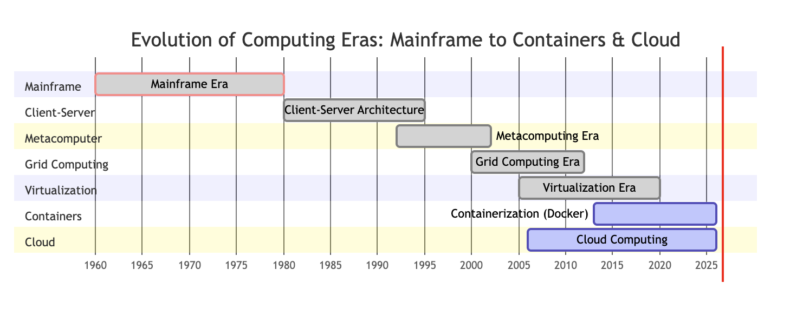

### Mainframe Era (1960–1980)
* What it is: Centralized, heavy-duty processing power housed in climate-controlled datacenters and accessed primarily via dumb terminals.

* Characteristics: Monolithic hardware, batch processing, time-sharing, and massive upfront capital costs. It laid the foundational principles of multi-user computing.

### Client-Server Architecture (1980–1995)

* What it is: The decentralization of computing powered by the rise of personal computers (PCs) acting as clients that queried centralized local servers.

* Characteristics: Distributed workloads, local user interfaces, relational databases, and Local Area Network (LAN) connectivity, moving computing power closer to the desktop.

### Metacomputing Era (1992–2002)
* What it is: The conceptual precursor to distributed computing, focused on linking heterogeneous supercomputers and high-performance resources over high-speed networks to act as a single virtual computer.

* Characteristics: Experimental testbeds (like I-WAY), early resource reservation protocols, and bridging geographically separated high-performance computing centers.

### Grid Computing Era (2000–2012)
* What it is: Coordinated resource sharing and virtual organizations across institutional boundaries, transforming metacomputing concepts into standardized, large-scale architectures.

* Characteristics: Pioneered by toolkits like the Java CoG Kit and Globus Toolkit, powering national supercomputing infrastructures like TeraGrid and XSEDE.

### Virtualization Era (2005–2020)
* What it is: The abstraction of physical hardware layers through hypervisors, enabling multiple virtual machines (VMs) to run independently on a single physical server.

* Characteristics: Dramatically improved hardware utilization, simplified server consolidation, easier disaster recovery, and enabled the foundational multi-tenant architecture required by early public clouds.

### Containerization (2013–Present)
* What it is: Lightweight, portable OS-level virtualization that packages an application and its dependencies together, isolating them from the host system.

* Characteristics: Fueled by Docker, Kubernetes, and HPC solutions like Apptainer, containerization revolutionized modern microservices, CI/CD pipelines, and reproducible AI model deployments.

### Cloud Computing (2006–Present)
* What it is: On-demand delivery of compute, storage, platforms, and AI resources over the internet, scaling dynamically under an OpEx model.

* Characteristics: Elastic scaling, self-service provisioning, multi-cloud orchestration, and seamless integration with modern container and AI execution environments.


# 2.1 Shift from Capital‑expenditure to Operational‑expenditure

This timeline illustrates how businesses have fundamentally changed how they invest in and manage IT infrastructure over the past three decades, moving away from heavy upfront hardware purchases toward flexible, subscription-based cloud services.

!!! note
    Instead of buying hardware the money is spend on doing the operation.

<!-- 
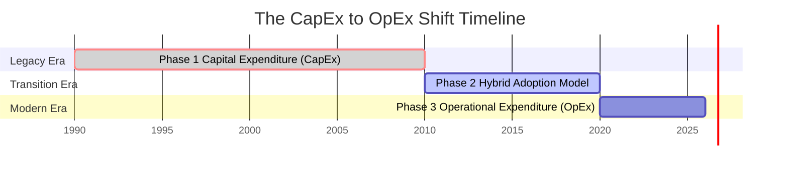
``` mermaid
gantt
    title The CapEx to OpEx Shift Timeline
    dateFormat  YYYY
    axisFormat %Y
    tickInterval 5year

    section Legacy Era
    Phase 1 Capital Expenditure (CapEx) :crit, done, 1990, 2010

    section Transition Era
    Phase 2 Hybrid Adoption Model       :active, 2010, 2020

    section Modern Era
    Phase 3 Operational Expenditure (OpEx) :2020, 2026
```
--->

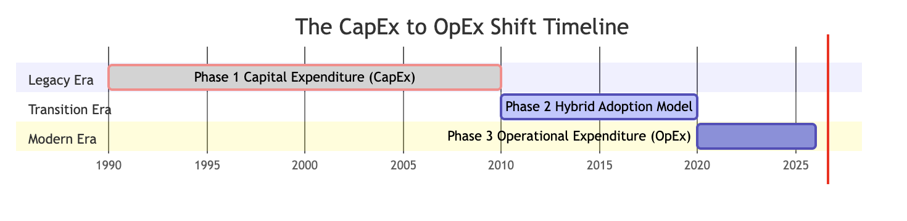

## Phase Breakdown

### Phase 1: Capital Expenditure (CapEx) Era (1990–2010)
* What it is: The traditional data center model. Companies had to purchase physical servers, networking gear, storage arrays, and real estate (datacenter space) upfront.

* Characteristics: High upfront costs, long procurement cycles, and rigid capacity planning. If you underestimated demand, you faced massive delays; if you overestimated, capital was wasted.

### Phase 2: Hybrid Adoption Model (2010–2020)
* What it is: The bridge between old and new. As early cloud providers (like AWS and Azure) matured, organizations began blending their on-premise hardware with cloud services.

* Characteristics: Businesses kept core or sensitive workloads on local servers while moving auxiliary workloads, testing environments, or backups to the cloud. This minimized risk while testing scalability.

### Phase 3: Operational Expenditure (OpEx) Era (2020–2026)
* What it is: The modern cloud-first paradigm. Organizations rely primarily on cloud infrastructure, SaaS, and pay-as-you-go models.

* Characteristics: Zero or minimal physical hardware upkeep. IT spending shifts from a massive capital investment to a predictable, flexible monthly or yearly operational expense that scales dynamically with business usage.

### Key Takeaway

This evolution transformed IT from a rigid, heavy-cost capital burden into an agile, scalable utility that grows and shrinks directly with business demand.


---  
# Business Value  

| Benefit | Typical Example |
|---------|-----------------|
| Speed & Agility | Spin‑up a dev environment in minutes |
| Cost Efficiency | Pay‑as‑you‑go, no upfront hardware |
| Scalability | Auto‑scale a web front‑end during traffic spikes |
| Innovation | Consume AI/ML services without building the stack |


## Example Instagram

A classic example from the early days of the cloud era is **Instagram** (or similarly, Netflix during its migration period, or Airbnb).  When Instagram was acquired by Facebook in 2012, they had only 13 employees yet were supporting 30 million active users worldwide.  

This highlights:
*  The Infrastructure Paradox: In the pre-cloud eras (Mainframe through Grid Computing), supporting tens of millions of concurrent media-heavy users globally would have required an army of systems administrators, physical data center leases in multiple countries, custom load balancers, and months of hardware supply-chain logistics.
* The Cloud Reality: Instagram ran almost entirely on Amazon Web Services (AWS) EC2 and S3 instances managed by a tiny team. They could spin up massive database shards and compute clusters with a few API calls, scaling globally overnight without ever racking a physical server.

The keyconcept for this example highlights the radical power of the modern Cloud and OpEx era, contrasting sharply with the legacy limitations of previous computing epochs.

* Zero Upfront Capital Expenditure (CapEx): In the Mainframe or early Client-Server eras, launching globally would have required months of hardware procurement, real estate leasing, rack provisioning, and massive capital investments just to secure server capacity in different regions. The start-up bypassed all of that, paying only for the compute and storage it actually consumed on day one.

* Global Instant Provisioning: Through cloud providers (like AWS, Azure, or GCP), the founders could deploy infrastructure across multiple global regions (e.g., US-East, Europe, Asia) with a few API calls or configuration scripts rather than waiting for physical shipments and data center visits.

* Elastic Scalability: Cloud architectures and automated orchestration (often backed by containers and serverless functions) allowed the platform to scale automatically to handle sudden spikes in international user traffic without crashing or requiring manual server tuning.

* Aggregated R&D Velocity: Instead of spending months building foundational networking, database clusters, and security layers from scratch, the team stood on the shoulders of decades of computing evolution—from virtualization and grid computing standards to modern managed cloud services—allowing them to focus entirely on their core product application.

In short, it's a real-world testament to how Cloud Computing and OpEx-driven infrastructure democratized enterprise reach, turning what used to take years and millions of dollars into a matter of weeks and a credit card. 

# Summary of Section 1

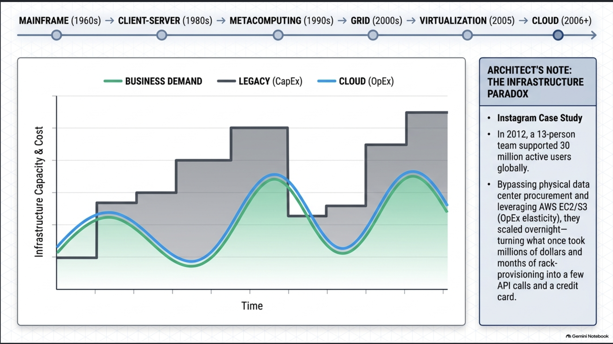

---  
# 2. Common Myths  

1. “Cloud is always cheaper.” – Not true without rightsizing.  
2. “Cloud equals no security.” – Shared responsibility model.  
3. “You’re locked‑in forever.” – Multi‑cloud tools and open standards mitigate lock‑in.  

Poll: “Which myth have you heard most?”  

---  
# 3. Service Models Overview  

| Model | What you get | Typical Users |
|-------|--------------|---------------|
| **IaaS** | Virtual machines, storage, networking | Sysadmins, DevOps |
| **PaaS** | Managed runtime, middleware, databases | Developers |
| **SaaS** | Fully‑managed application | Business users, end‑customers |

- Analogy: 
    * IaaS = bare apartment, 
    * PaaS = furnished condo, 
    * SaaS = hotel room.  


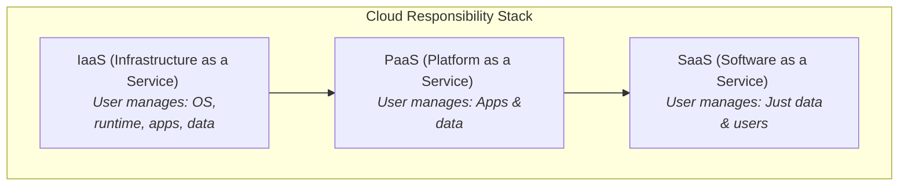
```mermaid
graph TD
    %% Styling and layout for pyramid / layered model
    subgraph Cloud Responsibility Stack
        SaaS["SaaS (Software as a Service) <br> <em>User manages: Just data & users</em>"]
        PaaS["PaaS (Platform as a Service) <br> <em>User manages: Apps & data</em>"]
        IaaS["IaaS (Infrastructure as a Service) <br> <em>User manages: OS, runtime, apps, data</em>"]
    end

    IaaS --> PaaS --> SaaS
```


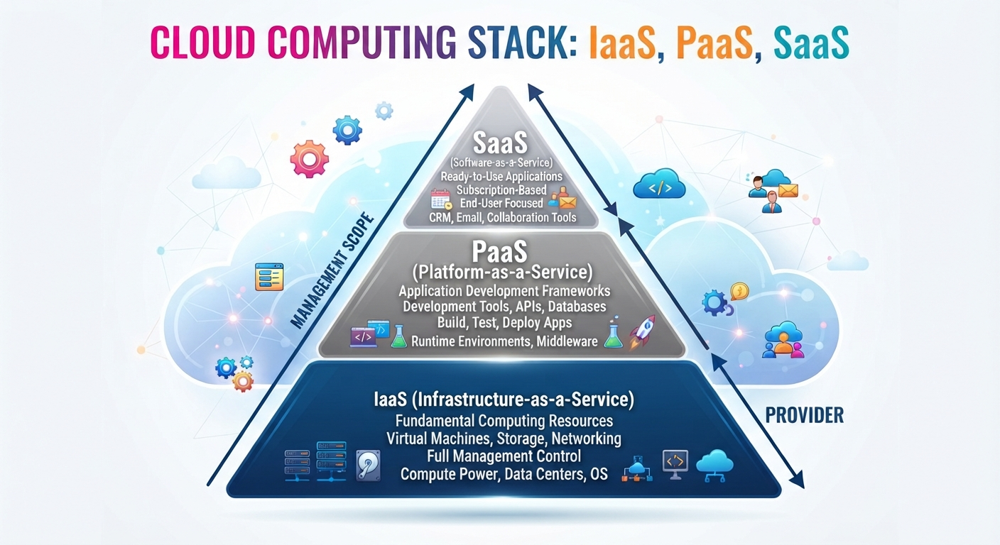
(image generated with gemini with modification suggestions by von Laszewski)

---  
# 3. IaaS – Details  

- **Core services:** Compute (VMs, containers), Block & Object storage, Virtual networking, Load balancers.  
- **Operational tasks:** Provisioning, OS patching, scaling, backups.  
- **Typical use‑case:** Lifting a monolithic on‑prem app to the cloud with minimal code changes.  


**Infrastructure as a Service (IaaS)** provides raw, virtualized computing resources over the internet, allowing you to rent virtual machines, storage, networks, and operating systems on-demand rather than buying physical hardware.

Examples of IaaS include:

* **Hyperscaler Public Clouds**

    * **Amazon Web Services (AWS) EC2 & EBS:** The industry pioneer offering scalable virtual servers (Elastic Compute Cloud) and block storage volumes (Elastic Block Store).
    * **Microsoft Azure Virtual Machines:** Enterprise-grade virtual infrastructure tightly integrated with Windows Server and hybrid cloud environments.
    * **Google Cloud Platform (GCP) Compute Engine:** High-performance, customizable virtual machines featuring custom machine types and fast global networking.


* **Alternative & Developer-Focused Clouds**
    * **DigitalOcean:** Known for developer-friendly virtual private servers (known as "Droplets") that simplify deployment for startups and independent developers.
    * **Linode (Akamai Cloud Computing):** Offers cost-effective Linux-based virtual servers, block storage, and object storage for general-purpose workloads.
    * **Vultr:** Provides high-performance SSD cloud compute instances distributed across global data center locations with straightforward hourly billing.
    ---  
## 3.1 PaaS – Details  

- **Core services:** Managed databases, serverless functions, CI/CD pipelines, API gateways.  
- **Benefits:** No infrastructure management, automatic scaling, integrated monitoring.  
- **Typical use‑case:** Rapidly prototype a mobile backend or expose a micro‑service API.  

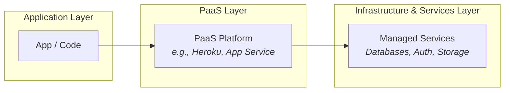
```mermaid
graph LR
    subgraph Application Layer
        A[App / Code]
    end

    subgraph PaaS Layer
        B[PaaS Platform <br> <em>e.g., Heroku, App Service</em>]
    end

    subgraph Infrastructure & Services Layer
        C[Managed Services <br> <em>Databases, Auth, Storage</em>]
    end

    A --> B
    B --> C
```

**Platform as a Service (PaaS)** sits right between IaaS (raw virtual servers) and SaaS (finished software). It provides developers and technical teams with the hardware, operating systems, databases, and runtime environments needed to build, test, and deploy applications without managing the underlying infrastructure.

Prominent examples of PaaS fall into a few key categories:

### 1. Developer & Full-Stack Application Platforms

These platforms allow developers to push code directly via Git, and the platform automatically handles building, scaling, routing, and SSL certificates.

* **Heroku:** One of the earliest and most famous pioneer developer platforms that popularized "dynos" and add-on marketplaces for easily spinning up databases and caching layers.
* **Railway & Render:** Modern, highly popular alternatives to Heroku that let developers deploy full-stack apps, background workers, and managed databases with minimal configuration.
* **Fly.io:** Runs applications as lightweight microVMs close to users globally, making it ideal for low-latency web services and APIs.

### 2. Frontend & Edge Platforms

These focus heavily on web frameworks, static sites, serverless functions, and global content delivery networks (CDNs).

* **Vercel:** The dominant platform for modern frontend frameworks like Next.js and React, handling automatic preview deployments per pull request.
* **Netlify:** A pioneer in Jamstack architecture, offering automated builds, global CDNs, and serverless edge functions.

### 3. Hyperscaler-Native PaaS

These are managed platform layers offered by major public cloud providers, integrated tightly with their broader infrastructure ecosystems:

* **Google App Engine & Cloud Run:** Google's managed platforms that let developers run web apps or containers without provisioning or sizing underlying virtual machine clusters.
* **AWS Elastic Beanstalk & App Runner:** Amazon’s managed deployment services that wrap around raw EC2 instances and container registries to simplify provisioning and load balancing.
* **Microsoft Azure App Service:** A robust enterprise platform widely used for hosting .NET web applications, APIs, and mobile backends.

### 4. Specialized Data & AI PaaS

* **Supabase / PlanetScale:** Managed database platforms that handle PostgreSQL or MySQL infrastructure while auto-generating APIs or managing database branching.
* **AWS SageMaker AI / Google Vertex AI:** Managed machine learning platforms that abstract away GPU infrastructure provisioning, letting data scientists focus purely on training and deploying models.


---  
## 3.2 SaaS – Details  

- **Core services:** Fully delivered applications (CRM, Office 365, Google Workspace).  
- **Benefits:** Zero maintenance, subscription pricing, instant upgrades.  
- **Typical use‑case:** Sales team using a CRM system.  

Software as a Service (SaaS) delivers fully functional applications over the internet on a subscription basis, eliminating the need to install or maintain anything locally.

Software as a Service (SaaS) delivers fully functioning applications over the internet, typically via a web browser on a subscription basis. The provider manages all hardware, operating systems, networking, and data storage.

The SaaS Position in the Cloud Stack: 

* Unlike Infrastructure as a Service (IaaS) where you manage virtual machines, or Platform as a Service (PaaS) where you manage deployed code, SaaS requires zero technical setup—you simply log in and use the finished software application.

Examples of SaaS include:

* **Productivity & Collaboration**
    * **Google Workspace:** Gmail, Google Docs, Drive, and Meet for daily office productivity.
    * **Microsoft 365:** Cloud-hosted Word, Excel, PowerPoint, and Teams.


* **Development, Design & Team Tools**
    * **GitHub:** Cloud-hosted code repository and collaboration platform.
    * **Figma:** Collaborative web-based interface and UI/UX design tool.
    * **Notion:** All-in-one workspace for notes, project management, and wikis.


* **Customer Relationship Management (CRM) & Business Operations**
    * **Salesforce:** Enterprise platform for sales tracking, pipeline management, and customer support.
    * **HubSpot:** Inbound marketing, sales, and customer service suite.
    * **Zendesk:** Helpdesk ticketing and customer service software.


* **Accounting & Enterprise Resource Planning (ERP)**
    * **QuickBooks Online:** Web-based accounting software for small and medium-sized businesses.
    * **Workday:** Enterprise cloud software for human resources, payroll, and financial management.

* **AI**
    * **ChatGPT:** OpenAI’s conversational AI assistant designed for natural language generation, complex reasoning, coding support, and multi-modal task execution.
    * **Gemini:** Google’s multi-modal AI platform deeply integrated with cloud productivity suites, capable of processing massive context windows across text, code, images, and audio.
    * **Copilot:** Microsoft and GitHub’s AI-powered assistant embedded directly into development environments (IDEs) and office productivity tools to automate code writing and document creation.

---  

## Summary section 3.

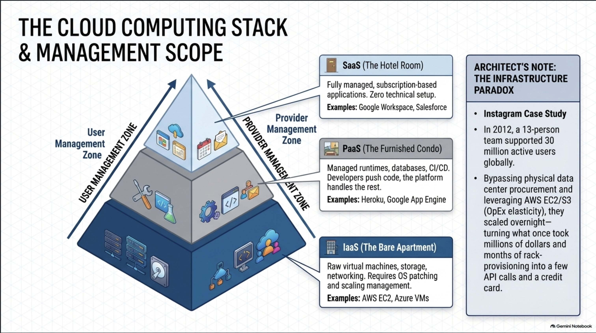


---
# 4. Deployment Models  

| Model | Ownership | Example |
|-------|-----------|---------|
| **Public Cloud** | Provider owns & operates the infrastructure | AWS, Azure, GCP |
| **Private Cloud** | Single organization, on‑prem or hosted | VMware on‑prem, OpenStack |
| **Hybrid Cloud** | Blend of public & private, linked via VPN/Direct Connect | Azure Arc, AWS Outposts |
| **Community Cloud** | Shared by organizations with common concerns | Government, healthcare consortium |


---  
# 5. Core Enabling Technologies – Virtualisation  

- Hypervisors: **KVM, VMware ESXi, Hyper‑V**.  
- Abstracted resources: CPU, memory, storage.  
- Benefits: Consolidation, isolation, rapid provisioning.  


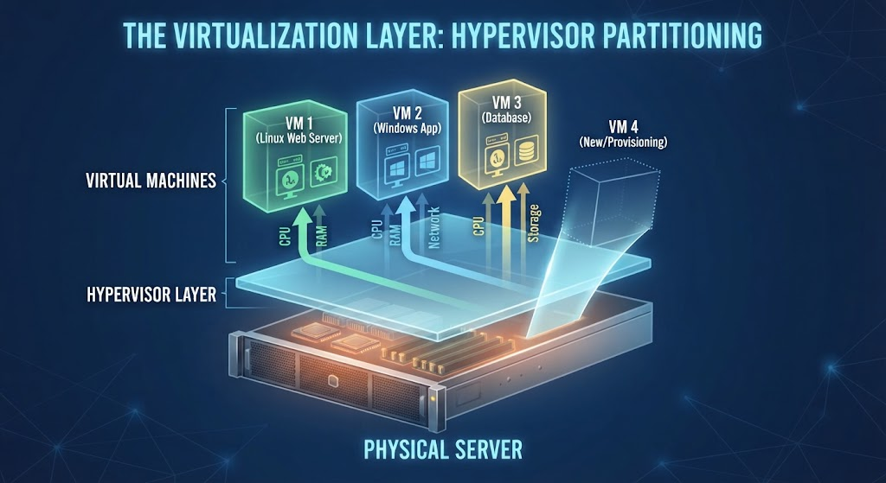

(Image: retrived via gemini)

---  
# 5. Core Enabling Technologies – Containers  

- **Docker** & **OCI** image spec.  
- Orchestration platform: **Kubernetes** (EKS, AKS, GKE).  
- Advantages over VMs: lighter weight, faster start‑up, immutable infrastructure.  

**Speaker notes**  
- Emphasise the “cloud‑native = containers” mantra.  

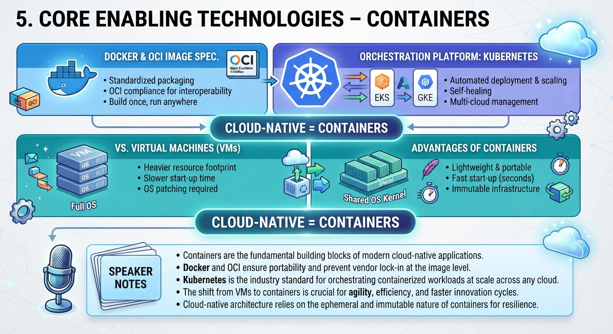

(Image: retrived via gemini)

---  
# 5. Core Enabling Technologies – Serverless  

- **Functions‑as‑a‑Service (FaaS):** AWS Lambda, Azure Functions, GCP Cloud Functions.  
- Event‑driven execution, pay‑per‑invocation, auto‑scale to zero.  
- Common patterns: API back‑ends, data pipelines, image processing.  

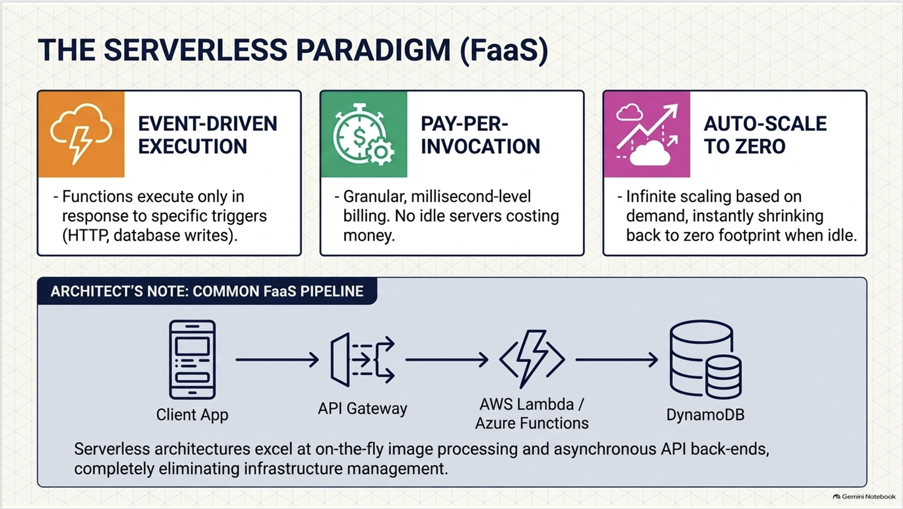

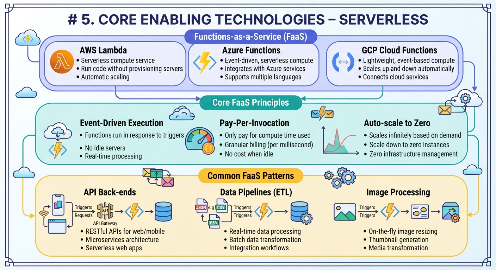
(Image: retrived via gemini)

---  

# 6. Architecture & Design Principles  

1. Design for Failure – redundancy, health checks.  
2. Loose Coupling – message queues, event buses.  
3. Stateless Services – enable horizontal scaling.  
4. Automation‑First – Infrastructure as Code (IaC), CI/CD pipelines.  
5. Security‑by‑Design – least‑privilege, encryption at rest & in‑flight.  

**Speaker notes**  
- Reference the **Well‑Architected Framework** (AWS) and the **Azure Architecture Center**.  

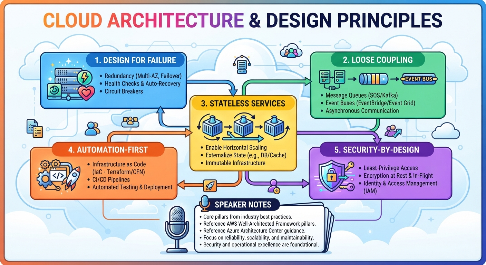

---  
# 7. The Big Three Providers – Quick Comparison  

| Feature | AWS | Azure | GCP |
|---------|-----|-------|-----|
| **Market Share (2024)** | 33 % | 22 % | 10 % |
| **Core Compute** | EC2, Lambda | Virtual Machines, Functions | Compute Engine, Cloud Functions |
| **Storage** | S3, EBS, Glacier | Blob, Disk, Archive | Cloud Storage, Persistent Disk |
| **AI/ML** | SageMaker | Azure ML | Vertex AI |
| **Hybrid Offerings** | Outposts, Local Zones | Azure Stack, Arc | Anthos (Google) |
| **Pricing Model** | On‑Demand, Savings Plans, Spot | Pay‑As‑You‑Go, Reserved, Spot | Sustained‑Use, Committed Use, Preemptible |

---  
# 7. – Service Landscape Snapshot  

- **Compute:** VMs, Containers, Serverless (3‑4 bullet points each).  
- **Storage:** Object, Block, File, Archive.  
- **Databases:** RDS/Aurora, Cosmos DB, Cloud SQL.  
- **Analytics:** Redshift, Synapse, BigQuery.  

**Speaker notes**  
- Colourful “service map” diagram for visual impact.  

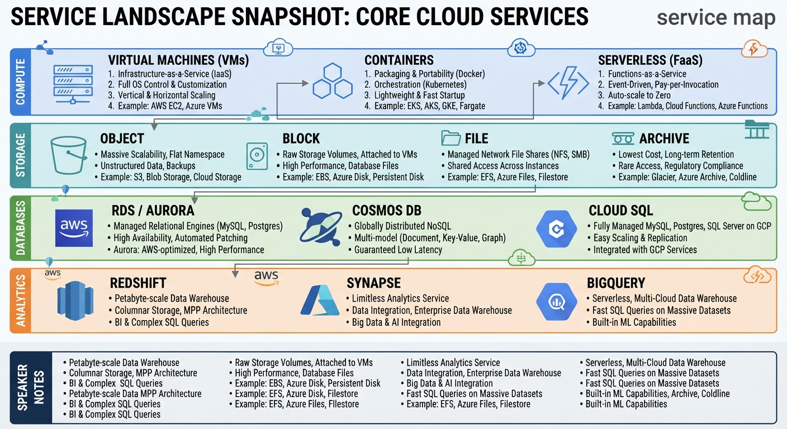

(Image generated by gemini)

---  
# 8. Storage Services Overview  

| Service | Type | Typical Use‑Case |
|---------|------|------------------|
| **Object** | S3 / Blob / Cloud Storage | Static assets, backups, data lakes |
| **Block** | EBS / Managed Disks / Persistent Disk | VM boot volumes, databases |
| **File** | EFS / Azure Files / Filestore | Shared file systems, lift‑and‑shift apps |
| **Archive** | Glacier / Azure Archive / Nearline | Long‑term compliance storage |

**Speaker notes**  
- Mention durability guarantees (e.g., for S3: $99.999999999\%$).  

---  
# 9. Networking in the Cloud  

- **VPC / Virtual Network:** CIDR block, subnets, route tables.  
- **Security controls:** Network ACLs vs Security Groups.  
- **Load Balancers:** Classic, Application (ALB), Network (NLB).  
- **CDN:** CloudFront, Azure CDN, Cloud CDN – reduced latency.  
- **Hybrid connectivity:** VPN, Direct Connect / ExpressRoute / Cloud Interconnect.  

Here is the expansion of the cloud networking and infrastructure abbreviations and concepts you listed:

### 1. VPC & Networking Fundamentals

* **VPC (Virtual Private Cloud):** An isolated, private virtual network dedicated to your cloud account, allowing you to run resources in a secure, defined network environment.
* **CIDR (Classless Inter-Domain Routing):** A method for allocating IP addresses and routing internet protocol packets (e.g., `10.0.0.0/16`), defining the total IP address pool for your VPC.
* **Subnets:** Segmented subdivisions of a VPC's IP range that allow you to group resources (can be public if they route to the internet via an Internet Gateway, or private if they remain isolated).
* **Route Tables:** A set of rules (routes) used to determine where network traffic directed from your subnets or gateways is steered.

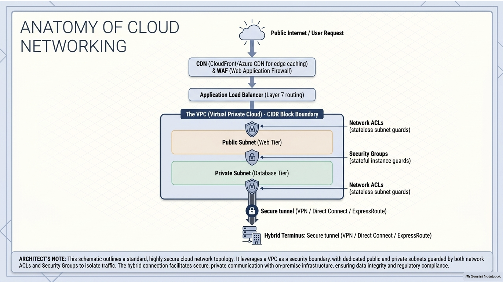

### 2. Security Controls

* **Network ACLs (Access Control Lists):** Stateless, subnet-level security layers that act as a firewall controlling inbound and outbound traffic at the subnet boundary.
* **Security Groups:** Stateful, instance-level (or ENI-level) virtual firewalls that control inbound and outbound traffic for specific compute resources or virtual machines.

### 3. Load Balancers

* **Classic Load Balancer (CLB):** A legacy, layer-level load balancer that routes traffic across multiple instances based on IP address and port (largely superseded by newer models).
* **Application Load Balancer (ALB):** A layer 7 (HTTP/HTTPS) load balancer designed for advanced application-level routing, microservices, and containerized architectures (like path-based or host-based routing).
* **Network Load Balancer (NLB):** A layer 4 (TCP/UDP) ultra-high-performance load balancer capable of handling millions of requests per second with ultra-low latencies.

### 4. Content Delivery Network (CDN)

* **CloudFront / Azure CDN / Cloud CDN:** Globally distributed proxy networks (from AWS, Microsoft Azure, and Google Cloud, respectively) that cache static and dynamic content closer to end users to drastically reduce network latency.

### 5. Hybrid Connectivity

* **VPN (Virtual Private Network):** Secure, encrypted tunnels connecting your on-premises datacenters to your cloud VPC over the public internet (IPsec VPN).
* **Direct Connect / ExpressRoute / Cloud Interconnect:** Dedicated, high-speed, private fiber-optic connections linking your on-premises infrastructure directly to AWS, Azure, or GCP, bypassing the public internet entirely for enhanced security and reliability.

- Simple diagram: “Internet → Load Balancer → Auto‑Scaling Group → VMs”, concept of autoscaling.  

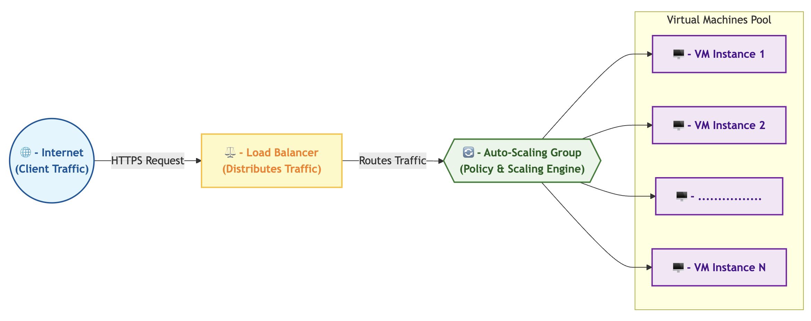

---  
# 10. Security & Compliance – Overview  

- **Shared‑Responsibility Model:** Provider secures the *cloud*; you secure the *in‑cloud* resources.  
- **Identity & Access Management (IAM):** Users, groups, roles, policies, least‑privilege.  
- **Encryption:** At‑rest (KMS, SSE‑S3), In‑transit (TLS).  
- **Compliance Standards:** GDPR, HIPAA, PCI‑DSS, ISO 27001 – many certifications built in.  

## Simple IAM policy JSON and explain its effect.  

Here is a simple, standard JSON example of an AWS IAM (Identity and Access Management) policy, along with an explanation of its effect:

```json
{
  "Version": "2012-10-17",
  "Statement": [
    {
      "Effect": "Allow",
      "Action": [
        "s3:GetObject",
        "s3:ListBucket"
      ],
      "Resource": [
        "arn:aws:s3:::my-company-data-bucket",
        "arn:aws:s3:::my-company-data-bucket/*"
      ]
    }
  ]
}
```

Explanation:

* **Version:** Specifies the policy language version (2012-10-17 is the current standard policy grammar).

* **Effect:** "Allow": Grants permission rather than denying it. By default, all AWS access is denied, so explicit "Allow" statements are required to open access.

* **Action:** Defines what actions are permitted. In this case, the user or role attached to this policy can:

* **s3:ListBucket:** View the list of files and folders inside the specified bucket.

* **s3:GetObject:** Download or read individual files stored within that bucket.

* **Resource:** Restricts where those actions can be performed. This policy strictly limits permissions to one specific bucket (my-company-data-bucket) and everything inside it (*), adhering to the least-privilege principle by preventing access to any other buckets in the cloud account.
    * ARN stands for Amazon Resource Name.

---  
# 10. – Security Best‑Practice Checklist  

1. Enforce Multi-Factor Authentication  (MFA, sometimes called Two-Factor Authentication or 2FA).  
2. Use least‑privilege dentity and Access Management. (IAM) roles for services. 
3. Encrypt data at rest and in transit.  
4. Enable logging (CloudTrail / Activity Log).  
5. Apply network segmentation (subnets, security groups).  
6. Regularly review security findings (GuardDuty, Azure Defender, Google Cloud Security Command Center (SCC).  
7. Automate patching where possible.  

## Provider-Specific Security Dashboards

* **Centralized Posture & Threat Management:** Cloud security dashboards act as a unified control center (or "single pane of glass") for security teams to continuously monitor assets, track compliance frameworks (such as SOC 2, HIPAA, or ISO 27001), and detect runtime threats.

* **AWS (AWS Security Hub & GuardDuty):** Aggregates findings from threat detection (GuardDuty), vulnerability management (Inspector), and data security to evaluate overall environment health against established security benchmarks.

* **Microsoft Azure (Microsoft Defender for Cloud):** Provides cloud security posture management (CSPM) and workload protection across Azure, multi-cloud setups, and hybrid environments using built-in compliance frameworks.

* **Google Cloud (Security Command Center):** Automatically discovers cloud and AI assets to identify misconfigurations, track asset inventories, and surface high-priority vulnerabilities or threats across GCP workloads.


## Summary Security

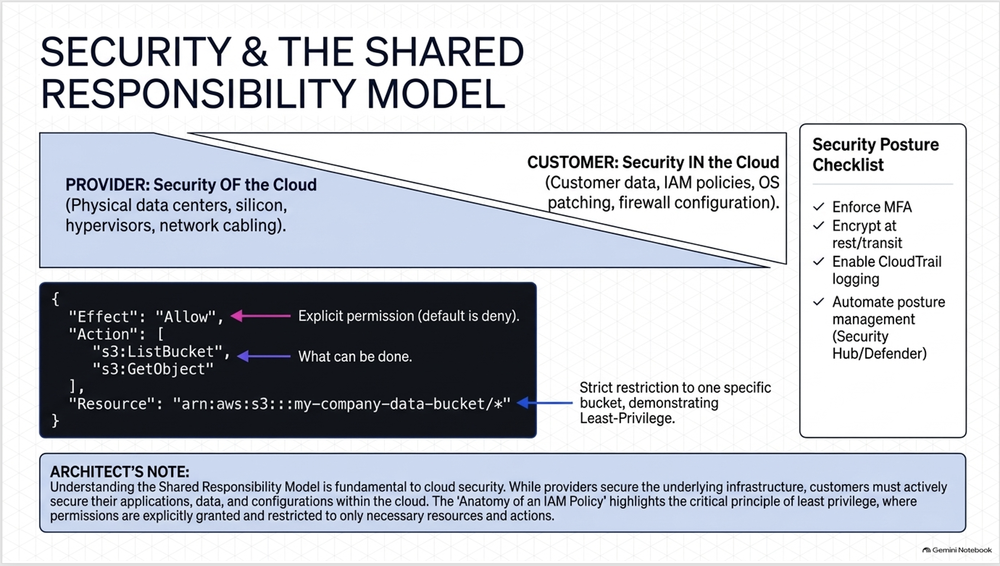

---  
# 11. Monitoring, Logging & Operations  

| Tool | Purpose |
|------|---------|
| **CloudWatch / Azure Monitor / Operations Suite** | Metrics, alarms, dashboards |
| **CloudTrail / Activity Log / Audit Logs** | API‑call tracking |
| **Log Analytics (ELK, CloudWatch Logs, Azure Log Analytics)** | Centralised log aggregation |
| **Auto‑Scaling** | Reactive scaling based on metrics |
| **IaC Drift Detection** | Terraform, CloudFormation, Bicep – detect configuration drift |

**Speaker notes**  

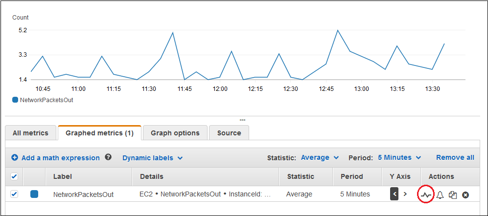

Figure: AWS CloudWatch CPU utilization metrics graph dashboard. Source: docs.aws.amazon.com, [Link](https://docs.aws.amazon.com/AmazonCloudWatch/latest/monitoring/graph_a_metric.html).

---  
# 12. Cost Management & Optimization  

- **Pricing models:** Pay‑as‑you‑go, Reserved Instances, Savings Plans, Spot/Preemptible.  
- **Cost visibility tools:** AWS Cost Explorer, Azure Cost Management, GCP Billing Reports.  
- **Optimization tactics:**  
  1. **Right‑size** instances (use Advisor / Trusted Advisor).  
  2. **Turn off** idle resources (stop non‑prod VMs).  
  3. **Leverage** spot instances for fault‑tolerant workloads.  
  4. **Tag** resources for chargeback/showback.  
  5. **Use** auto‑scaling to match demand.  
  6. Review **data transfer** costs (e.g., cross‑region traffic).  

## Possible example

Here is a practical case study example for the speaker notes illustrating cloud cost optimization:

### Expanded Speaker Notes: Before/After Cost-Savings Case Study

* **The Scenario:** A mid-sized SaaS company running a heavy data-processing pipeline on AWS noticed their monthly infrastructure bill creeping past **$45,000**, largely driven by over-provisioned production instances and forgotten non-production testing environments running 24/7.
* **The Optimization Audit:** Using **AWS Trusted Advisor** and **Cost Explorer**, the engineering team discovered that their core application servers were averaging only **12% CPU utilization** (massive over-provisioning) and that 30% of their compute spend was tied up in staging environments left running over weekends.

* **The Action Plan:**

    1. **Right-sized** production nodes from `c5.4xlarge` down to `c5.2xlarge`.
    2. Implemented automated schedules to **turn off non-prod VMs** outside of business hours (saving ~65% on staging compute).
    3. Migrated batch-processing analytics jobs to **Spot Instances**, cutting batch compute costs by 70%.
    4. Enforced strict **resource tagging** to identify and eliminate orphaned EBS storage volumes.


* **The Result:** A **32% net reduction** in monthly cloud spend within 45 days, dropping their bill from $45,000 to **$30,600 per month** with zero performance degradation or user-facing downtime.

## Summary Monitoring and Cost Management

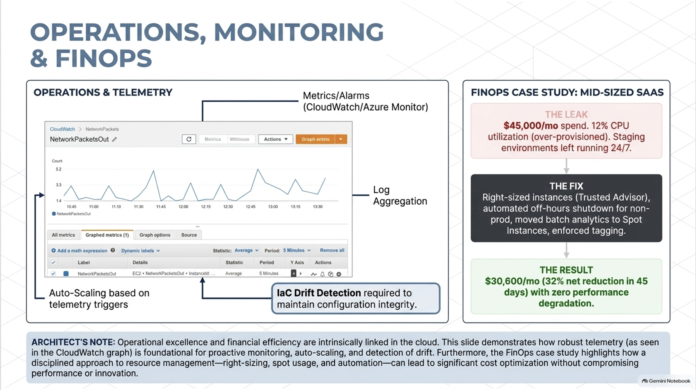

---  
# 13. Migration Strategies  

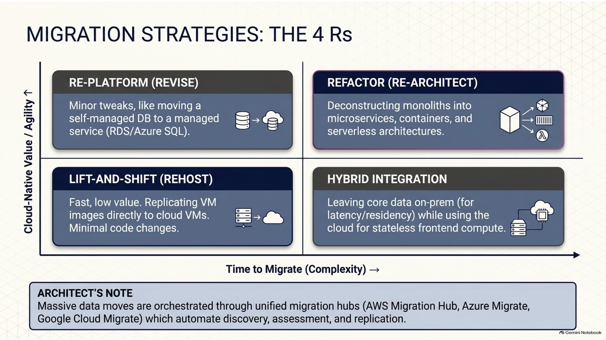


| Strategy | When to Use | Typical Steps |
|----------|-------------|---------------|
| **Lift‑and‑Shift** | Minimal code change, quick migration | Replicate VM images → cloud VMs |
| **Re‑platform** | Want managed services with slight code tweaks | Move DB → RDS/Azure SQL, app → PaaS |
| **Refactor / Re‑architect** | Need cloud‑native, micro‑services | Decompose monolith → containers/K8s |
| **Hybrid Integration** | Data residency, latency constraints | Connect on‑prem VPC ↔︎ cloud via VPN/Direct Connect |

**Speaker notes**  
## Tools exist to migrate between each other

* **Unified Migration Portals:** Major cloud providers supply dedicated service hubs to discover, assess, plan, and track the migration of physical servers, virtual machines, databases, and application code from on-premises datacenters or competing clouds.
* **AWS Migration Hub:** Acts as a single central location to collect and track the progress of application migrations across multiple AWS and partner tools, giving engineers end-to-end visibility.
* **Azure Migrate:** A centralized hub providing assessment and migration tools for physical servers, virtual machines, databases, and web apps, evaluating readiness and estimating costs for moving into Azure.
* **Google Cloud Migrate (Migrate to Virtual Machines):** A managed service designed to streamline and accelerate large-scale server migrations directly into Google Compute Engine with minimal downtime.
- Mention migration tools: AWS Migration Hub, Azure Migrate, Google Migrate for Compute Engine.  

---  
# 14. Emerging Trends  

1. Edge Computing – AWS Greengrass, Azure IoT Edge, Cloudflare Workers.  
2. Multi‑Cloud Management – Anthos, Azure Arc, Terraform Cloud.  
3. Generative AI as a Service – Bedrock, Azure OpenAI, Vertex AI.  
4. Quantum Computing in the Cloud – Amazon Braket, Azure Quantum, Google Quantum.  
5. Sustainability – Carbon‑aware scheduling, renewable‑energy powered regions.  
6. Low‑Code / No‑Code Platforms – Accelerate app delivery without deep coding.  

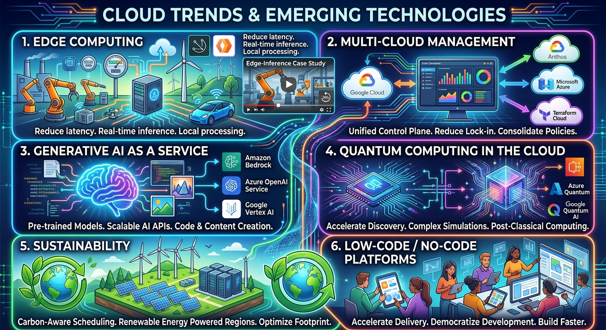

(image generated with Gemini)

One example from the image in more detail:

* **Edge-Inference Case Study:** As highlighted in Panel 1, edge computing shifts compute power away from centralized hyperscale datacenters and directly to the physical location where data is captured (such as smart factories, autonomous vehicles, or IoT sensors). This ensures ultra-low latency, reduced bandwidth consumption, and local autonomy even when internet connectivity drops.

---  
# 15. Real‑World Case Studies  

| Company | Challenge | Cloud Solution | Outcome |
|---------|-----------|----------------|---------|
| **Netflix** | Global streaming at massive scale | AWS (EC2, S3, CloudFront, Lambda) | 99.99 % uptime, instantaneous scaling for traffic spikes |
| **Airbnb** | Rapid global growth, analytics demand | GCP (BigQuery, GKE) | 10× faster analytics, 25 % cost reduction |
| **HSBC** | Strict regulatory compliance, data residency | Azure (Azure Stack, Private Link) | Seamless hybrid operation, audit‑ready environment |


## Quantitative Business Impact 

This is quantified by cost saved, time-to-market, and energy used (indirect cost).

* **Netflix (AWS - Scale & Elasticity):**
    * *Challenge:* Managing tens of millions of concurrent video streams globally with unpredictable traffic surges.
    * *Cloud Solution:* Fully embraced a cloud-native architecture on AWS utilizing EC2 for compute, S3 for storage, CloudFront for global content delivery, and Lambda for event-driven serverless workloads.
    * *Business Impact:* Achieved **99.99% uptime** while handling massive peak traffic loads without building redundant physical datacenters, reducing capital expenditure and scaling instantly.


* **Airbnb (GCP - Speed & Data Insights):**
    * *Challenge:* Rapid global expansion leading to massive operational data growth and slow, cumbersome business intelligence reporting.
    * *Cloud Solution:* Migrated core data workloads to Google Cloud Platform, leveraging BigQuery for serverless data warehousing and Google Kubernetes Engine (GKE) for container orchestration.
    * *Business Impact:* Delivered **10x faster query performance and analytics processing**, enabling real-time business insights while simultaneously achieving a **25% reduction in infrastructure costs**.


* **HSBC (Azure - Governance & Security):**
    * *Challenge:* Operating in a heavily regulated financial sector requiring strict data residency, privacy compliance, and ironclad security across multiple global markets.
    * *Cloud Solution:* Deployed a hybrid strategy using Microsoft Azure, Azure Stack, and Azure Private Link to connect on-premises systems securely with cloud infrastructure.
    * *Business Impact:* Established an **audit-ready compliance environment** that satisfied regional regulatory authorities while providing the agility of cloud-native development without sacrificing data sovereignty.

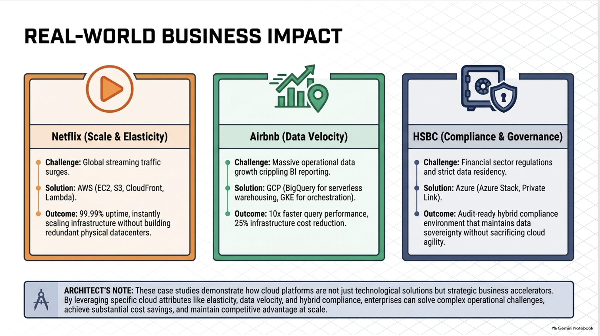
---  
# 16. Q&A / Wrap‑up  

- **Key take‑aways:**  
  1. Cloud enables flexible, pay‑as‑you‑go infrastructure.  
  2. Choose the right service & deployment model for your workload.  
  3. Security and cost are continuous responsibilities, not one‑time tasks.  
  4. Practice with IaC and automation to accelerate adoption.  

Treat the cloud as a continuous enabler of agility, operational model shifts, and capability expansion rather than just a place where data sits. The cloud is not a destination. It is a vehicle for transformation.

(I have heard this, but could not find the source.)

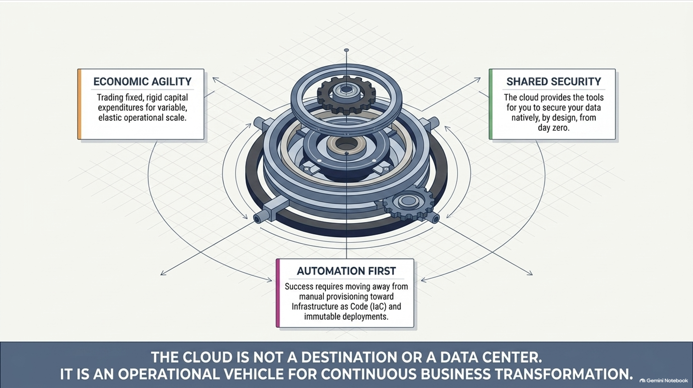

- **Next steps for the audience:**
  - Explore if your own computer can run VMs
  - Sign up for Access-ci account
  - Sign up for Chameleon Cloud account
  - Possibly wait for
     - Sign up for a free‑tier account on a provider of choice.  

  - Investigate what it takes to deploy a static website such as mkdocs).  
  

---  
# Thank You  

- **Contact:** gvonlaszewski@luc.edu  
- **LinkedIn / GitHub:** @laszewsk  

## References

*  [NIST Cloud Definition (PDF)](https://nvlpubs.nist.gov/NISTPUBS/LEGACY/SP/NISTSPECIALPUBLICATION800-145.PDF). Must read. 
* [AWS Well-Architected Framework Welcome](https://docs.aws.amazon.com/wellarchitected/latest/framework/welcome.html)
* [AWS Well-Architected Framework](https://aws.amazon.com/architecture/well-architected/)
* [Azure Architecture Center](https://learn.microsoft.com/en-us/azure/well-architected/)
* [Azure Architecture](https://learn.microsoft.com/en-us/azure/architecture/)
* [Google Cloud Architecture framework](https://docs.cloud.google.com/architecture/framework)
