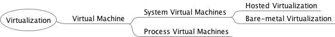
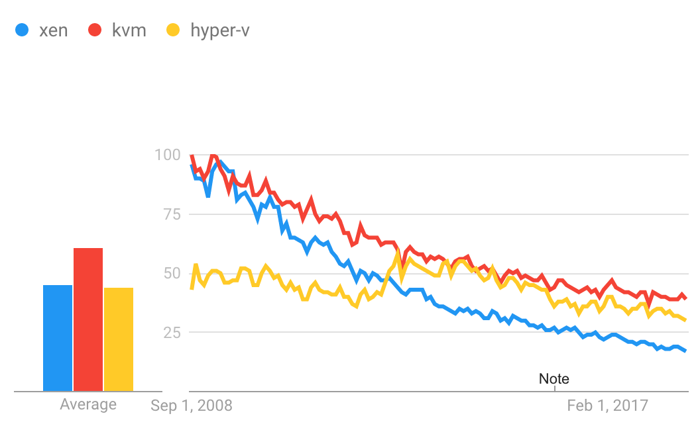

# Virtualization
## Foundations of the Cloud Revolution

---

## Learning Outcomes

- Gain a fundamental understanding of virtualization concepts.
- Define and distinguish between different types of Virtual Machines (VMs).
- Understand the role and types of Hypervisors.

---

## What is Virtualization?

- A cornerstone technology that enabled the cloud revolution.
- Allows physical hardware to be partitioned into multiple **virtual resources**.
- Enables the execution of multiple isolated environments on a single piece of physical hardware.
- **Key Benefit**: Better utilization of server resources in data centers and on local desktops.

---

## Virtual Machines (VMs)

**Definition**: A software-based emulation of a computer system.
- VMs allow an entire operating system (including the kernel) to run on top of another OS or directly on hardware.
- Multiple VMs share the physical resources of the host system.

### Two Primary Types:

1. **System Virtual Machines (Hardware VMs)**
2. **Process Virtual Machines (Application VMs)**

---

## 1. System Virtual Machines

- Provides a complete emulation of the underlying hardware.
- Allows a full "guest" operating system to run.
- Hypervisor abstracts the physical CPU, memory, and I/O devices.
- **Examples**: Oracle VirtualBox, VMware Workstation, Microsoft Hyper-V.

---

## 2. Process Virtual Machines

- Provides a platform-independent environment for a single program.
- Abstracts hardware and OS to ensure the application runs identically regardless of the host platform.
- **Examples**: Java Virtual Machine (JVM), .NET Common Language Runtime (CLR).

---

## Contrast: Wine (Not an Emulator)

- **Wine** = "Wine Is Not an Emulator"
- It is a **compatibility layer**, not a hypervisor.
- Translates Windows API calls into POSIX calls.
- **Pros**: High performance (no emulation overhead).
- **Cons**: Some API calls may not be ported, leading to app failure.

---

---

## Virtualization Taxonomy

---

## The Hypervisor (VMM)

**General Definition**:
The **Virtual Machine Monitor (VMM)** is the software layer that abstracts physical hardware to create and manage virtual machines. This layer is more commonly referred to as the **Hypervisor**.

It is the primary engine behind **Infrastructure-as-a-Service (IaaS)**.

---

## Type 1: Bare-Metal Hypervisors

- Installed **directly on the physical hardware**.
- Direct access to CPU, memory, and I/O.
- **Characteristics**: High performance and stability.
- **Examples**: 
  - VMware ESXi
  - Microsoft Hyper-V
  - Xen

---

## Type 2: Hosted Hypervisors

- Runs as an **application on top of a Host OS**.
- Host OS manages hardware $\rightarrow$ Hypervisor requests resources from Host OS.
- **Characteristics**: Easy to install, great for development/testing.
- **Examples**: 
  - Oracle VirtualBox
  - VMware Workstation
  - QEMU

---

## Hypervisor Comparison

| Feature | Type 1 (Bare-Metal) | Type 2 (Hosted) |
| :--- | :--- | :--- |
| **Installation** | Direct on Hardware | On Host OS |
| **Performance** | High (Near-Native) | Lower (OS Overhead) |
| **Stability** | Higher | Lower |
| **Ease of Setup** | Complex | Simple |
| **Use Case** | Production/Cloud | Dev/Testing/Personal |

---

## Virtualization Architecture (Type 2)

*

---

## Practical Virtualization

- **Oracle VirtualBox**: Popular for local labs.
- **Vagrant**: Command-line tool to automate the creation and configuration of VMs.
- **Guest Additions**: Driver package to improve host-guest interaction (shared folders, clipboard, etc.).

---

## Tool Comparison (Local Virtualizers)

| Feature | Parallels (Mac) | VMware (Win/Lin/Mac) | UTM (Mac) | VirtualBox (All) |
| :--- | :--- | :--- | :--- | :--- |
| **Cost** | Paid (Subscription) | **Free** (Personal Use) | Free | Free |
| **Setup Ease** | Easiest (1-Click) | Moderate | Simple | Manual |
| **Performance** | Best on M-series | Excellent | Near-Native (ARM) | Moderate |
| **3D Graphics** | Best (DX11/12) | Great (DX11) | None / Basic | Moderate |

---

## Technical Nuances

- **QEMU/KVM**: Better integrated into Linux, smaller footprint, higher performance.
- **Xen**: Supports both hardware virtualization and **Paravirtualization**.

### Full vs. Para-virtualization
- **Full**: Guest OS is unaware it's virtualized (complete hardware emulation).
- **Para**: Guest OS is modified to communicate with the hypervisor (better efficiency).

---

## Beyond Compute Virtualization

Virtualization applies to more than just the CPU/OS:

### Storage Virtualization
- Abstracts physical disks into a single pool of logical storage.
- **Examples**: Google Drive, AWS S3, Azure Blob Storage.

### Network Virtualization
- Combines hardware/software network resources into a **Virtual Network**.
- **External**: Unifies multiple physical networks.
- **Internal**: Network functionality for processes/containers on one server.

---

# Thank You!
## Questions?

---
marp: true
theme: default
paginate: true
backgroundColor: #fff
style: |
  section {
    font-family: 'Arial', sans-serif;
  }
  h1 {
    color: #2c3e50;
  }
  h2 {
    color: #34495e;
    border-bottom: 2px solid #3498db;
  }
  footer {
    font-size: 12px;
  }
---

# Virtualization
## Foundations of the Cloud Revolution

---

## Learning Outcomes

- Gain a fundamental understanding of virtualization concepts.
- Define and distinguish between different types of Virtual Machines (VMs).
- Understand the role and types of Hypervisors.

---

## What is Virtualization?

- A cornerstone technology that enabled the cloud revolution.
- Allows physical hardware to be partitioned into multiple **virtual resources**.
- Enables the execution of multiple isolated environments on a single piece of physical hardware.
- **Key Benefit**: Better utilization of server resources in data centers and on local desktops.

---

## Virtual Machines (VMs)

**Definition**: A software-based emulation of a computer system.
- VMs allow an entire operating system (including the kernel) to run on top of another OS or directly on hardware.
- Multiple VMs share the physical resources of the host system.

### Two Primary Types:
1. **System Virtual Machines (Hardware VMs)**
2. **Process Virtual Machines (Application VMs)**

---

## 1. System Virtual Machines

- Provides a complete emulation of the underlying hardware.
- Allows a full "guest" operating system to run.
- Hypervisor abstracts the physical CPU, memory, and I/O devices.
- **Examples**: Oracle VirtualBox, VMware Workstation, Microsoft Hyper-V.

---

## 2. Process Virtual Machines

- Provides a platform-independent environment for a single program.
- Abstracts hardware and OS to ensure the application runs identically regardless of the host platform.
- **Examples**: Java Virtual Machine (JVM), .NET Common Language Runtime (CLR).

---

## Contrast: Wine (Not an Emulator)

- **Wine** = "Wine Is Not an Emulator"
- It is a **compatibility layer**, not a hypervisor.
- Translates Windows API calls into POSIX calls.
- **Pros**: High performance (no emulation overhead).
- **Cons**: Some API calls may not be ported, leading to app failure.

---

## The Hypervisor (VMM)

**General Definition**:
The **Virtual Machine Monitor (VMM)** is the software layer that abstracts physical hardware to create and manage virtual machines. This layer is more commonly referred to as the **Hypervisor**.

It is the primary engine behind **Infrastructure-as-a-Service (IaaS)**.

---

## Type 1: Bare-Metal Hypervisors

- Installed **directly on the physical hardware**.
- Direct access to CPU, memory, and I/O.
- **Characteristics**: High performance and stability.
- **Examples**: 
  - VMware ESXi
  - Microsoft Hyper-V
  - Xen

---

## Type 2: Hosted Hypervisors

- Runs as an **application on top of a Host OS**.
- Host OS manages hardware $\rightarrow$ Hypervisor requests resources from Host OS.
- **Characteristics**: Easy to install, great for development/testing.
- **Examples**: 
  - Oracle VirtualBox
  - VMware Workstation
  - QEMU

---

## Hypervisor Comparison

| Feature | Type 1 (Bare-Metal) | Type 2 (Hosted) |
| :--- | :--- | :--- |
| **Installation** | Direct on Hardware | On Host OS |
| **Performance** | High (Near-Native) | Lower (OS Overhead) |
| **Stability** | Higher | Lower |
| **Ease of Setup** | Complex | Simple |
| **Use Case** | Production/Cloud | Dev/Testing/Personal |

---

## Practical Virtualization

- **Oracle VirtualBox**: Popular for local labs.
- **Vagrant**: Command-line tool to automate the creation and configuration of VMs.
- **Guest Additions**: Driver package to improve host-guest interaction (shared folders, clipboard, etc.).

---

## Technical Nuances

---

## Hypervisor Popularity

---

- **QEMU/KVM**: Better integrated into Linux, smaller footprint, higher performance.
- **Xen**: Supports both hardware virtualization and **Paravirtualization**.

### Full vs. Para-virtualization
- **Full**: Guest OS is unaware it's virtualized (complete hardware emulation).
- **Para**: Guest OS is modified to communicate with the hypervisor (better efficiency).

---

## Beyond Compute Virtualization

Virtualization applies to more than just the CPU/OS:

### Storage Virtualization
- Abstracts physical disks into a single pool of logical storage.
- **Examples**: Google Drive, AWS S3, Azure Blob Storage.

### Network Virtualization
- Combines hardware/software network resources into a **Virtual Network**.
- **External**: Unifies multiple physical networks.
- **Internal**: Network functionality for processes/containers on one server.

---

# Thank You!
## Questions?
