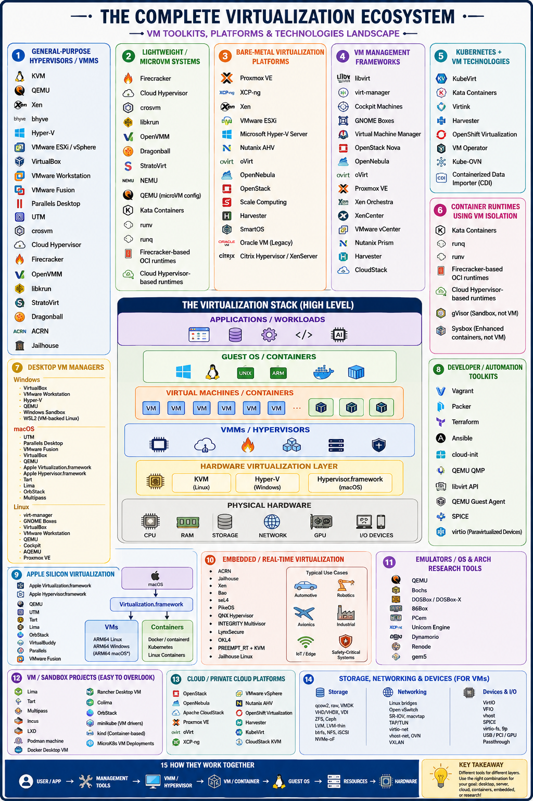

# Virtual Machine Technologies

In this section, we cover an introduction to the underlying virtualization technologies used on some mainstream platforms.

Cloud providers, such as AWS, Azure, and Google, and OpenStack use, for example, QEMU and KVM technologies for compute instance virtualization.

Despite the word "complete" in  the title it is certanly not complete and many other parts could be added



### Selected Hardware Virtualization Technologies

#### AMD-V and Intel-VT

The introduction of hardware virtualization extensions—specifically Intel VT-x and AMD-V—fundamentally changed the x86 processor architecture. These technologies introduced a new CPU execution mode (often called "Root" mode or Ring -1), allowing hypervisors to run guest operating systems with near-native performance and without the need for complex software binary translation. While hardware virtualization isolates different operating systems, processor efficiency within those environments is further enhanced by simultaneous multithreading (SMT). Intel's implementation, known as Intel Hyper-Threading Technology (HT Technology), allows a single physical processor core to present itself to the operating system as two logical cores. When Hyper-Threading is enabled, the processor can execute instructions from two separate threads concurrently by sharing the core's execution resources. This allows multi-threaded software applications and modern hypervisors to execute computational tasks in parallel, significantly improving overall system throughput and resource utilization.

## I/O MMU Virtualization (AMD-Vi and Intel VT-d)

An Input-Output Memory Management Unit (IOMMU) is a hardware component that connects a direct-memory-access–capable (DMA-capable) I/O bus to the main system memory. Much like a standard memory management unit (MMU) translates virtual memory addresses to physical addresses for the CPU, the IOMMU performs address translation and provides memory protection for peripheral devices [@iommu-1]. This architecture ensures that devices can safely interface with physical memory using isolated, virtualized address spaces.
Hardware manufacturers implement this technology under different names:

* AMD-Vi: Originally referred to simply as IOMMU, this is AMD's implementation of I/O virtualization technology.
* Intel VT-d: Standing for Virtualization Technology for Directed I/O, this is Intel's specialized I/O virtualization specification.

In a virtualized ecosystem, an IOMMU is a critical prerequisite for advanced features like PCI Passthrough (SR-IOV), which allows a virtual machine to bypass the hypervisor and access physical hardware components—such as a dedicated GPU or network card—directly. To utilize Intel VT-d or AMD-Vi, the underlying motherboard chipset, the CPU, and the system firmware (BIOS or UEFI) must all explicitly support and enable IOMMU functionality [@iommu-2].

### Selected VM Virtualization Software and Tools

A number of noteworthy virtualization software and tools exist which make the development and use of virtualization on the hardware possible. They include

- Libvirt
- KVM
- Xen
- Hyper-V
- QEMU
- VMWare
- VirtualBox

We will be discussing them next.

#### Libvirt

[Libvirt](https://libvirt.org/api.html) is a library with an API for managing virtualization solutions such as provided by KVM and Xen. It provides a common management API for them, allowing uniform, cross-hypervisor interfaces for higher-level management tools. `Libvirt` provides a toolkit to manage virtualization hosts and supports a wide set of languages, such as C, Python, Perl, and Java. Drivers are the basic building block for libvirt functionality to support the capability to handle specific hypervisor driver calls. Drivers are discovered and registered during connection processing as part of the `virInitializeAPI`. Each driver has a registration API that loads up the driver-specific function references for the libvirt APIs to call. The following is a simplistic view of the hypervisor driver mechanism. Furthermore, it provides APIs for management of virtual networks and storage on the VM Host Server. The configuration of each VM Guest is stored in an XML file [@libvirt]. The official website for `libvirt` is located at

- <https://libvirt.org/>

#### QEMU

QEMU is a virtualization technology emulator that allows you to run operating systems and Linux distributions on your current system without installing them or burn their ISO files. When used as a machine emulator, QEMU can run OSs and programs made for one machine (e.g., an ARM board) on a different machine (e.g., your own PC). By using dynamic translation, it achieves very good performance. QEMU provides two generic functions. One of them is an open-source machine emulator, and the other is a virtualizer.

- *Machine emulation:* using it as a machine emulator it runs the OSs and programs designed for one machine on a different machine of potentially different architecture. It uses dynamic translation through which it achieves very good performance.

- *Virtualizer:* Using is as a virtualizer it executes the guest code directly on the host CPU. This enables QEMU to achieve near-native performance.

Once QEMU has been installed, it should be ready to run a guest OS from a disk image. This image is a file that represents the filesystem and OS on a hard disk. From the perspective of the guest OS, it actually is a file on harddisk, and it can create its own filesystem on the virtual disk.

QEMU supports either XEN or KVM to enable virtualization. With the help of KVM, QEMU can virtualize x86, server, and embedded PowerPC, 64-bit POWER, S390, 32-bit and 64-bit ARM, and MIPS guests according to the [QEMU Wiki](https://wiki.qemu.org/Main_Page).

Useful links include the following:

- An extensive manual is provided at <https://qemu.weilnetz.de/doc/qemu-doc.html>.

- QEMU can be downloaded from <http://www.qemu.org/download/>.

- A collection of images for testing purposes is provided at <https://wiki.qemu.org/Testing/System_Images>

An example of using QEMU is provided in Section \[Virtual Machine Management with QEMU\]{@s-qemu-kvm}

#### KVM

KVM, or Kernel-based Virtual Machine is a popular open-source hypervisor solution. It was released as a virtualization solution for Linux based systems and later was merged into Linux Kernel since version 2.6.20. It was originally supporting x86 hardware with virtualization extensions (Intel VT or AMD-V), but later supporting of PowerPC and ARM were added. It supports a variety of different guest OSs, e.g., Windows family, Darwin (the core of MacOS), in addition to the different distros from various Linux operating systems. The full supported guest list can be found at: <http://www.linux-kvm.org/page/Guest_Support_Status>

The full list of KVM features can be found here: <http://www.linux-kvm.org/page/KVM_Features>. Among them, some cool features include hot-plugging of hardware , even CPU and PCI devices. It supports live migration of VMs too.

#### KVM vs QEMU

KVM includes a fork of the QEMU executable. The QEMU project focuses on hardware emulation and portability. KVM focus on the kernel module and interfacing with the rest of the userspace code. KVM comes with a `kvm-qemu` executable that just like QEMU manages the resources while allocating RAM, loading the code. However, instead of recompiling the code, it spawns a thread which calls the KVM kernel module to switch to guest mode. It then proceeds to execute the VM code. When privileged instructions are found, it switches back to the KVM kernel module, and if necessary, signals the QEMU thread to handle most of the hardware emulation. This means that the guest code is emulated in a POSIX thread, which can be managed with common Linux tools [@kvmvsqemu].

#### Xen

Xen is one of the most widely adopted hypervisors by IaaS cloud. It is supported by the earliest and still the most popular public cloud offering, i.e., Amazon Web Service (AWS). Eucalyptus, one open-source effort to replicate what AWS had to offer, and the then most popular private cloud software, supported Xen from the start. And later, Openstack, the most popular open-source IaaS cloud software at present, also supports Xen.

Some notable features of Xen include:

- Supporting x86-64 and ARM for host architecture.

- Supporting live migration of VMs between different physical hosts without losing availability.

A more detailed list can be found at <https://wiki.xenproject.org/wiki/Xen_Project_Release_Features>.

#### Hyper-V

Hyper-V is a product from Microsoft to support virtualization on systems running Windows. Hyper-V was originally released along with Windows Server 2008, with a separate free version with limited functionality. In later releases, it adds more features, e.g., better support of Linux guest OS, live migration of VMs, etc.

More detailed information about Hyper-V can be found at <https://docs.microsoft.com/en-us/virtualization/hyper-v-on-windows/reference/hyper-v-architecture>

#### VMWare

VMware is widely recognized as the company that brought virtualization to the mass market, becoming the first commercially successful entity to virtualize the x86 architecture. Although previously held by EMC and Dell, VMware is now owned by Broadcom following a major acquisition.
Historically, the company developed VMware Workstation, which was one of the earliest and most successful commercial Type-2 hypervisors. Today, VMware offers a robust portfolio of both Type-1 hypervisors (such as VMware ESXi) and Type-2 hypervisors.
Because its initial software virtualized fundamental system components—including "hardware for a video adapter, a network adapter, and hard disk adapters," alongside "pass-through drivers for guest USB, serial, and parallel devices"—it provided a highly attractive solution for running multiple isolated operating systems on a single host computer.
A significant architectural advantage of early VMware software was that it did not rely on hardware-assisted virtualization extensions (like Intel VT-x or AMD-V) to the x86 instruction set; it was engineered before those hardware features even existed. This allowed early VMware products to implement software-based binary translation to run on standard, legacy x86 platforms. However, this software-translation advantage has largely diminished due to the now-ubiquitous availability of virtualization extensions built directly into modern CPU hardware.

Following Broadcom's acquisition of VMware, the enterprise virtualization market has experienced a significant structural reset. Broadcom’s aggressive restructuring has led to intense customer backlash, major policy overhauls, and legal challenges. [1, 2, 3] 
The primary issues surrounding the acquisition involve several key areas:

1. Elimination of Perpetual Licenses and Mandatory Bundling:

    Broadcom completely terminated the sale of traditional perpetual licenses, forcing all users onto a subscription-only model. Furthermore, they gutted the old catalog of over 160 individual software products. Customers can no longer purchase individual components (like standalone vSphere or ESXi). Instead, they must buy massive software bundles, primarily condensed into VMware Cloud Foundation (VCF) for large enterprises and VMware vSphere Foundation (VVF) for smaller setups. [4, 5, 6, 7, 8] 

2. Extreme Price Increases:

    Due to forced bundling and per-core subscription pricing, many organizations have faced severe cost shocks. Multiple industry reports and legal filings have detailed price jumps ranging from 150% to over 1,000% depending on the infrastructure setup. These steep cost escalations have made VMware entirely unaffordable for many small-to-medium-sized businesses (SMBs). [4, 6, 9, 10, 11] 

3. Mass Partner and Managed Service Disruption:

    Broadcom overhauled the VMware Cloud Service Provider (VCSP) program, introducing an invite-only partner tier and cutting thousands of regional resellers. Hundreds of long-standing managed service providers (MSPs) were stripped of their ability to purchase new licenses or onboard clients. Some small cloud providers faced mandatory minimum subscription commitments that ballooned their annual VMware overhead by 10x. [10, 12, 13] 

4. High-Profile Lawsuits and Regulatory Pressure:

    Broadcom's aggressive sales enforcement has resulted in notable legal battles with massive enterprise clients:

    * Tesco Case: Retail giant Tesco filed a £100 million lawsuit after Broadcom refused to honor a four-year extension option on their existing perpetual licenses. [14] 
    * Fidelity Investments: Fidelity filed suit after Broadcom threatened to terminate their software access during subscription renewal disputes, though it was settled after Broadcom agreed to continue services. [15] 
    * Cease-and-Desist Campaign: Broadcom triggered widespread resentment by sending aggressive cease-and-desist letters and auditing perpetual license holders who stopped paying for high-tier support, warning them that downloading security patches without active support contracts constituted IP infringement. [3] 
    * Antitrust Inquiries: The European Union launched antitrust inquiries fueled by official complaints from EU business trade groups regarding predatory licensing practices. [1] 

5. Mass Exodus to Alternatives: 

    The uncertainty and financial strain have triggered an unprecedented migration away from VMware. Industry surveys indicate that up to 76% of IT leaders view Broadcom's ownership negatively, with over two-thirds actively pursuing alternative platforms. Competitors like Nutanix (for enterprise virtualization) and open-source solutions like Proxmox or XCP-ng have experienced massive growth as companies seek to eliminate their VMware dependency. [1, 3, 9, 11, 16] 

6. A boost for OpenStack:

    According to surveys conducted by the OpenInfra Foundation, over 80% of its member organizations reported receiving direct inquiries from businesses looking to migrate their workloads from VMware to OpenStack. The OpenStack services market size has spiked dramatically, projected by market analysts to balloon from around $21 billion to a massive industry due to this migration wave.

    Because of the complexity, OpenStack is mostly being adopted as a VMware alternative by large enterprises, telecommunications providers (managing 5G rollouts), financial institutions, and government entities that already possess large internal IT engineering teams. Smaller mid-market companies tend to lean toward simpler alternatives like Proxmox or Nutanix.

7. References

    * [1] [https://itaa.com](https://itaa.com/insights/vmware-under-broadcom-challenges-customer-impacts-and-choices/)
    * [2] [https://medium.com](https://medium.com/@NickHystax/the-post-broadcom-reality-vmware-customers-face-in-2026-163ce4582d8f)
    * [3] [https://www.youtube.com](https://www.youtube.com/watch?v=hBKoMFKkig0&vl=en)
    * [4] [https://www.youtube.com](https://www.youtube.com/watch?v=lpHsSaL-NJw)
    * [5] [https://www.nakivo.com](https://www.nakivo.com/blog/vmware-backup-broadcom-era-changes-challenges/)
    * [6] [https://avasant.com](https://avasant.com/report/the-impact-of-broadcoms-acquisition-of-vmware-pricing-and-licensing-changes-and-strategies-for-mitigation/)
    * [7] [https://www.ahead.com](https://www.ahead.com/resources/the-industry-implications-of-broadcoms-vmware-acquisition/)
    * [8] [https://www.youtube.com](https://www.youtube.com/watch?v=UXdMbKhS2-o&t=410)
    * [9] [https://www.novacloud.io](https://www.novacloud.io/blog/vmware-support-challenges-managed-services-solutions)
    * [10] [https://avasant.com](https://avasant.com/report/broadcom-vmware-shake-up-rising-costs-subscription-shock-and-enterprise-response/)
    * [11] [https://arstechnica.com](https://arstechnica.com/information-technology/2026/04/nutanix-claims-it-has-poached-30000-vmware-customers/)
    * [12] [https://lightedge.com](https://lightedge.com/resources/broadcoms-vcsp-transition-what-csps-and-customers-need-to-know-in-2026/)
    * [13] [https://www.readyworks.com](https://www.readyworks.com/blog/vmware-under-broadcom-what-every-cio-needs-to-know-before-2026)
    * [14] [https://www.rack2cloud.com](https://www.rack2cloud.com/broadcom-vmware-lawsuit-legal-playbook/)
    * [15] [https://beemanmuchmore.com](https://beemanmuchmore.com/broadcom-acquisition-of-vmware-its-bad-part-2-of-2/)
    * [16] [https://www.arcfra.com](https://www.arcfra.com/blog/vmware_modernization_2026_roadmap_q001)


#### Parallels

Another interesting company offering hypervisors is Parallels. This company has two main products in that regards:

- Parallels Desktop for Mac, which for x86 machines allows users to run virtual machines independently using Windows, Linux, Solaris.

- Parallels Workstation for Microsoft Windows and Linux users which for x86 machines allows user to run virtual machines independently on the Windows host.

#### VirtualBox

VirtualBox is a free, open-source hypervisor for x86 architectures. It is now owned by Oracle while transitioning from SUN which in turn acquired the original technology from Innotek.

One of the nice features for us is that VirtualBox is able to create and manage guest virtual machines such as Windows, Linux, BSD, OSx86 and even in part also macOS (on Apple hardware). Hence it makes it for us a very valuable tool while being able to run virtual machines on a local desktop or computer to simulate cloud resources without charging cost. In addition, we find command-line tools such as Vagrant that make the use convenient while not having to utilize the GUI or the more complex virtual box command interfaces. A guest additions package allows compatibility with the host OS, to, for example, allow window management between host and guest OS.

<!--
In Section [VirtualBox](../local/virtualbox.md) we have provided a practical
introduction to VirtualBox.
-->

#### Comparison of some technologies

QEMU and KVM are better integrated into Linux and has a smaller footprint. This may result in better performance. VirtualBox is targeted as virtualization software and limited to x86 and amd64. As Xen uses QEMU it allows hardware virtualization. However, Xen can also use paravirtualization [@diff-qemu]. In the following table, we summarize support for full- and paravirtualization

|                     | XEN | KVM | VirtualBox | VMWare |
|---------------------|----:|----:|-----------:|-------:|
| Paravirtualization  | yes |  no |         no |     no |
| Full virtualization | yes | yes |        yes |    yes |

### Comparison of Virtualization Technologies

The following table summarizes the key characteristics, hypervisor types, and primary use cases for the technologies discussed in your text. This serves as a quick-reference guide to distinguish between bare-metal, hosted, and container-like solutions.

|  |  |  |  |  |
|---------------|---------------|---------------|---------------|---------------|
| **Technology** | **Hypervisor Type** | **Primary Host OS** | **Key Characteristic** | **Common Use Case** |
| **KVM** | Type 1 (Kernel-based) | Linux | Built directly into the Linux kernel; near-native speed. | Cloud Infrastructure (AWS, Google Cloud). |
| **Xen** | Type 1 (Bare-metal) | None (Runs on HW) | Supports both Full and Paravirtualization. | Enterprise Clouds & VPS hosting. |
| **ESXi (VMware)** | Type 1 (Bare-metal) | None (Runs on HW) | Industry standard for enterprise data centers. | Large-scale corporate server consolidation. |
| **Hyper-V** | Type 1 | Windows | Integrated with Windows Server; strong Windows guest support. | Enterprise Windows environments. |
| **QEMU** | Emulator / Type 2 | Cross-platform | Can emulate different CPU architectures (e.g., ARM on x86). | Development, testing, and hardware emulation. |
| **VirtualBox** | Type 2 (Hosted) | Win / Mac / Linux | Easy-to-use GUI; highly portable across desktop OSs. | Local development and software testing. |
| **Parallels** | Type 2 (Hosted) | macOS / Windows | Highly optimized for running Windows on Mac hardware. | Desktop productivity for Mac users. |
| **Libvirt** | Management API | N/A | Not a hypervisor; it is an API to manage other hypervisors. | Automating VM management (scripts/tools). |
| **Wine** | Compatibility Layer | Linux / Mac / BSD | **Not an emulator/VM.** Translates API calls in real-time. | Running Windows apps (Word, Games) on Linux/Mac. |

### Selected Storage Virtualization Software and Tools

Storage virtualization allows the system to integrate the logical view of the physical storage resources into a single pool of storage. Users are unaware while using virtual storage that it is not hosted on the same hardware resources, such as disks. Storage virtualization is done across the various layers that build state of the art storage infrastructures. This includes Storage devices, the Block aggregation layer, the File/record layer, and the Application layer. Most recently, hosting files as part of the application layer in the cloud is changing how we approach data storage needs in the enterprise. A good example of a cloud-based virtual storage is google drive. Other systems include Box, AWS3 and Azure.

### Selected Network Virtualization Software and Tools

Network virtualization allows hardware and software network resources as well as network functionality to be combined into a single, software-defined administrative unit which is called a virtual network. We distinguish external network virtualization that combines many networks into a unifying network, and internal network virtualization that provides network functionality to the processes and containers running on a single server.

Note that we will not cover this topic in this introductory class.

## Exercises

!!! note "E.Virtualization.1"
    Install a virtualization framework on your local machine and experiment with it.


!!! note "E.Virtualization.2"
    Contribute a section about network virtualization.


!!! note "E.Virtualization.3"
    Which free virtualization software did you install on your machine. Can you describe your experience with it?

    |  |  |  |  |  |
    |---------------|---------------|---------------|---------------|---------------|
    | **Feature** | **Parallels (Mac)** | **VMware (Win/Lin/Mac)** | **UTM (Mac)** | **VirtualBox (All)** |
    | **Cost** | Paid (Subscription) | **Free** (Personal Use) | Free | Free |
    | **Setup Ease** | Easiest (1-Click) | Moderate | Simple | Manual |
    | **Performance** | Best on M-series | Excellent | Near-Native (ARM) | Moderate |
    | **3D Graphics** | Best (DX11/12) | Great (DX11) | None / Basic | Moderate |


!!! note "E.Virtualization.4"
    Start a recent LST version of an Ubuntu image on your virtualizer.

    - Which version did you use?
    - Did it work?
    - Describe what limitations you set based on your machine's hardware resources?


!!! note "E.Virtualization.5"
    Automate the management of your virtual machines with a Makefile with the following set of minimal targets:

    - make help
    - make start
    - make stop
    - make status
    - make pause
    - make resume
    - make destroy
    - make backup
    - make recover \# reloads from a backup

    Why would one create such a makefile, instead of just using the GUI (if yours has one)?

    You are allowed to use an LLM to help you. However, you need to explore what it creates and understand each line of the program.


!!! note "E.Virtualization.6"
    Based on your experience with E.Virtualization.5 develop a Python program that can accept commandline arguments with additional parameters such as

    - vm-manager.py help
    - vm-manager.py set --name=NAME -os=Ubuntu24_LTS_64
    - vm-manager.py start [--name=NAME] ...
    - vm-manager.py stop [--name=NAME] ...
    - vm-manager.py status [--name=NAME]
    - vm-manager.py pause [--name=NAME]
    - vm-manager.py resume [--name=NAME]
    - vm-manager.py destroy [--name=NAME]
    - vm-manager.py backup [--name=NAME]
    - vm-manager.py recover [--name=NAME] *# reloads from a backup*
    - vm-manager.py list *# lists the VMs in a table including space requirements and memory utilization if possible*
    - vm-manager.py images *# lists the OSs available (probe dynamically if possible)*

    1. Can your program handle multiple virtual machines by name?

    2. Assume the set command saves the name of the VM and if the --name option is omitted this name is used. If you need a configuration file you must use YAML. Name it ~/.cloudmesh/vms.yaml.

    3. You are allowed to use an LLM to help you. However, you need to explore what it creates and understand each line of the program.

    4. How do you handle security groups and ssh keys (Not covered in previous assignment).
    
    5. Show that you can login.

!!! note "E.Virtualization.7"
    Develop unit tests for E.Virtualization.6.


## Appendix - a more exhustive list

We present a more comprehensive catalog. It includes additional hypervisors, VMMs, VM runtimes, management systems, emulators, and VM-oriented developer tools. A useful distinction is that **not everything that is listed next is a hypervisor itself**. For example, KVM is the kernel virtualization layer, QEMU is a VMM/emulator, libvirt is a management API, and Proxmox is a management platform. ([IBM][1])

## Expanded VM toolkit catalog

### 1. General-purpose hypervisors / VMMs

* **KVM**
* **QEMU**
* **Xen**
* **bhyve**
* **Hyper-V**
* **VMware ESXi / vSphere**
* **VirtualBox**
* **VMware Workstation**
* **VMware Fusion**
* **Parallels Desktop**
* **UTM**
* **crosvm**
* **Cloud Hypervisor**
* **Firecracker**
* **OpenVMM**
* **libkrun**
* **StratoVirt**
* **Dragonball**
* **ACRN**
* **Jailhouse**

For example, crosvm is itself a VMM, while using the host's hypervisor facilities; its design emphasizes sandboxing of virtual devices. ([Crosvm][2])

---

## 2. Lightweight / microVM systems

This is a particularly large area now.

* **Firecracker**
* **Cloud Hypervisor**
* **crosvm**
* **libkrun**
* **OpenVMM**
* **Dragonball**
* **StratoVirt**
* **NEMU**
* **Cloud Hypervisor + KVM**
* **QEMU microVM configurations**
* **Kata Containers**
* **runwasi/VM-oriented runtimes**
* **runv**

These are useful when you want something closer to:

```text
          application
              ↓
        isolated VM
              ↓
       tiny guest kernel
              ↓
            KVM
              ↓
       physical computer
```

rather than a large traditional desktop VM.

Firecracker, Cloud Hypervisor, crosvm and libkrun are particularly relevant in this space. ([Emir Beganović][3])

---

# 3. Bare-metal virtualization platforms

These install directly onto a physical machine and turn it into a VM host.

### Major options

* **Proxmox VE**
* **XCP-ng**
* **Xen**
* **VMware ESXi**
* **Microsoft Hyper-V Server / Hyper-V**
* **Nutanix AHV**
* **oVirt**
* **OpenNebula**
* **OpenStack**
* **Scale Computing**
* **Harvester**
* **SmartOS**
* **Oracle VM** — legacy
* **Citrix Hypervisor / XenServer**

A useful addition to the earlier list is **XCP-ng**: it's a complete Xen-based virtualization platform rather than merely the underlying Xen hypervisor. ([Sekin][4])

---

# 4. VM management frameworks

These don't necessarily virtualize hardware themselves. Instead, they control hypervisors.

### libvirt

One of the most important pieces in the Linux ecosystem.

```text
Your application
       ↓
    libvirt
       ↓
 KVM / QEMU / Xen / ...
       ↓
       VM
```

GNOME Boxes, for example, uses QEMU/KVM and libvirt underneath. ([GNOME Help][5])

### Other management systems

* **libvirt**
* **virt-manager**
* **Cockpit Machines**
* **GNOME Boxes**
* **Virtual Machine Manager**
* **OpenStack Nova**
* **OpenNebula**
* **oVirt**
* **Proxmox VE**
* **Xen Orchestra**
* **XenCenter**
* **VMware vCenter**
* **Nutanix Prism**
* **Harvester**
* **CloudStack**

---

# 5. Kubernetes + VM technologies

This is another category I would add.

### KubeVirt

Lets Kubernetes manage traditional VMs.

```text
             Kubernetes
                 │
        ┌────────┴────────┐
        ↓                 ↓
   Containers             VMs
                         │
                    KVM/QEMU
```

### Related projects

* **KubeVirt**
* **Kata Containers**
* **Virtink**
* **Harvester**
* **OpenShift Virtualization**
* **VM Operator**
* **Kube-OVN** — networking component often used in these environments
* **Containerized Data Importer (CDI)** — VM disk/image management for KubeVirt

OpenStack similarly supports multiple underlying virtualization technologies, including KVM, QEMU, Xen, VMware, Hyper-V, Virtuozzo and others. ([OpenStack Docs][6])

---

# 6. Container runtimes that use VM isolation

These aren't conventional VM platforms, but they're worth including if your goal is **isolated local workloads**.

* **Kata Containers**
* **runq**
* **runv**
* **Firecracker-based OCI runtimes**
* **Cloud Hypervisor-based runtimes**
* **KubeVirt**
* **gVisor** — sandboxing, but **not a VM hypervisor**
* **Sysbox** — enhanced container isolation, but **not a traditional VM**

This distinction matters: Kata is a container runtime that can drive a VM underneath; Firecracker and Cloud Hypervisor are VMMs. ([OpenComputer][7])

---

# 7. Desktop VM managers

More options here too:

### Windows

* VirtualBox
* VMware Workstation
* Hyper-V
* QEMU
* Windows Sandbox
* WSL2 — VM-backed Linux environment rather than a conventional VM product

### macOS

* UTM
* Parallels Desktop
* VMware Fusion
* VirtualBox
* QEMU
* Apple Virtualization.framework
* Apple Hypervisor.framework
* Tart
* Lima
* OrbStack — primarily containers/Linux VMs
* Multipass

### Linux

* virt-manager
* GNOME Boxes
* VirtualBox
* VMware Workstation
* QEMU
* Cockpit
* AQEMU
* Proxmox VE

---

# 8. VM developer / automation toolkits

These are especially interesting if you're writing software.

### Vagrant

Reproducible development VMs.

### Packer

Builds VM images automatically.

### Terraform

Automates VM infrastructure.

### Ansible

Configures machines after they're created.

### cloud-init

Automatically configures newly booted Linux VMs.

### QEMU QMP

Programmatically controls QEMU.

### libvirt API

Programmatically creates/manages VMs.

### QEMU Guest Agent

Allows host-side management of the guest.

### SPICE

Remote VM display/input infrastructure.

### virtio

Paravirtualized device ecosystem for high-performance VM I/O.

---

# 9. Apple Silicon virtualization

This deserves its own category because Apple Silicon changed the landscape considerably.

* **Apple Virtualization.framework**
* **Apple Hypervisor.framework**
* **QEMU**
* **UTM**
* **Tart**
* **Lima**
* **OrbStack**
* **VirtualBuddy**
* **Parallels**
* **VMware Fusion**

A useful architecture is:

```text
             macOS
               │
       Virtualization.framework
               │
        ┌──────┴──────┐
        │             │
       VMs          containers
        │
     ARM64 Linux
     ARM64 macOS*
     ARM64 Windows
```

---

# 10. Embedded / real-time virtualization

These are less well-known but absolutely belong on a comprehensive list.

* **ACRN**
* **Jailhouse**
* **Xen**
* **Bao**
* **seL4**
* **PikeOS**
* **QNX Hypervisor**
* **INTEGRITY Multivisor**
* **LynxSecure**
* **OKL4**
* **PREEMPT_RT + KVM**
* **Jailhouse Linux**

These are used for things like:

* automotive
* robotics
* avionics
* industrial controls
* IoT
* edge AI
* safety-critical systems

ACRN and Jailhouse, for example, target embedded/mixed-criticality scenarios rather than acting like desktop VM software. ([QS Compute][8])

---

# 11. OS/emulator-oriented virtualization

This is where things get really interesting.

### QEMU

Can emulate entire computers and architectures:

* x86
* x86-64
* ARM
* ARM64
* RISC-V
* MIPS
* PowerPC
* SPARC
* s390x
* m68k
* etc.

So QEMU can do things that a conventional hardware-accelerated VM cannot.

### Other emulation projects

* **Bochs**
* **DOSBox / DOSBox-X**
* **86Box**
* **PCem**
* **Unicorn Engine**
* **Dynamorio** — instrumentation rather than VM
* **Renode** — embedded-system simulation
* **gem5** — computer-system simulation

These are useful for OS development, reverse engineering, embedded development and architecture research.

---

# 12. VM/sandbox projects that are easy to overlook

Some particularly interesting ones:

* **Lima**
* **Tart**
* **Multipass**
* **Incus**
* **LXD**
* **Podman machine**
* **Docker Desktop VM**
* **Rancher Desktop VM**
* **Colima**
* **OrbStack**
* **minikube VM drivers**
* **kind** — container-based rather than traditional VM
* **MicroK8s VM deployments**

For example, **Lima** provides Linux VMs primarily to support container workloads on macOS/Linux, while tools such as Tart focus on lightweight Apple-virtualization-based VMs.

---

# 13. Cloud/private-cloud VM platforms

If you want to turn multiple physical computers into a local cloud:

* **OpenStack**
* **OpenNebula**
* **Apache CloudStack**
* **Proxmox VE**
* **oVirt**
* **XCP-ng**
* **Harvester**
* **Nutanix AHV**
* **OpenShift Virtualization**
* **VMware vSphere**
* **OpenNebula KVM**
* **CloudStack KVM**

---

# 14. Storage/networking pieces that are part of VM infrastructure

These aren't VM engines, but you'll encounter them when building a serious local virtualization platform.

### VM storage

* qcow2
* raw
* VMDK
* VHD/VHDX
* VDI
* ZFS
* Ceph
* LVM
* LVM-thin
* btrfs
* NFS
* iSCSI
* NVMe-oF

### VM networking

* Linux bridges
* Open vSwitch
* SR-IOV
* macvtap
* TAP/TUN
* virtio-net
* vhost-net
* OVN
* VXLAN

### VM device technologies

* VirtIO
* VFIO
* vhost
* SPICE
* virtio-fs
* 9p
* USB passthrough
* PCI passthrough
* GPU passthrough

---

# 15. If you want the *really* broad universe

I'd divide everything into this hierarchy:

```text
VIRTUALIZATION
│
├── HARDWARE HYPERVISORS
│   ├── KVM
│   ├── Xen
│   ├── Hyper-V
│   ├── ESXi
│   ├── bhyve
│   ├── ACRN
│   └── Jailhouse
│
├── VMMs
│   ├── QEMU
│   ├── Firecracker
│   ├── Cloud Hypervisor
│   ├── crosvm
│   ├── libkrun
│   ├── OpenVMM
│   └── Dragonball
│
├── DESKTOP VM APPS
│   ├── VirtualBox
│   ├── VMware
│   ├── Parallels
│   ├── UTM
│   ├── GNOME Boxes
│   └── virt-manager
│
├── VM PLATFORMS
│   ├── Proxmox
│   ├── XCP-ng
│   ├── OpenNebula
│   ├── oVirt
│   ├── OpenStack
│   ├── CloudStack
│   └── Harvester
│
├── VM + CONTAINER
│   ├── Kata
│   ├── KubeVirt
│   ├── Incus
│   ├── LXD
│   └── Sysbox
│
├── MAC VM ECOSYSTEM
│   ├── Virtualization.framework
│   ├── Hypervisor.framework
│   ├── UTM
│   ├── Tart
│   ├── Lima
│   ├── Parallels
│   └── VMware Fusion
│
├── AUTOMATION
│   ├── Vagrant
│   ├── Packer
│   ├── Terraform
│   ├── Ansible
│   ├── cloud-init
│   ├── libvirt API
│   └── QEMU QMP
│
└── EMULATION / RESEARCH
    ├── QEMU
    ├── Bochs
    ├── 86Box
    ├── PCem
    ├── Renode
    └── gem5
```
The modern ecosystem isn't really one list of “VM software”; it's an interconnected stack of **hypervisors → VMMs → VM runtimes → management platforms → automation → storage/networking → container/VM hybrids**. ([Emir Beganović][3])

If your eventual goal is to build a **local VM toolkit/API that can dynamically create and destroy isolated machines**, I'd narrow this enormous list to about **15 technologies worth actually investigating** rather than trying to use all of them.

[1]: https://www.ibm.com/think/topics/hypervisors?utm_source=chatgpt.com "What Are Hypervisors? | IBM"
[2]: https://crosvm.dev/?utm_source=chatgpt.com "Introduction - Book of crosvm"
[3]: https://emirb.github.io/blog/microvm-2026/?utm_source=chatgpt.com "Your Container Is Not a Sandbox: The State of MicroVM Isolation in 2026"
[4]: https://sekin.in/free-and-open-source-bare-metal-hypervisors-the-2021-list-corrected-for-2026/?utm_source=chatgpt.com "Best Open-Source Bare-Metal Hypervisors in 2026"
[5]: https://help.gnome.org/gnome-boxes/supported-protocols.html?utm_source=chatgpt.com "What is the technology used by Boxes?"
[6]: https://docs.openstack.org/nova/wallaby/admin/configuration/hypervisors.html?utm_source=chatgpt.com "OpenStack Docs: Hypervisors"
[7]: https://opencomputer.dev/guides/firecracker-vs-cloud-hypervisor-vs-kata/?utm_source=chatgpt.com "Firecracker vs Cloud Hypervisor vs Kata Containers – OpenComputer"
[8]: https://qscompute.com/blog/embedded-virtualization-hypervisor-edge-ai-2026?utm_source=chatgpt.com "Embedded Virtualization for Edge AI 2026 — ACRN vs Xen vs KVM vs Jailhouse (Mixed-Criticality on One SoC) | QSCompute"

