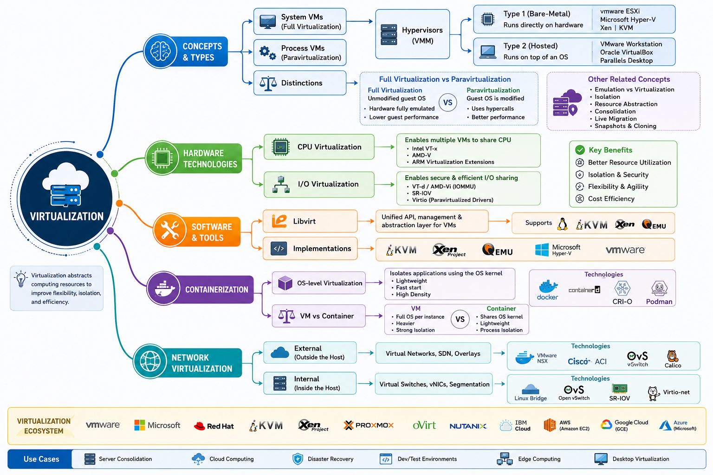

# Virtualization Landscape

This summary is significantly simplified, but provides in a convenient landsacpe diagram as well as a hierarchy of some important key concepts.

## VIRTUALIZATION

### I. Concepts & Types
* **System Virtual Machines (Hardware VMs)**
    * *Nature:* Full emulation of underlying hardware.
    * *Requirement:* Full Guest Operating System.
    * *Tools:* VirtualBox, VMware Workstation, Hyper-V.
    * **Implementation: Hypervisors (The VMM)**
        * **Type 1 (Bare-Metal):** Runs directly on the physical hardware (Native).
        * **Type 2 (Hosted):** Runs as an application on top of a host operating system.
* **Process Virtual Machines (Application VMs)**
    * *Nature:* Platform-independent environment for a single program.
    * *Examples:* JVM (Java), CPython (Python), .NET CLR.
* **Key Distinctions**
    * **Wine:** Not an emulator; it is a compatibility layer translating API calls.
    * **Python venv:** Not virtualization; it is filesystem isolation for dependency management.

### II. Hardware Enabling Technologies
* **CPU Virtualization:**
    * *Extensions:* Intel VT-x and AMD-V.
    * *Mechanism:* Root Mode (Ring -1) for near-native performance.
    * *Efficiency:* SMT (Simultaneous Multithreading) / Intel Hyper-Threading (Logical cores).
* **I/O Virtualization:**
    * *IOMMU:* Intel VT-d and AMD-Vi (Address translation & memory protection).
    * *Advanced Features:* PCI Passthrough (SR-IOV) for direct hardware access (e.g., GPUs).

### III. Software & Management Tools
* **Libvirt:** A toolkit/API providing a uniform interface to manage multiple hypervisors.
* **Hypervisor Implementations:** KVM, Xen, QEMU, VMware, VirtualBox.

### IV. Containerization
* **Core Concept:** OS-level virtualization sharing the host OS kernel.
* **VM vs. Container Trade-offs:**
    * *Performance:* Containers are faster to boot and have lower overhead.
    * *Security:* VMs provide stronger isolation (separate kernels).
    * *Resource Use:* Containers are significantly more lightweight.

### V. Network Virtualization
* **External:** Combining many physical networks into one unifying virtual network.
* **Internal:** Providing network functionality to processes/containers on a single server.

# Self-Assessment

!!! tip "Self-Assessment"
    Test your knowledge of the concepts covered in this section.

    ??? question "What is the role of Intel VT-x and AMD-V in CPU virtualization?"
        Intel VT-x and AMD-V are hardware extensions that introduce a new CPU execution mode (Root Mode/Ring -1). This allows the hypervisor to run guest OSs with near-native performance by reducing the need for complex software-based binary translation.

    ??? question "What is IOMMU (Intel VT-d/AMD-Vi) and why is it important for PCI Passthrough?"
        IOMMU (Input-Output Memory Management Unit) provides address translation and memory protection for peripheral devices. It is critical for PCI Passthrough (SR-IOV) because it allows a virtual machine to safely access physical hardware (like a GPU or NIC) directly, bypassing the hypervisor's emulation.

    ??? question "What is Libvirt?"
        Libvirt is an open-source API, daemon, and management tool for managing various virtualization technologies (like KVM, Xen, and QEMU). It provides a consistent interface, allowing management tools to interact with different hypervisors using a uniform set of commands.

