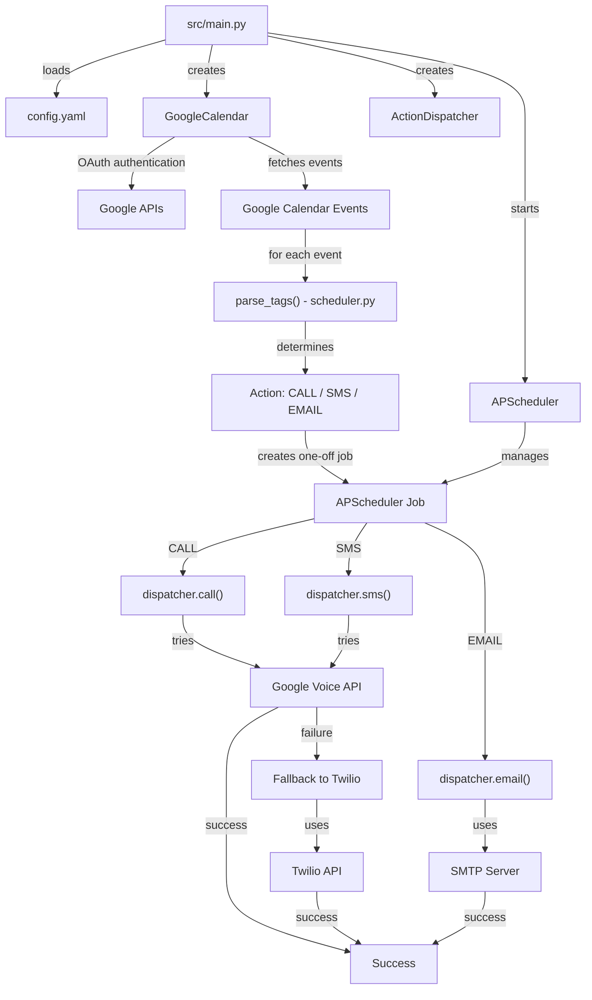

# cloudmesh-ai Calendar notification

## TODO

- create repository cloudmesh-ai/project-calendar-notify
- upload code
- what does twillo feedback mean
- config.yaml logic
    - location must be ~/.config/cloudmesh/ai/calendar/config.yaml
    - terminate if we find ./config.yaml execution and print whe r it shoudl be moved to 
- add motivation for the project
- can twillo vs google voice be configured in config.yaml
- fix phone to make calles from
- fix phone to make calles to
- Add more tag types (`#SUBJECT`, `#BODY`, `#TIMEZONE`, …) – simply extend
  `parse_tags` and the `build_job_from_event` logic.
- Add a web service that has a url so we can send messages to it and we see them printed() dispatcher web service ) add in config file if we want web service dispatecher or not
- add docker compose 

- add  tests

## Extending / customizing

* Replace the scheduler with a persistent queue (Redis, RQ, etc.) for
  distributed deployments.
* Add a web UI (FastAPI + Jinja) to edit `config.yaml` on‑the‑fly.
* Add a web UI to edit events so i can easy add notes to guide the scheduler
* add the ability to add multiple notifictaion phone numbers sms or emails
* add the ability to use contact groups from coogle contacts

# cloudmesh-ai Calendar Notify Project

!!! note "Goal"
    Calendar‑driven CALL / SMS / EMAIL automation

cloudmesh-ai reads Google Calendar events, parses custom tags in the **notes**
field and, at a configurable time, triggers one of three actions:

* **CALL** – a voice call (Google Voice, with Twilio fallback)
* **SMS** – a text message (Google Voice, with Twilio fallback)
* **EMAIL** – an e‑mail via any SMTP server

All secrets and defaults live in a single `config.yaml`.  
The project is completely self‑contained and can be run locally or
inside a Docker container.


## Summary

You now have an cloudmesh-ai codebase. Simply copy the files into a folder named `cloudmesh-ai`, adjust `config.yaml` with your own credentials, and run `python -m src.main` (or build the Docker image) to start the service.


## Project tree
```
cloudmesh-ai/
│
├─ config.yaml                # user‑editable configuration (see below)
├─ requirements.txt           # Python dependencies
├─ README.md                  # quick‑start guide (the text you are reading)
│
├─ src/
│   ├─ __init__.py
│   ├─ main.py                # entry point
│   ├─ google_calendar.py     # Google Calendar wrapper
│   ├─ google_voice.py        # Google Voice wrapper (beta)
│   ├─ actions.py             # CALL / SMS / EMAIL dispatcher
│   ├─ scheduler.py           # tag parsing & APScheduler glue
│
├─ credentials/
│   └─ client_secret.json     # Google OAuth client (keep private)
│
└─ Dockerfile                 # optional containerised run
```

---

## Quick start

```bash
git clone <repo‑url> # TODO: repo url needs to be updated
cd cloudmesh-ai # TODO: repo name needs to be updated
python -m venv .venv && source .venv/bin/activate   
pip install -r requirements.txt
# Edit config.yaml – add your Google OAuth client, Voice user, SMTP credentials etc.
python -m src.main
```

The first run will open a browser window for Google OAuth consent; grant the
requested scopes (Calendar + Voice). Afterwards a `credentials/token.json` file
stores the refresh token.

## Docker quickstart

TODO: add the docker quickstart here

---

## Architecture diagram (Chapter 4)

*The diagram shows the flow from configuration → calendar → tag parsing → APScheduler → Google Voice (primary) → optional Twilio fallback → SMTP for e‑mail.*

---

## ASCII Architecture Tree

```
main.py
  │
  ├── config.yaml
  ├── GoogleCalendar
  │      └── Google APIs
  │             └── Calendar Events
  │                    └── parse_tags()
  │                           └── Action
  │                                  └── APScheduler Job
  │                                         ├── CALL ──► Google Voice ──► Success
  │                                         │                  │
  │                                         │                  └─ failure ─► Twilio ──► Success
  │                                         │
  │                                         ├── SMS ───► Google Voice ──► Success
  │                                         │                  │
  │                                         │                  └─ failure ─► Twilio ──► Success
  │                                         │
  │                                         └── EMAIL ─► SMTP ──────────► Success
  │
  ├── ActionDispatcher
  │
  └── APScheduler
         └── manages jobs
```

---

## License

MIT – feel free to fork, adapt, and share!  


---

## 1️⃣ `config.yaml`

```yaml
# -------------------------------------------------
# 1️⃣ Google Calendar settings
# -------------------------------------------------
google:
  # Path to the OAuth client_secret.json you obtain from
  # Google Cloud Console → APIs & Services → Credentials
  client_secret_path: "./credentials/client_secret.json"

  # Token file where the user‑grant is stored after first auth
  token_path: "./credentials/token.json"

  # The calendar ID you want to watch.
  # For a personal account this is usually your e‑mail address.
  calendar_id: "youremail@example.com"

  # How many days in the future to look for events (default 7)
  look_ahead_days: 7

# -------------------------------------------------
# 2️⃣ Action defaults – can be overridden per‑event
# -------------------------------------------------
actions:
  # If the note does **not** contain an explicit time, use the
  # event start time for the action (true = use start, false = now)
  use_event_start_time: true

  # Default phone number to call / SMS (overridden by #PHONE: tag)
  default_phone: "+15552223333"

  # Default e‑mail address (overridden by #EMAIL: tag)
  default_email: "me@mydomain.com"

# -------------------------------------------------
# 3️⃣ Google Voice settings – replace Twilio
# -------------------------------------------------
google_voice:
  # The Workspace user that owns a Google Voice licence
  user_email: "voicebot@mycompany.com"

# -------------------------------------------------
# 4️⃣ E‑mail settings
# -------------------------------------------------
email:
  smtp_server: "smtp.gmail.com"
  smtp_port: 587
  username: "mygmail@gmail.com"
  password: "my_app_password"
  # default subject – can be overridden in the note with #SUBJECT:
  default_subject: "cloudmesh-ai notification"

# -------------------------------------------------
# 5️⃣ Scheduler (APScheduler) options
# -------------------------------------------------
scheduler:
  # run the scan every N minutes (default = 10)
  scan_interval_minutes: 10
  # timezone for all datetime handling
  timezone: "UTC"
```

---

## 2️⃣ `requirements.txt`

```
google-api-python-client==2.136.0
google-auth-httplib2==0.2.0
google-auth-oauthlib==1.2.1
pytz==2024.1
APScheduler==3.10.4
twilio==9.2.0
PyYAML==6.0.2
python-dotenv==1.0.1
```

*(If you decide you never need Twilio, you can remove the `twilio` line.)*

---

## 3️⃣ `Dockerfile`

```Dockerfile
# Use an official Python runtime as a parent image
FROM python:3.11-slim

# Set work directory
WORKDIR /app

# Install system dependencies (needed for tzdata)
RUN apt-get update && apt-get install -y --no-install-recommends \
    tzdata && rm -rf /var/lib/apt/lists/*

# Copy requirements and install them
COPY requirements.txt .
RUN pip install --no-cache-dir -r requirements.txt

# Copy source code & config (you will mount your own config.yaml at runtime)
COPY src ./src
COPY config.yaml .
COPY credentials ./credentials

# Expose nothing – the container just runs the script
CMD ["python", "-m", "src.main"]
```

## Docker compose

TODO: create two containers one for the opwnclaw, the other for the web service that recieves calls

---

## 4️⃣ `src/__init__.py`

```python
# Empty – marks src as a package
```

---

## 5️⃣ `src/main.py`

```python
import logging, yaml, sys, os
from pathlib import Path
from src.google_calendar import GoogleCalendar
from src.actions import ActionDispatcher
from src.scheduler import build_job_from_event
from apscheduler.schedulers.background import BackgroundScheduler
from datetime import datetime, timedelta
import pytz

# -------------------------------------------------
# Basic logging set‑up
# -------------------------------------------------
logging.basicConfig(
    level=logging.INFO,
    format="[%(asctime)s] %(levelname)s %(name)s – %(message)s",
    handlers=[logging.StreamHandler(sys.stdout)],
)
LOGGER = logging.getLogger("cloudmesh-ai")

def load_config(path="config.yaml"):
    if not Path(path).exists():
        LOGGER.error(f"Config file not found: {path}")
        sys.exit(1)
    with open(path) as f:
        cfg = yaml.safe_load(f)
    LOGGER.info("Configuration loaded")
    return cfg

def main():
    cfg = load_config()

    # Initialise Google Calendar (which also loads OAuth credentials)
    calendar = GoogleCalendar(cfg)

    # Pass the SAME OAuth credentials to the dispatcher so it can call Google Voice
    dispatcher = ActionDispatcher(cfg, calendar.service._http.credentials)

    # Scheduler (APScheduler) -------------------------------------------------
    scheduler = BackgroundScheduler(timezone=cfg["scheduler"]["timezone"])
    scheduler.start()

    # -------------------------------------------------------------------------
    # 1️⃣  Initial scan (run immediately)
    # -------------------------------------------------------------------------
    events = calendar.get_upcoming_events()
    for ev in events:
        build_job_from_event(ev, cfg, dispatcher, scheduler)

    # -------------------------------------------------------------------------
    # 2️⃣  Periodic re‑scan – every X minutes (configurable)
    # -------------------------------------------------------------------------
    scan_interval = cfg["scheduler"]["scan_interval_minutes"]

    def periodic_scan():
        LOGGER.info("Running periodic calendar scan …")
        events = calendar.get_upcoming_events()
        for ev in events:
            build_job_from_event(ev, cfg, dispatcher, scheduler)

    scheduler.add_job(
        periodic_scan,
        "interval",
        minutes=scan_interval,
        next_run_time=datetime.now(pytz.timezone(cfg["scheduler"]["timezone"])) + timedelta(seconds=5),
        id="periodic_scan",
        replace_existing=True,
    )
    LOGGER.info(f"Scheduler started – next scan in {scan_interval} minutes")
    try:
        # Keep the main thread alive – the background scheduler does the work.
        while True:
            pass
    except KeyboardInterrupt:
        LOGGER.info("Shutting down …")
        scheduler.shutdown()

if __name__ == "__main__":
    main()
```

---

## 6️⃣ `src/google_calendar.py`

```python
import datetime, os, yaml, logging
from google.oauth2.credentials import Credentials
from google_auth_oauthlib.flow import InstalledAppFlow
from googleapiclient.discovery import build
import pytz

LOGGER = logging.getLogger(__name__)

SCOPES = [
    "https://www.googleapis.com/auth/calendar.readonly",
    # Google Voice API scope (required for call/SMS)
    "https://www.googleapis.com/auth/voice",
]

class GoogleCalendar:
    def __init__(self, cfg):
        self.cfg = cfg
        self.service = self._authenticate()

    def _authenticate(self):
        client_path = self.cfg["google"]["client_secret_path"]
        token_path = self.cfg["google"]["token_path"]

        creds = None
        if os.path.exists(token_path):
            creds = Credentials.from_authorized_user_file(token_path, SCOPES)

        if not creds or not creds.valid:
            if creds and creds.expired and creds.refresh_token:
                creds.refresh(Request())
            else:
                flow = InstalledAppFlow.from_client_secrets_file(client_path, SCOPES)
                creds = flow.run_local_server(port=0)
            # Save the token for the next run
            with open(token_path, "w") as token_file:
                token_file.write(creds.to_json())

        return build("calendar", "v3", credentials=creds)

    def get_upcoming_events(self):
        now = datetime.datetime.utcnow().isoformat() + "Z"
        max_time = (
            datetime.datetime.utcnow()
            + datetime.timedelta(days=self.cfg["google"]["look_ahead_days"])
        ).isoformat() + "Z"

        events_result = (
            self.service.events()
            .list(
                calendarId=self.cfg["google"]["calendar_id"],
                timeMin=now,
                timeMax=max_time,
                singleEvents=True,
                orderBy="startTime",
            )
            .execute()
        )
        events = events_result.get("items", [])
        LOGGER.info(f"Fetched {len(events)} upcoming events")
        return events
```

---

## 7️⃣ `src/google_voice.py`

```python
import logging
from googleapiclient.discovery import build

LOGGER = logging.getLogger(__name__)

class GoogleVoice:
    """Thin wrapper around the Google Voice (beta) API."""
    def __init__(self, creds, cfg):
        self.cfg = cfg
        self.service = build("voice", "v1", credentials=creds, cache_discovery=False)

    # -------------------------------------------------
    # Send an SMS
    # -------------------------------------------------
    def send_sms(self, to_number: str, body: str):
        user = self.cfg["google_voice"]["user_email"]
        request_body = {"phoneNumber": to_number, "text": body}
        LOGGER.info(f"Google Voice → SMS to {to_number}")
        resp = (
            self.service.users()
            .messages()
            .create(parent=f"users/{user}", body=request_body)
            .execute()
        )
        LOGGER.debug(f"SMS response: {resp}")
        return resp

    # -------------------------------------------------
    # Place a PSTN call
    # -------------------------------------------------
    def place_call(self, to_number: str, message: str = ""):
        user = self.cfg["google_voice"]["user_email"]
        request_body = {
            "phoneNumber": to_number,
            "audioConfig": {"text": message or "This is an automated cloudmesh-ai call."},
        }
        LOGGER.info(f"Google Voice → CALL to {to_number}")
        resp = (
            self.service.users()
            .calls()
            .create(parent=f"users/{user}", body=request_body)
            .execute()
        )
        LOGGER.debug(f"Call response: {resp}")
        return resp
```

---

## 8️⃣ `src/actions.py`

```python
import logging, smtplib, ssl
from email.message import EmailMessage
from twilio.rest import Client          # optional fallback
from src.google_voice import GoogleVoice

LOGGER = logging.getLogger(__name__)

class ActionDispatcher:
    def __init__(self, cfg, creds):
        """
        cfg   – full configuration dictionary.
        creds – Google OAuth credentials (shared with Calendar).
        """
        self.cfg = cfg

        # Optional Twilio fallback
        self.twilio_client = None
        if cfg.get("twilio"):
            self.twilio_client = Client(
                cfg["twilio"]["account_sid"], cfg["twilio"]["auth_token"]
            )

        # Primary Google Voice client (must exist if you want Voice)
        if cfg.get("google_voice"):
            self.voice = GoogleVoice(creds, cfg)
        else:
            self.voice = None

    # ---------- CALL ----------
    def call(self, to_number, message=""):
        if self.voice:
            try:
                self.voice.place_call(to_number, message)
                LOGGER.info("Call placed via Google Voice")
                return
            except Exception as exc:      # pragma: no cover
                LOGGER.warning(f"Google Voice call failed ({exc}); trying Twilio…")

        if self.twilio_client:
            from_number = self.cfg["twilio"]["from_number"]
            twiml = f'<Response><Say voice="alice">{message or "cloudmesh-ai calling you."}</Say></Response>'
            call = self.twilio_client.calls.create(
                twiml=twiml, to=to_number, from_=from_number
            )
            LOGGER.info(f"Call placed via Twilio – SID {call.sid}")
        else:
            LOGGER.error("No calling method available (no Voice, no Twilio).")

    # ---------- SMS ----------
    def sms(self, to_number, body):
        if self.voice:
            try:
                self.voice.send_sms(to_number, body)
                LOGGER.info("SMS sent via Google Voice")
                return
            except Exception as exc:      # pragma: no cover
                LOGGER.warning(f"Google Voice SMS failed ({exc}); trying Twilio…")

        if self.twilio_client:
            from_number = self.cfg["twilio"]["from_number"]
            msg = self.twilio_client.messages.create(
                body=body, from_=from_number, to=to_number
            )
            LOGGER.info(f"SMS sent via Twilio – SID {msg.sid}")
        else:
            LOGGER.error("No SMS method available (no Voice, no Twilio).")

    # ---------- EMAIL ----------
    def email(self, to_addr, subject, body):
        email_cfg = self.cfg["email"]
        msg = EmailMessage()
        msg["From"] = email_cfg["username"]
        msg["To"] = to_addr
        msg["Subject"] = subject
        msg.set_content(body)

        LOGGER.info(f"Sending e‑mail to {to_addr}")
        context = ssl.create_default_context()
        with smtplib.SMTP(email_cfg["smtp_server"], email_cfg["smtp_port"]) as server:
            server.starttls(context=context)
            server.login(email_cfg["username"], email_cfg["password"])
            server.send_message(msg)
        LOGGER.debug("E‑mail sent")
```

---

## 9️⃣ `src/scheduler.py`

```python
import logging, re, pytz
from datetime import datetime
from apscheduler.triggers.date import DateTrigger

LOGGER = logging.getLogger(__name__)

TAG_REGEX = re.compile(r"#(\w+):\s*(.+)")

def parse_tags(note_text):
    """Extract tags from the note body, return dict of tag -> value."""
    tags = {}
    for line in note_text.splitlines():
        m = TAG_REGEX.search(line)
        if m:
            tags[m.group(1).upper()] = m.group(2).strip()
    return tags

def schedule_action(sched, cfg, dispatcher, action, run_at, **kwargs):
    """Add a one‑off job to the APScheduler."""
    trigger = DateTrigger(run_date=run_at)
    LOGGER.info(f"Scheduling {action} for {run_at.isoformat()} – kwargs: {kwargs}")

    if action == "CALL":
        sched.add_job(
            dispatcher.call,
            trigger=trigger,
            args=[kwargs["to_number"], kwargs.get("message", "")],
            misfire_grace_time=300,
        )
    elif action == "SMS":
        sched.add_job(
            dispatcher.sms,
            trigger=trigger,
            args=[kwargs["to_number"], kwargs["body"]],
            misfire_grace_time=300,
        )
    elif action == "EMAIL":
        sched.add_job(
            dispatcher.email,
            trigger=trigger,
            args=[kwargs["to_addr"], kwargs["subject"], kwargs["body"]],
            misfire_grace_time=300,
        )
    else:
        LOGGER.warning(f"Unsupported action: {action}")

def build_job_from_event(event, cfg, dispatcher, scheduler):
    """
    Takes a Google Calendar event dict, decides if an action is needed,
    parses tags, decides the exact datetime and registers the job.
    """
    notes = event.get("description", "")
    if not notes:
        return  # nothing to do

    tags = parse_tags(notes)

    # ---- What to do? ------------------------------------------------------------
    action = tags.get("ACTION")
    if not action:
        return  # No #ACTION tag → ignore

    # ---- When? -----------------------------------------------------------------
    tz = pytz.timezone(cfg["scheduler"]["timezone"])

    if "TIME" in tags:
        run_at = datetime.strptime(tags["TIME"], "%Y-%m-%d %H:%M")
        run_at = tz.localize(run_at)
    elif cfg["actions"]["use_event_start_time"]:
        start = event["start"].get("dateTime") or event["start"].get("date")
        start_dt = datetime.fromisoformat(start.rstrip("Z"))
        if start_dt.tzinfo is None:
            start_dt = pytz.UTC.localize(start_dt)
        run_at = start_dt.astimezone(tz)
    else:
        run_at = datetime.now(tz)

    # ---- Resolve recipients -----------------------------------------------------
    default_phone = cfg["actions"]["default_phone"]
    default_email = cfg["actions"]["default_email"]
    to_number = tags.get("PHONE", default_phone)
    to_email = tags.get("EMAIL", default_email)

    # ---- Dispatch ---------------------------------------------------------------
    if action == "CALL":
        message = tags.get("BODY", event.get("summary", "cloudmesh-ai reminder"))
        schedule_action(scheduler, cfg, dispatcher, "CALL", run_at,
                        to_number=to_number, message=message)

    elif action == "SMS":
        body = tags.get("BODY", event.get("summary", "cloudmesh-ai reminder"))
        schedule_action(scheduler, cfg, dispatcher, "SMS", run_at,
                        to_number=to_number, body=body)

    elif action == "EMAIL":
        subject = tags.get("SUBJECT", cfg["email"]["default_subject"])
        body = tags.get("BODY", event.get("description", "cloudmesh-ai reminder"))
        schedule_action(scheduler, cfg, dispatcher, "EMAIL", run_at,
                        to_addr=to_email, subject=subject, body=body)

    else:
        LOGGER.warning(f"Unsupported ACTION tag: {action}")
```

---
