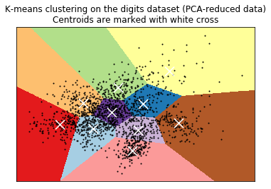

## Learning Objectives

!!! info "Learning Objectives"
    - Understand the mathematical objective of K-Means (Inertia/WCSS).
    - Implement the K-Means iterative process (Assignment and Update steps).
    - Compare Random initialization vs. K-means++ initialization.
    - Visualize high-dimensional clusters using PCA.

## Overview

K-Means is one of the most widely used unsupervised learning algorithms. It partitions data into $K$ clusters by minimizing the variance within each cluster, making it ideal for customer segmentation, image compression, and pattern discovery.

## Core Sections

### Case Study: K-Means Implementation

K-Means is a centroid-based unsupervised clustering algorithm designed to partition a dataset into $K$ distinct, non-overlapping subgroups (clusters).

#### The K-Means Algorithm: Detailed Mechanics

The objective of K-Means is to minimize the **Within-Cluster Sum of Squares (WCSS)**, also known as **Inertia**. Mathematically, the algorithm seeks to find centroids $\mu_i$ that minimize:

$$\text{Inertia} = \sum_{i=1}^{K} \sum_{x \in C_i} \| x - \mu_i \|^2$$

Where $C_i$ is the set of points assigned to cluster $i$, and $\| x - \mu_i \|^2$ is the squared Euclidean distance between a data point $x$ and its assigned centroid $\mu_i$.

**The Iterative Process (Lloyd's Algorithm):**

1. **Initialization**: The algorithm selects $K$ initial points as starting centroids.
2. **Assignment Step**: Each data point $x$ is assigned to the cluster $C_i$ whose centroid $\mu_i$ is closest in Euclidean space.
3. **Update Step**: Each centroid $\mu_i$ is recalculated as the arithmetic mean of all points currently assigned to that cluster: $\mu_i = \frac{1}{|C_i|} \sum_{x \in C_i} x$
4. **Convergence**: Steps 2 and 3 are repeated until the centroids no longer change significantly or a maximum number of iterations is reached.

**Centroid Initialization: Random vs. K-means++**

The quality of the final clustering is heavily dependent on the initial centroids.

- **Random Initialization**: Selects $K$ points from the dataset at random. This is computationally cheap but risky; if two centroids start very close to each other, the algorithm may converge to a poor local optimum, leading to suboptimal clusters.
- **K-means++**: This is the default in scikit-learn. It chooses the first centroid randomly, but then selects subsequent centroids with a probability proportional to their squared distance from the nearest existing centroid. This ensures that centroids are spread out across the data space, significantly improving convergence speed and ensuring a more stable, globally optimal solution.

#### Implementation on the Digits Dataset

This section demonstrates the implementation of the K-Means algorithm on the digits dataset. We use `load_digits` to acquire a dataset of handwritten digits and `scale` to normalize the features, which is mandatory for K-Means since it relies on Euclidean distance.

```python
from time import time
import numpy as np
import matplotlib.pyplot as plt
from sklearn import metrics
from sklearn.cluster import KMeans
from sklearn.datasets import load_digits
from sklearn.decomposition import PCA
from sklearn.preprocessing import scale

np.random.seed(42)
digits = load_digits()
data = scale(digits.data)

n_samples, n_features = data.shape
n_digits = len(np.unique(digits.target))
labels = digits.target
sample_size = 300

def bench_k_means(estimator, name, data):
    t0 = time()
    estimator.fit(data)
    # Log various clustering metrics:
    # - inertia_: Sum of squared distances of samples to their closest cluster center.
    # - homogeneity: Each cluster contains only members of a single class.
    # - completeness: All members of a given class are assigned to the same cluster.
    # - v_measure: Harmonic mean of homogeneity and completeness.
    # - silhouette: Measures how similar an object is to its own cluster compared to other clusters.
    print('% 9s   %.2fs    %i   %.3f   %.3f   %.3f   %.3f   %.3f    %.3f'
          % (name, (time() - t0), estimator.inertia_,
             metrics.homogeneity_score(labels, estimator.labels_),
             metrics.completeness_score(labels, estimator.labels_),
             metrics.v_measure_score(labels, estimator.labels_),
             metrics.adjusted_rand_score(labels, estimator.labels_),
             metrics.adjusted_mutual_info_score(labels,  estimator.labels_),
             metrics.silhouette_score(data, estimator.labels_,metric='euclidean',sample_size=sample_size)))

bench_k_means(KMeans(init='k-means++', n_clusters=n_digits, n_init=10), name="k-means++", data=data)
bench_k_means(KMeans(init='random', n_clusters=n_digits, n_init=10), name="random", data=data)

pca = PCA(n_components=n_digits).fit(data)
bench_k_means(KMeans(init=pca.components_,n_clusters=n_digits, n_init=1),name="PCA-based", data=data)
```

#### Visualization of K-Means Results

To visualize high-dimensional clusters, we use PCA to reduce the data to two dimensions. We then create a meshgrid of points across the feature space and use `kmeans.predict` to assign each point to a cluster, creating a colored decision boundary. Figure 10 shows the resulting clusters and their centroids.

```python
reduced_data = PCA(n_components=2).fit_transform(data)
kmeans = KMeans(init='k-means++', n_clusters=n_digits, n_init=10)
kmeans.fit(reduced_data)

h = .02
x_min, x_max = reduced_data[:, 0].min() - 1, reduced_data[:, 0].max() + 1
y_min, y_max = reduced_data[:, 1].min() - 1, reduced_data[:, 1].max() + 1
xx, yy = np.meshgrid(np.arange(x_min, x_max, h), np.arange(y_min, y_max, h))

Z = kmeans.predict(np.c_[xx.ravel(), yy.ravel()])
Z = Z.reshape(xx.shape)
plt.figure(1)
plt.clf()
plt.imshow(Z, interpolation='nearest',
           extent=(xx.min(), xx.max(), yy.min(), yy.max()),
           cmap=plt.cm.Paired,
           aspect='auto', origin='lower')

plt.plot(reduced_data[:, 0], reduced_data[:, 1], 'k.', markersize=2)
centroids = kmeans.cluster_centers_
plt.scatter(centroids[:, 0], centroids[:, 1],
            marker='x', s=169, linewidths=3,
            color='w', zorder=10)
plt.title('K-means clustering on the digits dataset (PCA-reduced data)\n'
          'Centroids are marked with white cross')
plt.xlim(x_min, x_max)
plt.ylim(y_min, y_max)
plt.xticks(())
plt.yticks(())
plt.show()
```



Figure 10: K-means clustering results on digits dataset.

## Summary Checklist

- [ ] Define the objective function of K-Means (Inertia).
- [ ] Explain the difference between the Assignment and Update steps.
- [ ] Justify the use of K-means++ over random initialization.
- [ ] Apply PCA to visualize clusters in 2D space.

## Assignments

!!! note "Practical Exercises"
    1. Implement K-Means clustering on the digits dataset.
    2. Compare the results of random vs. k-means++ initialization.
    3. Visualize the decision boundaries using PCA.

## References

- [Scikit-learn Documentation: KMeans](https://scikit-learn.org/stable/modules/generated/sklearn.cluster.KMeans.html)

## Self-Assessment
Test your knowledge by expanding the questions below.
??? note "What does Inertia represent in K-Means?"
    It is the sum of squared distances of samples to their closest cluster center.

??? note "Why is feature scaling necessary for K-Means?"
    K-Means relies on Euclidean distance, so features with larger scales would disproportionately influence the results.

??? note "How does K-means++ improve upon random initialization?"
    It spreads out the initial centroids by selecting new ones based on their distance from existing ones, leading to faster convergence and more stable results.
