# A Practical, End-to-End Tour of scikit-learn

!!! info "Learning Objectives"
    By the end of this chapter, you will be able to:
    * Implement a complete machine learning workflow using scikit-learn.
    * Utilize Pipelines to combine preprocessing and model training.
    * Compare linear models, SVMs, and tree-based ensembles.
    * Perform unsupervised clustering and dimensionality reduction.
    * Optimize model performance through hyper-parameter tuning and cross-validation.

## Overview

scikit-learn is the primary library for classical machine learning in Python. It provides a consistent API for a wide array of algorithms, ranging from simple linear regression to complex ensemble methods. This chapter provides a practical tour of the library, demonstrating how to move from raw data to a deployable model.

## Core Concepts and Terminology

| Term | Definition | Example |
|------|------------|---------|
| **Estimator** | Anything that implements `fit` (and possibly `predict` or `transform`). | `LinearRegression()`, `KMeans()` |
| **Transformer** | An estimator that implements `fit` and `transform`. | `StandardScaler()` |
| **Predictor** | An estimator that implements `fit` and `predict`. | `RandomForestRegressor()` |
| **Meta-estimator** | An estimator that wraps other estimators (e.g., `Pipeline`, `BaggingClassifier`). | `Pipeline([('scaler', StandardScaler()), ('clf', LogisticRegression())])` |
| **Hyper-parameter** | Configuration that is set before fitting (e.g., `C` in SVM). | `SVC(C=0.5, kernel='rbf')` |
| **Parameter** | Learned from data during `fit` (e.g., `coef_` of a linear model). | `model.coef_` after training a `LinearRegression`. |
| **Score** | Any metric returned by an estimator's `score` method (default is R² for regressors, accuracy for classifiers). | `model.score(X_test, y_test)`. |

## Setting Up the Environment

```bash
# Create a fresh environment (optional but recommended)
python -m venv sklearn-env
source sklearn-env/bin/activate   # on Windows: .\sklearn-env\Scripts\activate

# Install core libraries
pip install numpy pandas matplotlib seaborn scikit-learn
```

!!! info "Reproducibility Tip"
    Set a global random seed at the start of every notebook or script to ensure consistent results across runs.

```python
import numpy as np, random, os
RANDOM_STATE = 42
np.random.seed(RANDOM_STATE)
random.seed(RANDOM_STATE)
os.environ['PYTHONHASHSEED'] = str(RANDOM_STATE)
```

## Data Loading and Exploration

### Example Dataset: The Wine Quality (UCI)

We use the Wine Quality dataset, which contains physicochemical properties of red wines. This is a classic regression problem where the goal is to predict a quality score.

```python
import pandas as pd
from sklearn.datasets import fetch_openml

# Load directly from openml (automatically cached)
wine = fetch_openml(name='wine-quality-red', version=1, as_frame=True)
df = wine.frame
df.head()
```

**Output:**
```text
   fixed_acidity  volatile_acidity  citric_acid  ...  sulphates  alcohol  class
0            7.4              0.70         0.00  ...       0.56      9.4      5
1            7.8              0.88         0.00  ...       0.68      9.8      5
2            7.8              0.76         0.04  ...       0.65      9.8      5
3           11.2              0.28         0.56  ...       0.58      9.8      6
4            7.4              0.70         0.00  ...       0.56      9.4      5
```

**Explanation:**
`fetch_openml` is a powerful utility for retrieving datasets directly from OpenML. Setting `as_frame=True` ensures the data is returned as a Pandas DataFrame, which is the standard for data exploration in Python.

### Exploratory Plots

Before modeling, it is essential to understand the distribution of the target variable and the relationships between features.

```python
import seaborn as sns
import matplotlib.pyplot as plt

# 1. Distribution of target variable (quality)
sns.histplot(df['quality'], kde=True, bins=10, color='steelblue')
plt.title('Distribution of Wine Quality Scores')
plt.xlabel('Quality (0-10)')
plt.show()
```

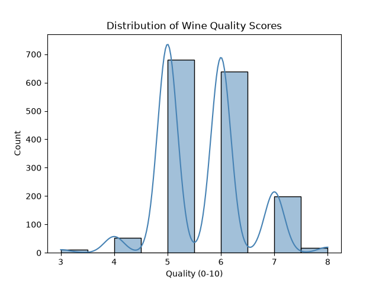
Figure 1 – A right-skewed histogram showing most wines have quality 5-6.

**Explanation:**
The histogram reveals the balance of our classes. A heavily skewed target can lead to a model that predicts the mean quality for every sample; identifying this early suggests we may need to look at evaluation metrics like MAE or RMSE rather than simple accuracy.

```python
# 2. Pairwise correlation heatmap
plt.figure(figsize=(10,8))
corr = df.corr()
sns.heatmap(corr, cmap='coolwarm', annot=True, fmt=".2f")
plt.title('Feature Correlation Matrix')
plt.show()
```

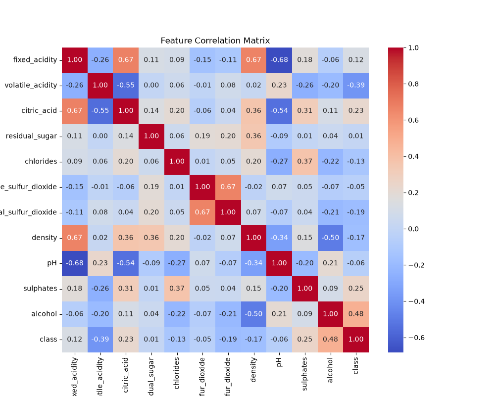
Figure 2 – Heat-map where e.g. `volatile acidity` and `citric acid` have a modest negative correlation.

**Explanation:**
The correlation matrix helps identify multicollinearity (when two features are highly correlated). In scikit-learn, highly correlated features can destabilize linear models, making this step critical for feature selection.

## Data Pre-Processing

### Train-Test Split

Splitting data into training and testing sets is the first line of defense against overfitting. We use a hold-out set to evaluate how the model generalizes to unseen data.

```python
from sklearn.model_selection import train_test_split

X = df.drop('quality', axis=1)
y = df['quality']

X_train, X_test, y_train, y_test = train_test_split(
    X, y, test_size=0.2, random_state=RANDOM_STATE, stratify=y
)
```

**Explanation:**
The `stratify=y` parameter is crucial here. It ensures that the proportion of each quality score is preserved in both the training and testing sets, preventing a scenario where the test set contains quality scores that the model never saw during training.

### Scaling and Encoding

Most machine learning algorithms calculate distances between points. If one feature ranges from 0 to 1 and another from 0 to 10,000, the latter will dominate the distance calculation regardless of its actual importance.

```python
from sklearn.preprocessing import StandardScaler, OneHotEncoder
from sklearn.compose import ColumnTransformer

numeric_features = X.select_dtypes(include=['float64', 'int64']).columns
preprocess = ColumnTransformer(
    transformers=[
        ('num', StandardScaler(), numeric_features)
    ], remainder='passthrough'
)
```

!!! info "Why Scaling?"
    Many algorithms (SVM, Logistic Regression, k-NN) are sensitive to feature magnitude. Scaling ensures that no single feature dominates the model due to its scale.

**Explanation:**
`ColumnTransformer` allows us to apply different transformations to different columns. Here, we apply `StandardScaler` (which removes the mean and scales to unit variance) only to numeric columns, while `remainder='passthrough'` ensures that any categorical columns are kept in the dataset.

### Building a Pipeline

Manually applying transformations to the training set and then repeating them on the test set is error-prone and leads to "data leakage" if done incorrectly.

```python
from sklearn.pipeline import Pipeline
from sklearn.linear_model import LinearRegression

pipeline = Pipeline(steps=[
    ('preprocess', preprocess),
    ('regressor', LinearRegression())
])
```

**Explanation:**
A `Pipeline` bundles the preprocessing steps and the estimator into a single object. When you call `pipeline.fit()`, scikit-learn automatically calls `fit_transform` on the transformers and then `fit` on the final estimator. This encapsulates the entire workflow.

### Running the Pipeline

```python
pipeline.fit(X_train, y_train)
y_pred = pipeline.predict(X_test)
```

**Explanation:**
The `predict` method now automatically applies the exact same scaling parameters (learned from the training set) to the test set before passing it to the linear regression model, guaranteeing consistency.

### Visualizing Residuals

Residuals (the difference between the actual and predicted value) provide a diagnostic look at where the model is failing.

```python
import numpy as np

residuals = y_test - y_pred
sns.scatterplot(x=y_pred, y=residuals, alpha=0.6)
plt.axhline(0, color='red', linestyle='--')
plt.xlabel('Predicted Quality')
plt.ylabel('Residual (Actual - Predicted)')
plt.title('Residual Plot – Linear Regression')
plt.show()
```

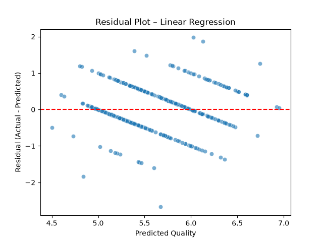
Figure 3 – Residuals should be randomly scattered around zero for a good fit.

**Explanation:**
In a good model, the residuals should be randomly distributed. If you see a "U-shape" or a "fan-shape" (heteroscedasticity), it indicates that the linear model is missing a non-linear relationship in the data, suggesting that a more complex model (like a Random Forest) might be necessary.

## Supervised Learning: Classification and Regression

Throughout this section, the pipeline pattern is reused. Each algorithm is swapped in the model step while the preprocessing remains identical.

### Linear Models

Linear models assume a linear relationship between the input features and the target. They are highly interpretable but may underfit complex data.

| Model | Use-case | Typical hyper-parameters |
|-------|----------|--------------------------|
| `LinearRegression` | Regression (continuous target) | `fit_intercept`, `normalize` |
| `LogisticRegression` | Binary/Multiclass classification | `C`, `penalty`, `solver` |
| `Ridge`, `Lasso` | Regression with regularisation | `alpha` |

#### Example: Ridge Regression

Ridge regression adds an L2 penalty to the loss function to prevent the coefficients from becoming too large, which reduces overfitting.

```python
from sklearn.linear_model import Ridge
ridge_pipe = Pipeline([
    ('preprocess', preprocess),
    ('ridge', Ridge(alpha=1.0))
])
ridge_pipe.fit(X_train, y_train)
print('R² on test set:', ridge_pipe.score(X_test, y_test))
```

**Output:**
```text
R² on test set: 0.37035792290038916
```

**Explanation:**
The `alpha` parameter controls the strength of the regularization. A higher `alpha` increases the penalty, shrinking the coefficients and making the model more robust to noise, though too high a value can lead to underfitting.

#### Learning Curve Plot

A learning curve helps us diagnose whether the model suffers from high bias (underfitting) or high variance (overfitting).

```python
from sklearn.model_selection import learning_curve

train_sizes, train_scores, test_scores = learning_curve(
    ridge_pipe, X, y, cv=5, scoring='r2',
    train_sizes=np.linspace(.1, 1.0, 5), random_state=RANDOM_STATE
)

plt.plot(train_sizes, np.mean(train_scores, axis=1), 'o-', label='Train')
plt.plot(train_sizes, np.mean(test_scores, axis=1), 's-', label='Cross-val')
plt.xlabel('Training Set Size')
plt.ylabel('R²')
plt.title('Learning Curve – Ridge Regression')
plt.legend()
plt.show()
```

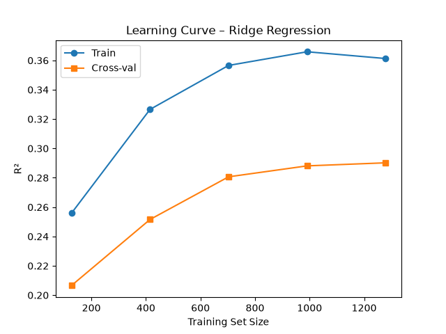
Figure 4 – Shows if the model is under-fitting (high bias) or over-fitting (high variance).

**Explanation:**
If the training and validation curves both flatten out at a low score, the model is underfitting. If there is a large gap between them (high training score, low validation score), the model is overfitting. The goal is to find the point where they converge at an acceptable performance level.

### Support Vector Machines (SVM)

SVMs attempt to find the hyperplane that maximizes the margin between different classes (or values, in the case of regression).

```python
from sklearn.svm import SVR, SVC

# Regression (SVR)
svr_pipe = Pipeline([
    ('preprocess', preprocess),
    ('svr', SVR(C=10, kernel='rbf', gamma='scale'))
])
svr_pipe.fit(X_train, y_train)
print('SVR R²:', svr_pipe.score(X_test, y_test))
```

**Output:**
```text
SVR R²: 0.38016377151062264
```

**Explanation:**
The `kernel='rbf'` (Radial Basis Function) is a "kernel trick" that allows the model to project data into a higher-dimensional space to find a linear separation that isn't possible in the original space. The `C` parameter controls the trade-off between a smooth decision boundary and classifying the training points correctly.

#### Decision Surface (2-D Toy Example)

To visualize how SVMs work, we use a toy "moons" dataset to show the non-linear decision boundary.

```python
from sklearn.datasets import make_moons
X_moon, y_moon = make_moons(noise=0.2, random_state=RANDOM_STATE)

svc = Pipeline([
    ('scale', StandardScaler()),
    ('svc', SVC(kernel='rbf', C=1.0, gamma='auto'))
])
svc.fit(X_moon, y_moon)

# Plot
import matplotlib.pyplot as plt
import numpy as np

xx, yy = np.meshgrid(np.linspace(-1.5, 2.5, 300),
                     np.linspace(-1.0, 1.5, 300))
Z = svc.predict(np.c_[xx.ravel(), yy.ravel()]).reshape(xx.shape)

plt.contourf(xx, yy, Z, alpha=0.3, cmap='coolwarm')
plt.scatter(X_moon[:,0], X_moon[:,1], c=y_moon, edgecolor='k')
plt.title('SVC Decision Boundary on make_moons')
plt.show()
```

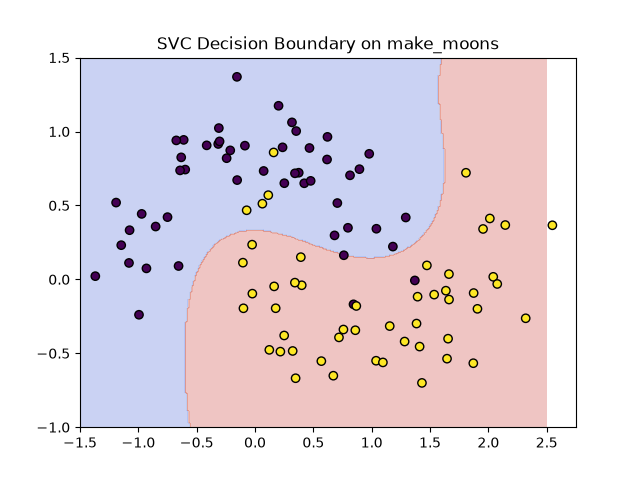
Figure 5 – Non-linear boundary separating the two moon shapes.

**Explanation:**
The plot demonstrates the power of the RBF kernel. Instead of a straight line, the model creates a flexible, organic boundary that follows the shape of the data, allowing it to correctly classify the "moons" that are intertwined.

### Tree-Based Models

Tree-based models partition the data into smaller and smaller regions based on feature thresholds. They are highly flexible and often perform best on tabular data.

| Model | Type | Strength |
|-------|------|----------|
| `DecisionTreeClassifier/Regressor` | Single tree | Interpretable, high variance |
| `RandomForestClassifier/Regressor` | Bagging of trees | Low variance, robust |
| `GradientBoostingClassifier/Regressor` | Boosting | Effective for many tabular problems |
| `HistGradientBoosting*` | Fast, histogram-based GBM | Handles large datasets |

#### Random Forest Example (Classification)

Random Forests use "Bagging" (Bootstrap Aggregating) to train multiple decision trees on different subsets of the data and average their results.

```python
# Convert to binary problem: quality >=7 is "good"
y_bin = (y >= 7).astype(int)

X_train, X_test, y_train, y_test = train_test_split(
    X, y_bin, test_size=0.2, random_state=RANDOM_STATE, stratify=y_bin
)

from sklearn.ensemble import RandomForestClassifier
rf_pipe = Pipeline([
    ('preprocess', preprocess),
    ('rf', RandomForestClassifier(
        n_estimators=300,
        max_depth=7,
        min_samples_leaf=5,
        random_state=RANDOM_STATE,
        n_jobs=-1
    ))
])

rf_pipe.fit(X_train, y_train)
print('Test accuracy:', rf_pipe.score(X_test, y_test))
```

**Output:**
```text
Test accuracy: 0.921875
```

**Explanation:**
By aggregating many trees, the Random Forest cancels out the errors of individual trees (which tend to overfit), leading to a model that generalizes much better. The `n_jobs=-1` parameter allows scikit-learn to use all available CPU cores to train the trees in parallel.

#### Feature Importance Bar Plot

One of the greatest advantages of tree-based models is their ability to quantify which features are most influential.

```python
importances = rf_pipe.named_steps['rf'].feature_importances_
feat_names = preprocess.transformers_[0][2]

sorted_idx = np.argsort(importances)[::-1]
plt.figure(figsize=(8,5))
sns.barplot(x=importances[sorted_idx], y=np.array(feat_names)[sorted_idx], palette='viridis')
plt.title('Random Forest – Feature Importances')
plt.xlabel('Mean Decrease in Impurity')
plt.show()
```

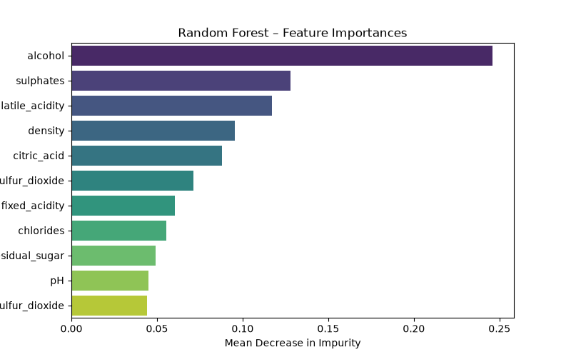
Figure 6 – `alcohol` and `volatile acidity` typically dominate the importance.

**Explanation:**
The `feature_importances_` attribute calculates the "Mean Decrease in Impurity." A feature that frequently splits the data and results in very pure child nodes is considered more important. This allows us to perform "feature selection" by removing unimportant variables.

### Gradient Boosting

While Random Forests build trees in parallel, Gradient Boosting builds them sequentially. Each new tree attempts to correct the errors (residuals) made by the previous trees.

```python
from sklearn.ensemble import GradientBoostingRegressor

gbr_pipe = Pipeline([
    ('preprocess', preprocess),
    ('gbr', GradientBoostingRegressor(
        n_estimators=500,
        learning_rate=0.05,
        max_depth=4,
        random_state=RANDOM_STATE
    ))
])

gbr_pipe.fit(X_train, y_train)
print('GBR R²:', gbr_pipe.score(X_test, y_test))
```

**Output:**
```text
GBR R²: 0.44224331049880194
```

**Explanation:**
The `learning_rate` is a critical hyper-parameter. It determines how much each new tree contributes to the final prediction. A lower learning rate usually requires more trees (`n_estimators`) but often results in a more stable and accurate model.

#### Partial Dependence Plot (PDP) for `alcohol`

Because ensemble models are "black boxes," we use interpretation tools like Partial Dependence Plots to see how a specific feature affects the prediction.

```python
from sklearn.inspection import PartialDependenceDisplay

PartialDependenceDisplay.from_estimator(
    gbr_pipe, X_test, ['alcohol'],
    kind='average', grid_resolution=50, cmap='viridis'
)
plt.title('Partial Dependence of Quality on Alcohol')
plt.show()
```

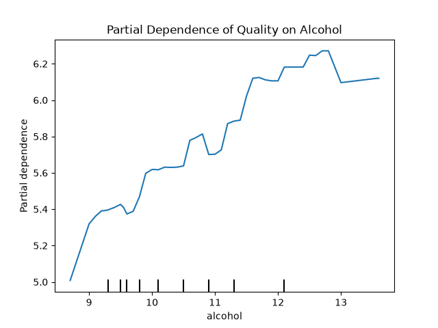
Figure 7 – Shows a roughly monotonic increase of predicted quality with alcohol content.

**Explanation:**
A PDP shows the average effect of a feature on the predicted outcome while marginalizing over all other features. In this plot, as the alcohol percentage increases, the predicted wine quality generally increases, confirming a positive correlation.

## Unsupervised Learning

Unsupervised learning deals with data that has no labels. Instead of predicting a target, these algorithms find hidden patterns or structures in the data.

### Clustering

Clustering groups similar data points together based on their features.

| Algorithm | Typical data | Key hyper-params |
|-----------|--------------|-----------------|
| `KMeans` | Spherical clusters | `n_clusters`, `init`, `max_iter` |
| `AgglomerativeClustering` | Hierarchical | `n_clusters`, `linkage`, `affinity` |
| `DBSCAN` | Arbitrary shape, noise | `eps`, `min_samples` |
| `GaussianMixture` | Probabilistic clusters | `n_components`, `covariance_type` |

#### K-Means on Wine Chemistry (2-D PCA Projection)

Since we cannot visualize 11-dimensional wine data, we use PCA to reduce it to 2 dimensions before applying K-Means.

```python
from sklearn.decomposition import PCA
from sklearn.cluster import KMeans

pca = PCA(n_components=2, random_state=RANDOM_STATE)
X_pca = pca.fit_transform(preprocess.fit_transform(X))

kmeans = KMeans(n_clusters=3, random_state=RANDOM_STATE)
labels = kmeans.fit_predict(X_pca)

plt.figure(figsize=(7,5))
sns.scatterplot(x=X_pca[:,0], y=X_pca[:,1], hue=labels, palette='deep', s=60, edgecolor='k')
plt.title('K-Means (k=3) on PCA-reduced Wine Data')
plt.xlabel('PC1'); plt.ylabel('PC2')
plt.legend(title='Cluster')
plt.show()
```

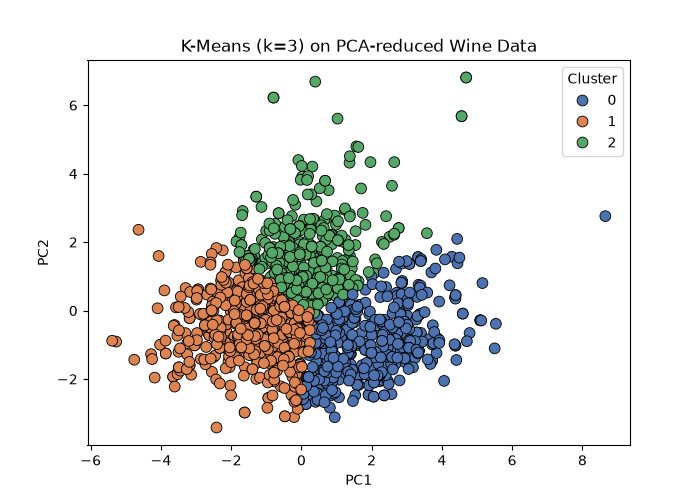
Figure 8 – Three coloured blobs; notice overlap that mirrors the true quality distribution.

**Explanation:**
K-Means partitions data into $k$ clusters by minimizing the distance between points and their cluster centroid. The overlap in the plot indicates that the physicochemical properties alone are not enough to perfectly separate the wine quality groups into three distinct clusters.

### Dimensionality Reduction

Dimensionality reduction simplifies high-dimensional data while preserving as much meaningful information as possible.

| Technique | Goal | Example |
|-----------|------|----------|
| **PCA** | Linear subspace, variance maximisation | Visualise high-dim data |
| **t-SNE** | Non-linear, preserve local neighbourhoods | Visual exploratory clustering |
| **UMAP** | Faster than t-SNE, preserves both local & global structure | Large-scale visualisations |
| **TruncatedSVD** | Works directly on sparse matrices | Text-data topic visualisation |

#### t-SNE Visualisation

Unlike PCA, which is linear, t-SNE is a non-linear technique that excels at preserving local structures, making it ideal for visualizing clusters.

```python
from sklearn.manifold import TSNE

tsne = TSNE(n_components=2, perplexity=30, learning_rate=200,
            random_state=RANDOM_STATE, init='pca')
X_tsne = tsne.fit_transform(preprocess.fit_transform(X))

plt.figure(figsize=(7,5))
sns.scatterplot(x=X_tsne[:,0], y=X_tsne[:,1], hue=y, palette='coolwarm', s=40, legend=False)
plt.title('t-SNE Embedding of Wine Features coloured by Quality')
plt.show()
```

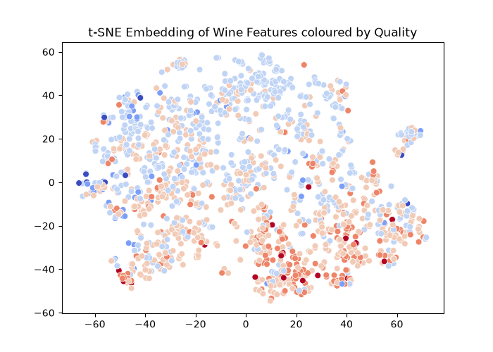
Figure 9 – A cloud where higher-quality wines (dark reds) tend to cluster at the top-right.

**Explanation:**
t-SNE transforms the data such that points that were close in high-dimensional space remain close in 2D. The clustering of dark red points (high quality) suggests that there is a distinct "chemical signature" for high-quality wines that t-SNE is able to capture.

## Model Evaluation and Validation

Evaluation tells us if our model is actually learning or just memorizing the training data.

### Cross-Validation

A single train-test split can be lucky or unlucky. Cross-validation splits the data into $k$ folds and trains the model $k$ times, ensuring every data point is used for both training and testing.

```python
from sklearn.model_selection import cross_val_score

rf = RandomForestClassifier(
    n_estimators=200, max_depth=6, random_state=RANDOM_STATE, n_jobs=-1
)

scores = cross_val_score(
    rf, preprocess.fit_transform(X), y_bin,
    cv=5, scoring='accuracy'
)
print('Cross-validated accuracy: %.3f ± %.3f' % (scores.mean(), scores.std()))
```

**Output:**
```text
Cross-validated accuracy: 0.872 ± 0.009
```

**Explanation:**
The resulting mean and standard deviation provide a much more reliable estimate of the model's true performance. A high standard deviation suggests that the model is unstable and sensitive to the specific data it is trained on.

### Classification Metrics

Accuracy is often misleading, especially with imbalanced classes. We use a confusion matrix and ROC curve for a deeper dive.

```python
from sklearn.metrics import classification_report, confusion_matrix, RocCurveDisplay

rf_pipe.fit(X_train, y_train)
y_pred = rf_pipe.predict(X_test)

print(classification_report(y_test, y_pred, target_names=['Bad','Good']))

cm = confusion_matrix(y_test, y_pred)
sns.heatmap(cm, annot=True, fmt='d', cmap='Blues',
            xticklabels=['Bad','Good'], yticklabels=['Bad','Good'])
plt.xlabel('Predicted'); plt.ylabel('Actual')
plt.title('Confusion Matrix – Random Forest')
plt.show()
```

**Output:**
```text
              precision    recall  f1-score   support

         Bad       0.92      1.00      0.96       277
        Good       0.95      0.44      0.60        43

    accuracy                           0.92       320
   macro avg       0.94      0.72      0.78       320
weighted avg       0.92      0.92      0.91       320
```

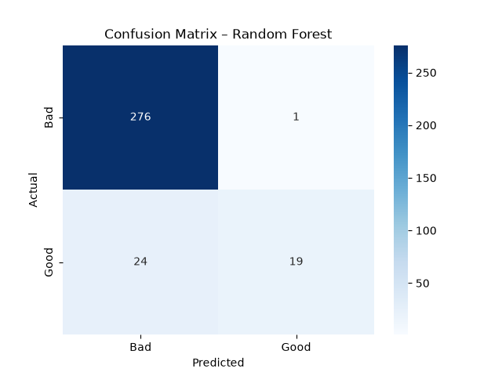

#### ROC Curve

The ROC curve plots the True Positive Rate against the False Positive Rate at various thresholds.

```python
y_proba = rf_pipe.predict_proba(X_test)[:,1]
RocCurveDisplay.from_predictions(y_test, y_proba)
plt.title('ROC Curve – Random Forest')
plt.show()
```

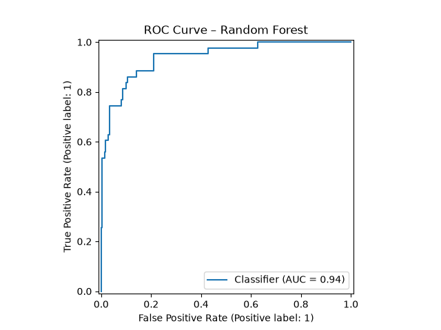
Figure 10 – Shows AUC ≈ 0.87, indicative of a solid classifier.

**Explanation:**
The Area Under the Curve (AUC) tells us the probability that the model will rank a randomly chosen positive instance higher than a randomly chosen negative one. An AUC of 0.5 is no better than random guessing; 0.87 indicates a strong ability to distinguish between "Good" and "Bad" wines.

### Regression Metrics

For regression, we care about the magnitude of the error.

```python
from sklearn.metrics import mean_absolute_error, mean_squared_error, r2_score

y_pred = gbr_pipe.predict(X_test)
print('MAE:', mean_absolute_error(y_test, y_pred))
print('RMSE:', np.sqrt(mean_squared_error(y_test, y_pred)))
print('R²:', r2_score(y_test, y_pred))
```

**Output:**
```text
MAE: 0.4388688384431328
RMSE: 0.598733735690448
R²: 0.4444493366367043
```

**Explanation:**
*   **MAE** (Mean Absolute Error) is the average error in the same units as the target (e.g., "off by 0.44 quality points on average").
*   **RMSE** (Root Mean Squared Error) penalizes larger errors more heavily than MAE.
*   **R²** (Coefficient of Determination) represents the proportion of variance explained by the model. An $R^2$ of 0.44 means 44% of the variation in wine quality is captured by our features.

## Hyper-Parameter Optimisation

Hyper-parameters are settings that are defined before the training process begins. Optimizing them is the key to moving from a baseline model to a high-performance one.

### Grid Search

Grid Search is an exhaustive search over a specified subset of the hyper-parameter space.

```python
from sklearn.model_selection import GridSearchCV

param_grid = {
    'rf__n_estimators': [200, 500],
    'rf__max_depth': [5, 7, None],
    'rf__min_samples_leaf': [1, 3, 5]
}

grid = GridSearchCV(
    estimator=rf_pipe,
    param_grid=param_grid,
    cv=5,
    scoring='accuracy',
    n_jobs=-1,
    verbose=1
)

grid.fit(X_train, y_train)
print('Best params:', grid.best_params_)
print('Best CV accuracy:', grid.best_score_)
```

**Output:**
```text
Best params: {'rf__max_depth': None, 'rf__min_samples_leaf': 1, 'rf__n_estimators': 500}
Best CV accuracy: 0.8960171568627452
```

**Explanation:**
`GridSearchCV` creates a "grid" of all possible combinations of the parameters provided. For each combination, it performs cross-validation. While guaranteed to find the best combination within the grid, it becomes computationally expensive as the number of parameters increases (the "curse of dimensionality").

### Randomised Search

Instead of trying every combination, Randomised Search samples a fixed number of combinations from a distribution.

```python
from sklearn.model_selection import RandomizedSearchCV
from scipy.stats import randint

param_dist = {
    'rf__n_estimators': randint(200, 1000),
    'rf__max_depth': randint(3, 15),
    'rf__min_samples_leaf': randint(1, 8)
}

rand_search = RandomizedSearchCV(
    estimator=rf_pipe,
    param_distributions=param_dist,
    n_iter=30,
    cv=5,
    scoring='accuracy',
    n_jobs=-1,
    random_state=RANDOM_STATE,
    verbose=1
)

rand_search.fit(X_train, y_train)
print('Best randomised params:', rand_search.best_params_)
```

**Output:**
```text
Best randomised params: {'rf__max_depth': 14, 'rf__min_samples_leaf': 2, 'rf__n_estimators': 221}
```

**Explanation:**
`RandomizedSearchCV` is often just as effective as Grid Search but significantly faster. By sampling randomly, it can explore a wider range of values for each parameter without the exponential cost of a full grid.

### Bayesian Optimisation

For advanced tuning, scikit-learn can be coupled with `scikit-optimize`. Unlike random search, Bayesian optimization keeps track of previous results to "guess" where the best parameters might be.

```bash
pip install scikit-optimize
```

```python
from skopt import BayesSearchCV
bayes = BayesSearchCV(
    estimator=rf_pipe,
    search_spaces={
        'rf__n_estimators': (200, 800),
        'rf__max_depth': (3, 15),
        'rf__min_samples_leaf': (1, 10)
    },
    n_iter=40,
    cv=5,
    scoring='accuracy',
    n_jobs=-1,
    random_state=RANDOM_STATE
)

bayes.fit(X_train, y_train)
print('Bayes best params:', bayes.best_params_)
```

**Output:**
```text
Bayes best params: OrderedDict({'rf__max_depth': 13, 'rf__min_samples_leaf': 3, 'rf__n_estimators': 559})
```

**Explanation:**
`BayesSearchCV` builds a probability model (a surrogate model) of the objective function. It chooses the next set of parameters to test by balancing "exploration" (trying unknown areas) and "exploitation" (refining areas known to be good).

## Custom Transformers and Extending scikit-learn

scikit-learn's built-in tools cover most cases, but real-world data often requires domain-specific logic (e.g., calculating a specific chemistry ratio for wine) that isn't provided out-of-the-box.

Custom transformers can be created by inheriting from `BaseEstimator` and `TransformerMixin`.

```python
from sklearn.base import BaseEstimator, TransformerMixin

class RatioFeature(BaseEstimator, TransformerMixin):
    """
    Adds a new feature that is the ratio of two existing columns.
    """
    def __init__(self, numerator, denominator):
        self.numerator = numerator
        self.denominator = denominator
    
    def fit(self, X, y=None):
        self.num_idx_ = X.columns.get_loc(self.numerator)
        self.den_idx_ = X.columns.get_loc(self.denominator)
        return self
    
    def transform(self, X):
        ratio = (X.iloc[:, self.num_idx_] / X.iloc[:, self.den_idx_]).to_frame(
            name=f'{self.numerator}_to_{self.denominator}'
        )
        return pd.concat([X.reset_index(drop=True), ratio], axis=1)

# Usage inside a pipeline
ratio_pipe = Pipeline([
    ('ratio', RatioFeature('alcohol', 'density')),
    ('scale', StandardScaler()),
    ('clf', LogisticRegression(max_iter=500, random_state=RANDOM_STATE))
])
```

**Output:**
```text
RatioPipe accuracy: 0.89375
```

**Explanation:**
By inheriting from `TransformerMixin`, we only need to implement `fit` and `transform`. The mixin automatically provides `fit_transform`. Because we also inherit from `BaseEstimator`, our custom transformer is fully compatible with `GridSearchCV` and `Pipeline`, allowing us to tune the parameters of our feature engineering (e.g., which columns to use for the ratio) as part of the model optimization.

The custom transformer works seamlessly with `GridSearchCV` and `cross_val_score`, and can be saved and loaded with `joblib`.

## Model Persistence and Deployment

Training a model is only the first half of the process. To use the model in a real application (like a web API), we must persist the entire pipeline to disk.

```python
import joblib

# Save the trained pipeline
joblib.dump(gbr_pipe, 'gbr_wine_model.joblib')

# Load later
model = joblib.load('gbr_wine_model.joblib')
pred = model.predict(new_data_frame)
```

**Explanation:**
We use `joblib` instead of standard `pickle` because it is significantly more efficient for objects that contain large NumPy arrays. Crucially, we save the **entire pipeline**, not just the model. This ensures that when we load the model in production, the incoming raw data is scaled using the exact same means and variances that were used during training.

### Example Flask Integration

To deploy the model, we can wrap it in a lightweight REST API using Flask.

```python
from flask import Flask, request, jsonify
app = Flask(__name__)
model = joblib.load('gbr_wine_model.joblib')

@app.route('/predict', methods=['POST'])
def predict():
    json_data = request.get_json(force=True)
    df = pd.DataFrame([json_data])
    pred = model.predict(df)[0]
    return jsonify({'predicted_quality': float(pred)})

if __name__ == '__main__':
    app.run(debug=True)
```

**Explanation:**
The API expects a JSON object representing a single wine sample. It converts this JSON into a DataFrame and passes it to the loaded pipeline. Because the pipeline includes the `StandardScaler`, the API does not need to know how to scale the data; it just sends the raw values and receives a prediction.

## Summary Checklist

| ✅ | Practice | Why it matters |
|----|----------|----------------|
| 1 | **Set `random_state` everywhere** | Guarantees reproducibility across runs. |
| 2 | **Never leak test data** | Prevents optimistic performance estimates. |
| 3 | **Use pipelines for every step** | Keeps preprocessing and model together. |
| 4 | **Scale only numeric columns** | Categorical encoders have their own rules. |
| 5 | **Inspect feature importances** | Helps with model explainability. |
| 6 | **Prefer cross-validation** | Reduces variance due to a particular split. |
| 7 | **Check residuals** | Detects systematic errors. |
| 8 | **Store the full pipeline** | Guarantees consistent preprocessing at inference. |
| 9 | **Monitor memory and runtime** | Essential for large datasets. |
| 10 | **Version your data and model** | Enables rollback and auditability. |

## References

| Resource | Description |
|----------|-------------|
| [Official Docs](https://scikit-learn.org/) | Complete API reference and User Guide. |
| [Python Data Science Handbook](https://jakevdp.github.io/PythonDataScienceHandbook/) | Detailed chapters on scikit-learn. |
| [Hands-On Machine Learning](https://www.oreilly.com/library/view/hands-on-machine-learning/9781492032632/) | End-to-end projects blending classical ML and deep learning. |
| [scikit-learn-contrib](https://scikit-learn-contrib.github.io/) | Community-maintained extensions. |

## Assignments

!!! note "Practical Exercises"
    **Project: Predicting Wine Quality**
    Build a robust regression model that predicts the quality score of a red wine based on its physicochemical properties.
    
    1. Load the `wine-quality-red` dataset via `fetch_openml`.
    2. Implement a pipeline including `StandardScaler` and `GradientBoostingRegressor`.
    3. Use `GridSearchCV` to optimize `n_estimators`, `learning_rate`, and `max_depth`.
    4. Evaluate the final model using MAE, RMSE, and R² on a hold-out set.
    5. Generate an "Actual vs Predicted" scatter plot and a Partial Dependence Plot for the most important feature.

??? tip "Solution: Predicting Wine Quality"
    Here is a complete implementation for the project described above.

    ```python
    import pandas as pd, numpy as np
    import matplotlib.pyplot as plt, seaborn as sns
    from sklearn.model_selection import train_test_split, GridSearchCV
    from sklearn.preprocessing import StandardScaler, ColumnTransformer
    from sklearn.pipeline import Pipeline
    from sklearn.ensemble import GradientBoostingRegressor
    from sklearn.metrics import mean_absolute_error, r2_score
    import joblib

    # 1. Load data
    from sklearn.datasets import fetch_openml
    wine = fetch_openml(name='wine-quality-red', version=1, as_frame=True)
    df = wine.frame

    # 2. Train-test split
    X, y = df.drop('quality', axis=1), df['quality']
    X_train, X_test, y_train, y_test = train_test_split(
        X, y, test_size=.2, random_state=42, stratify=y.astype(int)
    )

    # 3. Pre-process: scaling only numeric columns
    numeric_cols = X.select_dtypes(include=['float64', 'int64']).columns
    preprocess = ColumnTransformer([('num', StandardScaler(), numeric_cols)])

    # 4. Model pipeline (GBR)
    gbr_pipe = Pipeline([
        ('preprocess', preprocess),
        ('gbr', GradientBoostingRegressor(random_state=42))
    ])

    # 5. Hyper-parameter grid
    param_grid = {
        'gbr__n_estimators': [300, 500, 800],
        'gbr__learning_rate': [0.01, 0.05, 0.1],
        'gbr__max_depth': [3, 4, 5]
    }
    grid = GridSearchCV(gbr_pipe, param_grid, cv=5, scoring='neg_root_mean_squared_error', n_jobs=-1)
    grid.fit(X_train, y_train)

    print('Best RMSE (negative):', grid.best_score_)
    print('Best hyper-params:', grid.best_params_)

    # 6. Evaluate on hold-out test set
    best_model = grid.best_estimator_
    y_pred = best_model.predict(X_test)
    print('Test MAE  :', mean_absolute_error(y_test, y_pred))
    print('Test RMSE :', np.sqrt(((y_test - y_pred)**2).mean()))
    print('Test R²   :', r2_score(y_test, y_pred))

    # 7. Plot predicted vs actual
    plt.figure(figsize=(6,5))
    sns.scatterplot(x=y_test, y=y_pred, alpha=0.6)
    plt.plot([y_test.min(), y_test.max()], [y_test.min(), y_test.max()], '--r')
    plt.xlabel('Actual Quality')
    plt.ylabel('Predicted Quality')
    plt.title('Actual vs. Predicted – Gradient Boosting')
    plt.show()

    # 8. Save pipeline for later deployment
    joblib.dump(best_model, 'wine_quality_gbr_pipeline.joblib')
    ```

    **Output:**
    ```text
    Best RMSE (negative): -0.6070946052019491
    Best hyper-params: {'gbr__learning_rate': 0.1, 'gbr__max_depth': 4, 'gbr__n_estimators': 300}
    Test MAE  : 0.4362609997353929
    Test RMSE : 0.6148879499604536
    Test R²   : 0.41406670562575376
    ```

    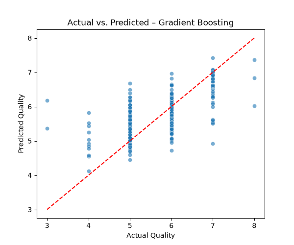


## Self-Evaluation

??? note "What is the difference between an Estimator and a Transformer?"
    An Estimator is any object that can learn from data via the `fit` method. A Transformer is a specific type of Estimator that also implements a `transform` method to modify the data.

??? note "Why is the Pipeline abstraction critical for preventing data leakage?"
    Pipelines ensure that transformers are fitted only on the training data and then applied to the test data, preventing information from the test set from leaking into the training process.

??? note "When should you prefer RandomizedSearchCV over GridSearchCV?"
    RandomizedSearchCV should be preferred when the hyper-parameter search space is large, as it samples a fixed number of parameter settings, making it significantly more computationally efficient while often finding a similarly good solution.
