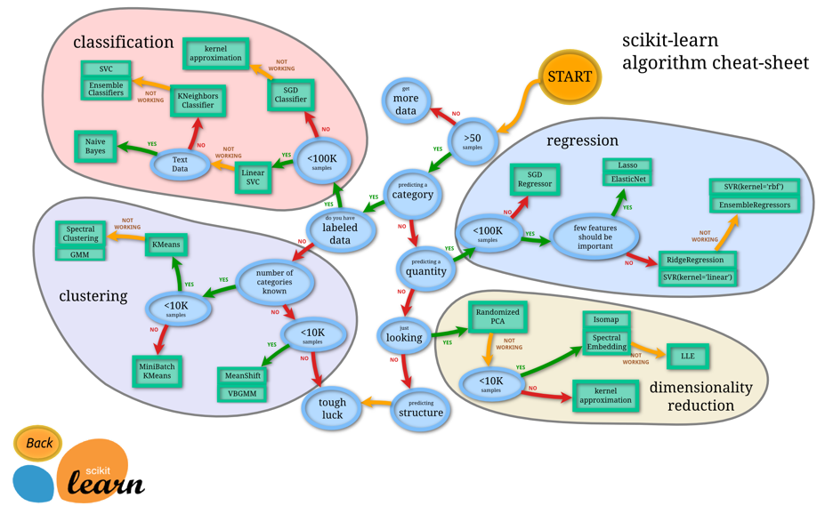
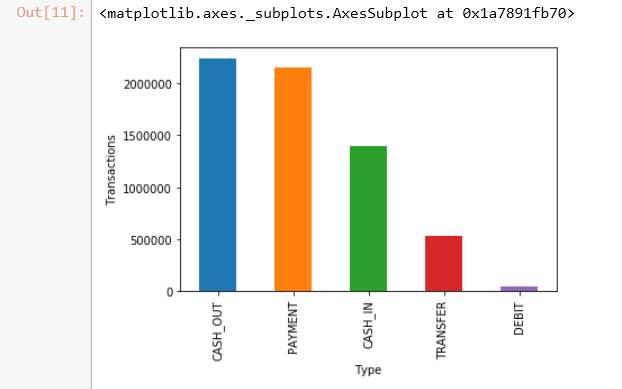
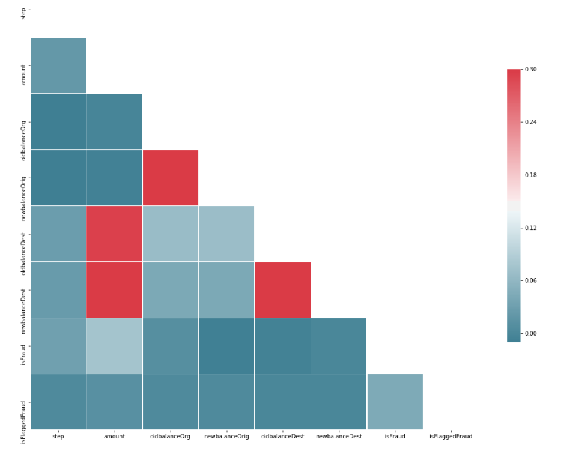
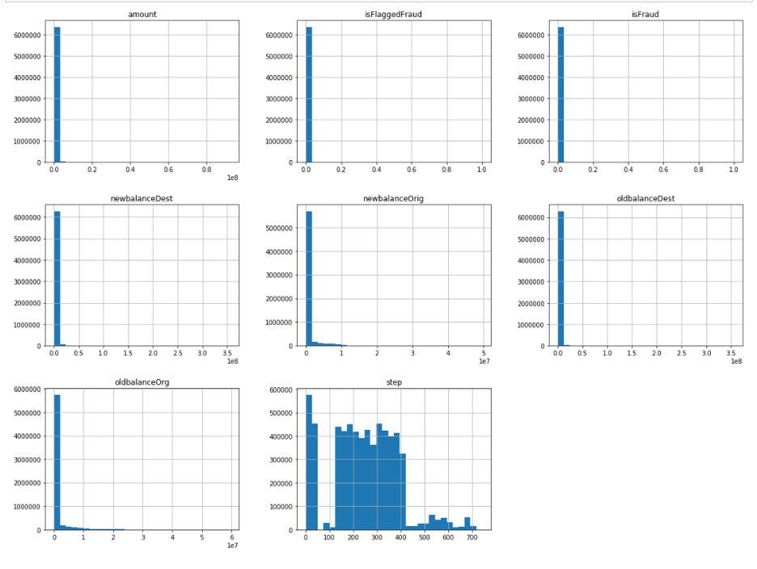
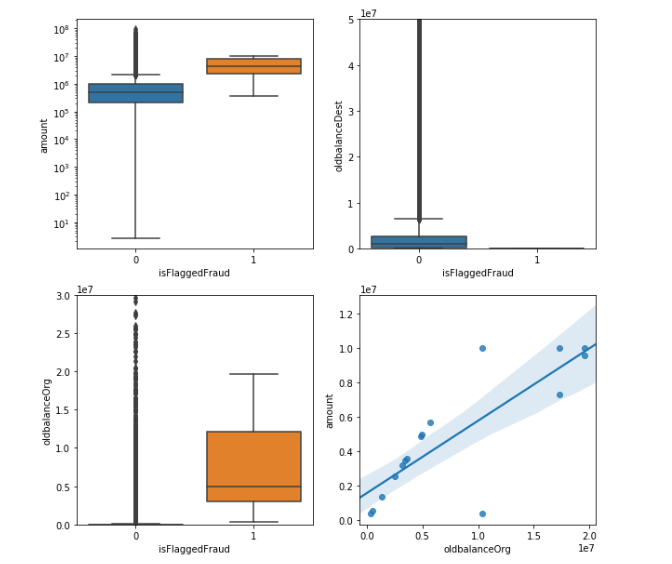
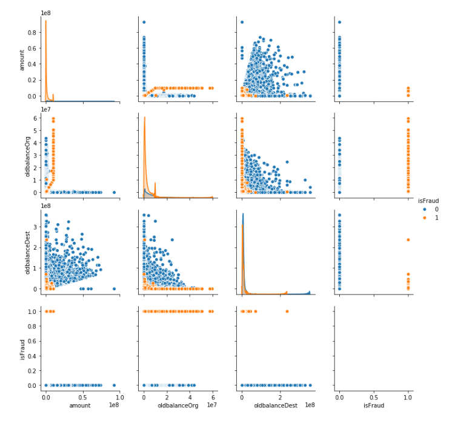
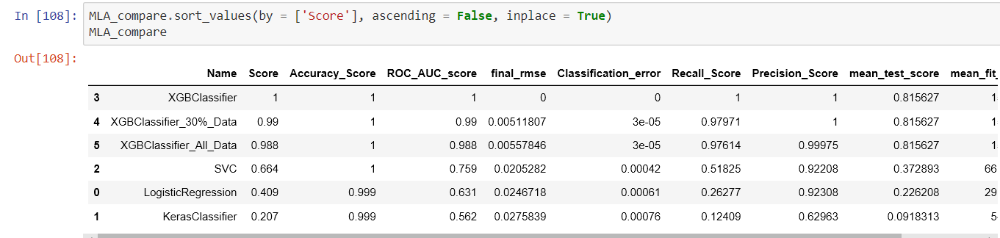
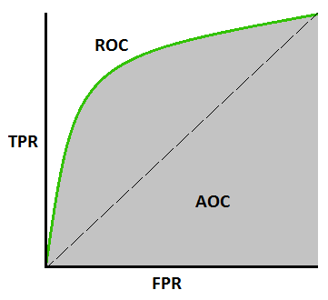
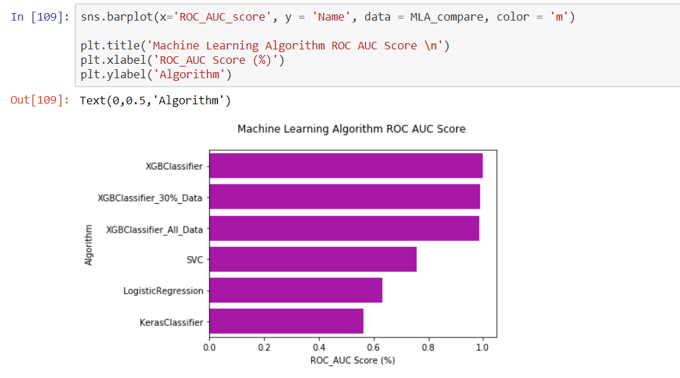

## Learning Objectives

!!! info "Learning Objectives"
    - Perform exploratory data analysis (EDA) using scikit-learn, pandas, and seaborn.
    - Construct production-ready data preparation pipelines using `Pipeline` and `FeatureUnion`.
    - Implement a full machine learning lifecycle from data cleansing to model evaluation.
    - Fine-tune model hyperparameters using `GridSearchCV` and `RandomizedSearchCV`.
    - Perform statistical significance tests to evaluate model performance across multiple algorithms.

## Overview

Scikit-learn is the industry-standard library for classical machine learning in Python. Built upon the scientific Python stack—NumPy for linear algebra, SciPy for optimization, and Matplotlib for visualization—it provides a unified interface for a vast array of algorithms.

The power of scikit-learn lies in its **consistent API design**. Almost every object in the library follows one of three patterns:

- **Estimators**: Any object that can learn from data via a `.fit()` method.
- **Transformers**: Estimators that can modify data via a `.transform()` method.
- **Predictors**: Estimators that can make predictions via a `.predict()` method.

This consistency allows for "plug-and-play" model swapping, where a Logistic Regression model can be replaced by a Random Forest without changing the surrounding pipeline code.

### Scikit-Learn Cheat Sheet

Choosing the right algorithm depends on the data size, the type of target variable, and the requirement for interpretability. Scikit-learn provides a comprehensive flow chart to assist in this selection, as shown in Figure 6.



Figure 6: scikit-learn algorithm cheat sheet.

## Core Sections

### Installation

Scikit-learn requires NumPy and SciPy. The recommended installation via pip ensures the latest stable version.

```bash
pip install numpy
pip install scipy -U
pip install -U scikit-learn
```

### Learning Paradigms

#### Supervised Learning

Supervised learning is used when a set of output predictions is known based on input characteristics. The goal is to predict the target for new input.

1. **Classification**: Training data belongs to several categories. Based on the label, the model predicts the category for unlabeled data (e.g., Fraud vs. Not Fraud).
2. **Regression**: Training data consists of vectors used to predict a continuous target value (e.g., predicting the future value of a financial asset).

#### Unsupervised Learning

Unsupervised learning is used when training data is available without corresponding targets. The goal is to discover inherent structures or groups within the input.

1. **Clustering**: Discovering groups with similar characteristics (e.g., customer segmentation).
2. **Density Estimation**: Finding the distribution of data within the input space or reducing dimensionality from high-dimensional space to two or three dimensions.

### Machine Learning Pipeline Development

A data pipeline is a sequence of processing components designed to produce meaningful data. In machine learning, pipelines are critical to automate transformation and manipulation, ensuring that the output of one component becomes the input for the next.

#### Steps for Developing a Machine Learning Model

1. Explore the domain space.
2. Extract the problem definition.
3. Acquire data suitable for solving the problem definition.
4. Discover and visualize the data to gain insights.
5. Perform feature engineering and prepare the data.
6. Fine-tune the model.
7. Evaluate the solution using metrics.
8. Launch and maintain the model.

### Exploratory Data Analysis (EDA)

Using a fraud detection system as an example, EDA begins by loading the data into a dataframe. We use `pd.read_csv` to load the raw data and `data.head()` to inspect the first five rows, which helps verify that columns were parsed correctly and identify the general nature of the features.

```python
data = pd.read_csv('dataset/data_file.csv')
data.head()
```

**Initial Audit**: Before analysis, we audit the dataset's dimensions using `data.shape` and check for data types and memory usage with `data.info()`. We use `data.isnull().values.any()` to quickly determine if any missing values exist, as most scikit-learn algorithms cannot handle `NaN` values without prior imputation.

```python
print(data.shape)
print(data.info())
data.isnull().values.any()
```

#### Visualization Techniques

**Bar Plot Analysis**: For categorical features (like transaction type), we use `value_counts()` to aggregate the frequency of each category and `.plot.bar()` to visualize them. This allows us to identify class imbalances—for example, if one transaction type is overwhelmingly more common than others, as shown in Figure 1.

```python
plt.ylabel('Transactions')
plt.xlabel('Type')
data.type.value_counts().plot.bar()
```



Figure 1: Example of scikit-learn barplots.

**Correlation Analysis**: To understand how features interact, we compute the correlation matrix using `data.corr()`. Because the matrix is symmetrical, we create a boolean mask using `np.triu_indices_from` to hide the upper triangle, reducing visual clutter. The `sns.heatmap` then visualizes the Pearson correlation coefficients, where values near 1 indicate strong positive correlation and values near -1 indicate strong negative correlation, as illustrated in Figure 2.

```python
# compute the correlation matrix
corr = data.corr()

# generate a mask for the lower triangle
mask = np.zeros_like(corr, dtype=np.bool)
mask[np.triu_indices_from(mask)] = True

# set up the matplotlib figure
f, ax = plt.subplots(figsize=(18, 18))

# generate a custom diverging color map
cmap = sns.diverging_palette(220, 10, as_cmap=True)

# draw the heatmap with the mask and correct aspect ratio
sns.heatmap(corr, mask=mask, cmap=cmap, vmax=.3,
            square=True,
            linewidths=.5, cbar_kws={"shrink": .5}, ax=ax);
```



Figure 2: scikit-learn correlation array.

**Histogram Analysis**: To understand the distribution of numerical features, we use `data.hist()`. Histograms reveal if the data is normally distributed, skewed, or contains multimodal peaks, which informs whether we need to apply transformations (like log-scaling), as seen in Figure 3.

```python
%matplotlib inline
data.hist(bins=30, figsize=(20,15))
plt.show()
```



Figure 3: scikit-learn histograms.

**Box Plot Analysis**: Box plots provide a five-number summary (minimum, first quartile, median, third quartile, and maximum). They are particularly useful for detecting outliers—points that fall far outside the whiskers. In Figure 4, we use `sns.boxplot` to compare the distribution of amounts for flagged vs. unflagged fraud, and `sns.regplot` to visualize the linear relationship between the old balance and the transaction amount.

```python
fig, axs = plt.subplots(2, 2, figsize=(10, 10))
tmp = data.loc[(data.type == 'TRANSFER'), :]

a = sns.boxplot(x = 'isFlaggedFraud', y = 'amount', data = tmp, ax=axs[0][0])
axs[0][0].set_yscale('log')
b = sns.boxplot(x = 'isFlaggedFraud', y = 'oldbalanceDest', data = tmp, ax=axs[0][1])
axs[0][1].set(ylim=(0, 0.5e8))
c = sns.boxplot(x = 'isFlaggedFraud', y = 'oldbalanceOrg', data=tmp, ax=axs[1][0])
axs[1][0].set(ylim=(0, 3e7))
d = sns.regplot(x = 'oldbalanceOrg', y = 'amount', data=tmp.loc[(tmp.isFlaggedFraud ==1), :], ax=axs[1][1])
plt.show()
```



Figure 4: scikit-learn boxplots.

**Scatter Plot Analysis**: To explore bivariate relationships across many features, we use `sns.pairplot`. By setting the `hue` parameter to the target variable (`isFraud`), we can visually identify which combinations of features best separate the classes, as seen in Figure 5.

```python
plt.figure(figsize=(12,8))
sns.pairplot(data[['amount', 'oldbalanceOrg', 'oldbalanceDest', 'isFraud']], hue='isFraud')
```



Figure 5: scikit-learn scatter plots.

### Data Cleansing and Outlier Removal

Extreme outliers can disproportionately influence linear models. To mitigate this, we filter transactions based on statistical quantiles. We calculate the 5th and 95th percentiles of the transaction amount. To avoid over-filtering, we use `np.minimum` and `np.maximum` to ensure we only remove values that are both statistically extreme AND exceed reasonable absolute thresholds (USD 3,000 on the low end, USD 500,000 on the high end).

```python
low_exclude = np.round(np.minimum(fin_samp_data.amount.quantile(0.05), 3000), 2)
high_exclude = np.round(np.maximum(fin_samp_data.amount.quantile(0.95), 500000), 2)

low_data = fin_samp_data[fin_samp_data.amount > low_exclude]
data = low_data[low_data.amount < high_exclude]
```

### Pipeline Construction

#### DataFrameSelector

Scikit-learn transformers are designed to work with NumPy arrays. To allow our pipeline to accept Pandas DataFrames, we implement a `DataFrameSelector` by inheriting from `BaseEstimator` (to enable hyperparameter tuning) and `TransformerMixin` (to automatically provide the `fit_transform` method). The `transform` method simply extracts the values of the specified columns as a NumPy array.

```python
from sklearn.base import BaseEstimator, TransformerMixin

class DataFrameSelector(BaseEstimator, TransformerMixin):
    def __init__(self, attribute_names):
        self.attribute_names = attribute_names
    def fit(self, X, y=None):
        return self
    def transform(self, X):
        return X[self.attribute_names].values
```

#### Feature Engineering: CombinedAttributesAdder

Domain knowledge often suggests that raw data is insufficient. In fraud detection, we calculate the "balance error"—the difference between the expected final balance and the actual final balance. If the sum of the old balance and the transaction amount does not equal the new balance, it is a strong indicator of an anomaly.

```python
from sklearn.base import BaseEstimator, TransformerMixin

# column index mapping for NumPy array access
amount_ix, oldbalanceOrg_ix, newbalanceOrig_ix, oldbalanceDest_ix, newbalanceDest_ix = 0, 1, 2, 3, 4

class CombinedAttributesAdder(BaseEstimator, TransformerMixin):
    def __init__(self): 
        pass
    def fit(self, X, y=None):
        return self
    def transform(self, X, y=None):
        # Calculate discrepancies for Originator and Destination accounts
        errorBalanceOrig = X[:,newbalanceOrig_ix] +  X[:,amount_ix] -  X[:,oldbalanceOrg_ix]
        errorBalanceDest = X[:,oldbalanceDest_ix] +  X[:,amount_ix]-  X[:,newbalanceDest_ix]
        
        # Append new features as new columns to the original array
        return np.c_[X, errorBalanceOrig, errorBalanceDest]
```

### Training and Testing Sets

To evaluate how a model generalizes to unseen data, we split the dataset into training and testing sets. We use `train_test_split` with `stratify=y`, which is critical for imbalanced datasets. Stratification ensures that the proportion of fraud vs. non-fraud cases remains identical in both sets, preventing the model from being trained on a distribution that differs from the test set.

```python
from sklearn.model_selection import train_test_split
X_train, X_test, y_train, y_test = train_test_split(X,y,test_size=0.30, random_state=42, stratify=y)
```

#### Attribute-Specific Pipelines

Different data types require different preprocessing. We use `Pipeline` to chain these operations together. For numerical data, we use `StandardScaler` to perform z-score normalization (centering the mean at 0 and scaling to unit variance), which prevents features with large scales from dominating the model.

```python
from sklearn.pipeline import Pipeline
from sklearn.preprocessing import StandardScaler, Imputer

num_attribs = list(X_train_num)
cat_attribs = list(X_train_cat)

num_pipeline = Pipeline([
        ('selector', DataFrameSelector(num_attribs)),
        ('attribs_adder', CombinedAttributesAdder()),
        ('std_scaler', StandardScaler())
    ])

cat_pipeline = Pipeline([
        ('selector', DataFrameSelector(cat_attribs)),
        ('cat_encoder', CategoricalEncoder(encoding="onehot-dense"))
    ])
```

### Algorithm Selection and Implementation

#### Linear Regression

Linear regression models the relationship between a dependent variable and one or more independent variables using a linear equation. In our implementation, we scale the data first because linear regression is sensitive to the magnitude of features.

**The Linear Regression Algorithm: Detailed Mechanics**

The objective of linear regression is to find the best-fitting straight line (or hyperplane in higher dimensions) that describes the relationship between the independent variables $X$ and the dependent variable $y$.

**The Linear Equation:**
The model assumes that the target $y$ is a linear combination of the input features $X$:
$$y = \beta_0 + \beta_1 x_1 + \beta_2 x_2 + \dots + \beta_n x_n + \epsilon$$
Where:
- $\beta_0$ is the y-intercept (bias).
- $\beta_1, \dots, \beta_n$ are the coefficients (weights) for each feature.
- $\epsilon$ is the error term (residual).

**Objective Function: Ordinary Least Squares (OLS)**
To find the optimal coefficients $\beta$, scikit-learn's `LinearRegression` minimizes the **Residual Sum of Squares (RSS)**, also known as the Sum of Squared Errors (SSE):
$$\text{RSS} = \sum_{i=1}^{m} (y_i - \hat{y}_i)^2 = \sum_{i=1}^{m} (y_i - (\beta_0 + \sum_{j=1}^{n} \beta_j x_{ij}))^2$$
Where $m$ is the number of samples and $\hat{y}_i$ is the predicted value.

**Numerical Implementation**
While the theoretical solution can be found using the Normal Equation $\beta = (X^T X)^{-1} X^T y$, this approach is computationally expensive and numerically unstable if $X^T X$ is singular. Scikit-learn instead uses **Singular Value Decomposition (SVD)** to compute the pseudo-inverse of the feature matrix, ensuring stability and efficiency even with collinear features.

```python
from sklearn.linear_model import LinearRegression
from sklearn.preprocessing import StandardScaler
import time

scl= StandardScaler()
X_train_std = scl.fit_transform(X_train)
X_test_std = scl.transform(X_test)
start = time.time()
lin_reg = LinearRegression()
lin_reg.fit(X_train_std, y_train)
y_train_pred = lin_reg.predict(X_train_std)
train_time = time.time() - start
```

#### Logistic Regression

Despite the name, Logistic Regression is a classification algorithm. It uses the sigmoid function to map any real-valued number into a value between 0 and 1, representing a probability. We use `C=1e6` (a high value) to reduce regularization, allowing the model to fit the training data more closely, and the `sag` (Stochastic Average Gradient) solver for efficiency on larger datasets.

```python
from sklearn.linear_model import LogisticRegression
from sklearn.model_selection import train_test_split

X_train, _, y_train, _ = train_test_split(X_train, y_train, stratify=y_train, train_size=subsample_rate, random_state=42)
X_test, _, y_test, _ = train_test_split(X_test, y_test, stratify=y_test, train_size=subsample_rate, random_state=42)

model_lr_sklearn = LogisticRegression(multi_class="multinomial", C=1e6, solver="sag", max_iter=15)
model_lr_sklearn.fit(X_train, y_train)

y_pred_test = model_lr_sklearn.predict(X_test)
acc = accuracy_score(y_test, y_pred_test)
results.loc[len(results)] = ["LR Sklearn", np.round(acc, 3)]
```

#### Decision Trees

Decision trees perform recursive binary splitting based on feature thresholds that maximize information gain. They are non-parametric, meaning they make no assumptions about the distribution of the data, but they are prone to overfitting if the tree grows too deep.

```python
from sklearn.tree import DecisionTreeRegressor
dt = DecisionTreeRegressor()
start = time.time()
dt.fit(X_train_std, y_train)
y_train_pred = dt.predict(X_train_std)
train_time = time.time() - start

start = time.time()
y_test_pred = dt.predict(X_test_std)
test_time = time.time() - start
```

#### K-Means Clustering

K-Means is an unsupervised algorithm that partitions data into $K$ clusters. It iteratively assigns points to the nearest centroid and then updates the centroid position to the mean of the assigned points. We use `KNeighborsClassifier` as a proxy for distance-based logic in some experiments, but true K-Means is used for group discovery.

```python
from sklearn.neighbors import KNeighborsClassifier
from sklearn.model_selection import train_test_split, GridSearchCV, PredefinedSplit
from sklearn.metrics import accuracy_score

X_train, _, y_train, _ = train_test_split(X_train, y_train, stratify=y_train, train_size=subsample_rate, random_state=42)
X_test, _, y_test, _ = train_test_split(X_test, y_test, stratify=y_test, train_size=subsample_rate, random_state=42)

model_knn_sklearn = KNeighborsClassifier(n_jobs=-1)
model_knn_sklearn.fit(X_train, y_train)

y_pred_test = model_knn_sklearn.predict(X_test)
acc = accuracy_score(y_test, y_pred_test)

results.loc[len(results)] = ["KNN Arbitary Sklearn", np.round(acc, 3)]
```

#### Support Vector Machines (SVM)

SVMs find the optimal hyperplane that maximizes the margin between two classes. For non-linear data, they use the "kernel trick" to map data into a higher-dimensional space where a linear separation becomes possible.

#### Naive Bayes

Naive Bayes is based on Bayes' Theorem with the "naive" assumption that all features are independent. Because it only requires calculating counts, it is extremely fast and memory-efficient.

#### Random Forest

A Random Forest is an ensemble of decision trees. It uses **Bagging** (Bootstrap Aggregating) to train each tree on a random subset of the data and a random subset of features. The final prediction is the average (regression) or majority vote (classification), which significantly reduces variance and overfitting.

```python
from sklearn.ensemble import RandomForestRegressor
forest = RandomForestRegressor(n_estimators = 400, criterion='mse',random_state=1, n_jobs=-1)
start = time.time()
forest.fit(X_train_std, y_train)
y_train_pred = forest.predict(X_train_std)
train_time = time.time() - start

start = time.time()
y_test_pred = forest.predict(X_test_std)
test_time = time.time() - start
```

#### Neural Networks and Deep Learning

Neural networks use layers of interconnected neurons with weights that are adjusted during training. Keras provides a high-level API for these models, integrating with TensorFlow to handle the complex tensor mathematics and backpropagation required for training.

#### XGBoost

XGBoost (eXtreme Gradient Boosting) builds an additive model of decision trees. Each new tree is trained to predict the residuals (errors) of the previous ensemble, effectively performing gradient descent in the function space to minimize the loss.

### Parameter Optimization

Hyperparameters are configurations set before training (e.g., the number of trees in a forest). Finding the optimal set is a search problem.

#### Hyperparameter Tuning Algorithms

- **Grid Search**: Exhaustively evaluates every possible combination of parameters provided in a grid. It is guaranteed to find the best combination in the search space but is computationally expensive.
- **Random Search**: Samples parameters from a statistical distribution. It is often more efficient and can find a near-optimal solution in a fraction of the time.

### Model Evaluation Experiments

To determine the best model, we compare several algorithms against a baseline (Logistic Regression) using a parameter grid.

```python
grid_param = [
                [{   #LogisticRegression
                   'model__penalty':['l1','l2'],
                   'model__C': [0.01, 1.0, 100]
                }],

                [{#keras
                    'model__optimizer': optimizer,
                    'model__loss': loss
                }],

                [{  #SVM
                   'model__C' :[0.01, 1.0, 100],
                   'model__gamma': [0.5, 1],
                   'model__max_iter':[-1]
                }],

                [{   #XGBClassifier
                    'model__min_child_weight': [1, 3, 5],
                    'model__gamma': [0.5],
                    'model__subsample': [0.6, 0.8],
                    'model__colsample_bytree': [0.6],
                    'model__max_depth': [3]
                }]
            ]
```

#### Implementing Grid Search and Metrics

We use `GridSearchCV` to automate the tuning process. For each model, we calculate a wide array of metrics to ensure a holistic view of performance. We calculate **Recall** (the ability to find all positive cases) and **Precision** (the accuracy of the positive predictions). The **F1-Score** provides a balance between the two.

```python
from sklearn.metrics import mean_squared_error, classification_report, f1_score
from xgboost.sklearn import XGBClassifier
from sklearn.svm import SVC

test_scores = []
MLA = [
        linear_model.LogisticRegression(),
        keras_model,
        SVC(),
        XGBClassifier()
      ]

MLA_columns = ['Name', 'Score', 'Accuracy_Score','ROC_AUC_score','final_rmse','Classification_error','Recall_Score','Precision_Score', 'mean_test_score', 'mean_fit_time', 'F1_Score']
MLA_compare = pd.DataFrame(columns = MLA_columns)
Model_Scores = pd.DataFrame(columns = ['Name','Score'])

row_index = 0
for alg in MLA:
    MLA_name = alg.__class__.__name__
    MLA_compare.loc[row_index, 'Name'] = MLA_name

    full_pipeline_with_predictor = Pipeline([
        ("preparation", full_pipeline),
        ("model", alg)
    ])

    grid_search = GridSearchCV(full_pipeline_with_predictor, grid_param[row_index], cv=4, verbose=2, scoring='f1', return_train_score=True)
    grid_search.fit(X_train[X_model_col], y_train)
    y_pred = grid_search.predict(X_test)

    MLA_compare.loc[row_index, 'Accuracy_Score'] = np.round(accuracy_score(y_pred, y_test), 3)
    MLA_compare.loc[row_index, 'ROC_AUC_score'] = np.round(metrics.roc_auc_score(y_test, y_pred),3)
    MLA_compare.loc[row_index,'Score'] = np.round(grid_search.score(X_test, y_test),3)

    negative_mse = grid_search.best_score_
    scores = np.sqrt(-negative_mse)
    final_mse = mean_squared_error(y_test, y_pred)
    final_rmse = np.sqrt(final_mse)
    MLA_compare.loc[row_index, 'final_rmse'] = final_rmse

    confusion_matrix_var = confusion_matrix(y_test, y_pred)
    TP = confusion_matrix_var[1, 1]
    TN = confusion_matrix_var[0, 0]
    FP = confusion_matrix_var[0, 1]
    FN = confusion_matrix_var[1, 0]
    MLA_compare.loc[row_index,'Classification_error'] = np.round(((FP + FN) / float(TP + TN + FP + FN)), 5)
    MLA_compare.loc[row_index,'Recall_Score'] = np.round(metrics.recall_score(y_test, y_pred), 5)
    MLA_compare.loc[row_index,'Precision_Score'] = np.round(metrics.precision_score(y_test, y_pred), 5)
    MLA_compare.loc[row_index,'F1_Score'] = np.round(f1_score(y_test,y_pred), 5)

    MLA_compare.loc[row_index, 'mean_test_score'] = grid_search.cv_results_['mean_test_score'].mean()
    MLA_compare.loc[row_index, 'mean_fit_time'] = grid_search.cv_results_['mean_fit_time'].mean()

    Model_Scores.loc[row_index,'MLA Name'] = MLA_name
    Model_Scores.loc[row_index,'ML Score'] = np.round(metrics.roc_auc_score(y_test, y_pred),3)

    test_scores.append(grid_search.cv_results_['mean_test_score'])
    row_index+=1
```

#### Evaluation Results

The summary of model performance across different metrics is displayed in Figure 7. This allows us to compare the trade-off between training time and prediction accuracy.



Figure 7: model evaluation results.

#### ROC AUC Score

The AUC-ROC curve measures classification performance across various thresholds, as shown in Figure 8 and Figure 9. ROC is a probability curve, and AUC represents the degree of separability, indicating how well the model distinguishes between classes. An AUC of 1.0 represents a perfect model, while 0.5 represents random guessing.



Figure 8: ROC AUC curve.



Figure 9: ROC AUC score.

## Summary Checklist

- [ ] Understand the `fit`/`transform`/`predict` API pattern.
- [ ] Implement a `Pipeline` to prevent data leakage.
- [ ] Perform EDA to identify skewness and multicollinearity.
- [ ] Select an algorithm based on the data type (Regression vs Classification).
- [ ] Tune hyperparameters to balance the Bias-Variance tradeoff.
- [ ] Evaluate performance using ROC-AUC and F1-score for imbalanced data.

## Assignments

!!! note "Practical Exercises"
    1. Implement a fraud detection pipeline using the provided dataset.
    2. Compare the performance of Logistic Regression, Random Forest, and XGBoost.
    3. Perform K-means clustering on the digits dataset and visualize the results.

## References

- [Scikit-learn Documentation](https://scikit-learn.org/stable/)
- [Keras Documentation](https://keras.io/)
- [XGBoost Documentation](https://xgboost.readthedocs.io/)

## Self-Evaluation

??? note "What is the difference between Supervised and Unsupervised Learning?"
    Supervised learning uses labeled data to predict targets, while unsupervised learning discovers hidden patterns or groups in unlabeled data.

??? note "Why is a data pipeline used in machine learning?"
    Pipelines automate the sequence of data transformations and model application, ensuring consistency between training and testing data.

??? note "What is the purpose of Cross-Validation in model selection?"
    Cross-validation evaluates the model's ability to generalize to unseen data by partitioning the training set into multiple folds.
