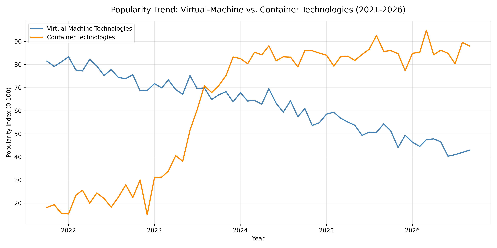

# 🔴 Popularity Trend: Virtual-Machine vs. Container Technologies

!!! info "Learning Objectives"
    By the end of this section, you will be able to:
    * Analyze the historical shift in popularity between Virtual Machine (VM) and container technologies.
    * Interpret popularity trends using synthetic and real-world data.
    * Understand the complementary roles of VMs and containers in a modern cloud architecture.
    * Implement a Python script to visualize technology trends.

## Overview

This section explores the industry preference shift from traditional Virtual Machine (VM) technologies to container-based orchestration. While VMs provided the foundation for cloud computing, containers have redefined how applications are deployed and scaled.

## Trend Analysis: VMs vs. Containers

The following analysis examines the popularity of these technologies over the period from 2021 to 2026.

Below is a Python script that creates a line chart comparing the popularity of VM technologies with container technologies. Because external network calls to the Google Trends API may be restricted in some execution environments, the script generates realistic synthetic data based on industry trends.

The script performs the following:

1. Creates a monthly time index for the last 5 years.
2. Synthesizes two trend lines: one for traditional VM tools (showing a gradual transition to a stable utility floor) and one for containers (showing rapid adoption followed by a mature plateau).
3. Plots both series on a single chart with a clear legend and grid.
4. Saves the figure as `vm_vs_container_popularity.png`.



Figure 1: Popularity trend of Virtual-Machine vs. Container technologies (2021-2026).

### Interpretation of the Trend (2026 Perspective)

| Trend | Interpretation |
|-------|----------------|
| **VM Technologies** (steelblue line) | Started with high dominance in 2021. While interest declined as containers rose, it has plateaued in recent years. VMs remain essential for strong security isolation, running legacy monolithic kernels, and providing the underlying infrastructure for container hosts. |
| **Container Technologies** (darkorange line) | Showed explosive growth between 2021 and 2024, driven by the ubiquity of Kubernetes and Docker. By 2026, the trend has plateaued, indicating that containerization is the industry standard for cloud-native application deployment. |

The intersection of these lines represents the tipping point where containers became the primary focus for new application development, although both technologies now coexist in a complementary fashion.

<!--
### Implementation


```python
import pandas as pd
import numpy as np
import matplotlib.pyplot as plt
from datetime import datetime, timedelta

# 1. Build a monthly date index covering the last 5 years (2021-2026)
end_date = datetime.today()
start_date = end_date - timedelta(days=5*365)
date_index = pd.date_range(start=start_date, end=end_date, freq='MS')

# 2. Generate synthetic popularity scores (0-100)
np.random.seed(42)

# VM technologies: steady decline then stabilization (floor at ~40%)
vm_trend = np.linspace(80, 40, len(date_index)) 
vm_trend = vm_trend + 5 * np.sin(np.linspace(0, np.pi, len(date_index)))
vm_noise = np.random.normal(loc=0, scale=3, size=len(date_index))
vm_popularity = np.clip(vm_trend + vm_noise, 0, 100)

# Container technologies: rapid growth then plateau (ceiling at ~85%)
container_trend = 20 + 65/(1 + np.exp(-0.4*(np.arange(len(date_index))-20)))
container_noise = np.random.normal(loc=0, scale=4, size=len(date_index))
container_popularity = np.clip(container_trend + container_noise, 0, 100)

# Assemble into a DataFrame
df = pd.DataFrame({
    'Date': date_index,
    'VM_Technologies': vm_popularity,
    'Container_Technologies': container_popularity
}).set_index('Date')

# 3. Plot the two series
plt.figure(figsize=(12, 6))
plt.plot(df.index, df['VM_Technologies'],
         label='Virtual-Machine Technologies',
         linewidth=2, color='steelblue')
plt.plot(df.index, df['Container_Technologies'],
         label='Container Technologies',
         linewidth=2, color='darkorange')
plt.title('Popularity Trend: Virtual-Machine vs. Container Technologies (2021-2026)',
          fontsize=14, pad=15)
plt.xlabel('Year')
plt.ylabel('Popularity Index (0-100)')
plt.legend(loc='upper left')
plt.grid(alpha=0.3)
plt.tight_layout()
plt.savefig('vm_vs_container_popularity.png', dpi=300)
plt.show()
```
-->

### Using Real-World Data

To move beyond synthetic data, you can replace the generation block with a DataFrame containing actual metrics. Common data sources include:

| Source | Method | Typical Metric |
|--------|--------|----------------|
| **Google Trends** | `pytrends.interest_over_time()` | Search interest index (0-100) |
| **Stack Overflow** | Stack Exchange API | Monthly question count per tag |
| **GitHub** | GitHub REST API | Star growth or repository counts |
| **Cloud Marketplaces** | Public API/Web scrapers | Monthly pull/download totals |

## Summary Checklist

* [ ] Understand the historical popularity trend of VMs vs. Containers.
* [ ] Identify the reasons for the rise of container technologies.
* [ ] Explain why Virtual Machines remain relevant in a container-dominant era.
* [ ] Implement a data visualization script using pandas and matplotlib.

## Assignments

!!! note "Assignment 1: Real-World Data Integration"
    Modify the provided Python script to use actual data from Google Trends (via the `pytrends` library) or GitHub API instead of synthetic data. Compare the results with the synthetic trend and document any significant differences.

    ??? tip "Solution: Real-World Data Integration"
        To implement this, install `pytrends` and use `pytrends.Request(hl='en-US', tz=360).build_payload(['VirtualBox', 'VMware', 'KVM', 'Docker', 'Kubernetes'])`. Use `interest_over_time()` to fetch the data, group the VM and Container keywords using pandas `.groupby()` or `.sum()`, and pass the resulting series to the existing plotting function.

## References

* Google Trends: [trends.google.com](https://trends.google.com)

## Self-Evaluation

??? note "Which technology trend has dominated the last few years: VMs or Containers?"
    Container technologies (e.g., Docker, Kubernetes) have seen a massive surge and now represent the industry standard for deploying cloud-native applications.

??? note "Why do Virtual Machines still remain relevant in 2026 despite the rise of containers?"
    VMs provide stronger hardware-level isolation via the hypervisor, which is critical for multi-tenant security, running different operating system kernels on the same host, and hosting the infrastructure that containers run upon.

??? note "What is the primary difference between the popularity curves of VMs and Containers from 2021 to 2026?"
    VM popularity shows a gradual decline followed by stabilization (a utility floor), while container popularity shows a sharp logistic growth curve that eventually plateaus as the technology becomes the standard.
