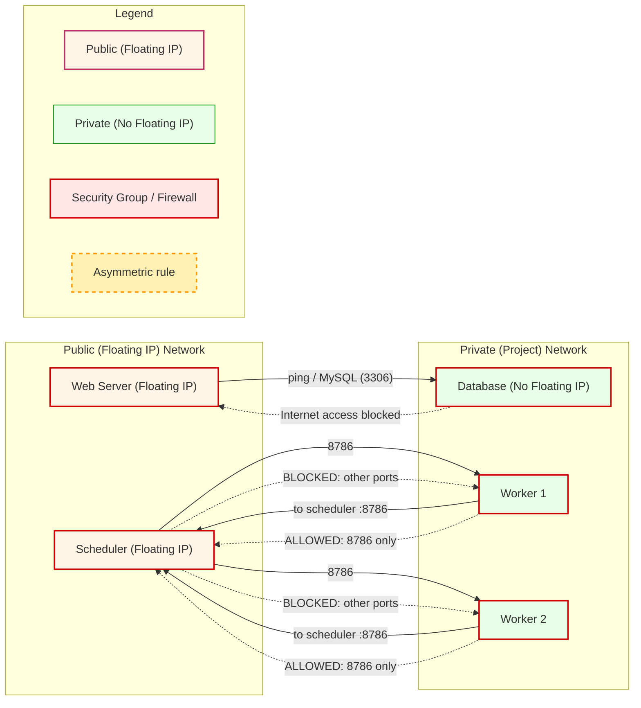

```mermaid
flowchart LR
    %% ==== Global styles ====
    classDef public fill:#fff4e6,stroke:#b36,stroke-width:2px;
    classDef private fill:#e6ffe6,stroke:#090,stroke-width:1px;
    classDef fwPublic fill:#fff4e6,stroke:#c00,stroke-width:2px;
    classDef fwPrivate fill:#e6ffe6,stroke:#c00,stroke-width:2px;
    classDef asymmetric fill:#fff0b3,stroke:#ff9900,stroke-width:2px,stroke-dasharray:5 5;
    classDef legendPublic fill:#fff4e6,stroke:#b36,stroke-width:2px;
    classDef legendPrivate fill:#e6ffe6,stroke:#090,stroke-width:1px;
    classDef legendFW fill:#ffe6e6,stroke:#c00,stroke-width:2px;
    classDef legendAsymmetric fill:#fff0b3,stroke:#ff9900,stroke-width:2px,stroke-dasharray:5 5;

    %% ==== Public network ====
    subgraph Public["Public (Floating IP) Network"]
        direction TB
        web01["Web Server (Floating IP)"]:::fwPublic
        sched["Scheduler (Floating IP)"]:::fwPublic
    end

    %% ==== Private network ====
    subgraph Private["Private (Project) Network"]
        direction TB
        db01["Database (No Floating IP)"]:::fwPrivate
        worker1["Worker 1"]:::fwPrivate
        worker2["Worker 2"]:::fwPrivate
    end

    %% ==== Step 1: Web ↔ DB ====
    web01 -->|"ping / MySQL (3306)"| db01
    db01 -.->|"Internet access blocked"| web01

    %% ==== Step 2: Scheduler ↔ Workers ====
    sched -->|"8786"| worker1
    sched -->|"8786"| worker2

    worker1 -->|"to scheduler :8786"| sched
    worker2 -->|"to scheduler :8786"| sched

    %% ==== Step 3: Asymmetric security rule ====
    worker1 -.->|"ALLOWED: 8786 only"| sched
    worker2 -.->|"ALLOWED: 8786 only"| sched

    sched -.->|"BLOCKED: other ports"| worker1
    sched -.->|"BLOCKED: other ports"| worker2

    %% ==== Legend ====
    subgraph Legend["Legend"]
        direction LR
        L1["Public (Floating IP)"]:::legendPublic
        L2["Private (No Floating IP)"]:::legendPrivate
        L3["Security Group / Firewall"]:::legendFW
        L4["Asymmetric rule"]:::legendAsymmetric
    end
```