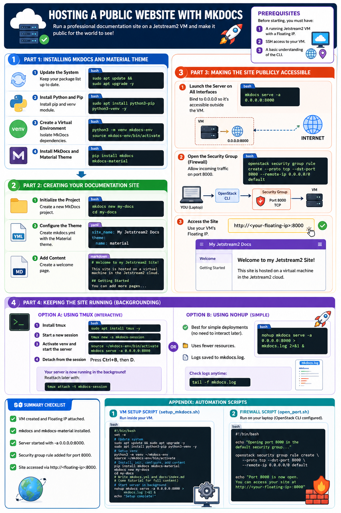

# Hosting a Public Website with MkDocs 

This tutorial guides you through the process of setting up an **MkDocs** server on a Jetstream2 virtual machine. By the end of this guide, you will have a professional-looking documentation site that is accessible to anyone on the public internet.

## Prerequisites

Before starting, you must have:

1. A running Jetstream2 VM with a **Floating IP**.
2. SSH access to your VM.
3. A basic understanding of the CLI (see [Jetstream2 Quick Start Guide](jetstream-vm.md)).

---

## Part 1: Installing MkDocs and Material Theme

We will use the **Material for MkDocs** theme, as it is the industry standard for beautiful, responsive documentation.

### 1. Update the System
Log into your VM and ensure your package list is up to date:
```bash
sudo apt update && sudo apt upgrade -y
```

### 2. Install Python and Pip
Most Jetstream2 Ubuntu images come with Python. Install `pip` and the `venv` module:
```bash
sudo apt install python3-pip python3-venv -y
```

### 3. Create a Virtual Environment
To keep your system clean, install MkDocs inside a virtual environment:
```bash
python3 -m venv mkdocs-env
source mkdocs-env/bin/activate
```

### 4. Install MkDocs and Material Theme
```bash
pip install mkdocs mkdocs-material
```

---

## Part 2: Creating Your Documentation Site

### 1. Initialize the Project
Create a new MkDocs project named `my-docs`:
```bash
mkdocs new my-docs
cd my-docs
```

### 2. Configure the Theme
Instead of manually editing the file, you can use this command to create the `mkdocs.yml` configuration file with the Material theme enabled:

```bash
cat <<EOF > mkdocs.yml
site_name: My Jetstream2 Docs
theme:
  name: material
EOF
```

### 3. Add Content
Create a simple welcome page in `docs/index.md`:

```bash
cat <<EOF > docs/index.md
# Welcome to my Jetstream2 Site!

This site is hosted on a virtual machine in the Jetstream2 cloud.

## Getting Started
You can add more pages to this documentation by creating new \`.md\` files in the \`docs/\` directory and listing them in the \`mkdocs.yml\` file.
EOF
```

---

## Part 3: Making the Site Publicly Accessible

By default, `mkdocs serve` only listens on `localhost` (127.0.0.1), meaning it is only visible *inside* the VM. To make it public, we must change the binding and open the cloud firewall.

### 1. Launch the Server on all Interfaces
Run the server using the `-a` (address) flag to bind to `0.0.0.0` (all interfaces) on port `8000`:

```bash
mkdocs serve -a 0.0.0.0:8000
```

### 2. Open the Security Group (Firewall)
While the server is running, you must tell Jetstream2 to allow incoming traffic on port `8000`. **Open a new terminal window on your laptop** (do not stop the server) and run:

```bash
openstack security group rule create --proto tcp --dst-port 8000 --remote-ip 0.0.0.0/0 default
```

### 3. Access the Site
You can now view your website from any browser using your VM's **Floating IP**:
`http://<your-floating-ip>:8000`

---

## Part 4: Keeping the Site Running (Backgrounding)

If you close your SSH terminal, the `mkdocs serve` process will stop, and your website will go offline. To keep it running in the background, use a tool like `tmux` or `nohup`.

### Option A: Using `tmux`
`tmux` allows you to start a session, disconnect from it, and reconnect later. This is ideal when you want to interactively manage your server, view the live logs in real-time, or run multiple commands in the same session.

1. **Install tmux**:
   ```bash
   sudo apt install tmux -y
   ```
2. **Start a new session**:
   ```bash
   tmux new -s mkdocs-session
   ```
3. **Activate venv and start the server**:
   ```bash
   source ~/mkdocs-env/bin/activate
   mkdocs serve -a 0.0.0.0:8000
   ```
4. **Detach from the session**:
   Press `Ctrl+B`, then let go and press `D`.

Your server is now running in the background! You can close your terminal. To return to the session later, run:
```bash
tmux attach -t mkdocs-session
```

### Option B: Using `nohup` (Recommended for simple deployments)
If you only need the server to run and don't need to interact with the terminal session again, `nohup` (no hang up) is better because it is simpler, uses fewer resources, and doesn't require managing session IDs.

```bash
nohup mkdocs serve -a 0.0.0.0:8000 > mkdocs.log 2>&1 &
```
This runs the server in the background and saves all logs to `mkdocs.log`. You can check the logs at any time using `tail -f mkdocs.log`.

---

## Summary Checklist
- [ ] VM created and Floating IP attached.
- [ ] `mkdocs` and `mkdocs-material` installed.
- [ ] Server started with `-a 0.0.0.0:8000`.
- [ ] Security group rule added for port `8000`.
- [ ] Site accessed via `http://<floating-ip>:8000`.



---

## Appendix: Automation Scripts

If you prefer to automate the setup, you can use the following scripts to deploy your site quickly.

### 1. VM Setup Script (`setup_mkdocs.sh`)
Run this script **inside your virtual machine** to handle the installation, configuration, and launching of the server.

```bash
cat <<'EOF' > setup_mkdocs.sh
#!/bin/bash
set -e

echo "Updating system..."
sudo apt update && sudo apt upgrade -y
sudo apt install python3-pip python3-venv -y

echo "Setting up virtual environment..."
python3 -m venv ~/mkdocs-env
source ~/mkdocs-env/bin/activate

echo "Installing MkDocs and Material theme..."
pip install mkdocs mkdocs-material

echo "Initializing project..."
mkdocs new my-docs
cd my-docs

echo "Configuring mkdocs.yml..."
cat <<EOF > mkdocs.yml
site_name: My Class Docs
theme:
  name: material
EOF

echo "Creating index page..."
cat <<EOF > docs/index.md
# Welcome to my Class Site!

This site is hosted on a virtual machine in the Jetstream2 cloud.

## Getting Started
You can add more pages to this documentation by creating new .md files in the docs/ directory and listing them in the mkdocs.yml file.
EOF

echo "Starting server in background..."
# We use nohup to keep the server running after we exit
nohup mkdocs serve -a 0.0.0.0:8000 > mkdocs.log 2>&1 &

echo "----------------------------------------------------------------"
echo "Setup complete! Your site is being launched on port 8000."
echo "Remember to open port 8000 in your security group to view the site."
echo "----------------------------------------------------------------"
EOF

chmod +x setup_mkdocs.sh
./setup_mkdocs.sh
```

### 2. Firewall Script (`open_port.sh`)
Run this script on your **laptop/local machine** where your OpenStack CLI is configured.

```bash
cat <<EOF > open_port.sh
#!/bin/bash
echo "Opening port 8000 in the default security group..."
openstack security group rule create --proto tcp --dst-port 8000 --remote-ip 0.0.0.0/0 default
echo "Port 8000 is now open. You can access your site at http://<your-floating-ip>:8000"
EOF

chmod +x open_port.sh
./open_port.sh
```

