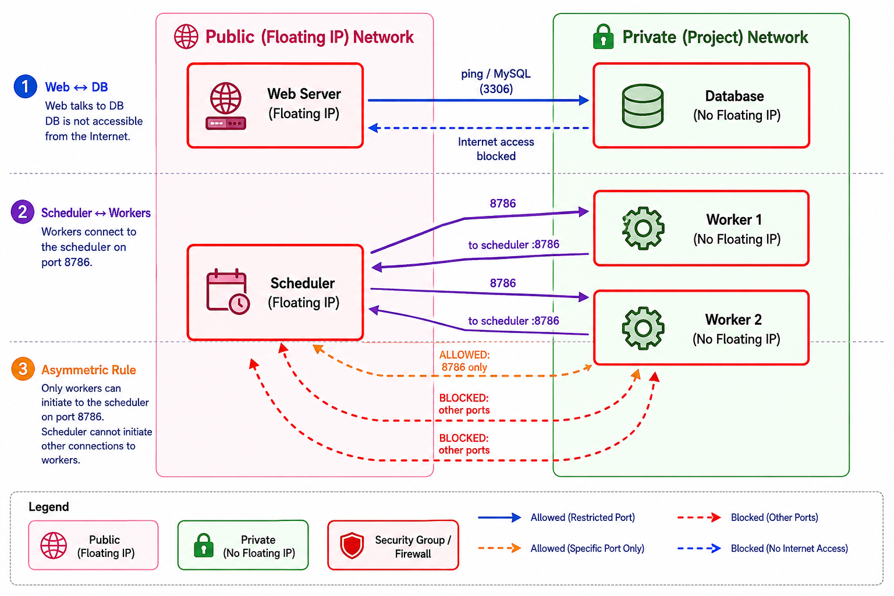

# Complex Multi Worker VM Example.md  


!!! Info "Learning Objectives"  

    By the end of this lab students will be able to understand theoretically how to:  

    1. Distinguish between public (floating) and private IP addresses and configure them on OpenStack VMs.  
    2. Create and apply security‑group rules that enforce network isolation for a classic 2‑tier web ↔ database architecture.  
    3. Build a simple distributed AI/Data cluster (scheduler ↔ workers) and set up password‑less SSH for head‑node‑to‑worker communication.  
    4. Run a basic parallel workload (e.g., Dask) across multiple VMs and verify that tasks are scheduled correctly.  
    5. Apply the principle of least privilege by tightening security‑group rules so that traffic is allowed only in the required direction (asymmetric rules).  
    6. (Optional) Design a custom Neutron network with its own subnet, router, and gateway, demonstrating full‑stack OpenStack networking knowledge.  

---

## Overview  

| Step | Architecture | Goal |
|------|--------------|------|
| 1 | 2‑Tier Web ↔ Database | Learn public vs. private IPs, security groups, and internal routing. |
| 2 | Scheduler ↔ Workers (AI/Data cluster) | Build a head‑node/worker cluster, configure password‑less SSH, and run a simple distributed task. |
| 3 | Security Challenge | Harden the cluster by crafting asymmetric security‑group rules. |

All commands are written for the **OpenStack CLI** (`openstack`). 

*Figure: The diagram of the multiple VM example*



**Prerequisites**  

* An active Jetstream 2 project with quota for at least four instances.  
* `openstack` installed and authenticated (`source ~/openrc.sh`).  
* A recent Featured-Ubuntu-24.04 (or any cloud‑image) flavor that supports SSH key injection.  

---

## 1. Two‑Tier Web ↔ Database  

### 1.1 Create a key pair  

```bash
openstack keypair create jetstream-demo --public-key ~/.ssh/id_rsa.pub
```

### 1.2 Security groups  

| Security group | Purpose | Rules |
|----------------|---------|-------|
| **web‑sg** | Front‑end web server – public HTTP/HTTPS and SSH. | `TCP 22 (0.0.0.0/0)`, `TCP 80 (0.0.0.0/0)`, `TCP 443 (0.0.0.0/0)` |
| **db‑sg**  | Backend DB – only allow inbound MySQL from the web tier and SSH from the web tier. | `TCP 22 (web‑sg)`, `TCP 3306 (web‑sg)` |

Create them:

```bash
openstack security group create web-sg --description "Web tier (public)" 
openstack security group create db-sg  --description "DB tier (private)" 

# Open ports for web‑sg
openstack security group rule create --proto tcp --dst-port 22  --remote-ip 0.0.0.0/0 web-sg
openstack security group rule create --proto tcp --dst-port 80  --remote-ip 0.0.0.0/0 web-sg
openstack security group rule create --proto tcp --dst-port 443 --remote-ip 0.0.0.0/0 web-sg

# DB rules (allow only from web‑sg)
openstack security group rule create --proto tcp --dst-port 22  --remote-group web-sg db-sg
openstack security group rule create --proto tcp --dst-port 3306 --remote-group web-sg db-sg
```

### 1.3 Spin‑up the VMs  

```bash
# Web server – gets a floating IP
openstack server create \
    --flavor m1.medium \
    --image Featured-Ubuntu-24.04 \
    --key-name jetstream-demo \
    --security-group web-sg \
    --network private-net \
    web01

# DB server – stays private
openstack server create \
    --flavor m1.medium \
    --image Featured-Ubuntu-24.04 \
    --key-name jetstream-demo \
    --security-group db-sg \
    --network private-net \
    db01
```

### 1.4 Exposing the Web Server (Floating IP)

To make the web server accessible from the internet, allocate a floating IP and attach it **only** to `web01`:

```bash
FIP=$(openstack floating ip create public --format value -c floating_ip_address)
openstack server add floating ip web01 $FIP
echo "Web server reachable at http://$FIP"
```

### 1.5 Install Basic Services

To make the connectivity tests actually work, install a web server on `web01` and a database on `db01`:

```bash
# Install Nginx on web01
ssh -i ~/.ssh/id_rsa ubuntu@$FIP "sudo apt update && sudo apt install -y nginx"

# Install MariaDB on db01 (via web01 since db01 is private)
DB_IP=$(openstack server show db01 -f value -c addresses | awk '{print $2}')
ssh -i ~/.ssh/id_rsa ubuntu@$FIP "ssh -i ~/.ssh/id_rsa ubuntu@$DB_IP 'sudo apt update && sudo apt install -y mariadb-server'"
```
Note: The second command assumes you have shared your SSH key with `db01` or are using the same key. In this lab, both use `jetstream-demo`.

### 1.6 Verify connectivity  

```bash
# From your laptop
ssh -i ~/.ssh/id_rsa ubuntu@$FIP      # login to web01
```

Inside `web01`:

```bash
# Show internal IPs
ip -4 addr show eth0

# Get the private IP of the DB server
DB_IP=$(openstack server show db01 -f value -c addresses | awk '{print $2}')
echo "DB Server IP: $DB_IP"

# Ping the DB server
ping -c 3 $DB_IP

# Test MySQL port
nc -zv $DB_IP 3306
```

You should **not** be able to SSH directly to `db01` because it has no floating IP and its security group blocks the world.

### 1.7 Cleanup (optional)

```bash
openstack server delete web01 db01
openstack floating ip delete $FIP
openstack security group delete web-sg db-sg
openstack keypair delete jetstream-demo
```

---

## 2. Distributed AI / Data Cluster (Scheduler ↔ Workers)

This pattern mirrors Dask, Ray, or PyTorch Distributed – a single head node (scheduler) coordinates several worker nodes.

### 2.1 Create a security group for the cluster

```bash
openstack security group create cluster-sg --description "Cluster head + workers"
openstack security group rule create --proto tcp --dst-port 22 --remote-ip 0.0.0.0/0 cluster-sg
# Allow any node in the group to talk to any other node on all ports (simplified)
openstack security group rule create --proto tcp --dst-port 0-65535 --remote-group cluster-sg cluster-sg
```

*Why allow all intra‑group traffic?*  
The head node will open arbitrary ports for the workers (e.g., Dask scheduler on 8786). The rule above saves you from having to list each port manually.

### 2.2 Create the Scheduler VM (public)

```bash
openstack server create \
    --flavor m1.large \
    --image Featured-Ubuntu-24.04 \
    --key-name jetstream-demo \
    --security-group cluster-sg \
    --network private-net \
    scheduler
```

### 2.3 Create two Worker VMs (private)

```bash
for i in 1 2; do
  openstack server create \
      --flavor m1.large \
      --image Featured-Ubuntu-24.04 \
      --key-name jetstream-demo \
      --security-group cluster-sg \
      --network private-net \
      worker${i}
done
```

### 2.4 Attach a floating IP to the Scheduler (only)

```bash
SCHED_FIP=$(openstack floating ip create public --format value -c floating_ip_address)
openstack server add floating ip scheduler $SCHED_FIP
echo "Scheduler reachable at $SCHED_FIP"
```

### 2.5 Install the cluster software (example with Dask)

1. **SSH to the scheduler**

```bash
ssh -i ~/.ssh/id_rsa ubuntu@$SCHED_FIP
```

2. **Inside the scheduler node: Install Dask and setup SSH**

```bash
# Install Python and Dask
sudo apt update && sudo apt install -y python3-pip
pip3 install --user dask[distributed]

# Generate an SSH key for intra‑cluster use (password-less communication)
ssh-keygen -t rsa -b 4096 -N "" -f ~/.ssh/id_cluster
```

3. **Configure password-less SSH to workers**

Since you are on the scheduler, you can use the OpenStack CLI (if installed/configured on the VM) or simply get the IPs from your laptop. 

**From your laptop (recommended):**

```bash
# 1. Generate the key on your laptop first if not already done
ssh-keygen -t rsa -b 4096 -N "" -f ~/.ssh/id_cluster

# 2. Copy the key to the scheduler
ssh-copy-id -i ~/.ssh/id_cluster.pub ubuntu@$SCHED_FIP

# 3. Copy the key to each worker
for H in worker1 worker2; do
  WORKER_IP=$(openstack server show $H -f value -c addresses | awk '{print $2}')
  ssh-copy-id -i ~/.ssh/id_cluster.pub ubuntu@$WORKER_IP
done
```

### 2.6 Start the scheduler and workers  

```bash
# 1. Start Scheduler (on the head node)
ssh -i ~/.ssh/id_cluster ubuntu@$SCHED_FIP "dask-scheduler --port 8786 --dashboard-address :8787 &"

# 2. Start Workers (run on each worker VM)
for H in worker1 worker2; do
  WORKER_IP=$(openstack server show $H -f value -c addresses | awk '{print $2}')
  SCHED_IP=$(openstack server show scheduler -f value -c addresses | awk '{print $2}')
  ssh -i ~/.ssh/id_cluster ubuntu@$WORKER_IP "dask-worker tcp://$SCHED_IP:8786 &"
done
```

### 2.7 Verify from your laptop  

```bash
# Install Dask locally (or use a Jupyter notebook)
pip install dask[distributed]

python - <<'PY'
from dask.distributed import Client
client = Client('tcp://<scheduler_private_ip>:8786')
print("Cluster info:", client.scheduler_info())

# Simple parallel test
import dask.array as da
x = da.random.random((10000, 10000), chunks=(1000, 1000))
print("Mean:", x.mean().compute())
PY
```

If the client connects and the computation finishes, the cluster is operational.

### 2.8 Cleanup  

```bash
openstack server delete scheduler worker1 worker2
openstack floating ip delete $SCHED_FIP
openstack security group delete cluster-sg
```

---

## 3. Security Challenge – Asymmetric Rules  

Now that the students have a working cluster, ask them to tighten the security groups so that:

* Workers can initiate connections **to** the scheduler (required for Dask worker registration).  
* Scheduler cannot open arbitrary connections back to the workers (except the already‑allowed Dask ports).  

### 3.1 What to change  

1. Remove the all‑ports intra‑group rule created earlier.  
2. Add a rule that only permits the scheduler port (8786) from workers → scheduler.  
3. Do not add any rule that opens inbound SSH (port 22) from the scheduler to the workers; the default “deny” will block it.  

### 3.2 Step‑by‑step solution (example)

```bash
# 1) Delete the permissive rule (port range 0‑65535)
# Find the rule ID with:
openstack security group rule list cluster-sg

# Then delete it (replace <RULE_ID> with the actual ID from the list)
RULE_ID=$(openstack security group rule list cluster-sg -f value -c ID | grep -E '0-65535|65535')
openstack security group rule delete $RULE_ID

# 2) Add a rule that allows workers → scheduler on Dask port
openstack security group rule create \
    --protocol tcp --dst-port 8786 \
    --remote-group cluster-sg \
    --description "Workers → Scheduler Dask port" \
    cluster-sg
```

### 3.3 Validation checklist  

| Test | Command | Expected result |
|------|---------|-----------------|
| Worker → Scheduler (Dask) | `ssh -i ~/.ssh/id_cluster ubuntu@$SCHED_IP dask-scheduler --version` | Connection succeeds (port 8786 allowed). |
| Scheduler → Worker (SSH) | `ssh -i ~/.ssh/id_cluster ubuntu@$WORKER1_IP` | Fails – no inbound rule for 22 from scheduler. |
| Scheduler → Worker (Ping) | `ping -c 2 $WORKER1_IP` | Succeeds because security groups are stateful for ICMP; add an extra rule if you want to block ICMP. |
| External Internet → Workers | `ssh -i ~/.ssh/id_rsa ubuntu@<worker_public_ip>` (none exists) | Fails – no floating IP / no 0.0.0.0/0 rule. |

Students should inspect the security‑group JSON (`openstack security group show cluster-sg -f json`) and explain why the allowed/blocked traffic behaves as observed.

---

## 4. Bonus: Custom Private Network (Optional Deep‑Dive)

If you have extra time or quota, let students create their **own Neutron network** instead of using the default project network.

```bash
# 1) Create a private network & subnet
openstack network create custom-net
openstack subnet create --network custom-net \
    --subnet-range 192.168.100.0/24 \
    --gateway 192.168.100.1 \
    custom-subnet

# 2) Create a router and attach the subnet
openstack router create custom-router
openstack router set --external-gateway public custom-router
openstack router add subnet custom-router custom-subnet

# 3) Launch VMs on the new network (add `--network custom-net` to the server create commands above)
```

Students can compare routing tables, floating‑IP allocation, and latency between the default and the custom network.

---

## 5. Quick Reference Cheat‑Sheet  

| Step | Command (short) | Purpose |
|------|-----------------|---------|
| Keypair | `openstack keypair create jetstream-demo --public-key ~/.ssh/id_rsa.pub` | Re‑use the same SSH key for all VMs. |
| Security groups | `sg-create … ; sg-rule create …` | Isolate tiers, allow only required ports. |
| Web + DB | `server create web01 … ; server create db01 …` | Public front‑end + private DB. |
| Cluster | `server create scheduler … ; for i in 1 2; do server create worker${i} …; done` | Scheduler (public) + workers (private). |
| Floating IP | `FIP=$(openstack floating ip create public -f value -c floating_ip_address); openstack server add floating ip <VM> $FIP` | Expose only the intended VM. |
| Password‑less SSH | `ssh-keygen … ; ssh-copy-id -i ~/.ssh/id_cluster.pub ubuntu@<private‑IP>` | Enables head‑node → workers communication. |
| Start Dask | `dask-scheduler … &` on scheduler; `dask-worker tcp://<sched‑IP>:8786 &` on each worker. | Verify a distributed workload. |
| Challenge | Remove permissive rule, add narrow `8786` rule. | Practice least‑privilege security groups. |
| Cleanup | `openstack server delete … ; openstack floating ip delete … ; openstack security group delete …` | Tear down everything. |

---

## Appendix: Cleanup and Cost Optimization

### Comprehensive Cleanup
To ensure no resources are left running (and consuming quota or budget), follow these steps in order:

1. **Delete all Servers**:
   ```bash
   openstack server list -f value -c Name | xargs -I {} openstack server delete {}
   ```
2. **Delete all Floating IPs**:
   ```bash
   openstack floating ip list -f value -c ID | xargs -I {} openstack floating ip delete {}
   ```
3. **Delete Security Groups**:
   Security groups can only be deleted after the VMs using them are gone.
   ```bash
   openstack security group delete web-sg db-sg cluster-sg
   ```
4. **Delete Keypairs**:
   ```bash
   openstack keypair delete jetstream-demo
   ```

### Cost Optimization Tips
Cloud resources are billed based on the instance flavor (CPU, RAM, Disk).

* **Instance Sizes**: The `m1.medium` and `m1.large` flavors used in this lab are for demonstration. For initial testing or learning, it is highly recommended to use smaller flavors such as `tiny` or `msmall` to minimize costs.
* **Image Impact**: While the image itself usually doesn't cost extra, larger images can increase boot times and may require larger disk quotas.
* **Idle Resources**: Always delete your Floating IPs and Servers as soon as you are finished with a lab session.

### Appendix Database

In this example, the database (implemented using __MariaDB__) serves as a pedagogical tool to demonstrate a __classic 2-tier architecture__ and the concept of __network isolation__.

Specifically, it is used for the following purposes:

1. __Demonstrating Tiered Security__: The lab sets up a scenario where the database is placed in a "private tier." By applying a specific security group (`db-sg`), the database is configured to __only__ accept traffic from the web server (`web-sg`). This teaches students how to protect sensitive backend data from the public internet.
2. __Public vs. Private IP Practice__: While the web server is given a __Floating IP__ (publicly accessible), the database server is kept on a __Private IP__ only. This forces students to understand that the only way to manage or interact with the database is by first SSH-ing into the web server (which acts as a "jump box" or bastion host).
3. __Connectivity Validation__: The database is used to verify that the security group rules are working. Students use the `nc -zv` (netcat) command from the web server to check if port `3306` (the default MySQL/MariaDB port) is open, confirming that internal routing between the two tiers is functioning correctly.

In short, the database isn't used to store actual data in this lab; rather, it acts as a __target for network verification__ to prove that the security architecture is correctly isolating the backend from the frontend.

### Cross-Tier Access: Accessing the Database from Workers

By default, the database (`db-sg`) only allows traffic from the web server (`web-sg`). If your AI cluster workers need to access the database, you must explicitly authorize the cluster's security group.

1. **Allow Workers $\to$ Database traffic**:
   Run this from your laptop to add a rule allowing the cluster nodes to reach the database on the MySQL port:
   ```bash
   openstack security group rule create \
       --proto tcp --dst-port 3306 \
       --remote-group cluster-sg \
       db-sg
   ```

2. **Verify access from a worker**:
   First, get the DB private IP and the worker's private IP:
   ```bash
   DB_IP=$(openstack server show db01 -f value -c addresses | awk '{print $2}')
   WORKER1_IP=$(openstack server show worker1 -f value -c addresses | awk '{print $2}')
   ```
   Then, SSH into the worker and test the connection:
   ```bash
   ssh -i ~/.ssh/id_rsa ubuntu@$WORKER1_IP "nc -zv $DB_IP 3306"
   ```
   If the rule was applied correctly, the connection should now succeed.

