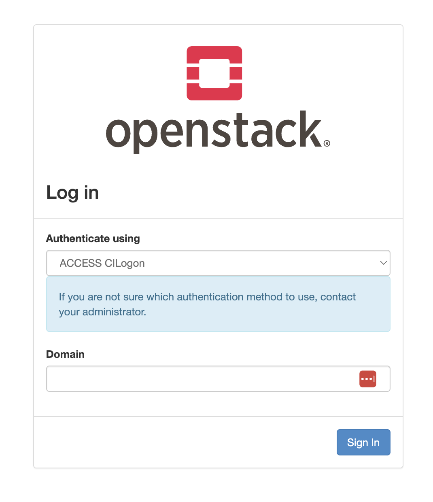
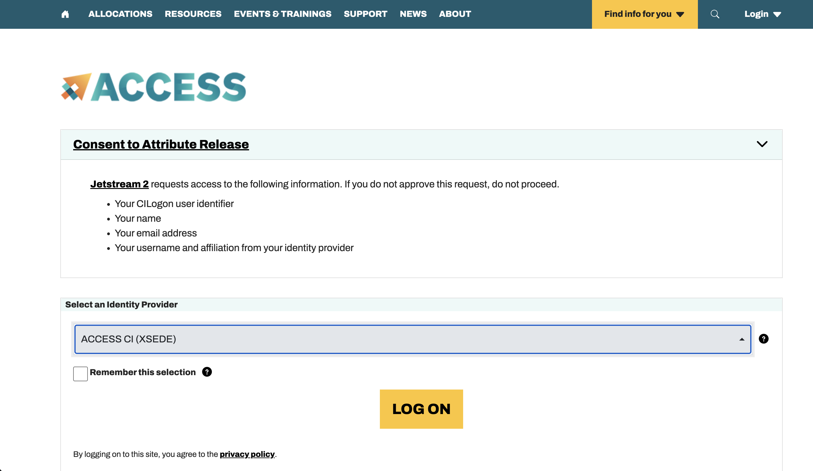
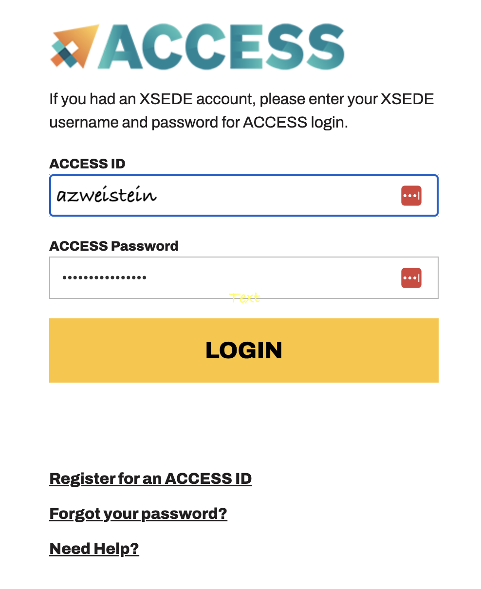
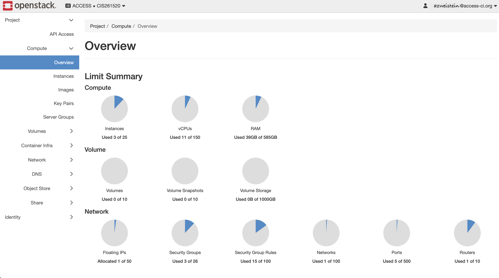
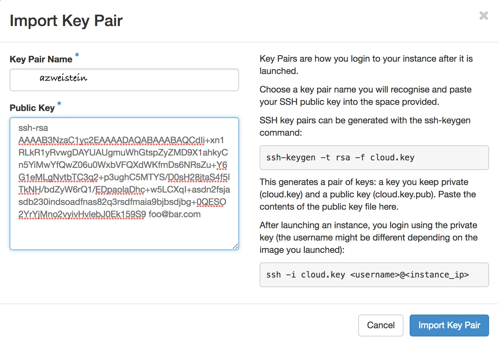
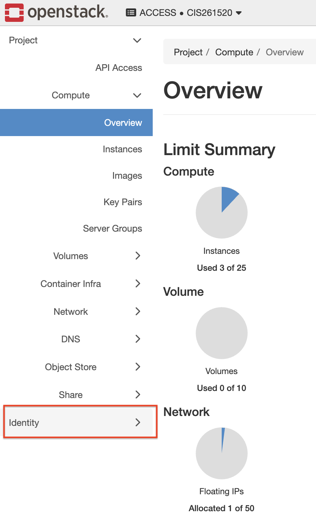
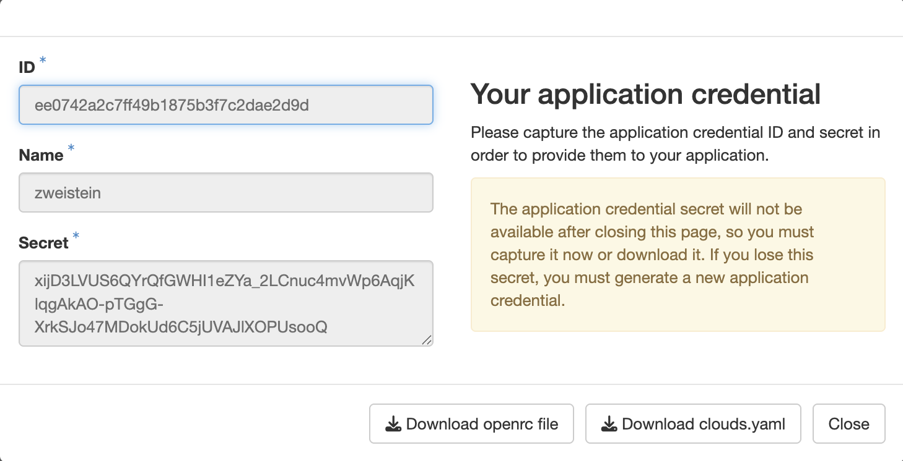
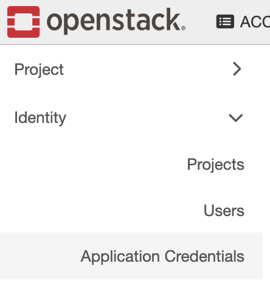
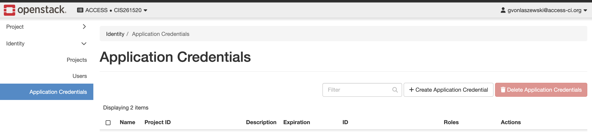
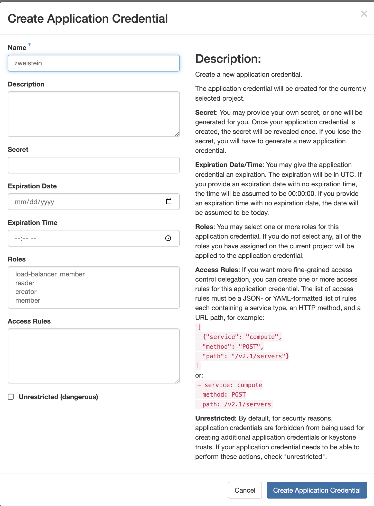

# Jetstream2 Quick Start Guide

This tutorial provides a step-by-step guide to getting started with Jetstream2, covering both the Horizon Web UI and the Command-Line Interface (CLI).

## Part 1: Getting Started with Horizon (Web UI)

The Horizon dashboard is a convenient way for beginners to manage your Jetstream2 resources. It is suitable for creating small environments, but should not be used when automating deployments.

To be able to use the command line tools we also need to start with horizon to obtain the credentials.

### 1. Log In
Go to the Jetstream2 login page and login with your ACCESS CILogon or other authentication frameworks you have registered with your account. In general it will be ACCESS CILOGON.

Go to <https://docs.jetstream-cloud.org/ui/horizon/login> and you will see the Login Screen.

 [Jetstream Login Screen](https://docs.jetstream-cloud.org/ui/horizon/login)

Follow the login process. We provide here some screenshots.



Press the `Sign in` Button. 




Press the `Log On` button.



Fill out the form and `Login`.

Once logged in, you will see the Horizon dashboard:



### 2. Add an SSH Key Pair

Before you can launch any virtual machine that you like to login to, you must add an SSH public key. This allows you to securely log into your VM after it's created.

Detailed instructions can be found here: [https://docs.jetstream-cloud.org/ui/horizon/ssh_keys/](https://docs.jetstream-cloud.org/ui/horizon/ssh_keys/)

When uploading the key pair we recommend to name it after your login ID or your first and last name. For programming and scripting it is best to use a name that does not contain spaces and keep it short. As we share a project the names must be unique.





### 3. Create Application Credentials

To use the command-line tools, you'll need application credentials.

!!! Warning
    There is a bug in the deployment of the Horizon interface that you can not download the credentials from the upper right menu.

Hence you need to follow tis workflow:

1. Navigate to the **Identity** menu.



Click on `Identity` and you will see the Identity menu




2. Create your credentials.

Click on the `Applications Credentials` menu entry





You will now be redirectet to the credentials 
form, that includes a list of all credentials.




Click on the `Create Applications Credentails` button to create a new credential you can use.
Please note you only need one for this class, but could create more dependent on if you need to restrict access to services offered by the cloud.




!!! warning
    do not click on unrestricted. 

Make sure you do not expose your credentials or give it to other users. If they are exposed, delet them and create a new one.

### 4. Download the credential files.

Once created, you will be able to download your `clouds.yaml` file or an `openrc.sh` script. They will have different names, but we suggest to rename them accordingly so it is easier to follow this tutorial.

Please download them now and place them in the folder `~/.config/openstack`. Make sure you have the folder and create it with 

```bash
mkdir -p ~/.config/openstack
```

Detailed configuration instructions are provided in [Part 2](#part-2-configuring-the-command-line-interface-cli).

## Part 2: Configuring the Command-Line Interface (CLI)

We assume you have placed your clouds in the `~/.config/openstack/clouds.yaml`. We will from now on only use that.

The CLI is more powerful and efficient for managing resources, especially for automation.

### Prerequisites

We need to make sure we fulfill the following prerequisits. On Windows we need to install `gitbash` so you can use the same commands as we use on Linux and MacOS to keep the example simple. 

!!! tip
    Projects in class should avoid using powershell in order to provide maximum portability across the OSes. We believe there are little to no reasons to use powershell even if you use Windows.


### 1. Use a Python Virtual Environment


To avoid impacting your system Python installation, it is highly recommended to use a virtual environment.

An example to create one is 

```bash
python3 -m venv ~/ENV3
source ~/ENV3/bin/activate
```
Once activated, you can proceed to install the necessary tools.

First Install the OpenStack client:
  ```bash
  pipx install python-openstackclient
  ```

### 2. Authentication Configuration

There are two main ways to authenticate your CLI session. While `openrc.sh` is common if you have only one cloud, **`clouds.yaml` is the recommended best practice**.

#### Option A: Using `clouds.yaml`

Save your downloaded `clouds.yaml` file to `~/.config/openstack/clouds.yaml`. The OpenStack CLI automatically checks this directory, so you don't need to source any files in every new terminal session.

**Handling a Single Cloud:**

An example `clouds.yaml` for a single cloud looks like:

```yaml
clouds:
  openstack:
    auth:
      auth_url: https://js2.jetstream-cloud.org:5000/v3/
      application_credential_id: "your-credential-id"
      application_credential_secret: "your-credential-secret"
    region_name: "IU"
    interface: "public"
    identity_api_version: 3
    auth_type: "v3applicationcredential"
```

**Handling Multiple Clouds:**

If you have accounts on multiple clouds (e.g., Jetstream and Chameleon), merge them into one `clouds.yaml` file and give each one a unique name:

```yaml
clouds:
  jetstream:
    auth:
      auth_url: https://js2.jetstream-cloud.org:5000/v3/
      application_credential_id: "your-jetstream-id"
      application_credential_secret: "your-jetstream-secret"
    region_name: "IU"
    interface: "public"
    identity_api_version: 3
    auth_type: "v3applicationcredential"
  chameleon:
    auth:
      auth_url: https://...
      application_credential_id: "your-chameleon-id"
      application_credential_secret: "your-chameleon-secret"
    region_name: "..."
    interface: "public"
    identity_api_version: ...
    auth_type: ...
```

#### Option B: Using `openrc.sh`

Alternatively, you can save your credentials in an `openrc.sh` file (e.g., `~/.config/openstack/openrc.sh`) and load it into your current session:

```bash
source ~/.config/openstack/openrc.sh
```

**Example `openrc.sh` content:**
```bash
#!/usr/bin/env bash
export OS_AUTH_TYPE=v3applicationcredential
export OS_AUTH_URL=https://js2.jetstream-cloud.org:5000/v3/
export OS_IDENTITY_API_VERSION=3
export OS_REGION_NAME="IU"
export OS_INTERFACE=public
export OS_APPLICATION_CREDENTIAL_ID=your-credential-id
export OS_APPLICATION_CREDENTIAL_SECRET=your-credential-secret
```

In case of multiple clouds you would need multiple files and name them accordingly such as:
- `~/.config/openstack/openrc-jetstream.sh`
- `~/.config/openstack/openrc-chameleon.sh`

!!! warning
    Never place the clouds.yaml or openrc.sh files into your current directory. Always make sure the ~/.config directory tree is properly protected.

    ```bash
    chmod 700 ~/.config/openstack
    chmod 600 ~/.config/openstack/*
    ```


Now we can verify if the setup works and we can access the openstack cloud.

To do so we simply list a common function such as listing all available images in the openstack cloud.


  ```bash
  openstack image list
  ```

  If it works you will see something like 

```
+--------------------------------------+----------------------------------------+--------+
| ID                                   | Name                                   | Status |
+--------------------------------------+----------------------------------------+--------+
| e6fd0368-aba2-432f-91a6-e44753bf870b | Featured-Minimal-Ubuntu22              | active |
| 94fe2ee9-c1c3-4a38-9cfa-5c3e5b5daca8 | Featured-Minimal-Ubuntu24              | active |
| f6eb2462-7a70-4490-97a8-9ba8d3829bf7 | Featured-RockyLinux10                  | active |
| e812b4dd-8dc5-483c-9451-8a7e9956bfce | Featured-RockyLinux9                   | active |
| 6eefa5f4-89c8-4206-bbb4-5c99e3a7eb70 | Featured-Ubuntu22                      | active |
| 6cbb4cfe-92e2-403c-8cf3-d578c654293c | Featured-Ubuntu24                      | active |
| bbad1676-40f1-485d-8575-ca9eac7e211e | Windows-Server-2022-JS2-Beta           | active |
| b59ca85b-41a4-42f0-b7e2-804861cf38c8 | sev-noble-server-amd64                 | active |
| a49f22ed-4ba1-46a5-9569-5dae8f626eed | ubuntu-jammy-kube-v1.28.13-240828-1652 | active |
| 52506e1e-30e0-43d1-bd26-1ca68f8422c3 | ubuntu-jammy-kube-v1.29.8-240828-1652  | active |
| 9625520a-b96c-46e5-b6d5-4f3f995dbee6 | ubuntu-jammy-kube-v1.30.4-240828-1653  | active |
| 784ef7b3-a05a-4b04-bbb6-8d246d039e35 | ubuntu-jammy-kube-v1.31.0-240828-1652  | active |
| 53a1b751-7353-42f7-a1e3-6fb9f298a174 | ubuntu-jammy-kube-v1.32.6-250626-0849  | active |
| 74846576-bb7e-4ca9-897e-8f33e8fd84d1 | ubuntu-jammy-kube-v1.33.2-250626-0848  | active |
| 18895dd1-6e94-482b-9a62-9573328c7429 | ubuntu-jammy-kube-v1.34.8-260518-1604  | active |
+--------------------------------------+----------------------------------------+--------+
```

As we at one point want to also process data retrieved from the cloud, one way to do this is to export the data in various formats. For example we can export it with the options `-f yaml` or `-f json`

```bash
openstack image list -f json
```
> ```
> [
>  {
>    "ID": "e6fd0368-aba2-432f-91a6-e44753bf870b",
>    "Name": "Featured-Minimal-Ubuntu22",
>    "Status": "active"
>  },
>  ...
> ]
> ```

```bash
openstack image list -f yaml
```
> ```
> - ID: e6fd0368-aba2-432f-91a6-e44753bf870b
>   Name: Featured-Minimal-Ubuntu22
>  Status: active
> ```


## Part 3: Launching Your First Virtual Machine

Now that your environment is configured, follow these steps to provision a VM.

### 1. Identify Resources

Before creating the server, you need to find the names or IDs of the hardware size (**flavor**), operating system (**image**), and your **key pair**.

* **Find a flavor:**
  ```bash
  openstack flavor list
  ```
  *(Note the name, e.g., `m3.small` or `jetstream.medium`)*

  **Expected Output:**
  ```
  +----+-----------+--------+------+-----------+-------+-----------+
  | ID | Name      |    RAM | Disk | Ephemeral | VCPUs | Is Public |
  +----+-----------+--------+------+-----------+-------+-----------+
  | 1  | m3.tiny   |   3072 |   20 |         0 |     1 | False     |
  | 2  | m3.small  |   6144 |   20 |         0 |     2 | False     |
  | 3  | m3.quad   |  15360 |   20 |         0 |     4 | False     |
  | 4  | m3.medium |  30720 |   60 |         0 |     8 | False     |
  | 5  | m3.large  |  61440 |   60 |         0 |    16 | False     |
  | 7  | m3.xl     | 128000 |   60 |         0 |    32 | False     |
  | 8  | m3.2xl    | 256000 |   60 |         0 |    64 | False     |
  +----+-----------+--------+------+-----------+-------+-----------+
  ```

* **Find an image:**

  ```bash
  openstack image list
  ```
  *(Note the image name, e.g., `Featured-Ubuntu-24.04`)*

  **Expected Output:**
  ```
  +---------------------------------------+----------------------+-----------+
  | ID                                    | Name                 | Status    |
  +---------------------------------------+----------------------+-----------+
  | 12345678-1234-1234-1234-1234567890ab | Featured-Ubuntu-24.04 | active    |
  | 87654321-4321-4321-4321-ba0987654321 | Featured-CentOS-9     | active    |
  +---------------------------------------+----------------------+-----------+
  ```

* **Verify your SSH key name:**

  ```bash
  openstack keypair list
  ```

  **Expected Output:**
  ```
  +-----------------------+----------------------+
  | Name                  | Public Key            |
  +-----------------------+----------------------+
  | your-ssh-key-name     | ssh-rsa AAAAB3...     |
  +-----------------------+----------------------+
  ```

### 2. Create and Launch the Server
Run the `openstack server create` command. 

!!! important
    Replace the placeholders in this document

    * your-ssh-key-name
    * your-login-id

    with your actual values.


```bash
openstack server create \
  --flavor m3.small \
  --image "Featured-Ubuntu-24.04" \
  --key-name your-ssh-key-name \
  --security-group default \
  --wait \
  your-login-id-vm-1
```
*The `--wait` flag ensures the command blocks until the instance is `ACTIVE`.*

**Expected Output:**

The command will return once the server is created. You can verify it with:

```bash
openstack server show your-login-id-vm-1 -c status
```

**Expected Output:**
```
+-----------+---------+
| Field     | Value   |
+-----------+---------+
| status    | ACTIVE  |
+-----------+---------+
```

**Expected Output:**
The command will return once the server is created. You can verify it with:

```bash
openstack server show your-login-id-vm-1 -c status
```

**Expected Output:**
```
+-----------+---------+
| Field     | Value   |
+-----------+---------+
| status    | ACTIVE  |
+-----------+---------+
```

### 3. Allocate and Attach a Floating IP

Jetstream2 instances require a public floating IP to be accessible via the internet.

* **Create a public IP address:**

  ```bash
  openstack floating ip create public
  ```
  *(Note the `floating_ip_address` returned, e.g., `149.165.x.x`)*

  **Expected Output:**
  ```
  +---------------------+--------------------------------------+
  | Floating IP Address | Fixed IP Address                     |
  +---------------------+--------------------------------------+
  | 149.165.10.20       | 10.0.0.15                            |
  +---------------------+--------------------------------------+
  ```

* **Attach the IP to your server:**

  ```bash
  openstack server add floating ip your-login-id-vm-1 149.165.x.x
  ```

  **Expected Output:**
  The command usually returns no output upon success. You can verify the attachment using:
  ```bash
  openstack server show your-login-id-vm-1 -c addresses
  +---------------------------------------------------------------------------------------------------+
  | addresses                                                                                           |
  +---------------------------------------------------------------------------------------------------+
  | [{'addr': '10.0.0.15', 'version': 4, 'external': '149.165.10.20'}]                                |
  +---------------------------------------------------------------------------------------------------+
  ```

### 4. Log Into Your VM

Finally, SSH into your instance.

* Ensure your private key permissions are secure:
  ```bash
  chmod 600 ~/.ssh/id_rsa
  ```

* SSH using the default username (e.g., `ubuntu` for Ubuntu images):
  ```bash
  ssh -i ~/.ssh/id_rsa ubuntu@149.165.x.x
  ```


!!! warning "Connectivity Troubleshooting"
    If you encounter a `Connection timed out` error when trying to SSH, it is likely that Port 22 is blocked by the security group.
    
    You can open Port 22 for all IP addresses using this command:
    ```bash
    openstack security group rule create --proto tcp --dst-port 22 --remote-ip 0.0.0.0/0 default
    ```
    Alternatively, you can add the SSH rule via the **Horizon UI** under **Network** $\rightarrow$ **Security Groups** $\rightarrow$ **Manage Rules**.


### 5. Manage VM Power State

If you want to stop your VM to save resources without deleting it entirely, you can manage its power state.

* **Stop the VM:**
  ```bash
  openstack server stop your-login-id-vm-1
  ```

* **Start the VM again:**
  ```bash
  openstack server start your-login-id-vm-1
  ```

* **Check the current status:**
  ```bash
  openstack server list
  ```

  **Expected Output:**
  ```
  +---------------------------------------------------------------------------------------------------+------------------+-----------+-------------------+----------------------------------------------------------------------------------------------------------+
  | ID                                                                                                 | Name             | Status    | VM State          | Host                                                                                                       |
  +---------------------------------------------------------------------------------------------------+------------------+-----------+-------------------+----------------------------------------------------------------------------------------------------------+
  | 87654321-432... | your-login-id-vm-1 | ACTIVE    | running           | compute-node-01                                                                                                 |
  +---------------------------------------------------------------------------------------------------+------------------+-----------+-------------------+----------------------------------------------------------------------------------------------------------+
  ```

---

## Part 4: Resource Cleanup

To avoid wasting your project quota, always delete your resources when you are finished with them.

### 1. Delete the Virtual Machine
Replace `your-login-id-vm-1` with the name you gave your server:
```bash
openstack server delete your-login-id-vm-1
```

### 2. Release the Floating IP
Deleting the server does not automatically remove the Floating IP. You must delete it separately:

* **Find your Floating IP:**
  ```bash
  openstack floating ip list
  ```
* **Delete the IP:**
  ```bash
  openstack floating ip delete <floating_ip_address>
  ```


## Appendix: CLI Tips

### 1. Using the `--os-cloud` Flag

If you have multiple clouds defined in your `clouds.yaml`, you can specify which one to use without setting environment variables:

```bash
openstack --os-cloud jetstream server list --format json
```

### 2. Setting a Session Default

To avoid typing `--os-cloud` every time in a specific terminal session, export the `OS_CLOUD` environment variable:

```bash
export OS_CLOUD=jetstream
```
Now, all subsequent `openstack` commands will default to your Jetstream configuration.

### 3. Restricting SSH Access to Your IP Address

For better security, instead of allowing all IP addresses (`0.0.0.0/0`) to connect to your VM, you can restrict access to only your own laptop's public IP address.

**1. Find your public IP address**
Use `curl` to find your current external IP address:
```bash
curl ifconfig.me
```
*(Note the returned IP, e.g., `1.2.3.4`)*

**2. Create a specific security rule**
Replace `1.2.3.4` with the IP address you just found:
```bash
openstack security group rule create --proto tcp --dst-port 22 --remote-ip 1.2.3.4/32 default
```

**3. Remove the "Allow All" rule (Optional but Recommended)**
If you previously added the `0.0.0.0/0` rule, you should remove it to ensure your VM is secure:
```bash
# First, find the ID of the rule you want to delete
openstack security group rule list default

# Delete the rule using its ID
openstack security group rule delete <rule-id>
```


