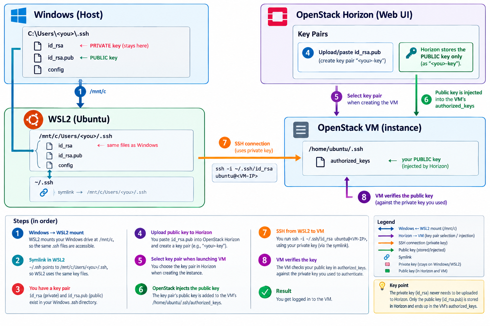

# SSH Key Management in WSL2 and Windows 11

!!! info "Learning Objectives"
    After completing this chapter, you will be able to:
    - Understand the relationship between Windows and WSL2 file systems regarding SSH configuration.
    - Configure a shared SSH key store between Windows and WSL2 using symbolic links.
    - Manage secure permissions for SSH keys within a Linux environment.
    - Use a Windows-generated SSH key to authenticate with remote OpenStack instances from WSL2.

## Contextual Overview

When working with a hybrid environment like Windows 11 and WSL2 (Windows Subsystem for Linux), managing SSH keys can become redundant if you maintain separate keys for each environment. By leveraging the way WSL2 mounts the Windows file system, you can create a single source of truth for your identities, allowing you to use the same keys regardless of whether you are executing commands in PowerShell or an Ubuntu terminal. This streamlines your workflow, simplifies key rotation, and ensures consistent access across your local development tools.

## Shared SSH Architecture

### Why this matters
Maintaining duplicate SSH keys increases the risk of losing a key or failing to rotate one of them, leading to authentication failures. A shared architecture ensures consistency across your local development environments and reduces the overhead of managing multiple identity files.

The primary mechanism for sharing keys is the `/mnt/c` mount point in WSL2, which exposes your Windows `C:` drive to the Linux environment.

!!! warning "Permission Sensitivity"
    SSH clients are extremely strict about file permissions. If a private key is "too open" (e.g., readable by others), the SSH client will reject the key and fail to connect to protect your identity.


### Implementation: Linking Windows SSH to WSL2

To achieve this single source of truth, follow these steps to link your Windows identity to your Linux environment.

### Step 1: Generating the Key Pair on Windows

Instead of generating keys in both environments, start with the Windows host. This ensures your primary identity is anchored to your main OS.

*(Note: `<you>` in the following examples refers to your Windows system username, which may differ from your WSL2 username).*

```powershell
# Generate a high-entropy RSA 4096-bit key pair
ssh-keygen -t rsa -b 4096
```

When prompted, press Enter to accept the default file location (`C:\Users\<you>\.ssh\id_rsa`) and optionally enter a passphrase for additional security.

### Step 2: Establishing the Symbolic Link in WSL2

Rather than copying files—which creates synchronization issues whenever you update a key—use a symbolic link. This makes WSL2 treat the Windows `.ssh` folder as its own native directory.

```bash
# 1. Back up existing .ssh directory if it exists to avoid data loss
mv ~/.ssh ~/.ssh.bak

# 2. Create a symbolic link pointing to your Windows .ssh directory
# Replace <you> with your actual Windows username
ln -s /mnt/c/Users/<you>/.ssh ~/.ssh
```

**Verification:** Run `ls -la ~/.ssh` in WSL2. You should see the directory pointing to the `/mnt/c/` path.

### Step 3: Securing the Keys

Because the Windows filesystem (NTFS) and Linux filesystem (ext4) handle permissions differently, you must ensure the private key has the correct Linux permissions. SSH will ignore keys that are world-readable. Even though the file physically resides on a Windows drive, the WSL2 translation layer allows you to set the permissions necessary to satisfy the SSH client.

```bash
# Set read/write permissions for the owner only (REQUIRED for SSH)
chmod 600 ~/.ssh/id_rsa

# Set read permissions for others on the public key
chmod 644 ~/.ssh/id_rsa.pub
```

**Verification:** Run `ls -l ~/.ssh/id_rsa`. The output should start with `-rw-------`, indicating that only the owner has read/write access.

!!! tip "Professional Shortcut"
    If you frequently switch between multiple SSH identities, consider creating a `config` file in your Windows `.ssh` folder. Since you've symlinked the directory, your WSL2 environment will automatically inherit these aliases and configurations.

## Deploying Keys to OpenStack

Once your local environment is configured, you must provide the public half of your key to the cloud provider to enable passwordless authentication.

### Step 4: Importing the Public Key

1. Log in to your **OpenStack Horizon** dashboard.
2. Navigate to **Compute** > **Key Pairs**.
3. Click **Import Public Key**.
4. Paste the contents of your public key (`C:\Users\<you>\.ssh\id_rsa.pub`) into the public key field and give it a descriptive name.

!!! tip "Import vs. Create"
    When using OpenStack, always prefer **Import Public Key**. This allows you to keep your private key secure on your own machine rather than letting the cloud provider generate and store it for you.

### Step 5: Launching and Connecting

When creating a new VM instance in OpenStack Horizon, select the imported key pair during the launch process. Once the instance is running and has an IP address, connect from your WSL2 terminal:

```bash
# Connect to the VM using the shared key
# The -i flag explicitly points to the identity file
ssh -i ~/.ssh/id_rsa ubuntu@<VM-IP>
```

## Direct Windows Access

While the WSL2 workflow is ideal for development, you can connect directly from Windows (using PowerShell or Windows Terminal) by referencing the same private key. This proves that the identity is managed centrally.

```powershell
# Using Windows Terminal or PowerShell
ssh -i C:\Users\<you>\.ssh\id_rsa ubuntu@<VM-IP>
```

### Using Git Bash

For those who prefer a Unix-like shell on Windows, Git Bash is an excellent alternative. It uses a slightly different path syntax to reference the Windows drive.

```bash
# Using Git Bash
ssh -i /c/Users/<you>/.ssh/id_rsa ubuntu@<VM-IP>
```

!!! tip "Git Bash Pathing"
    Git Bash maps Windows drives to a root-level directory. Instead of `C:\`, use `/c/`. This allows you to use standard Bash commands and paths while still accessing your Windows-hosted SSH keys.

### Path Reference Summary

To help you navigate between different environments, use this table as a quick reference for the SSH key paths.

| Environment | Path Syntax | Notes |
| :--- | :--- | :--- |
| **Windows (PowerShell)** | `C:\Users\<you>\.ssh\id_rsa` | Standard Windows path |
| **WSL2 (Ubuntu)** | `~/.ssh/id_rsa` | Accessed via symlink to Windows |
| **Git Bash** | `/c/Users/<you>/.ssh/id_rsa` | Unix-style mapping of C: drive |

!!! tip "Summary Checklist"
    - [ ] SSH key pair generated on Windows Host.
    - [ ] WSL2 `~/.ssh` symlinked to `/mnt/c/Users/<you>/.ssh`.
    - [ ] Private key permissions set to `600` in WSL2.
    - [ ] Public key imported into OpenStack Horizon.
    - [ ] Successful connection verified from WSL2, PowerShell, and Git Bash.

## Assignments
!!! note "Assignment 1: Basic Setup"
    Generate a new SSH key pair on your Windows host and verify that both `id_rsa` and `id_rsa.pub` are created in the `.ssh` folder.

!!! note "Assignment 2: WSL2 Integration"
    Create the symbolic link in WSL2 and use `ls -la ~/.ssh` to verify that the link correctly points to your Windows directory.

!!! note "Assignment 3: Advanced Troubleshooting"
    Intentionally change the permissions of your `id_rsa` file to be world-readable using `chmod 777 ~/.ssh/id_rsa` and attempt to SSH into a server. Observe the "unprotected private key file" error message, then restore the permissions to `600` and verify the connection works again.

## Self-Assessment

!!! tip "Self-Assessment"
    Test your knowledge by expanding the questions below.

    ??? question "Why is a symbolic link preferred over copying the SSH keys into the WSL2 home directory?"
        Using a symbolic link creates a single source of truth. Any changes made to keys or the `config` file on the Windows side are immediately reflected in WSL2, avoiding the need to manually keep two sets of keys in sync across different filesystems.

    ??? question "What happens if you try to use a private key with permissions set to 777?"
        The SSH client will refuse to use the key, issuing a warning that the 'private key is unprotected'. This is a critical security feature designed to prevent other users on the same system from stealing your identity.

    ??? question "Where is the Windows C: drive typically mounted in a WSL2 distribution?"
        It is typically mounted at `/mnt/c/`.

    ??? question "Which command is used to ensure that only the owner can read and write the private SSH key?"
        The command is `chmod 600 <filename>`, which removes all permissions for group and others.

    ??? question "In the context of OpenStack, what is the difference between 'Create Key Pair' and 'Import Public Key'?"
        'Create Key Pair' allows OpenStack to generate the key and provide the private key for you to download. 'Import Public Key' allows you to generate your own key locally (which is a security best practice) and upload only the public part to the cloud.


## Appendix: Integrated SSH Lifecycle Workflow

This section provides a linear, step-by-step walkthrough of the entire process—from local key creation to accessing a cloud instance—as visualized in the architectural diagram. To make it easier, a diagram is provided as a visual aid. This section demonstrates how a single set of keys on the Windows host can be accessed by both the host OS and the WSL2 distribution.




<!-- HTML entity (works in most places) -->
&rarr;

<!-- LaTeX arrow – works only where MathJax/KaTeX is enabled -->
$\rightarrow$

<!-- Display‑style LaTeX arrow -->
$$\rightarrow$$


1. **Windows** $\rightarrow$ **WSL2 Mount**
   WSL2 automatically mounts your Windows `C:` drive at `/mnt/c`. This allows the Linux subsystem to "see" your Windows user profile and the `.ssh` directory.
   - **Path**: `/mnt/c/Users/<you>/.ssh`

2. **Create Symlink in WSL2**
   To avoid duplicating keys, create a symbolic link from the Linux home directory to the Windows mount.
   - **Action**: `ln -s /mnt/c/Users/<you>/.ssh ~/.ssh`
   - **Result**: `~/.ssh` now points directly to your Windows key store.

3. **Establish Key Pair**
   Ensure you have a valid key pair generated on the Windows host.
   - **Private Key**: `id_rsa` (Kept secret on Windows)
   - **Public Key**: `id_rsa.pub` (Shared with the cloud)

4. **Upload Public Key to Horizon**
   Log into the OpenStack Horizon Web UI and upload your public key (`id_rsa.pub`) under the **Key Pairs** section.
   - !!! info "Security Best Practice"
       Horizon stores **only the public key**. Your private key never leaves your local machine, maintaining the security of your identity.

5. **Associate Key with VM**
   When launching a new instance, select the corresponding key pair from the configuration menu. This tells OpenStack which identity is authorized to access this specific VM.

6. **Automated Key Injection**
   During the VM provisioning process, OpenStack automatically injects the public key into the instance's internal storage.
   - **Destination**: `/home/ubuntu/.ssh/authorized_keys`

7. **Initiate SSH Connection**
   From your WSL2 terminal, execute the connection command:
   ```bash
   ssh -i ~/.ssh/id_rsa ubuntu@<VM-IP>
   ```
   The SSH client follows the symlink to access the private key stored on your Windows drive.

8. **Cryptographic Verification**
   The VM's SSH daemon verifies the private key provided by your WSL2 client against the public key in its `authorized_keys` file. If the mathematical pair matches, you are granted access.

!!! tip "Workflow Summary"
    **Windows** (Store) $\rightarrow$ **WSL2** (Access via Symlink) $\rightarrow$ **Horizon** (Public Key Registration) $\rightarrow$ **VM** (Verification).


