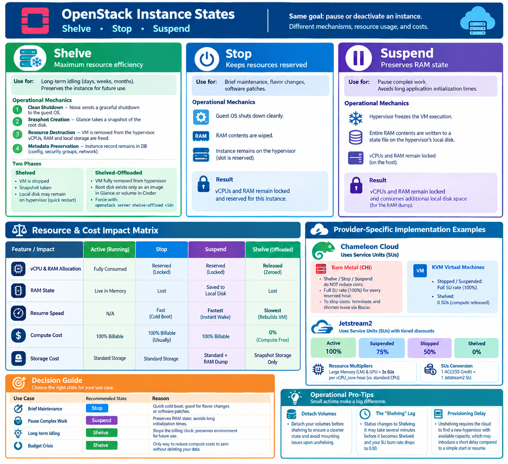

## 🎯 Learning Objectives

By the end of this section, you will be able to:
* **Distinguish** between the `Shelve`, `Stop`, and `Suspend` states in OpenStack.
* **Explain** the relationship between resource reservation and cloud billing.
* **Calculate** resource consumption (SUs) for various states across Chameleon Cloud and Jetstream2.
* **Determine** the optimal instance state for specific budget and performance constraints.

---

# Reducing Cost in Openstack

In cloud environments, maximizing utilization while controlling expenses is a core operational priority. OpenStack provides three distinct lifecycle mechanisms to pause or deactivate an active instance when it is not actively processing workloads: Shelve, Stop, and Suspend.
While all three options stop the virtual machine from running, they treat the underlying compute infrastructure, memory states, and billing footprints fundamentally differently. Understanding these nuances is critical for administrators trying to free up hardware resources and users attempting to reduce cloud costs.

## 1. Shelving an Instance

The Shelve state is OpenStack's ultimate mechanism for resource efficiency. It is designed for workloads that will remain idle for an extended period—days, weeks, or even months—but must be preserved for future use.

### Operational Mechanics

When you issue the `openstack server shelve` command, the Nova compute service coordinates a multi-step deprovisioning sequence:

   1. Clean Shutdown: Nova sends a graceful shutdown signal to the guest operating system.
   2. Snapshot Creation: Once powered down, Nova instructs the Glance image service to take a snapshot of the instance's root disk.
   3. Resource Destruction: The virtual machine is completely deleted from the hypervisor. Its allocated vCPUs, RAM, and local ephemeral storage are freed back into the cloud's resource pool.
   4. Metadata Preservation: The database entry for the instance remains active, tracking its configuration, security groups, and network bindings.

### The Two Phases of Shelving

OpenStack handles shelving in two distinct phases, governed by the cloud's configuration:

* Shelved: The VM is stopped, and a snapshot is taken, but the local disk files may temporarily remain on the hypervisor's local storage to facilitate a quick restart.
* Shelved-Offloaded: The instance is completely stripped from the hypervisor. Its root disk exists only as a compressed image in Glance or as a backend volume in Cinder. If not automated by a time-out in `nova.conf`, users can force this state immediately using:

`openstack server shelve-offload <instance-id>`

------------------------------

## 2. Technical Comparison: Shelve vs. Stop vs. Suspend

To choose the right state for your workload, you must understand how Stop and Suspend function in contrast to Shelve.

### Stopping an Instance (Power Off)

Issuing a `openstack server stop` mimics flipping the physical power switch on a server.

* Mechanics: The guest OS shuts down cleanly, and the RAM contents are wiped. However, the instance retains its slot on the hypervisor.
* Resource Impact: The physical vCPU and RAM allocations remain locked and reserved for this specific instance. No other user can claim that capacity, even though the VM is sitting dark.

### Suspending an Instance (Pause to Disk)

Issuing a `openstack server suspend` is identical to closing the lid on a laptop.

* Mechanics: The hypervisor hyper-freezes the execution of the virtual machine and writes the entire active contents of its RAM directly to a state file on the hypervisor’s local disk.
* Resource Impact: Like a stopped instance, its vCPU and RAM allocations remain locked on the host. Furthermore, it consumes additional local disk space on the hypervisor to hold the volatile memory dump.

------------------------------

## 3. The Economics of Instance States: Understanding the Costs

The fundamental differentiator between these states is how they affect **Resource Allocation** (physical capacity on the host) and **Cost Accumulation** (billing for public clouds or quota consumption for private clouds).

### The Core Principle: Resource Reservation
In a cloud environment, you aren't just paying for the CPU cycles your code uses; you are paying for the **reservation of hardware**. 

* **Stop and Suspend** leave the instance's vCPUs and RAM "pinned" to a specific hypervisor node. Because the cloud provider cannot sell that reserved capacity to another user, you continue to be billed for the compute resources, even if the VM is not running.
* **Shelving** (specifically Shelved-Offloaded) destroys the VM on the hypervisor and saves its state as an image. This releases all vCPU and RAM reservations back into the pool, effectively dropping your compute cost to zero.

### Resource & Cost Impact Matrix

| Feature / Impact | Active (Running) | Stop | Suspend | Shelve (Offloaded) |
| :--- | :--- | :--- | :--- | :--- |
| **vCPU & RAM Allocation** | Fully Consumed | Reserved (Locked) | Reserved (Locked) | Released (Zeroed) |
| **RAM State** | Live in Memory | Lost | Saved to Local Disk | Lost |
| **Resume Speed** | N/A | Fast (Cold Boot) | Fastest (Instant Wake) | Slowest (Rebuilds VM) |
| **Compute Cost** | 100% Billable | 100% Billable (Usually) | 100% Billable | **/bin/zsh.00 (Compute Free)** |
| **Storage Cost** | Standard Storage | Standard Storage | Standard + RAM Dump | Snapshot Storage Only |

---

### Provider-Specific Implementation Examples

Different cloud providers implement these costs differently based on their underlying hardware and billing models.

#### Chameleon Cloud

On [Chameleon Cloud](https://chameleoncloud.org/), resource consumption is measured in **Service Units (SUs)**. The cost of inactive states depends on the instance type: [1, 2]

* **Bare Metal Instances (CHI):** Lifecycle commands like Shelve, Stop, and Suspend **do not reduce costs**. Because a physical server is locked exclusively to your lease, you are billed the full SU rate (100%) for every wall-clock hour of your reservation. To stop costs, you must terminate the instance and shorten your lease via Blazar. [1, 3, 4]
* **KVM Virtual Machines:** Costs map to the physical resource footprint: [2, 5]
    * **Stopped / Suspended:** Full SU Rate (Resources remain pinned to the hypervisor).
    * **Shelved:** 0 SUs (Compute resources are released). [6]

#### 🚀 Jetstream2
Jetstream2 also uses **Service Units (SUs)**, but applies a tiered discount for inactive states to balance resource reservation with user costs:

* **Active:** 100% SU consumption.
* **Suspended:** 75% of normal SU value.
* **Stopped:** 50% of normal SU value.
* **Shelved:** 0% SU consumption.

**Important Notes for Jetstream2:**
* **Resource Multipliers:** Large Memory (LM) and GPU allocations cost **2x SUs** per vCPU_core-hour compared to standard CPU instances.
* **SUs Conversion:** For simplicity, 1 ACCESS Credit = 1 Jetstream2 SU.

---

## 4. Decision Guide: Choosing the Right State

To optimize both performance and budget, use the following guidelines:

| Use Case | Recommended State | Reason |
| :--- | :--- | :--- |
| **Brief Maintenance** | `Stop` | Quick cold boot; good for flavor changes or software patches. |
| **Pause Complex Work** | `Suspend` | Preserves RAM state; avoids long application initialization times. |
| **Long-term Idling** | `Shelve` | Stops the billing clock entirely; preserves environment for future use. |
| **Budget Crisis** | `Shelve` | The only way to reduce compute costs to zero without deleting your data. |

### 💡 Operational Pro-Tips for Cost Saving

* **Detach Volumes:** It is good practice to detach your volumes before shelving an instance to ensure a cleaner state and avoid potential mounting issues upon unshelving.
* **The "Shelving" Lag:** Note that shelving is not instantaneous. When you trigger the command, the status will change to `Shelving`. It may take several minutes to complete the snapshot and offload process before the status changes to `Shelved` and your SU burn rate drops to 0.00.
* **Provisioning Delay:** While shelving is free, remember that `unshelving` requires the cloud to find a new hypervisor with available capacity, which may introduce a short provisioning delay compared to a simple `start` or `resume`.

---

## References
[1] [https://chameleoncloud.org](https://chameleoncloud.org/learn/frequently-asked-questions/)
[2] [https://blog.chameleoncloud.org](https://blog.chameleoncloud.org/posts/chameleon-changelog-for-july-2025/)
[3] [https://chameleoncloud.readthedocs.io](https://chameleoncloud.readthedocs.io/en/latest/technical/reservations/index.html)
[4] [https://chameleoncloud.readthedocs.io](https://chameleoncloud.readthedocs.io/en/latest/user/project.html)
[5] [https://chameleoncloud.org](https://chameleoncloud.org/learn/frequently-asked-questions/)
[6] [https://chameleoncloud.org](https://chameleoncloud.org/learn/frequently-asked-questions/)

---

## ✍️ Self-Assessment

Test your knowledge of OpenStack instance states and their economic impacts.

**Questions:**
1. **The Reservation Principle:** Why does a `Stopped` or `Suspended` instance typically still incur compute costs?
2. **Cost Optimization:** Which state is the only one that reduces compute costs to zero in a multi-tenant KVM cloud?
3. **Provider Nuance:** On Chameleon Cloud CHI (Bare Metal), does executing the `shelve` command reduce the SU burn rate? Why or why not?
4. **Jetstream2 Pricing:** If a Jetstream2 instance is in the `Suspended` state, what percentage of the normal SU rate is charged?
5. **Resource Multipliers:** How does the SU cost differ between a standard CPU instance and a Large Memory (LM) instance on Jetstream2?

**Answers:**

Click to reveal answers

1. Because the vCPU and RAM remain reserved (pinned) on the hypervisor, preventing other users from using them.
2. `Shelve` (specifically Shelved-Offloaded).
3. No. Bare Metal instances are tied to a hardware lease; you are billed for the reservation of the physical server regardless of the instance state.
4. 75%.
5. LM and GPU instances cost 2x the SUs per vCPU_core-hour compared to standard CPU instances.

---

## 🛠️ Assignments

### Assignment 1: The Lifecycle Lab
Perform the following operations on a KVM instance and document the results:
1. Start an instance and verify its status.
2. `Stop` the instance $\rightarrow$ Check the status $\rightarrow$ Note the time to start it again.
3. `Suspend` the instance $\rightarrow$ Check the status $\rightarrow$ Note the time to resume it.
4. `Shelve` the instance $\rightarrow$ Wait for it to reach `Shelved` status $\rightarrow$ Note the time to `unshelve` it.
5. **Report**: Create a table comparing the "Time to Return to Active" for each state.

### Assignment 2: The Cloud Cost Calculator (Python Project)
**Goal:** Create a Python tool that calculates the total Service Units (SUs) consumed based on instance state and provider.

#### Project Requirements:
Your program should allow the user to select a provider and input the instance details to calculate the total SU burn over a specified period.

**1. Jetstream2 Module**
Implement the following logic:
*   **Inputs**: `vCPU_count`, `hours`, `instance_type` (Standard, LM, or GPU), and `state` (Active, Suspended, Stopped, Shelved).
*   **Logic**:
    *   Base Rate: 1 SU per vCPU_core-hour.
    *   Multiplier: 2x for LM or GPU.
    *   State Discount: Active (100%), Suspended (75%), Stopped (50%), Shelved (0%).
*   **Formula**: $\text{SUs} = (\text{vCPU} \times \text{Multiplier} \times \text{Hours}) \times \text{State Discount}$

**2. Chameleon Cloud KVM Module**
Implement the following logic:
*   **Inputs**: `vCPU_count`, `hours`, and `state` (Active, Suspended, Stopped, Shelved).
*   **Logic**: 
    *   SUs = $\text{vCPU} \times \text{Hours}$ if state is NOT `Shelved`.
    *   SUs = 0 if state is `Shelved`.

**3. Chameleon Cloud Bare Metal Module**
Implement the following logic:
*   **Inputs**: `lease_hours` and `instance_state`.
*   **Logic**:
    *   The cost is based on the lease, not the OpenStack state.
    *   SUs = $\text{Lease Rate} \times \text{lease\_hours}$ regardless of whether the instance is Active, Stopped, Suspended, or Shelved.

#### Deliverables:
*   A Python script (`cost_calc.py`) that implements these three modules.
*   A short test suite (or set of example inputs) demonstrating that the calculator handles state transitions and multipliers correctly.

