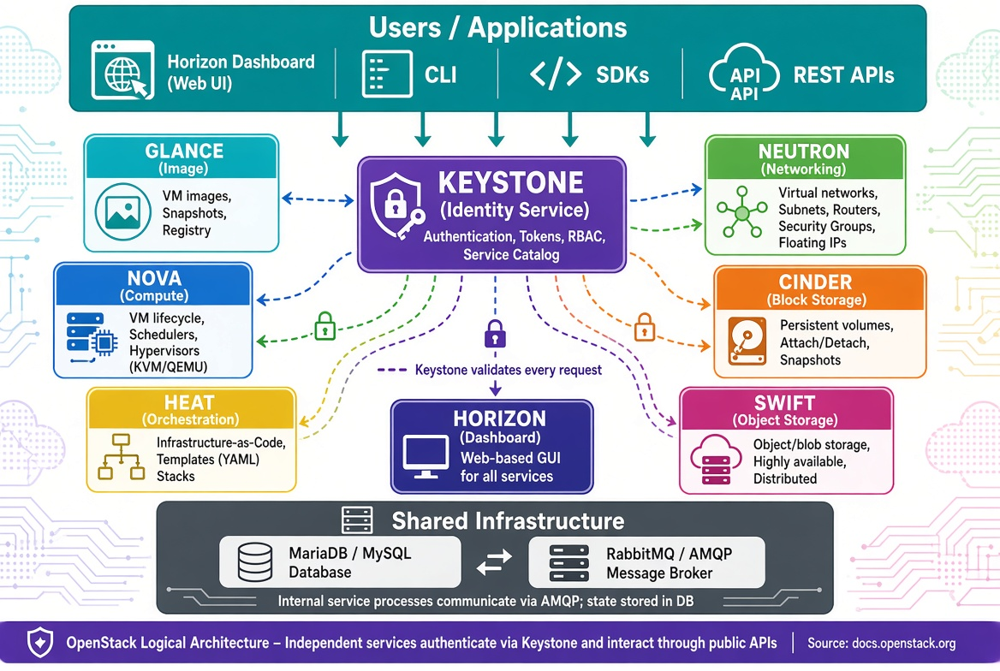

# Introduction to OpenStack: IaaS for the Enterprise

## Learning Objectives

!!! info "LearningObjectives"
    By the end of this chapter, participants will be able to:
    - Define OpenStack and explain its role as an Infrastructure-as-a-Service (IaaS) platform.
    - Analyze the core OpenStack services (Nova, Neutron, Cinder, Keystone, etc.) and their interactions.
    - Compare different deployment options, from development stacks (DevStack) to production-grade distributions (Kolla, TripleO).
    - Implement a basic OpenStack environment using DevStack.
    - Design a cloud architecture considering high availability, network topology, and storage backends.
    - Evaluate OpenStack's integration with container orchestration via Magnum.
    - Articulate the trade-offs between public cloud (AWS/GCP) and private cloud (OpenStack) for AI workloads.

## 1. OpenStack Fundamentals

OpenStack is an open-source cloud-computing platform that provides a comprehensive Infrastructure-as-a-Service (IaaS) solution. It enables the creation and management of virtual machines, storage, and networking resources across a data center or multiple sites.

The primary goal of OpenStack is to deliver capabilities similar to commercial public clouds (such as Amazon EC2 or Google Compute Engine) while giving operators full control over the underlying hardware, software stack, and governance. This makes it the ideal choice for organizations that require the elasticity of the cloud but must maintain strict data sovereignty or specific hardware requirements.

!!! info "Why this matters"
    For AI and Data Science, the "Cloud" is more than just a place to rent GPUs; it is about the **orchestration of resources**. When training a large-scale model, you need more than a single server; you need a coordinated pool of compute nodes, high-speed networking (like InfiniBand), and massive shared storage. OpenStack allows an organization to build a "Private AI Cloud" where they can provision 100 GPU-enabled VMs in seconds, ensuring that researchers have the resources they need without the unpredictable costs or data egress fees of public cloud providers.

## 2. Core Services Architecture

OpenStack is not a single monolithic application but a modular set of services that communicate via RESTful APIs, a shared message bus (RabbitMQ), and a central database (MariaDB).

### The Orchestration of Resources

The platform has evolved from a pure VM-provisioning tool into a heterogeneous orchestrator. While traditional **Virtualization** uses hypervisors like KVM to run instances, OpenStack also supports **Bare-Metal** provisioning through the **Ironic** service. Ironic is critical for High-Performance Computing (HPC) and AI workloads that cannot tolerate hypervisor overhead and require direct GPU passthrough. Additionally, the **Magnum** service provides Container Orchestration-as-a-Service (COaaS), allowing users to provision managed Kubernetes clusters using the same API surface as virtual machines.

### The Core Service Stack

To understand how OpenStack operates, one must understand the specific roles of its primary services. **Keystone** serves as the central identity service, handling all authentication and token issuance. Once authenticated, users interact with **Nova**, the primary compute service responsible for the lifecycle of virtual machines and bare-metal instances.

Networking is managed by **Neutron**, which provisions virtual networks, subnets, and security groups. For storage, OpenStack offers two primary paths: **Cinder** provides persistent block storage volumes that can be attached to instances, while **Swift** provides a scalable, S3-compatible object storage system for unstructured data.

The platform is supported by **Glance**, which acts as the image registry for VM snapshots, and **Heat**, which provides template-driven orchestration to automate the deployment of complex environments. For operational visibility, **Ceilometer** collects usage and metering data, while **Horizon** provides the web-based dashboard for users and administrators.



| Service | Acronym | Primary Function | Key API |
| :--- | :--- | :--- | :--- |
| **Compute** | **Nova** | Lifecycle management of virtual machines and bare-metal instances. | `nova-api` |
| **Networking** | **Neutron** | Provisioning of virtual networks, subnets, routers, and security groups. | `neutron-api` |
| **Block Storage** | **Cinder** | Management of persistent block devices (volumes) attached to instances. | `cinder-api` |
| **Object Storage** | **Swift** | Scalable, redundant storage for unstructured data (S3-compatible). | `swift-api` |
| **Identity** | **Keystone** | Central authentication, token issuance, and project/role management. | `keystone-api` |
| **Image Service** | **Glance** | Storage and retrieval of VM images and snapshots. | `glance-api` |
| **Orchestration** | **Heat** | Template-driven automation of OpenStack resources. | `heat-api` |
| **Telemetry** | **Ceilometer** | Collection of usage and metering data for billing and monitoring. | `ceilometer-api` |
| **Dashboard** | **Horizon** | Web-based user interface for administrators and end-users. | - |

!!! info "Why this matters"
    The modularity of OpenStack is its greatest strength. If an organization only needs compute and networking, they can deploy Nova and Neutron. If they need a massive data lake for AI training sets, they can integrate Swift or a Ceph backend for Cinder. This "plug-and-play" architecture allows a private cloud to grow from a few servers to thousands of nodes without a complete redesign.

### Service Interaction: Launching an Instance

The power of OpenStack is best seen during the launch of a new VM. The process begins with **Keystone** authenticating the request. **Nova** then coordinates with **Neutron** to allocate a network port and IP address, and asks **Cinder** to provide a boot volume. Finally, **Nova** selects a hypervisor and instructs the `nova-compute` agent to launch the instance using a disk image retrieved from **Glance**. Throughout this process, the state is recorded in the database and metered by **Ceilometer**.

## 3. Deployment and Operations

Depending on the scale and purpose, OpenStack can be deployed using various tools and distributions.

### Choosing the Right Deployment Tool

For those learning the platform or developing new features, **DevStack** is the fastest path to a working cloud, though it is limited to a single-node installation. For proof-of-concept environments, **Packstack** provides a simpler RPM-based installation driven by an answer file.

In production environments, the requirements shift toward stability and immutability. **TripleO** is used for full-scale production on bare metal using Heat templates. However, the modern industry preference has shifted toward **Kolla / Kolla-Ansible**. By packing each OpenStack service into its own Docker container, Kolla eliminates the "dependency hell" associated with Python packages on the host system. Updating a service becomes a matter of pulling a new image and restarting the container.

| Tool / Distribution | Typical Use-Case | Characteristics |
| :--- | :--- | :--- |
| **DevStack** | Development and learning | Small, single-node, installs latest master code. |
| **Packstack** | Proof-of-concept | RPM/YUM based; driven by a simple answer file. |
| **TripleO** | Full-scale production | Uses Heat templates to deploy OpenStack on bare metal. |
| **Kolla / Kolla-Ansible** | Container-native | Packs each service into Docker containers for immutability. |
| **MicroStack** | Edge / Desktop | Single-node, snap-based installer for Ubuntu. |

!!! tip "The Modern Choice: Kolla"
    For production environments, **Kolla-Ansible** is highly recommended. By running OpenStack services *inside* containers, it solves the "dependency hell" of installing dozens of Python packages on the host. Updating a service becomes as simple as pulling a new image and restarting the container.

### Implementing a Minimal Environment with DevStack

To get started with a development environment, follow these steps on a clean Ubuntu 22.04 VM:

```bash
# 1. Prepare a clean Ubuntu 22.04 VM
sudo apt update && sudo apt install -y git

# 2. Clone DevStack
git clone https://opendev.org/openstack/devstack.git
cd devstack

# 3. Configure basic credentials in local.conf
cat >local.conf <<EOF
[[local|localrc]]
ADMIN_PASSWORD=secretadmin
DATABASE_PASSWORD=secretdb
RABBIT_PASSWORD=secretrabbit
SERVICE_PASSWORD=secretservice
EOF

# 4. Run the installer
./stack.sh
```

### Production Design Considerations

Designing a production-grade cloud requires a focus on several critical domains. **Hardware Sizing** must balance vCPU overcommit ratios (typically 2:1) with physical core availability. **Network Topology** requires a choice between flat networks and overlays like VXLAN, where proper MTU configuration is essential to avoid packet fragmentation.

**High Availability (HA)** is achieved by duplicating the control plane components—API services, the message bus, and the database—behind load balancers using tools like Pacemaker or keepalived. For the **Storage Backend**, operators must choose between the raw speed of local LVM or the distributed resilience of Ceph. Finally, a robust **Security Model** mandates TLS for all API endpoints and strict RBAC via Keystone.

::: warning "The Control Plane Bottleneck"
    A common mistake in OpenStack design is under-provisioning the control plane (Keystone and Nova API). If the API services cannot respond quickly, the entire cloud feels slow, even if the compute nodes have plenty of free resources. Always prioritize high-performance SSDs for the MariaDB and RabbitMQ nodes.
:::

## Assignments

!!! note "Assignment 1: DevStack Deployment"
    Deploy a minimal OpenStack environment using DevStack on a Ubuntu VM. Log into the Horizon dashboard and create a private network and a small instance.
    
    ??? tip "Solution: DevStack"
        Follow the provided installation steps. Once `./stack.sh` completes, use the provided Horizon URL and the `ADMIN_PASSWORD` from your `local.conf` to log in.

!!! note "Assignment 2: Service Interaction Mapping"
    Draw a sequence diagram showing the interaction between Keystone, Nova, Neutron, and Glance when a user launches a VM from a template.
    
    ??? tip "Solution: Interaction Map"
        The flow should start with the User $\rightarrow$ Keystone (Auth) $\rightarrow$ Nova (API) $\rightarrow$ Glance (Image) $\rightarrow$ Neutron (Network) $\rightarrow$ Nova (Compute/Hypervisor).

!!! note "Assignment 3: Capacity Planning"
    Given a requirement to host 100 VMs, each requiring 2 vCPUs and 4GB RAM, calculate the minimum physical hardware needed, assuming a 2:1 vCPU overcommit ratio and 10% overhead for the control plane.
    
    ??? tip "Solution: Capacity Calculation"
        Total vCPUs = 200. With 2:1 overcommit, you need 100 physical cores. Total RAM = 400GB + 10% = 440GB.

## References

- Official OpenStack Documentation: [docs.openstack.org](https://docs.openstack.org)
- OpenStack Architecture Guide: [docs.openstack.org/arch-design/](https://docs.openstack.org/arch-design/)
- Kolla-Ansible Quickstart: [docs.openstack.org/kolla-ansible/latest/user/quickstart.html](https://docs.openstack.org/kolla-ansible/latest/user/quickstart.html)

## Self-Assessment

!!! tip "Self-Assessment"
    Test your knowledge by expanding the questions below.

??? question "What is OpenStack and what is its primary goal?"
    OpenStack is an open-source IaaS platform. Its goal is to provide a self-service cloud environment (similar to AWS or GCP) while allowing the operator to maintain full control over the underlying physical and software infrastructure.

??? question "Explain the role of Nova, Neutron, and Cinder in OpenStack."
    **Nova** manages the lifecycle of compute instances (VMs/Bare Metal). **Neutron** provides virtual networking (subnets, routers, security groups). **Cinder** provides persistent block storage volumes that can be attached to instances.

??? question "What is Ironic and how does it extend OpenStack's capabilities?"
    Ironic is the bare-metal provisioning service. It allows OpenStack to manage physical servers as if they were virtual instances, enabling high-performance workloads to run without the overhead of a hypervisor.

??? question "What is Magnum and how does it integrate container orchestration?"
    Magnum provides Container Orchestration-as-a-Service (COaaS). It allows users to provision managed Kubernetes or Docker Swarm clusters as OpenStack resources, utilizing Nova for compute and Neutron for networking.

??? question "Compare Public Cloud vs Private Cloud (OpenStack) specifically for AI model training."
    Public clouds offer instant scalability and managed GPU services. However, Private clouds (OpenStack) provide superior data sovereignty (crucial for sensitive datasets), lower long-term costs for 24/7 high-utilization workloads, and the ability to use specialized hardware (e.g., custom FPGA or InfiniBand) that public clouds may not expose.

??? question "Why is Keystone the first point of contact for every OpenStack API call?"
    Because OpenStack is a distributed system of independent services, there is no single "gateway". Keystone provides a centralized identity and token service. Every other service (Nova, Neutron, etc.) validates the user's token against Keystone before executing any command, ensuring consistent RBAC across the entire cloud.

??? question "What is the purpose of the 'Heat' orchestration service?"
    Heat allows users to define their entire infrastructure (networks, volumes, and VMs) as a single template (YAML). Instead of manually creating each resource via the dashboard, Heat automates the deployment, ensuring the environment is reproducible and consistent.
