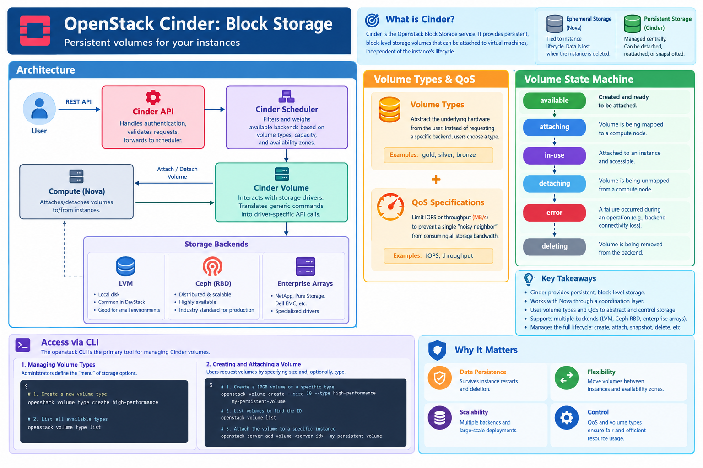

# OpenStack Cinder: Block Storage

## Learning Objectives

!!! info "Learning Objectives"
    By the end of this section, you will be able to:
    - Explain the architecture of Cinder and its relationship with Nova.
    - Analyze the Cinder volume state machine and lifecycle.
    - Implement volume types and Quality of Service (QoS) specifications.
    - Manage block storage volumes, snapshots, and extensions using the OpenStack CLI.
    - Automate volume management using the OpenStack SDK.
    - Evaluate different storage backends, specifically LVM and Ceph RBD.

## Overview

**Cinder** is the OpenStack Block Storage service. It provides persistent block-level storage volumes that can be attached to virtual machines, allowing data to persist independently of the instance's lifecycle. Unlike ephemeral storage, which is tied to the lifecycle of a specific compute node and instance, Cinder volumes are managed centrally and can be migrated across different compute nodes.

## Design and Architecture

Cinder operates as a coordination layer between the user's request for storage and the actual physical or virtual storage backend.



### Architectural Components

- **Cinder API**: The RESTful entry point for all volume requests. It handles authentication and validates requests before passing them to the scheduler.
- **Cinder Scheduler**: The brain of the operation. It filters and weighs available backends based on requested volume types, capacity, and availability zones to determine the optimal placement for a volume.
- **Cinder Volume**: The service that interacts with the storage drivers. It translates generic Cinder commands (e.g., "create volume") into driver-specific API calls for the backend.
- **Storage Backends**: Cinder uses a driver-based architecture to support diverse storage technologies:
    - **LVM (Logical Volume Manager)**: Typically used in DevStack or small environments. It carves volumes out of a local disk on the storage node.
    - **Ceph (RBD)**: The industry standard for production OpenStack. It provides a distributed, scalable, and highly available storage pool using the Rados Block Device (RBD) protocol.
    - **Enterprise Arrays**: Specialized drivers for NetApp, Pure Storage, Dell EMC, etc.

### Volume Types and Quality of Service (QoS)

Cinder uses **Volume Types** to abstract the underlying hardware from the user. Instead of requesting a "Ceph SSD volume," a user requests a volume of type `high-performance`.

1.  **Volume Types**: Admin-defined labels (e.g., `gold`, `silver`, `bronze`) that map to specific backends.
2.  **QoS Specs**: Administrators can attach QoS specifications to these types to limit IOPS (Input/Output Operations Per Second) or throughput (MB/s), ensuring that a single "noisy neighbor" VM does not consume all storage bandwidth.

### The Volume State Machine

Understanding the lifecycle states is critical for troubleshooting and automation:

- **available**: The volume is created and ready to be attached.
- **attaching/detaching**: Transitional states while the volume is being mapped to or unmapped from a compute node.
- **in-use**: The volume is attached to an instance and accessible as a block device.
- **error**: The volume encountered a failure during an operation (e.g., backend connectivity loss).
- **deleting**: The volume is being removed from the backend.

!!! info "Ephemeral vs. Persistent Storage"
    - **Ephemeral Storage**: Provided by Nova. It resides on the local disk of the compute node. If the instance is deleted or the node fails, the data is lost. It is optimized for temporary files, swap, and caches.
    - **Persistent Storage (Cinder)**: Managed by Cinder. It exists independently of the instance. A volume can be detached from one VM and attached to another, or snapshotted for backup, preserving the data across instance lifecycles.

## Access via CLI

The `openstack` CLI is the primary tool for managing Cinder volumes.

### Managing Volume Types

Administrators define the "menu" of storage options available to users.

```bash
# 1. Create a new volume type
openstack volume type create high-performance

# 2. List all available types
openstack volume type list
```

### Creating and Attaching a Volume

Users request volumes by specifying size and, optionally, the volume type.

```bash
# 1. Create a 10GB volume of a specific type
openstack volume create --size 10 --type high-performance my-persistent-volume

# 2. List volumes to find the ID
openstack volume list

# 3. Attach the volume to a specific instance
openstack server add volume <server-id> my-persistent-volume
```

### Volume Lifecycle Operations

Cinder supports snapshots, clones, and extensions to manage data growth.

```bash
# 1. Create a snapshot of a volume
openstack volume snapshot create --volume my-persistent-volume my-snapshot

# 2. Create a new volume (clone) from a snapshot
openstack volume create --snapshot my-snapshot volume-from-snapshot

# 3. Extend an existing volume (e.g., increase to 20GB)
openstack volume set --size 20 my-persistent-volume

# 4. Delete a volume (must be detached first)
openstack volume delete my-persistent-volume
```

## Access via Python Libraries

### Using OpenStack SDK (`openstacksdk`)

The OpenStack SDK allows for complex orchestration, such as automatically expanding volumes when disk usage reaches a threshold.

```python
import openstack

# Initialize connection
conn = openstack.connect(cloud='my-cloud')

# 1. Create a volume with a specific type
volume = conn.block_storage.create_volume(
    name='sdk-volume',
    size=10,
    volume_type='high-performance'
)
print(f"Created volume: {volume.id}")

# 2. Attach volume to server
server = conn.compute.get_server('my-server-id')
conn.compute.create_volume_attachment(
    server=server,
    volumeId=volume.id
)

# 3. Example: Extend volume size
conn.block_storage.update_volume(volume.id, size=20)
print(f"Extended volume {volume.id} to 20GB")
```

### Using Apache Libcloud

Libcloud provides a vendor-neutral abstraction. While it is less feature-rich for OpenStack-specific extensions (like Volume Types), it is excellent for writing scripts that must work across multiple cloud providers.

```python
from apache.libcloud.compute.types import Provider
from apache.libcloud.compute.providers.openstack.v3 import LibcloudOpenStackDriver

# Setup driver
driver = LibcloudOpenStackDriver(
    user='admin', 
    auth_url='http://...', 
    tenant_id='...', 
    api_version=3
)

# Libcloud primarily handles the compute side; 
# for deep Cinder integration, the OpenStack SDK is recommended.
```

## Troubleshooting and Common Pitfalls

### Volume Stuck in 'Error' or 'Deleting' State
Occasionally, a backend failure prevents a volume from completing a state transition. This often results in the volume being stuck in `error` or `deleting`.

- **Cause**: Network partition between the Cinder-volume service and the storage backend, or a failed API call to the backend.
- **Resolution**: An administrator can manually reset the volume state using the Cinder CLI (on the controller node):
  ```bash
  # Reset volume state to 'available'
  cinder reset-state --state available <volume-id>
  ```

### Filesystem Expansion
Increasing the volume size via `openstack volume set --size` only increases the **block device** size. The operating system inside the VM still sees the old partition size.

- **Resolution**: After extending the volume, the user must resize the filesystem inside the VM:
  ```bash
  # Example for XFS filesystem
  sudo xfs_growfs /mnt/cinder_volume
  ```

## Summary Checklist

- [ ] Explain the roles of the Cinder API, Scheduler, and Volume services.
- [ ] Compare LVM and Ceph RBD storage backends.
- [ ] Describe the volume state transition from `available` to `in-use`.
- [ ] Implement Volume Types and QoS to manage performance tiers.
- [ ] Create, attach, snapshot, and extend a volume using the CLI.
- [ ] Automate volume lifecycle management using the OpenStack SDK.
- [ ] Resolve volumes stuck in `error` state using `reset-state`.

## Assignments

!!! note "Assignment.1: Volume Tiering"
    Create two volume types: `ssd-gold` and `hdd-silver`. Create a 5GB volume of type `ssd-gold` and attach it to a server.

??? tip "Solution: Volume Tiering"
    ```bash
    openstack volume type create ssd-gold
    openstack volume type create hdd-silver
    openstack volume create --size 5 --type ssd-gold exercise-gold-vol
    openstack server add volume <server-id> exercise-gold-vol
    ```

!!! note "Assignment.2: Disaster Recovery Workflow"
    Create a volume, take a snapshot of it, delete the original volume, and then restore the volume from the snapshot.

??? tip "Solution: Disaster Recovery Workflow"
    ```bash
    openstack volume create --size 2 backup-vol
    openstack volume snapshot create --volume backup-vol backup-snap
    openstack server remove volume <server-id> backup-vol
    openstack volume delete backup-vol
    openstack volume create --snapshot backup-snap restored-vol
    ```

!!! note "Assignment.3: Automated Volume Expansion"
    Write a Python script using `openstacksdk` that finds all volumes smaller than 10GB and extends them to 10GB.

??? tip "Solution: Automated Volume Expansion"
    ```python
    import openstack
    conn = openstack.connect(cloud='my-cloud')
    for vol in conn.block_storage.volumes():
        if vol.size < 10:
            conn.block_storage.update_volume(vol.id, size=10)
            print(f"Extended {vol.name} to 10GB")
    ```

## References

- [OpenStack Cinder Documentation](https://docs.openstack.org/cinder/latest/)
- [OpenStack SDK Documentation](https://docs.openstack.org/openstacksdk/latest/)
- [Ceph RBD Documentation](https://docs.ceph.com/en/latest/rados/rbd/)

## Self-Evaluation

??? note "What is the primary difference between a Cinder volume and Nova ephemeral storage?"
    Cinder volumes are persistent and exist independently of any VM, whereas ephemeral storage is tied to the VM's lifecycle and is deleted when the VM is destroyed.

??? note "How do Volume Types and QoS Specs improve storage management?"
    They allow administrators to create performance tiers (e.g., gold, silver) and enforce hardware-level constraints (IOPS, throughput), preventing "noisy neighbor" issues and abstracting backend complexity from the user.

??? note "What happens at the OS level when a Cinder volume is extended via the CLI?"
    The underlying block device is enlarged, but the filesystem within the VM remains at the original size. The user must manually run a filesystem resize tool (like `xfs_growfs` or `resize2fs`) to utilize the new space.

??? note "In which state must a volume be to be deleted?"
    A volume must be in the `available` state (detached from all instances) before it can be deleted.
