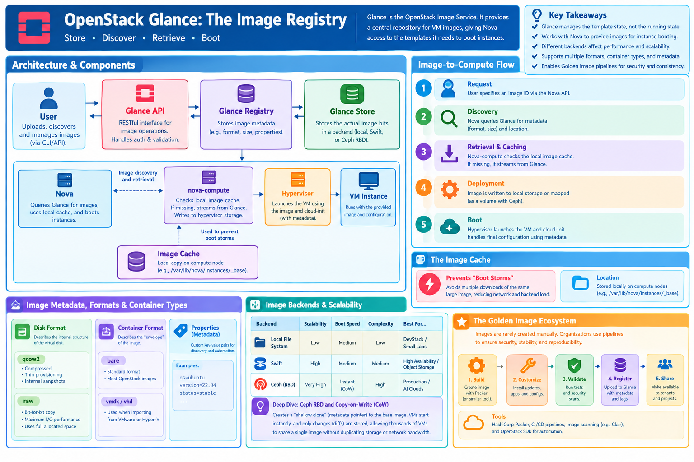

# OpenStack Glance: The Image Registry

## Learning Objectives

!!! info "Learning Objectives"
    By the end of this section, you will be able to:
    - Explain the role of Glance in the OpenStack ecosystem and its detailed interaction with Nova.
    - Analyze the impact of different image backends (Local, Swift, Ceph RBD) on boot performance and scalability.
    - Differentiate between image formats (QCOW2, RAW) and container formats (Bare, VMDK).
    - Manage images, tags, and metadata using advanced OpenStack CLI patterns.
    - Automate image registration and audit pipelines using the OpenStack SDK with industry-standard patterns.
    - Describe the lifecycle of a "Golden Image" pipeline and the role of tools like HashiCorp Packer.

## Overview

**Glance** is the OpenStack Image Service. It acts as a central repository for virtual machine images, providing a way to store, discover, and retrieve the disk images used to boot instances across the cloud.

While other services manage the *running* state of the cloud (Nova for compute, Neutron for networking), Glance manages the *template* state. It ensures that every compute node in a massive cluster has access to the exact same OS image, ensuring consistency and reproducibility across the infrastructure.



## Design and Architecture

Glance does not execute the images; it provides the "blueprint" (the virtual disk) that Nova uses to instantiate a virtual machine.

### The Image-to-Compute Flow

The process of launching a VM from an image involves a coordinated sequence between services:

1. **Request**: The user specifies an image ID via the Nova API.
2. **Discovery**: Nova queries Glance for the image's metadata (format, size) and its location in the backend.
3. **Retrieval & Caching**: Nova's compute agent (`nova-compute`) checks its **local image cache**. If the image is missing, it streams the image from the Glance backend.
4. **Deployment**: The image is written to the hypervisor's local storage or, in the case of shared storage (Ceph), mapped as a volume.
5. **Boot**: The hypervisor launches the VM, and `cloud-init` handles the last-mile configuration using metadata passed from Nova.

### The Image Cache

To prevent **"Boot Storms"**—where hundreds of VMs request the same multi-gigabyte image simultaneously, saturating the network—`nova-compute` implements an **Image Cache**.

Images are stored locally on the compute node (typically in `/var/lib/nova/instances/_base`). When a second VM is launched from the same image, Nova uses the local cached copy instead of downloading it again from Glance, drastically reducing boot times and alleviating pressure on the storage backend.

### Image Backends and Scalability

The choice of backend fundamentally changes the performance and reliability characteristics of the cloud.

| Backend | Scalability | Boot Speed | Complexity | Best For... |
| :--- | :--- | :--- | :--- | :--- |
| **Local File System** | Low | Medium | Low | DevStack / Small Labs |
| **Swift** | High | Medium | Medium | High Availability / Object Storage |
| **Ceph (RBD)** | Very High | Instant (CoW) | High | Production / AI Clouds |

#### Deep Dive: Ceph RBD and Copy-on-Write (CoW)
In production environments, **Ceph RBD** is the preferred backend. Instead of streaming a massive image to every compute node, Ceph leverages **Copy-on-Write (CoW) cloning**.

When Nova boots a VM from a Ceph-backed image, it creates a "shallow clone"—a metadata pointer to the original base image. The VM starts almost instantaneously. As the VM writes data, Ceph only stores the *changes* (diffs) in a new block. This allows thousands of VMs to share a single base image without duplicating storage or wasting network bandwidth.

### Metadata and Formats

Glance stores the image bits along with critical metadata that informs the hypervisor how to handle the disk.

- **Disk Format**: Describes the internal structure of the virtual disk.
    - `qcow2`: Compressed, supports thin provisioning and internal snapshots.
    - `raw`: A bit-for-bit copy; provides maximum I/O performance but consumes full allocated space.
- **Container Format**: Describes the "envelope" or wrapper of the image.
    - `bare`: The standard format for most OpenStack images.
    - `vmdk` / `vhd`: Used when importing images from VMware or Hyper-V.
- **Properties**: Custom key-value pairs (e.g., `os=ubuntu`, `version=22.04`, `status=stable`) used for discovery and automation.

## The Golden Image Ecosystem

In enterprise and AI environments, images are rarely created manually. Organizations implement **Golden Image Pipelines** to ensure security, stability, and reproducibility.

### The Concept
A "Golden Image" is a pre-configured, hardened, and tested VM image that includes all necessary dependencies (e.g., NVIDIA CUDA drivers for AI, monitoring agents, and security patches). This eliminates "configuration drift" where different VMs have slightly different software versions.

### Automation with HashiCorp Packer
**HashiCorp Packer** is the industry-standard tool for this workflow. It automates the a process:
1. **Build**: Packer spins up a temporary VM.
2. **Provision**: It runs shell scripts or Ansible playbooks to install software and harden the OS.
3. **Generalize**: It cleans the image (e.g., removing SSH host keys) to make it a generic template.
4. **Publish**: It converts the disk to QCOW2 and uploads it to Glance via the OpenStack API.

**Workflow**: `Packer (Build) $\rightarrow$ Glance (Register) $\rightarrow$ Nova (Deploy)`

## Access via CLI

The `openstack` CLI allows for rapid management and auditing of the image library.

### Image Registration and Management
```bash
# 1. Upload an image from a local file
openstack image create "Ubuntu 22.04" \
  --file ubuntu-22.04.qcow2 \
  --disk-format qcow2 \
  --container-format bare \
  --public

# 2. Create an image from an existing volume (efficient for large images)
openstack image create "Volume-Backup" --volume <volume-id>

# 3. Filter images using custom properties
openstack image list --properties os_distro=ubuntu

# 4. Tag an image for versioning or status
openstack image set --property status=stable "Ubuntu 22.04"

# 5. Delete an image
openstack image delete <image-id>
```

## Access via Python Libraries

### Using OpenStack SDK (`openstacksdk`)

For production automation, use `clouds.yaml` to manage credentials. This separates sensitive authentication data from your application logic.

```python
import openstack

# Initialize connection using clouds.yaml profile 'prod-cloud'
conn = openstack.connect(cloud='prod-cloud')

# 1. Memory-efficient Image Upload (Streaming)
# Passing a file handle instead of a path prevents loading 
# the entire multi-gigabyte image into RAM.
with open('/path/to/large-image.qcow2', 'rb') as f:
    image = conn.image.create_image(
        name='automation-image-v1',
        filename=f, 
        disk_format='qcow2',
        container_format='bare',
        visibility='public'
    )
print(f"Uploaded image: {image.id}")

# 2. Finding images by property
images = conn.image.find_images(os_distro='ubuntu')
for img in images:
    print(f"Found Ubuntu image: {img.name}")
```

### Using Apache Libcloud

Libcloud provides a vendor-neutral abstraction, useful for writing scripts that must target multiple cloud providers.

```python
from apache.libcloud.compute.providers.openstack.v3 import LibcloudOpenStackDriver

driver = LibcloudOpenStackDriver(...)

# List available images
images = driver.list_images()
for img in images:
    print(f"Image Name: {img.name}, ID: {img.id}")
```

## Summary Checklist

- [ ] Explain the sequence of image retrieval from Glance to the Nova hypervisor.
- [ ] Contrast the performance and scalability of Local, Swift, and Ceph RBD backends.
- [ ] Explain the mechanism of Copy-on-Write (CoW) cloning in Ceph.
- [ ] Differentiate between `disk_format` and `container_format`.
- [ ] Describe the "Golden Image" pipeline and the role of HashiCorp Packer.
- [ ] Implement image filtering and metadata management via CLI.
- [ ] Automate image registration using streaming uploads in the OpenStack SDK.

## Assignments

!!! note "Assignment.1: Advanced Image Registration"
    Upload a local image and assign it three custom properties: `app=nginx`, `env=dev`, and `version=1.0`. Then, use the CLI to list only images that match `app=nginx`.
    
    ??? tip "Solution: Advanced Image Registration"
        ```bash
        openstack image create "nginx-dev" \
          --file nginx.qcow2 --disk-format qcow2 --container-format bare \
          --property app=nginx --property env=dev --property version=1.0 --public

        openstack image list --property app=nginx
        ```

!!! note "Assignment.2: The SDK Guardian"
    Write a Python script that checks if an image with the property `status=stable` exists. If it does not, upload a fallback image from a local path.
    
    ??? tip "Solution: The SDK Guardian"
        ```python
        import openstack
        conn = openstack.connect(cloud='my-cloud')
        
        stable_images = list(conn.image.find_images(status='stable'))
        if not stable_images:
            print("No stable image found. Uploading fallback...")
            conn.image.create_image(name="fallback", filename="fallback.qcow2", 
                                    disk_format='qcow2', container_format='bare')
        else:
            print(f"Stable image found: {stable_images[0].name}")
        ```

!!! note "Assignment.3: Image Audit Script"
    Write a Python script using `openstacksdk` that audits the image registry. The script should identify and print the names of all images that are missing the `os_distro` property.
    
    ??? tip "Solution: Image Audit"
        ```python
        import openstack
        conn = openstack.connect(cloud='my-cloud')
        for img in conn.image.images():
            if 'os_distro' not in img.properties:
                print(f"Missing os_distro: {img.name}")
        ```

## References

- [OpenStack Glance Documentation](https://docs.openstack.org/glance/latest/)
- [OpenStack SDK Reference](https://docs.openstack.org/openstacksdk/latest/)
- [Cloud-init Documentation](https://cloud-init.readthedocs.io/)
- [HashiCorp Packer Documentation](https://developer.hashicorp.com/packer/docs)

## Self-Evaluation

??? note "Why is Ceph RBD's 'copy-on-write' mechanism more efficient than Swift or Local storage for large-scale VM deployment?"
    In Swift or Local storage, the image must be copied from the backend to the compute node's local disk before the VM can start. With Ceph RBD, Nova creates a thin clone (metadata pointer). The VM reads from the original image and only writes changes to its own thin layer, eliminating the need for massive data transfers during boot.

??? note "In what scenario would a RAW image be preferable to a QCOW2 image?"
    A RAW image is preferable when maximum disk I/O performance is required and storage space is not a constraint (e.g., for a high-transaction database). Since it lacks the metadata layer of QCOW2, it avoids the translation overhead, providing faster raw read/write access.

??? note "What is the purpose of the Nova Image Cache, and what happens if it is disabled?"
    The cache stores frequently used images on the local disk of the compute node. If disabled, Nova must download the image from Glance every time a VM is launched, leading to significantly slower boot times and potential network congestion (Boot Storms).

??? note "If an image is marked as 'private' in Glance, who can use it?"
    Only the project that created the image and cloud administrators can see or use it. Public images are available to every project in the cloud.

??? note "How does a 'Golden Image' pipeline improve infrastructure reliability?"
    By using tools like Packer to automate the build, harden the OS, and install dependencies *before* the image is registered in Glance, organizations ensure that every deployed VM is identical, secure, and pre-validated, eliminating "configuration drift" during manual setups.
