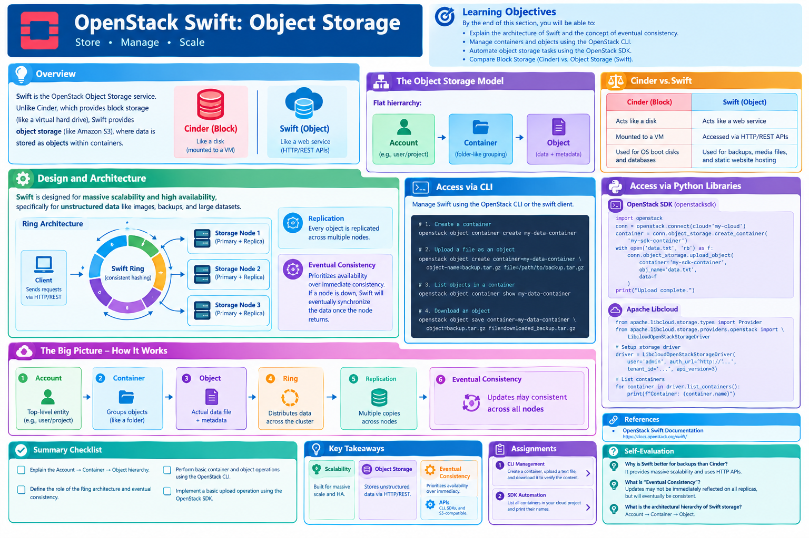

# OpenStack Swift: Object Storage

## Learning Objectives

!!! info "Learning Objectives"
    By the end of this section, you will be able to:
    - Explain the architecture of Swift and the concept of eventual consistency.
    - Manage containers and objects using the OpenStack CLI.
    - Automate object storage tasks using the OpenStack SDK.
    - Compare Block Storage (Cinder) vs. Object Storage (Swift).

## Overview

**Swift** is the OpenStack Object Storage service. Unlike Cinder, which provides block storage (like a virtual hard drive), Swift provides object storage (like Amazon S3), where data is stored as objects within containers.



## Core Sections

### Design and Architecture

Swift is designed for massive scalability and high availability, specifically for unstructured data like images, backups, and large datasets.

#### The Object Storage Model

In Swift, data is organized in a flat hierarchy: **Account $\rightarrow$ Container $\rightarrow$ Object**.

- **Account**: The top-level entity (e.g., a user or project).
- **Container**: A folder-like grouping of objects.
- **Object**: The actual data file, along with its metadata.

#### Ring Architecture and Eventual Consistency

Swift uses a "Ring" architecture (consistent hashing) to distribute data across a cluster of commodity servers without needing a central metadata database.

- **Replication**: Every object is replicated across multiple nodes.
- **Eventual Consistency**: Swift prioritizes availability over immediate consistency. If a node is down, Swift will eventually synchronize the data once the node returns.

!!! info "Cinder vs. Swift"
    - **Cinder (Block)**: Acts like a disk. It is mounted to a VM. Used for OS boot disks and databases.
    - **Swift (Object)**: Acts like a web service. It is accessed via HTTP/REST APIs. Used for backups, media files, and static website hosting.

### Access via CLI

Swift can be managed via the `openstack` CLI or the dedicated `swift` client.

#### Container and Object Management

```bash
# 1. Create a container
openstack object container create my-data-container

# 2. Upload a file as an object
openstack object create container=my-data-container object-name=backup.tar.gz file=/path/to/backup.tar.gz

# 3. List objects in a container
openstack object container show my-data-container

# 4. Download an object
openstack object save container=my-data-container object=backup.tar.gz file=downloaded_backup.tar.gz
```

### Access via Python Libraries

The SDK provides a clean interface to manage Swift containers and objects.

#### Using OpenStack SDK (`openstacksdk`)

```python
import openstack

# Initialize connection
conn = openstack.connect(cloud='my-cloud')

# Create a container
container = conn.object_storage.create_container('my-sdk-container')

# Upload an object
with open('data.txt', 'rb') as f:
    conn.object_storage.upload_object(
        container='my-sdk-container',
        obj_name='data.txt',
        data=f
    )
print("Upload complete.")
```

#### Using Apache Libcloud

Libcloud's support for Swift is handled through its storage abstraction layer, providing a consistent way to interact with S3-compatible services.

```python
from apache.libcloud.storage.types import Provider
from apache.libcloud.storage.providers.openstack import LibcloudOpenStackStorageDriver

# Setup storage driver
driver = LibcloudOpenStackStorageDriver(
    user='admin', 
    auth_url='http://...', 
    tenant_id='...', 
    api_version=3
)

# List containers
for container in driver.list_containers():
    print(f"Container: {container.name}")
```

## Summary Checklist

- [ ] Explain the Account $\rightarrow$ Container $\rightarrow$ Object hierarchy.
- [ ] Define the role of the Ring architecture and eventual consistency.
- [ ] Perform basic container and object operations using the OpenStack CLI.
- [ ] Implement a basic upload operation using the OpenStack SDK.

## Assignments

!!! note "Assignment.1: CLI Management"
    Use the OpenStack CLI to create a container named `assignment-swift-1`, upload a small text file as an object, and then download it to verify the content.

    ??? tip "Solution: CLI Management"

        ```bash
        openstack object container create assignment-swift-1
        openstack object create container=assignment-swift-1 object-name=test.txt file=test.txt
        openstack object save container=assignment-swift-1 object=test.txt file=test_downloaded.txt
        ```

!!! note "Assignment.2: SDK Automation"
    Write a Python script using the `openstacksdk` library that lists all containers available in your cloud project and prints their names.

    ??? tip "Solution: SDK Automation"

        ```python
        import openstack
        conn = openstack.connect(cloud='my-cloud')
        for container in conn.object_storage.containers():
            print(container.name)
        ```

## References

- [OpenStack Swift Documentation](https://docs.openstack.org/swift/)

## Self-Evaluation

??? note "Why is Swift better for backups than Cinder?"
    Swift is designed for massive scalability and uses HTTP APIs, making it easier to store and retrieve millions of files across a distributed cluster without needing to mount a volume to a specific VM.

??? note "What is 'Eventual Consistency' in the context of Swift?"
    It means that when data is updated, it may not be immediately reflected on all replicas across the cluster, but it will eventually become consistent across all nodes.

??? note "What is the architectural hierarchy of Swift storage?"
    The hierarchy is Account $\rightarrow$ Container $\rightarrow$ Object.
