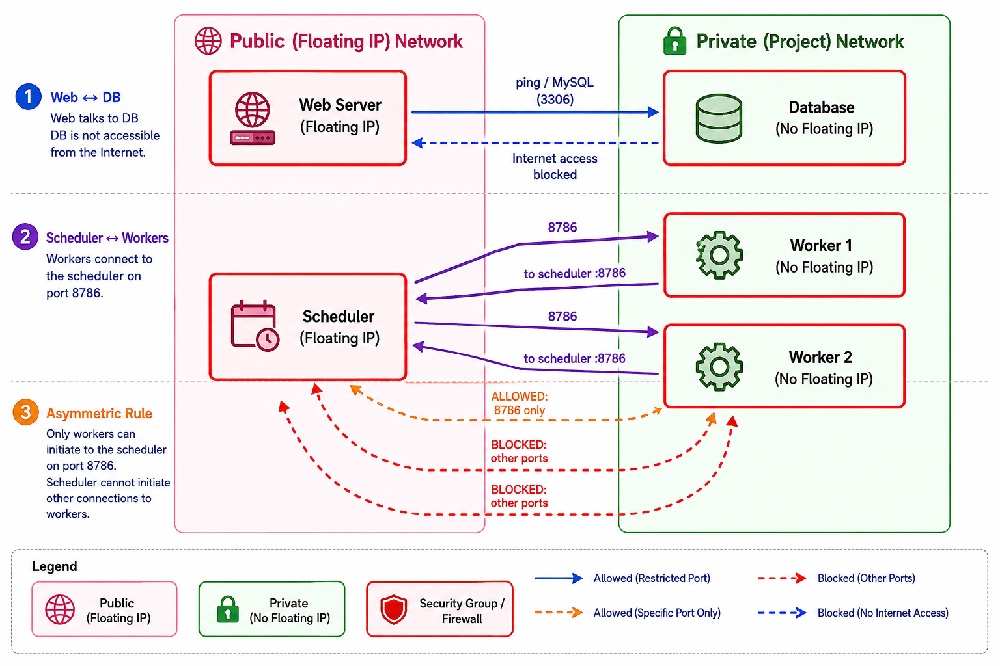

# Orchestrating Multi-VM Architectures with OpenStack Heat

!!! info "Learning Objectives"

    By the end of this lab, students will be able to:

    1. Understand the concept of **Infrastructure as Code (IaC)** using OpenStack Heat.
    2. Create a **Heat Orchestration Template (HOT)** to deploy a multi-tier architecture.
    3. Manage the full lifecycle of a "stack" (Create, Update, Delete) using the OpenStack CLI.
    4. Implement resource dependencies (e.g., ensuring security groups exist before servers are launched).
    5. Compare imperative deployment (running individual commands) with declarative orchestration.

---

## Overview

In the previous lab, we manually created servers, security groups, and floating IPs. While this is great for learning, it is error-prone and difficult to reproduce. **OpenStack Heat** allows us to define our entire infrastructure in a single YAML file.

Instead of running 20 separate commands, we define a **Stack**. A stack is a collection of resources that are managed as a single unit.

This contrasts the experience from the 

* [comandline only management](/section/cloud/platforms/jetstream/jetstream-multi.md)

*Figure: The diagram of the multiple VM example*



### Architecture to be Orchestrated

We will deploy the same architecture as the manual lab:
1. **Two-Tier Web-DB**: A public web server (`web01`) and a private database server (`db01`).
2. **AI/Data Cluster**: A scheduler node (`scheduler`) and multiple worker nodes (`worker01`, `worker02`).

---

## 1. The Heat Orchestration Template (HOT)

Create a file named `multi-vm.yaml` on your local machine. This template defines the desired state of your infrastructure.

```yaml
heat_template_version: 2018-08-31

description: Template for a multi-tier Web/DB and AI Cluster architecture.

parameters:
  image:
    type: string
    description: Image to use for all servers.
    default: Featured-Ubuntu-24.04
  flavor:
    type: string
    description: Flavor to use for all servers.
    default: m1.medium
  key_name:
    type: string
    description: SSH keypair name.
    default: jetstream-demo

resources:
  # --- SECURITY GROUPS ---
  web_sg:
    type: OS::Nova::SecurityGroup
    properties:
      name: web-sg-heat
      rules:
        - protocol: tcp
          port_range_min: 22
          port_range_max: 22
          remote_ip_prefix: 0.0.0.0/0
        - protocol: tcp
          port_range_min: 80
          port_range_max: 80
          remote_ip_prefix: 0.0.0.0/0
        - protocol: tcp
          port_range_min: 443
          port_range_max: 443
          remote_ip_prefix: 0.0.0.0/0

  db_sg:
    type: OS::Nova::SecurityGroup
    properties:
      name: db-sg-heat
      rules:
        - protocol: tcp
          port_range_min: 22
          port_range_max: 22
          remote_group: { get_resource: web_sg }
        - protocol: tcp
          port_range_min: 3306
          port_range_max: 3306
          remote_group: { get_resource: web_sg }

  cluster_sg:
    type: OS::Nova::SecurityGroup
    properties:
      name: cluster-sg-heat
      rules:
        - protocol: tcp
          port_range_min: 22
          port_range_max: 22
          remote_ip_prefix: 0.0.0.0/0
        - protocol: all
          remote_group: { get_resource: cluster_sg }


  # --- SERVERS ---
  web01:
    type: OS::Nova::Server
    properties:
      name: web01-heat
      image: { get_param: image }
      flavor: { get_param: flavor }
      key_name: { get_param: key_name }
      security_groups: [{ get_resource: web_sg }]
      networks: [{ net: private-net }]

  db01:
    type: OS::Nova::Server
    properties:
      name: db01-heat
      image: { get_param: image }
      flavor: { get_param: flavor }
      key_name: { get_param: key_name }
      security_groups: [{ get_resource: db_sg }]
      networks: [{ net: private-net }]

  scheduler:
    type: OS::Nova::Server
    properties:
      name: scheduler-heat
      image: { get_param: image }
      flavor: { get_param: flavor }
      key_name: { get_param: key_name }
      security_groups: [{ get_resource: cluster_sg }]
      networks: [{ net: private-net }]

  worker01:
    type: OS::Nova::Server
    properties:
      name: worker01-heat
      image: { get_param: image }
      flavor: { get_param: flavor }
      key_name: { get_param: key_name }
      security_groups: [{ get_resource: cluster_sg }]
      networks: [{ net: private-net }]

  worker02:
    type: OS::Nova::Server
    properties:
      name: worker02-heat
      image: { get_param: image }
      flavor: { get_param: flavor }
      key_name: { get_param: key_name }
      security_groups: [{ get_resource: cluster_sg }]
      networks: [{ net: private-net }]

  # --- FLOATING IPS ---
  web_float_ip:
    type: OS::Neutron::FloatingIP
    properties:
      floating_network: public

  web_float_ip_assoc:
    type: OS::Neutron::FloatingIPAssociation
    properties:
      floating_ip: { get_resource: web_float_ip }
      port: { get_attr: [web01, interfaces, 0, port] }

  scheduler_float_ip:
    type: OS::Neutron::FloatingIP
    properties:
      floating_network: public

  scheduler_float_ip_assoc:
    type: OS::Neutron::FloatingIPAssociation
    properties:
      floating_ip: { get_resource: scheduler_float_ip }
      port: { get_attr: [scheduler, interfaces, 0, port] }

outputs:
  web_ip:
    description: Public IP of the web server
    value: { get_attr: [web_float_ip, floating_ip_address] }
  scheduler_ip:
    description: Public IP of the scheduler
    value: { get_attr: [scheduler_float_ip, floating_ip_address] }
```


## 2. Deploying the Stack

### 2.1 Securing Resources (The Lease)
Before deploying the stack, you must reserve the necessary compute resources. On Chameleon, especially for KVM@TACC instances, we use the **Blazar Reservation** service to create a lease. This ensures that your required flavors and quotas are guaranteed for the duration of your lab.

Run the following command to create a simple lease for the resources needed (e.g., 5 `m1.medium` instances for **1 hour** starting now):

```bash
openstack reservation lease create \
  --flavor m1.medium \
  --count 5 \
  --start $(date -u +"%Y-%m-%dT%H:%M:%SZ") \
  --duration 3600
```
*Note: Ensure your current quota allows for this reservation. You can verify your lease status with `openstack reservation lease list`.*

### 2.2 Creating the Stack
Once the lease is active and resources are reserved, use the OpenStack CLI to create the stack.

```bash
openstack stack create -t multi-vm.yaml chameleon-multi-stack
```

### 2.2 Monitoring Deployment
Heat creates resources in parallel where possible, but respects dependencies (e.g., it will not create `web01` until `web_sg` is ready). You can monitor the progress:

```bash
openstack stack list
openstack stack resource list jetstream-multi-stack
```

### 2.3 Retrieving Outputs
Instead of searching for IPs manually, Heat provides the outputs we defined in the template:

```bash
openstack stack output show jetstream-multi-stack
```

---

## 3. Lifecycle Management

### 3.1 Updating the Infrastructure
If you want to add a third worker (`worker03`), you don't need to run more commands. Simply:
1. Edit `multi-vm.yaml` and add the `worker03` resource.
2. Update the stack:
   ```bash
   openstack stack update -t multi-vm.yaml jetstream-multi-stack
   ```
Heat will detect that only one server needs to be added and will leave the others untouched.

### 3.2 Tearing Down the Infrastructure
To delete everything—servers, security groups, and floating IPs—in one command:

```bash
openstack stack delete jetstream-multi-stack
```

---

## 4. Imperative vs. Declarative: Comparison

| Feature | Imperative (Manual CLI) | Declarative (Heat) |
| :--- | :--- | :--- |
| **Process** | Run a sequence of commands | Define the final state in YAML |
| **Error Handling** | If command 5 fails, you must clean up 1-4 | Heat handles rollbacks automatically |
| **Reproducibility** | Hard (must re-run script/commands) | Easy (reuse the `.yaml` file) |
| **Cleanup** | Must delete resources in reverse order | One command: `stack delete` |
| **Updates** | Manual addition/deletion of resources | Update template $\rightarrow$ `stack update` |

---

## Appendix: Integrating Reservations into Heat Templates

### Could reservations be integrated into the Heat YAML?
Technically, it is possible to define certain resource constraints in a Heat Orchestration Template (HOT), but a **Blazar Reservation (Lease)** is a separate architectural layer that operates *before* Heat.

### Why we separate them:
1.  **Timing**: A reservation is a commitment of resources for a *future* time window. Heat, however, is an execution engine that creates resources *now*.
2.  **Quota vs. Allocation**: Blazar handles the "booking" of the quota so that when the `openstack stack create` command is run, the resources are guaranteed to be available. If you tried to include the reservation logic inside the Heat template, the stack creation would likely fail because the resources wouldn't have been "pre-booked" in the cloud's global inventory.
3.  **Lifecycle**: Leases often have a specific start and end time that is independent of the stack's existence. You might have a lease for 24 hours but only keep the stack active for 2 hours.

**Best Practice**: Always create your lease first via the `openstack reservation` CLI or Horizon UI, verify its status, and then deploy your Heat stack.

### Automation with Makefiles
To avoid running these multi-line commands manually, you can use a `Makefile` to encapsulate the workflow. This ensures consistency and reduces errors.

Example `Makefile`:
```makefile
# Variables
LEASE_NAME=chameleon-multi-lease
STACK_NAME=chameleon-multi-stack
TEMPLATE=multi-vm.yaml
FLAVOR=m1.medium
COUNT=5
DURATION=3600

.PHONY: reservation deploy destroy clean

reservation:
	@echo "Creating lease for $(COUNT) x $(FLAVOR)..."
	openstack reservation lease create \
	  --flavor $(FLAVOR) \
	  --count $(COUNT) \
	  --start $$(date -u +"%Y-%m-%dT%H:%M:%SZ") \
	  --duration $(DURATION)

deploy:
	@echo "Deploying Heat stack $(STACK_NAME)..."
	openstack stack create -t $(TEMPLATE) $(STACK_NAME)

destroy:
	@echo "Tearing down stack $(STACK_NAME)..."
	openstack stack delete $(STACK_NAME)

clean: destroy
	@echo "Cleaning up leases..."
	openstack reservation lease list | grep $(LEASE_NAME) | awk '{print $$2}' | xargs -I {} openstack reservation lease delete {}
```

With this file, you can simply run `make reservation` followed by `make deploy`.
