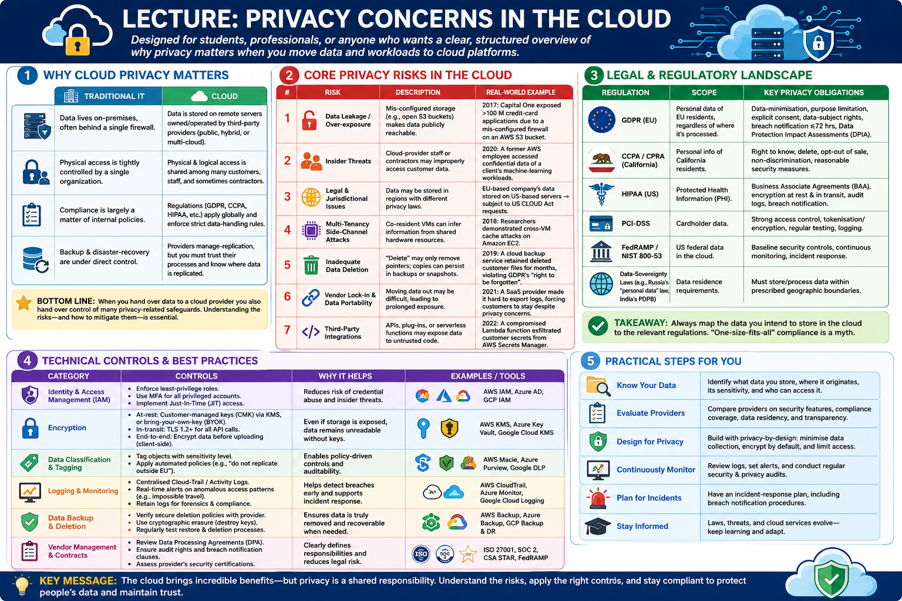

# Lecture: Privacy Concerns in the Cloud

---

## 1. Why Cloud Privacy Matters

The transition from traditional on-premises IT infrastructure to cloud computing represents a fundamental shift in the trust model of information systems. In a traditional environment, an organization maintains absolute sovereignty over its data, controlling every layer of the stack from the physical security of the server room to the logical configuration of the hypervisor. Privacy is enforced through physical isolation and a perimeter-based security model.

In contrast, cloud computing introduces a model of shared tenancy and outsourced management. When an organization migrates to the cloud, it replaces direct control with contractual trust. This shift introduces a complex dichotomy known as the **Shared Responsibility Model**. Under this framework, the cloud service provider (CSP) is responsible for the **security OF the cloud**—ensuring that the physical data centers, the virtualization layer, and the core networking infrastructure are secure. However, the customer remains responsible for **security IN the cloud**. This includes the classification of data, the configuration of Identity and Access Management (IAM) policies, the encryption of sensitive payloads, and the management of network security groups. 

A critical realization for architects is that most privacy breaches in the cloud are not the result of a failure in the CSP's underlying infrastructure, but rather a failure of the customer to properly implement their side of the shared responsibility.

The following table summarizes the primary shifts in privacy management when moving from traditional IT to the cloud:

| **Traditional IT** | **Cloud** |
|-------------------|-----------|
| Data lives on‑premises, often behind a single firewall. | Data is stored on remote servers owned/operated by third‑party providers (public, hybrid, or multi‑cloud). |
| Physical access is tightly controlled by a single organization. | Physical & logical access is shared among many customers, staff, and sometimes contractors. |
| Compliance is largely a matter of internal policies. | Regulations (GDPR, CCPA, HIPAA, etc.) apply **globally** and enforce strict data‑handling rules. |
| Backup & disaster‑recovery are under direct control. | Providers manage replication, but you must trust their processes and know where data is replicated. |

**Bottom line:** When you hand over data to a cloud provider you also hand over **control** of many privacy‑related safeguards. Understanding the risks—and how to mitigate them—is essential.

---

## 2. Core Privacy Risks in the Cloud

Privacy in a multi-tenant environment is subject to risks that do not exist in isolated systems. One of the most sophisticated threats is the **Side-Channel Attack**. Because multiple virtual machines (VMs) share the same physical CPU and memory hardware, a malicious tenant may be able to infer sensitive information—such as cryptographic keys—by observing the timing or state of shared hardware caches. While CSPs implement rigorous isolation, the inherent nature of shared hardware creates a residual risk that must be accounted for in high-security architectures.

Beyond technical vulnerabilities, the cloud introduces significant **Legal and Jurisdictional Complexity**. The physical location of data (data residency) is often conflated with the legal jurisdiction over that data. A primary example is the conflict between the **US CLOUD Act** and the **EU GDPR**. The CLOUD Act allows US law enforcement to compel US-based providers to produce data regardless of where it is stored globally. Conversely, the GDPR prohibits the transfer of personal data to jurisdictions that do not provide "adequate" protection. This creates a paradox where data stored in a European data center may still be subject to US legal requests if the provider is a US company. This jurisdictional tug-of-war necessitates the use of Sovereign Clouds or "Hold Your Own Key" (HYOK) strategies for highly regulated data.

Other risks include the "persistence" of data; in the cloud, a "delete" command often only removes a pointer, while the actual bits may persist in snapshots or redundant backups across multiple regions, potentially violating the "right to be forgotten."

The table below categorizes these and other primary privacy risks:

| # | Risk | Description | Real‑World Example |
|---|------|-------------|--------------------|
| 1 | **Data Leakage / Over‑exposure** | Mis‑configured storage (e.g., open S3 buckets) makes data publicly reachable. | 2017: Capital One exposed >100 M credit‑card applications due to a mis‑configured firewall on an AWS S3 bucket. |
| 2 | **Insider Threats** | Cloud‑provider staff or contractors may improperly access customer data. | 2020: A former AWS employee accessed confidential data of a client's machine‑learning workloads. |
| 3 | **Legal & Jurisdictional Issues** | Data may be stored in regions with different privacy laws. | EU‑based company's data stored on US‑based servers → subject to US CLOUD Act requests. |
| 4 | **Multi‑Tenancy Side‑Channel Attacks** | Co‑resident VMs can infer information from shared hardware resources. | 2018: Researchers demonstrated cross‑VM cache attacks on Amazon EC2. |
| 5 | **Inadequate Data Deletion** | "Delete" may only remove pointers; copies can persist in backups or snapshots. | 2019: A cloud backup service retained deleted customer files for months, violating GDPR's "right to be forgotten". |
| 6 | **Vendor Lock‑in & Data Portability** | Moving data out may be difficult, leading to prolonged exposure. | 2021: A SaaS provider made it hard to export logs, forcing customers to stay despite privacy concerns. |
| 7 | **Third‑Party Integrations** | APIs, plug‑ins, or serverless functions may expose data to untrusted code. | 2022: A compromised Lambda function exfiltrated customer secrets from AWS Secrets Manager. |

---

## 3. Legal & Regulatory Landscape

Navigating the cloud privacy landscape requires an understanding of the complex interplay between technological capabilities and the legal mandates of diverse jurisdictions. Unlike traditional software licensing, cloud compliance is not a static achievement but a continuous state of alignment with evolving laws. These regulations generally fall into two categories: horizontal regulations, which apply to all personal data regardless of the industry (such as the GDPR), and vertical regulations, which are sector-specific (such as HIPAA for healthcare).

A primary challenge for global enterprises is "regulatory fragmentation." When data is distributed across multiple cloud regions, the organization must simultaneously satisfy the requirements of the data's origin, the data's current physical location, and the jurisdiction of the cloud provider. Failure to maintain this alignment can result in severe financial penalties and the loss of the "social license" to operate in certain markets.

The following table outlines the most influential regulatory frameworks and their core privacy obligations:

| Regulation | Scope | Key Privacy Obligations |
|------------|-------|------------------------|
| **GDPR (EU)** | Personal data of EU residents, regardless of where it's processed. | Data‑minimisation, purpose limitation, explicit consent, data‑subject rights, breach notification ≤72 hrs, Data Protection Impact Assessments (DPIA). |
| **CCPA / CPRA (California)** | Personal info of California residents. | Right to know, delete, opt‑out of sale, non‑discrimination, reasonable security measures. |
| **HIPAA (US)** | Protected Health Information (PHI). | Business Associate Agreements (BAA), encryption at rest & in transit, audit logs, breach notification. |
| **PCI‑DSS** | Cardholder data. | Strong access control, tokenisation/encryption, regular testing, logging. |
| **FedRAMP / NIST 800‑53** | US federal data in the cloud. | Baseline security controls, continuous monitoring, incident response. |
| **Data‑Sovereignty Laws** (e.g., Russia's "personal data" law, India's PDPB) | Data residence requirements. | Must store/process data within prescribed geographic boundaries. |

**Takeaway:**  
*Always map the data you intend to store in the cloud to the relevant regulations. "One‑size‑fits‑all" compliance is a myth.*

---

## 4. Technical Controls & Best Practices

While legal frameworks provide the "what" of privacy, technical controls provide the "how." Effective cloud privacy is built on the principle of **Defense in Depth**, where multiple layers of controls are implemented so that the failure of a single mechanism does not lead to a total compromise of privacy.

One of the most critical components of this architecture is the management of cryptographic keys. The level of actual privacy achieved depends entirely on the "root of trust"—essentially, who holds the keys to the data. In the simplest model, **Provider-Managed Keys** are used, where the CSP handles everything; however, this means the CSP can technically decrypt the data. To gain more control, organizations move toward **Customer-Managed Keys (CMK)**, where the customer defines the access policy via a Key Management Service (KMS). 

For higher-assurance requirements, **Bring Your Own Key (BYOK)** allows organizations to generate keys in their own on-premises Hardware Security Modules (HSMs) before uploading them to the cloud. The most extreme form of privacy is **Hold Your Own Key (HYOK)**, where the key never leaves the customer's premises. In an HYOK model, the cloud service must request a decryption operation from the customer's local HSM, ensuring the CSP never has access to the plaintext key material. While HYOK offers the highest privacy, it introduces significant latency and creates a single point of failure for data availability.

Other technical controls include the rigorous application of the **Principle of Least Privilege (PoLP)** through Identity and Access Management (IAM), the use of network segmentation to prevent lateral movement, and the automation of configuration audits to prevent "drift" into insecure states.

The following table summarizes the essential technical controls for preserving cloud privacy:

| Category | Controls | Why It Helps |
|----------|----------|--------------|
| **Identity & Access Management (IAM)** | - Enforce least‑privilege roles. - Use MFA for all privileged accounts. - Implement Just‑In‑Time (JIT) access. | Reduces risk of credential abuse and insider threats. |
| **Encryption** | - **At‑rest:** Customer‑managed keys (CMK) via KMS, or bring‑your‑own‑key (BYOK). - **In‑transit:** TLS 1.2+ for all API calls. - **End‑to‑end:** Encrypt data before uploading (client‑side). | Even if storage is exposed, data remains unreadable without keys. |
| **Data Classification & Tagging** | - Tag objects with sensitivity level. - Apply automated policies (e.g., "do not replicate outside EU"). | Enables policy‑driven controls and auditability. |
| **Logging & Monitoring** | - Centralised Cloud‑Trail / Activity Logs. - Real‑time alerts on anomalous access patterns (e.g., impossible travel). - Retain logs for the period required by law. | Early detection of breaches and evidence for forensic investigations. |
| **Network Segmentation** | - Use VPCs, sub‑nets, and security groups. - Deploy private endpoints for storage services. - Zero‑trust micro‑segmentation. | Limits lateral movement and reduces exposure surface. |
| **Automated Configuration Checks** | - IaC linting (Terraform, CloudFormation) with policies (e.g., Checkov, AWS Config Rules). - Continuous compliance scans. | Prevents mis‑configurations that lead to data leakage. |
| **Backup & Deletion Hygiene** | - Verify that backups are encrypted and isolated. - Use "secure erase" APIs or lifecycle policies that purge data after retention. | Guarantees the "right to be forgotten" and reduces stale data risk. |
| **Third‑Party Governance** | - Conduct security assessments of SaaS add‑ons. - Require contractual clauses for data handling and breach notification. | Controls risk introduced by external code or services. |

---

## 5. Architectural Patterns that Preserve Privacy

To move beyond perimeter-based security, architects must employ structural patterns that embed privacy into the application's fabric—a concept known as Privacy by Design (PbD). The goal is to minimize the amount of plaintext data exposed to the cloud provider's compute environment, thereby reducing the impact of both insider threats and side-channel attacks.

One of the most promising advancements in this area is **Confidential Computing**. By utilizing Trusted Execution Environments (TEEs), such as Intel SGX or AMD SEV, sensitive data can be processed in a hardware-isolated enclave. This ensures that even if the host operating system or the hypervisor is compromised, the data remains encrypted in memory during execution. This is particularly critical for high-stakes analytics in fields like genomics or financial modeling, where data must be processed but cannot be revealed to the infrastructure provider.

For scenarios where the cloud provider is completely untrusted, **Zero-Knowledge Architectures** are employed. In this model, encryption occurs exclusively on the client side. The provider stores only opaque blobs of ciphertext and possesses no mechanism to retrieve the decryption keys. While this maximizes privacy, it fundamentally limits the provider's ability to offer server-side features like indexing, searching, or data transformation.

Other strategic patterns include the use of **Hybrid Cloud** deployments to keep the most sensitive "crown jewels" on-premises, and **Multi-Cloud** strategies to distribute data across different legal jurisdictions to avoid a single point of legal failure.

The following patterns represent the current state-of-the-art in privacy-preserving cloud architecture:

1. **Data‑in‑Use Encryption (Confidential Computing)**  
   - Use Trusted Execution Environments (Intel SGX, AMD SEV, Azure Confidential VMs) to keep data encrypted while being processed.  
   - Ideal for sensitive analytics (e.g., genomics, financial modeling).

2. **Zero‑Knowledge (Client‑Side) Encryption**  
   - Encrypt data on the client before upload; provider never sees plaintext or decryption keys.  
   - Suitable for backups, file‑sharing services, or storing PII.

3. **Hybrid Cloud with Data‑Residency Controls**  
   - Keep regulated data on‑premises or in a private cloud; only move non‑sensitive workloads to public clouds.  
   - Use secure VPN or dedicated interconnects for data flow.

4. **Multi‑Cloud Redundancy with Policy‑Based Routing**  
   - Store copies in two clouds that satisfy differing jurisdictional requirements (e.g., EU + APAC).  
   - Enforce routing policies that direct requests based on user location.

5. **Serverless with Scoped Permissions**  
   - Grant each function only the minimum set of secret/permissions it needs (principle of least privilege).  
   - Use secret‑management services that rotate keys automatically.

---

## 6. Risk-Assessment Workflow (Step-by-Step)

The transition from theoretical controls to operational privacy requires a structured risk-assessment methodology. For graduate-level practitioners, this process is not merely a compliance checklist but a rigorous analytical exercise in threat modeling. The objective is to identify the intersection of high-value data assets and the vulnerabilities introduced by the specific cloud service model (IaaS, PaaS, or SaaS) being utilized.

A robust workflow begins with a comprehensive inventory of data assets and their associated sensitivity levels. Once the data flow is mapped across cloud components, architects should employ formal threat modeling frameworks—such as STRIDE—to systematically enumerate potential attack vectors. By comparing the identified threats against existing controls, a "gap analysis" is performed, which allows the organization to prioritize remediations based on the product of likelihood and impact.

The following step-by-step workflow provides a standardized approach to cloud privacy risk management:

1. **Identify Data Assets** – inventory all data, classify by sensitivity, and note regulatory constraints.  
2. **Map Cloud Services** – list every SaaS/IaaS/PaaS component that will touch those assets.  
3. **Threat Modelling** – use STRIDE (Spoofing, Tampering, Repudiation, Information disclosure, Denial‑of‑service, Elevation of privilege) to enumerate possible attacks.  
4. **Control Gap Analysis** – compare existing controls (encryption, IAM, monitoring) against required controls from regulations and internal policies.  
5. **Mitigation Planning** – prioritize gaps by risk (likelihood × impact) and assign remediation (e.g., re‑configure bucket ACLs, enable CMEK).  
6. **Implementation & Automation** – codify controls as Infrastructure‑as‑Code (IaC) and integrate with CI/CD pipelines.  
7. **Continuous Monitoring & Auditing** – set up dashboards, KPI alerts (e.g., "public bucket detected"), and periodic compliance reviews.

---

## 7. Case Study Snapshot

To illustrate the practical application of the aforementioned theories and controls, we examine the implementation strategy of a global financial technology provider. The primary architectural challenge for such an organization is the requirement to maintain high-performance transaction processing while adhering to the stringent, often conflicting, requirements of the GDPR and PCI-DSS.

In this case, the organization adopted a "Sovereign-Lite" approach, combining regional data residency with high-assurance cryptographic controls. By ensuring that the root of trust remained with the organization rather than the cloud provider, they were able to mitigate the risks associated with foreign legal requests while benefiting from the scalability of a public cloud provider.

**Company:** *FinTechCo* (global payments provider)  
**Challenge:** Must store EU customer transaction logs while complying with GDPR and PCI‑DSS.  

| Action | How It Addressed Privacy |
|--------|--------------------------|
| **Data Residency** – Deployed Azure Region "West Europe" and used Azure Private Link for storage. | Guarantees data never leaves EU; avoids US CLOUD‑Act requests. |
| **Customer‑Managed Keys (CMK)** – Integrated Azure Key Vault with BYOK. | Only FinTechCo holds the master key; Azure cannot decrypt data. |
| **Immutable Logs** – Enabled Azure Append‑only blobs with legal hold for 7 years. | Satisfies PCI‑DSS retention and prevents tampering. |
| **Confidential Computing** – Ran analytics workloads on Azure Confidential VMs. | Data stays encrypted even during processing. |
| **Automated Compliance Scans** – Deployed Azure Policy + Checkov in CI/CD. | Blocks any deployment that would expose logs publicly. |
| **Incident‑Response Playbook** – Integrated CloudTrail logs with SIEM and set up automated alerts for anomalous access. | Guarantees breach detection within minutes, meeting GDPR 72‑hour notification rule. |

**Result:** Achieved full GDPR & PCI‑DSS compliance, passed external audit with **zero findings** and reduced the risk of data leakage by >90 % (as measured by control‑coverage metrics).

---

### 8. Self-Assessment

!!! tip "Self-Assessment"
    Test your knowledge by expanding the questions below.

??? question "True or False: Enabling encryption at rest on a cloud storage bucket automatically satisfies GDPR's 'right to be forgotten'."
    **False**. Encryption protects confidentiality, but it does **not** guarantee that data is fully erased from all backups, snapshots, and replicas when a user exercises their right to be forgotten.

??? question "Which attack vector exploits shared CPU caches in a multi-tenant environment?"
    The **Side-channel cache attack**. This occurs when co-resident VMs on the same physical hardware infer sensitive information by observing how the CPU cache is used by other tenants.

??? question "What is the primary benefit of 'customer-managed keys' (CMK) over provider-managed encryption?"
    **Control**. With CMKs, the customer retains ownership of the root key. This ensures that the cloud provider cannot decrypt the data without the customer's explicit consent or authorization.

??? question "Which regulatory frameworks impose strict data-at-rest encryption requirements?"
    **GDPR** (through various national interpretations and requirements for protecting personal data) and **PCI-DSS** (which mandates the encryption of cardholder data stored at rest).

??? question "How does 'Configuration as Code' help prevent privacy breaches?"
    By treating infrastructure as code (IaC) and implementing **Policy-as-Code** (e.g., using tools like Checkov), organizations can automatically detect and block misconfigurations—such as publicly accessible storage buckets—before they are ever deployed to production.

??? question "Why is data residency a critical concern for cloud privacy?"
    Data residency refers to the physical location where data is stored. Because different countries have different laws (e.g., the US CLOUD Act vs. EU GDPR), data stored in a foreign jurisdiction may be subject to legal requests or surveillance that conflict with the privacy laws of the data owner's home country.

### 9. Assignments

!!! note "Assignment.1: Cloud Privacy Risk Assessment"
    **Task:** Imagine a company migrating a customer database to a public cloud. Use the STRIDE model (Spoofing, Tampering, Repudiation, Information disclosure, Denial-of-service, Elevation of privilege) to identify three potential privacy threats and propose a specific technical control for each to mitigate the risk.

!!! note "Assignment.2: Compliance Mapping Matrix"
    **Task:** Select a regulated data type (e.g., Protected Health Information (PHI) or Personally Identifiable Information (PII)). Create a mapping matrix that lists the specific requirements of GDPR and CCPA/CPRA regarding that data, and specify which cloud-native service (e.g., AWS KMS, Azure Policy, GCP Cloud IAM) would help enforce those requirements.

!!! note "Assignment.3: Designing a Secure Deletion Workflow"
    **Task:** Describe a technical workflow for handling a "Right to be Forgotten" request in a system that employs automated daily backups and weekly snapshots. Explain how you would ensure the specific user's data is purged from all locations without compromising the integrity of the remaining backup sets.

---

### 10. Further Resources  

| Format | Link | Description |
|--------|------|-------------|
| **Guidelines** | <https://cloudsecurityalliance.org/artifacts/ccsks/> | Cloud Controls Matrix – a comprehensive set of security controls for cloud providers. |
| **Tooling** | <https://github.com/bridgecrewio/checkov> | Open‑source IaC scanner that checks for mis‑configurations and privacy‑related risks. |
| **Whitepaper** | <https://www.nist.gov/publications/nist-special-publication-800-144-guidelines-security-cloud-computing> | NIST SP 800‑144 – "Guidelines on Security and Privacy in Public Cloud Computing". |
| **Course** | <https://www.coursera.org/learn/cloud-privacy-security> | Coursera specialization covering cloud privacy, legal aspects, and technical controls. |
| **Case Study** | <https://azure.microsoft.com/en-us/resources/cloud-compliance/> | Microsoft Azure compliance resources with detailed GDPR/PCI‑DSS examples. |

---

#### Closing Thought  

Privacy in the cloud isn't a single checkbox—it's an **ongoing discipline** that blends legal awareness, strong architecture, automated controls, and a culture of vigilance. By embedding privacy‑by‑design from day 1 and continuously verifying your posture, you turn the cloud from a potential liability into a powerful enabler for secure, compliant innovation.  

