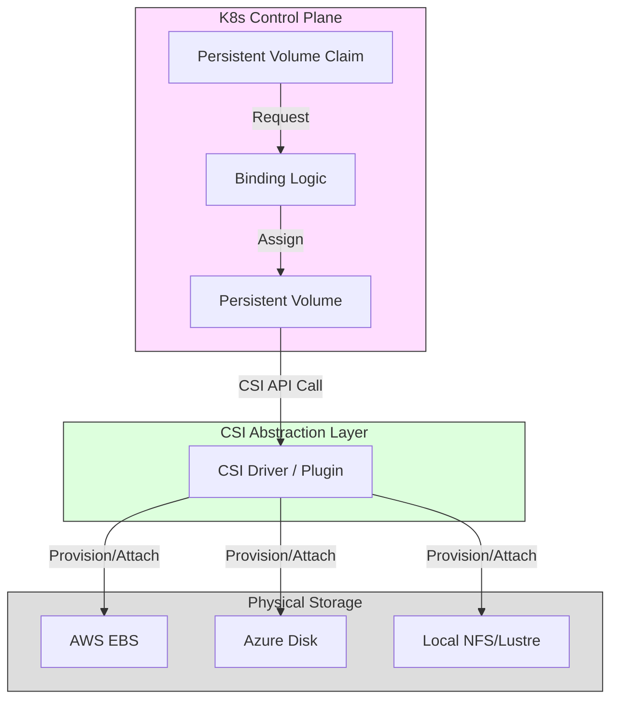

# Container Storage & Networking

!!! info "Learning Objectives"
    - Understand the ephemeral nature of container filesystems.
    - Differentiate between Bind Mounts and Volumes.
    - Explain the Container Network Interface (CNI) and how pods communicate.
    - Understand the Container Storage Interface (CSI) and Persistent Volume (PV) lifecycle in Kubernetes.

Containers are designed to be **ephemeral**. This means that any data written to the container's own writable layer is deleted the moment the container is stopped or deleted. For AI workloads—where you have massive datasets and model weights—this behavior is unacceptable. You cannot lose your trained model just because a pod restarted.

To handle data and communication, we rely on abstraction layers that separate the application from the underlying physical hardware.

!!! info "Why this matters"
    In a distributed AI training setup, multiple containers across different physical nodes need to access the same dataset. If you store the data inside the container, you have to duplicate it on every node. By using shared storage and a standardized networking layer, you can mount a single high-performance network drive (like NFS or Lustre) into a thousand containers simultaneously.

## 1. Container Storage: Beyond Ephemeral Layers

To persist data, we move it *outside* the container's writable layer.

### Bind Mounts vs. Volumes
- **Bind Mounts**: Maps a specific path on the host machine (e.g., `/home/user/data`) directly into the container. It is fast and simple but ties the container to a specific host's directory structure.
- **Volumes**: Managed by the container engine (Docker/Podman). The engine creates a directory on the host and manages it. Volumes are more portable and are the preferred way to persist data in production.

### The Kubernetes Storage Stack (CSI)
In Kubernetes, we use the **Container Storage Interface (CSI)** to allow K8s to talk to any storage provider (AWS EBS, Azure Disk, Google Persistent Disk, or local NFS) using a universal API.

*Figure 1: The CSI Abstraction. The CSI Driver ensures that the K8s API can request storage from any provider without knowing the provider's specific API.*

**The PV/PVC Lifecycle:**
1.  **Persistent Volume (PV)**: A piece of storage in the cluster that has been provisioned by an administrator or a storage class. (The "Physical" disk).
2.  **Persistent Volume Claim (PVC)**: A request for storage by a user. "I need 50Gi of storage with ReadWriteOnce access." (The "Ticket").
3.  **Binding**: Kubernetes matches the PVC to an available PV and mounts it into the Pod.

## 2. Container Networking: How Pods Talk

Networking in containers is complex because containers often move between hosts. We need a way for them to find each other regardless of their physical location.

### The Container Network Interface (CNI)
Similar to storage, networking is standardized via the **CNI**. The CNI is a specification that allows different networking plugins (like Flannel, Calico, or Cilium) to be swapped in and out of a cluster.

**Core Networking Concepts:**
- **Pod Networking**: In Kubernetes, every Pod gets its own unique IP address. All containers within a single Pod share that IP and can communicate via `localhost`.
- **Service (ClusterIP)**: Because Pods are ephemeral and their IPs change, a **Service** provides a stable IP address and DNS name that load-balances traffic across a set of identical Pods.
- **Ingress**: The entry point for external traffic. It routes requests from the outside world (e.g., `api.my-ai-model.com`) to the correct internal Service.

### Networking for AI: High-Performance requirements
Standard container networking introduces a small amount of latency. For distributed AI training (e.g., using PyTorch Distributed), this latency can become a bottleneck.
- **Host Networking**: Running a container with `--net=host` removes the network isolation, allowing the container to use the host's network stack directly for maximum performance.
- **SR-IOV / RDMA**: Specialized CNI plugins allow AI containers to bypass the kernel entirely and communicate directly with the NIC, which is essential for multi-node GPU training.

---

## Self-Assessment

Test your knowledge by expanding the questions below.

??? question "What happens to data in a container if you don't use a Volume or Bind Mount?"
    The data is stored in the container's writable layer. Once the container is deleted, that layer is destroyed, and all data is lost forever.

??? question "What is the difference between a PV and a PVC in Kubernetes?"
    A PV (Persistent Volume) is the actual storage resource (the disk), while a PVC (Persistent Volume Claim) is a request for that storage. The PVC allows a developer to ask for storage without needing to know the technical details of the underlying storage hardware.

??? question "Why is CNI important for Kubernetes?"
    CNI provides a standardized way for Kubernetes to configure networking. It allows the cluster to remain agnostic of the underlying network provider, meaning you can move a cluster from AWS to on-premise by simply changing the CNI plugin.

## Assignments

!!! note "Assignment 1: Data Persistence Test"
    Start a container with a writable file. Stop and delete the container. Verify the file is gone. Now, repeat the process using a **Docker Volume**. Verify the file persists even after the container is deleted.

!!! note "Assignment 2: Exploring K8s Services"
    Deploy two pods in a local cluster (e.g., using Kind). Try to ping one from the other using its IP. Delete the pod and redeploy it; notice the IP changes. Now, create a **Service** and ping the service's stable DNS name to see how it solves the IP volatility problem.

## References

- Kubernetes Storage Documentation: [kubernetes.io/docs/concepts/storage/](https://kubernetes.io/docs/concepts/storage/)
- CNI Specification: [cncf.io/projects/cni/](https://cncf.io/projects/cni/)
- Docker Volumes Guide: [docs.docker.com/storage/volumes/](https://docs.docker.com/storage/volumes/)

---

## What's Next?

You now know how to build, secure, and connect containers. The final step is to automate this entire process. Head over to **Bridging Containers and CI/CD** to see how to turn your Dockerfile into a production-ready pipeline.
