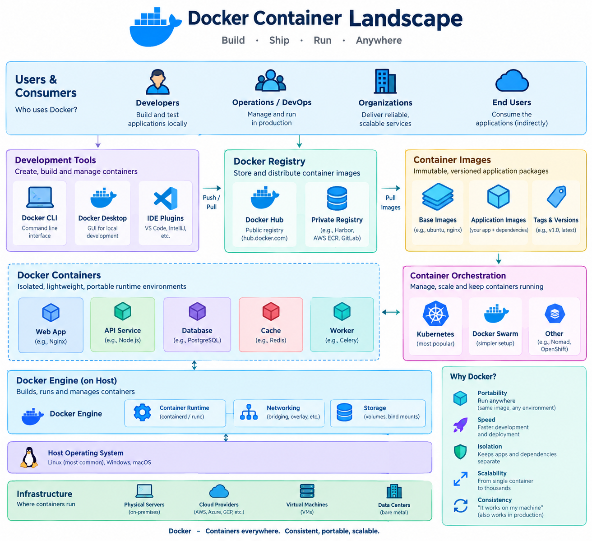

# Introduction to Containers

!!! info "Learning Objectives"
    - Define containerization and explain how it differs from traditional virtualization.
    - Understand the core components of the container ecosystem: Image, Registry, and Runtime.
    - Analyze the container lifecycle: Build $\rightarrow$ Ship $\rightarrow$ Run.
    - Identify the critical role of containers in ensuring reproducibility for AI and Data Science workloads.

!!! tip "Prerequisites"
    To get the most out of this chapter and the subsequent practical labs, you should have:
    - **Basic Linux CLI Knowledge**: Comfort with the terminal, navigating directories, and using basic commands (`ls`, `cd`, `cat`, `sudo`).
    - **Basic Networking Concepts**: A general understanding of IP addresses, ports, and how the client-server model works.
    - **Virtualization Access**: A local Linux environment (e.g., Ubuntu on WSL2, a VM, or a native Linux install).

In the early days of cloud computing, the primary unit of isolation was the Virtual Machine (VM). While VMs provided strong isolation, they were "heavy"—each requiring its own full guest operating system, which consumed significant memory and CPU resources even before the application started.

Containerization represents a fundamental shift in how we package and deploy software. Instead of virtualizing the hardware, containers virtualize the operating system. This allows multiple isolated applications to share the same OS kernel while maintaining their own filesystem, libraries, and configurations.

!!! info "Why this matters"
    For AI researchers and Data Scientists, "it works on my machine" is a frequent and costly failure. A model that trains perfectly on a local workstation with a specific version of CUDA, PyTorch, and a set of system libraries often fails when moved to a GPU cluster or a production cloud environment. Containers solve this by packaging the entire environment—not just the code—ensuring that the environment in production is an exact replica of the environment used during development.

## The Container Lifecycle

The movement of software from a developer's laptop to a production cluster follows a consistent three-stage lifecycle: **Build**, **Ship**, and **Run**.

### 1. Build (The Image)
The process begins with a **Dockerfile** (or similar recipe). This text file defines the environment: the base OS, the dependencies to install, the environment variables to set, and the command to execute. When this file is "built," it creates a **Container Image**.
*   **Image**: A read-only template containing the application and everything it needs to run. It is composed of stacked layers to maximize reuse.

### 2. Ship (The Registry)
Once an image is built, it needs to be stored and shared. This is where the **Container Registry** comes in (e.g., Docker Hub, GitHub Container Registry, or a private corporate registry).
*   **Registry**: A centralized repository for storing and distributing container images. Developers "push" images to the registry and orchestration systems "pull" them down to deploy.

### 3. Run (The Container)
The final stage occurs when a container runtime (like containerd or CRI-O) takes an image from the registry and instantiates it.
*   **Container**: A running instance of an image. While the image is static and read-only, the container adds a thin "writable layer" on top, allowing the application to write logs or temporary files during execution.

*Figure 1: The Build $\rightarrow$ Ship $\rightarrow$ Run workflow.*

## Reproducibility in the AI Stack

Containers are especially powerful when dealing with the complex dependencies of AI workloads. A typical AI container manages:
- **System Libraries**: Specific versions of glibc or BLAS.
- **GPU Runtimes**: CUDA and cuDNN versions that must match the physical GPU driver.
- **Language Environments**: Python versions and virtual environments.
- **Model Weights**: Large binary files that can be baked into the image or mounted as volumes.

By utilizing containers, an AI team can guarantee that every member of the team, and every node in the compute cluster, is using the exact same software stack, eliminating environment-related bugs.

## Chapter Roadmap: Containerization and Orchestration

To master this ecosystem, we will progress through the following sequence:

#### Part I: Foundations of Containerization
- **Introduction to Containers** (`containers.md`): The core philosophy and lifecycle.
- **Container Tool Comparison** ([`container-tool-comparison.md`](container-tool-comparison.md)): Choosing the right engine.
- **Docker** ([`docker.md`](docker.md)): The industry standard for building images.
- **Podman** ([`podman.md`](podman.md)): Rootless and daemonless containers.
- **Apptainer** ([`apptainer.md`](apptainer.md)): Specialized containers for HPC.

#### Part II: Container Orchestration
- **Orchestration Landscape** ([`orchestration-comparison.md`](orchestration-comparison.md)): The transition from single containers to clusters.
- **Kubernetes** ([`kubernetes.md`](kubernetes.md)): Architecture and core primitives.
- **Local K8s** ([`kubernetes-local.md`](kubernetes-local.md)): Development with Minikube and Kind.
- **Advanced Scaling** ([`kubernetes-advanced/hpa-autoscaling.md`](kubernetes-advanced/hpa-autoscaling.md)): Auto-scaling for dynamic workloads.
- **Helm** ([`helm.md`](helm.md)): Managing applications as packages.

#### Part III: Enterprise Platforms
- **OpenShift** ([`openshift.md`](openshift.md)): Enterprise-grade Kubernetes.
- **OpenStack Integration** ([`openstack/openstack.md`](openstack/openstack.md)): Containers in the IaaS layer.

---

## Self-Assessment

Test your knowledge by expanding the questions below.

??? question "What is the fundamental difference between a VM and a Container?"
    A VM virtualizes the hardware, requiring a full guest OS for every instance. A container virtualizes the operating system, sharing the host's kernel and making it significantly more lightweight and faster to start.

??? question "Explain the relationship between an Image and a Container."
    An image is a read-only template (the "blueprint") containing the application and its dependencies. A container is a running instance of that image (the "building"), adding a writable layer on top of the read-only image.

??? question "Why is the 'Build $\rightarrow$ Ship $\rightarrow$ Run' workflow important for reproducibility?"
    It ensures that the exact same artifact (the image) created during the build phase is the one shipped to the registry and subsequently run in production, removing any variance between environments.

??? question "How do containers help in AI research specifically?"
    AI workloads depend on a fragile combination of GPU drivers, CUDA versions, and Python libraries. Containers package these dependencies together, ensuring that a model developed on one machine will behave identically on a remote GPU cluster.

## Assignments

!!! note "Assignment 1: Analyzing an Image"
    Find a public image on Docker Hub for a tool you use (e.g., `pytorch/pytorch` or `tensorflow/tensorflow`). Inspect its tags and description. Try to determine which base OS it uses and what CUDA version it supports.

!!! note "Assignment 2: Mapping the Lifecycle"
    Draw a diagram of your current development-to-deployment workflow. Identify where "Build", "Ship", and "Run" occur. If you aren't using containers, identify one point where an environment mismatch has caused a bug and explain how a container would have prevented it.

## References

- Docker Documentation: [docs.docker.com](https://docs.docker.com/)
- Kubernetes Documentation: [kubernetes.io/docs](https://kubernetes.io/docs/)
- Podman Documentation: [podman.io](https://podman.io/)

---

## What's Next?

Now that you understand the core philosophy of containers, it's time to look at the tools available. Head over to **Container Tool Comparison** to see how Docker, Podman, and other engines differ.
