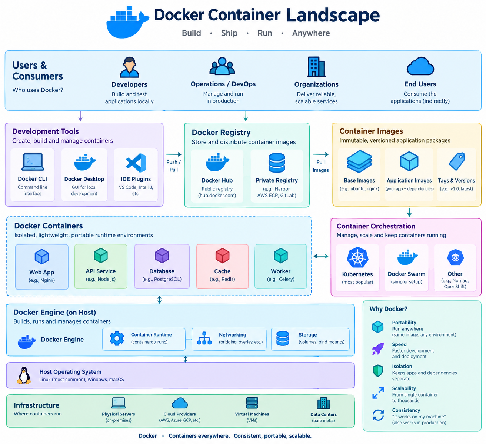

# Docker

A **hands‑on, step‑by‑step guide** that walks you through installing Docker, understanding its core concepts, building images, running containers, using Docker Compose, handling storage & networking, and applying best‑practice patterns.  

---

!!! info "Learning Objectives"
    By the end of this guide, you will be able to:

    1. **Install** and configure the Docker Engine on various operating systems.
    2. **Build** optimized Docker images using a Dockerfile and best-practice patterns.
    3. **Manage** container lifecycles (create, start, stop, remove) using the Docker CLI.
    4. **Orchestrate** multi-container applications using Docker Compose.
    5. **Implement** persistent storage using volumes and bind mounts.
    6. **Configure** container networking for communication between containers and the host.
    7. **Troubleshoot** common Docker runtime and build errors.

---




## 1. What is Docker?

| Aspect | Description |
|--------|-------------|
| **Docker Engine** | A daemon (`dockerd`) + client (`docker`) that builds, runs, and manages **containers** – isolated Linux processes that share the host kernel. |
| **Image** | A read‑only template (layers + metadata) that describes a filesystem snapshot and the command to start. |
| **Container** | A runtime instance of an image (a set of writable layers on top of the image). |
| **Registry** | A service (Docker Hub, GitHub Container Registry, self‑hosted) that stores and distributes images. |
| **Dockerfile** | A declarative script that tells Docker how to build an image (instructions → layers). |
| **Docker Compose** | A YAML‑based tool to define and run **multi‑container** applications. |
| **Docker Swarm / Kubernetes** | Orchestrators that schedule containers across many hosts (beyond the scope of this basic tutorial). |

Docker follows a **client-server architecture**. The Docker client (`docker` CLI) sends commands to the Docker daemon (`dockerd`), which does the heavy lifting of building images and managing containers. This separation allows you to control a Docker engine running on a remote server from your local machine.

The core workflow is often described as **Build, Ship, and Run**:

1. **Build**: Use a `Dockerfile` to create a lightweight, immutable **Image**.
2. **Ship**: Push that image to a **Registry** (like Docker Hub), making it accessible to any other machine.
3. **Run**: Pull the image from the registry and instantiate it as a **Container**, which runs exactly the same way regardless of the underlying host OS.

Docker essentially packages an application **and everything it needs** (libraries, runtime, OS files) into a portable, reproducible unit.


---

## 2. Why Use Docker?

| Need | How Docker Helps |
|------|------------------|
| **Consistent environments** | “Works on my machine” → same image runs on laptops, CI runners, & production servers. |
| **Fast onboarding** | `docker run` pulls a ready‑made stack in seconds; no manual dependency installs. |
| **Isolation** | Processes run in separate namespaces (PID, network, mount, etc.) → fewer conflicts. |
| **Resource efficiency** | Containers share the host kernel → lower overhead than full VMs. |
| **Micro‑services** | Each service can be packaged as its own container, versioned independently. |
| **CI/CD** | Build → test → push → deploy images automatically. |
| **Portability** | Images are architecture‑aware (amd64, arm64) and can be deployed anywhere Docker runs. |

The primary advantage of Docker is **Environment Parity**. In traditional development, a "dependency hell" often occurs when the developer's environment differs from the production server (e.g., different Python versions or missing C libraries). Docker solves this by making the environment **immutable**: once an image is built, it never changes.

Unlike Virtual Machines (VMs), which require a full guest OS for every instance, containers share the **host's Linux kernel**. This makes them significantly lighter, allowing you to start containers in milliseconds and run dozens more on the same hardware compared to VMs. This efficiency is what enabled the industry-wide shift toward **microservices**, where a single application is split into many small, independently deployable containers.


---

## 3. Install Docker (client + engine)

| OS | Commands |
|----|----------|
| **Ubuntu 22.04+** | ```bash sudo apt-get update && sudo apt-get install -y ca-certificates curl gnupg lsb-release && curl -fsSL https://download.docker.com/linux/ubuntu/gpg | sudo gpg --dearmor -o /usr/share/keyrings/docker-archive-keyring.gpg && echo "deb [arch=$(dpkg --print-architecture) signed-by=/usr/share/keyrings/docker-archive-keyring.gpg] https://download.docker.com/linux/ubuntu $(lsb_release -cs) stable" | sudo tee /etc/apt/sources.list.d/docker.list > /dev/null && sudo apt-get update && sudo apt-get install -y docker-ce docker-ce-cli containerd.io && sudo usermod -aG docker $USER && newgrp docker ``` |
| **Fedora 38+** | ```bash sudo dnf -y install dnf-plugins-core && sudo dnf config-manager --add-repo https://download.docker.com/linux/fedora/docker-ce.repo && sudo dnf install -y docker-ce docker-ce-cli containerd.io && sudo systemctl enable --now docker && sudo usermod -aG docker $USER && newgrp docker ``` |
| **CentOS 8 / Rocky 9** | ```bash sudo dnf -y install dnf-plugins-core && sudo dnf config-manager --add-repo https://download.docker.com/linux/centos/docker-ce.repo && sudo dnf install -y docker-ce docker-ce-cli containerd.io && sudo systemctl enable --now docker && sudo usermod -aG docker $USER && newgrp docker ``` |
| **macOS** | Install **Docker Desktop** from https://docs.docker.com/desktop/mac/install/ (includes Engine & GUI). |
| **Windows** | Install **Docker Desktop for Windows** (requires WSL2) from https://docs.docker.com/desktop/windows/install/. |
| **Rootless mode (Linux only)** | See the *Rootless* section below – no `sudo` needed after setup. |


Docker operates using a **client-server model**. The commands you run (the client) communicate with a background service called the **Docker Daemon** (`dockerd`). On Linux, this daemon typically requires root privileges. By adding your user to the `docker` group, you can interact with the daemon without prefixing every command with `sudo`, which is the standard practice for development environments.

!!! tip "**Verify installation**"  
    ```bash
    docker version
    docker info   # shows storage driver, cgroup driver, etc.
    ```

---

## 4. Core Concepts & Terminology

| Term | Meaning |
|------|---------|
| **Image Layer** | Immutable filesystem diff created by each Dockerfile instruction. |
| **Tag** | Human‑readable identifier (`repo/name:tag`). `latest` is a default tag, **not** a moving pointer. |
| **Registry** | Remote storage for images (Docker Hub, GitHub Container Registry, Harbor, etc.). |
| **Docker Daemon (`dockerd`)** | The long‑running service that builds, runs, and manages containers. |
| **Docker Client (`docker`)** | CLI that talks to the daemon via UNIX socket or TCP. |
| **Namespace** | Linux kernel isolation (PID, NET, IPC, MNT, UTS). |
| **cgroup** | Resource‑control (CPU, memory, blkio). |

At its heart, Docker is not a "virtual machine" but a clever use of **Linux Kernel primitives**. **Namespaces** provide the "illusion" of isolation by ensuring a container cannot see the processes, network interfaces, or files of another container or the host. Meanwhile, **cgroups** (control groups) act as the "meter," preventing a single container from consuming all the host's CPU or RAM.

The **Image Layer** system is based on a **Union File System**. Each instruction in a Dockerfile (e.g., `RUN apt-get install`) creates a new read-only layer. When you run a container, Docker adds a thin **writable layer** on top. This makes images incredibly efficient: if ten different images are all based on `ubuntu:22.04`, the host only stores that base layer once.

| **Build Context** | Directory tree sent to the daemon when building an image. |
| **Docker Compose** | A tool (`docker compose`) that reads `docker-compose.yml` to orchestrate multiple containers. |

---

## 5. Basic Docker Commands Cheat‑Sheet

| Action | Command | Common Options |
|--------|---------|----------------|
| **Show version** | `docker version` | |
| **List images** | `docker images` | `-a` (show intermediate layers) |
| **Pull an image** | `docker pull nginx:alpine` | |
| **Run a container (interactive)** | `docker run -it --rm ubuntu bash` | `--name myctn`, `-p 8080:80`, `-v /host:/container` |
| **Run in background** | `docker run -d --name web -p 80:80 nginx:alpine` | |
| **List running containers** | `docker ps` | `-a` (show stopped) |
| **Stop / Remove** | `docker stop web && docker rm web` | |
| **Inspect details** | `docker inspect web` | |
| **Show logs** | `docker logs -f web` | |

The general lifecycle of a container follows a predictable path:
1. **Provision**: `docker pull` retrieves the image, and `docker run` creates and starts the container.
2. **Interact**: `docker exec` allows you to jump into a running container to debug or run commands.
3. **Monitor**: `docker logs` provides the stdout/stderr streams from the application.
4. **Teardown**: `docker stop` gracefully shuts down the process, and `docker rm` deletes the container's writable layer.

| Action | Command | Common Options |
|--------|---------|----------------|
| **Execute inside** | `docker exec -it web sh` | |
| **Copy files** | `docker cp host.txt web:/tmp/` | |
| **Build an image** | `docker build -t myapp:1.0 .` | `--progress=plain`, `--no-cache` |
| **Tag an image** | `docker tag myapp:1.0 registry.example.com/myapp:1.0` | |
| **Push to registry** | `docker push registry.example.com/myapp:1.0` | |
| **Remove unused data** | `docker system prune -a` | *Be careful – removes dangling images* |
| **Compose up / down** | `docker compose up -d` | `docker compose down -v --remove-orphans` |
| **Compose logs** | `docker compose logs -f` | |
| **Compose config (dry‑run)** | `docker compose config` | validates yaml |

!!! tip
    `docker --help` shows the full command tree. Every sub‑command supports `--help`.

---

## 6. Building Your First Image – “Hello‑World” Web App

### 6.1. Create a project directory

```bash
mkdir hello-docker && cd hello-docker
```

### 6.2. Write a simple **Dockerfile**

```Dockerfile
# Dockerfile
FROM python:3.12-slim

# Set working directory inside the container
WORKDIR /app

# Copy source code
COPY app.py .

# Install runtime dependencies (none needed for this tiny app)
# RUN pip install -r requirements.txt   # for real apps

# Expose the port the app will listen on
EXPOSE 5000

# Default command when container starts
CMD ["python", "app.py"]
```

### 6.3. Add the application (`app.py`)

```python
# app.py
from flask import Flask
app = Flask(__name__)

@app.route("/")
def hello():
    return "Hello from Docker!"

if __name__ == "__main__":
    app.run(host="0.0.0.0", port=5000)
```

### 6.4. Build the image

```bash
docker build -t hello-app:0.1 .
```

You’ll see a series of steps (`FROM`, `COPY`, `CMD`) each creating a new **layer**.  

The `docker build` process is a sequence of **layered snapshots**. Each instruction in the `Dockerfile` (like `FROM`, `COPY`, `RUN`) creates a new read-only layer. Docker caches these layers; if you only change the application code (`app.py`) but not the base image or dependencies, Docker re-uses the cached layers for the first few steps, making the rebuild nearly instantaneous. This layering system is what allows Docker images to be distributed efficiently—you only download the layers you don't already have.


### 6.5. Run the container locally

```bash
docker run -d -p 5000:5000 --name hello hello-app:0.1
```

Test it:

```bash
curl http://localhost:5000
# → Hello from Docker!
```

### 6.6. Clean up

```bash
docker stop hello && docker rm hello
docker rmi hello-app:0.1
```

---

## 7. Managing Data – Volumes & Bind‑Mounts

| Type | When to use | Example |
|------|-------------|---------|
| **Named volume** (Docker‑managed) | Persistent data you want Docker to handle (databases, logs). | `docker run -d -v dbdata:/var/lib/postgresql/data postgres:15` |
| **Bind mount** (host directory) | Development (live‑code reload), access to host files. | `docker run -d -v $(pwd)/src:/app/src myapp` |
| **Tmpfs mount** (memory‑only) | Sensitive data that must never hit disk. | `docker run --tmpfs /run tmpfs:rw,size=64m alpine` |


By default, any file created inside a container is stored in a **writable layer**. This layer is ephemeral: if the container is deleted, the data is gone. To achieve **persistence**, Docker provides two primary mechanisms:

1. **Named Volumes**: Managed by Docker in a dedicated area of the host filesystem (`/var/lib/docker/volumes`). They are the preferred method for production as they are isolated from host OS specifics and easier to back up or migrate.
2. **Bind Mounts**: Map a specific folder on your host (e.g., `/home/user/app/src`) directly into the container. This is ideal for **development**, as any change you make to the code on your host is immediately reflected inside the running container without needing to rebuild the image.

### Example: Using a named volume for MySQL

```bash
docker volume create mysql-data

docker run -d \
  --name mysql \
  -e MYSQL_ROOT_PASSWORD=SuperSecret \
  -v mysql-data:/var/lib/mysql \
  -p 3306:3306 \
  mysql:8
```

Inspect the volume location (rootless Docker stores under `$HOME/.local/share/docker/volumes`).

---

<a name="networking"></a>
## 8. Docker Networking Basics


Docker networking allows you to control how containers communicate with each other and the outside world. The **bridge network** is the most common; it creates a virtual switch on the host. Containers on the same bridge can talk to each other using their internal IPs.

To make a service inside a container accessible to the outside world, you use **Port Mapping** (`-p host_port:container_port`). This tells the Docker daemon to listen on a specific port on the host and forward all traffic to the container. For example, `-p 8080:80` means "anything hitting my laptop on 8080 goes to the container's port 80".


| Network driver | Description | Typical use |
|----------------|-------------|-------------|
| **bridge** (default) | Isolated private network on a single host. Containers get an IP like `172.17.x.x`. | Simple single‑host apps; use `-p` to expose ports to host. |
| **host** | Container shares the host’s network namespace (no isolation). | Performance‑critical apps needing direct host networking. |
| **none** | No network stack; container can’t communicate externally. | Sandbox/testing low‑level network code. |
| **overlay** | Multi‑host network used by Docker Swarm or Kubernetes. | Clusters spanning many nodes. |
| **macvlan** | Assigns a real MAC address to the container; appears as a separate host on the LAN. | Legacy apps that require “real” L2 connectivity. |

### Create a user‑defined bridge network

```bash
docker network create mynet
docker run -d --name web --network mynet -p 8080:80 nginx
docker run -d --name api --network mynet myapi:latest
# The two containers can reach each other via their names (web ↔ api)
```

---

<a name="compose"></a>
## 9. Multi‑Container Apps with **Docker Compose**

### 9.1. Install Compose (if not part of Docker Desktop)

```bash
# Linux (stand‑alone binary)
DOCKER_COMPOSE_VERSION=$(curl -s https://api.github.com/repos/docker/compose/releases/latest | grep tag_name | cut -d '"' -f4)
sudo curl -L "https://github.com/docker/compose/releases/download/${DOCKER_COMPOSE_VERSION}/docker-compose-$(uname -s)-$(uname -m)" -o /usr/local/bin/docker-compose
sudo chmod +x /usr/local/bin/docker-compose
docker compose version   # should show v2.x
```

### 9.2. Example `docker-compose.yml` (web + db)

```yaml
version: "3.9"

services:
  web:
    build: ./web          # uses Dockerfile in ./web
    ports:
      - "8080:80"
    environment:
      - FLASK_ENV=development
    depends_on:
      - db

  db:
    image: postgres:15
    restart: unless-stopped
    environment:
      POSTGRES_USER: app
      POSTGRES_PASSWORD: secret
      POSTGRES_DB: appdb
    volumes:
      - db-data:/var/lib/postgresql/data

volumes:
  db-data:
```

### 9.3. Run the stack

```bash
docker compose up -d        # builds the web image, pulls db, starts both
docker compose ps           # shows status
docker compose logs -f web # follow logs
```

### 9.4. Tear down

```bash
docker compose down -v      # also removes the named volume db-data
```

> **Tip:** Use `docker compose config` to validate the final merged YAML (including overrides).

---

Docker Compose solves the "multi-container headache." Instead of running five separate `docker run` commands with complex `--network` and `--link` flags, you define your entire application stack in a single YAML file. This ensures that every developer on your team starts the exact same environment with one command (`docker compose up`), and it automatically handles the creation of a shared network so that services can resolve each other by their service names (e.g., the `web` app can simply connect to `http://db:5432`).


<a name="push-registry"></a>
## 10. Pushing Images to a Registry

1. **Log in** (Docker Hub example)

   ```bash
   docker login
   # prompts for Docker ID + password (or token)
   ```

2. **Tag the image** with the repository name

   ```bash
   docker tag hello-app:0.1 yourdockerhubusername/hello-app:0.1
   ```

3. **Push**

   ```bash
   docker push yourdockerhubusername/hello-app:0.1
   ```

4. **Pull from another host**

   ```bash
   docker pull yourdockerhubusername/hello-app:0.1
   ```

### Private Registries (e.g., Harbor, GitHub Container Registry)

* Use the same `docker login <registry-url>` flow.  

Pushing an image to a registry is the critical "Ship" phase of the workflow. By tagging an image with a registry namespace (e.g., `username/app:v1`), you create a versioned artifact that can be pulled by any server in the world. This eliminates the need to manually transfer files or installation scripts; you simply deploy the image, guaranteeing that the production environment is an exact binary replica of your tested build.

* For GitHub Packages: `docker login ghcr.io -u USERNAME -p <PAT>` where PAT has `write:packages` scope.

---

<a name="security"></a>
## 11. Security & User‑Namespaces (Rootless Docker)

| Concern | Mitigation |
|---------|------------|
| **Running as root** | Enable **rootless mode** (`dockerd-rootless-setuptool.sh install`) – containers run under your UID, no `sudo` required. |
| **Image provenance** | Scan images with tools like **Trivy**, **Clair**, or Docker’s built‑in `docker scan`. |
| **Least‑privilege** | Avoid `--privileged`; use fine‑grained capabilities (`--cap-add`, `--cap-drop`). |
| **Secrets** | Do **not** bake credentials into images; inject via environment variables, Docker secrets (Swarm), or external secret managers (Vault, AWS Secrets Manager). |
| **Network isolation** | Use user‑defined bridge networks, avoid `--network host` unless necessary. |
| **Runtime security** | Enable **AppArmor** (Ubuntu) or **SELinux** (Fedora/RHEL) profiles, or use **gVisor**/**Kata Containers** for extra sandboxing. |


Running containers as the `root` user is a major security risk: if an attacker escapes the container, they potentially have root access to the host system. **Rootless Docker** solves this by running the Docker daemon and containers under a standard user account using user namespaces. This ensures that the process inside the container is mapped to a non-privileged user on the host, significantly reducing the blast radius of a potential compromise.

---

<a name="cicd"></a>
## 12. CI/CD Integration – Quick GitHub Actions Example

```yaml
name: Docker Build & Push

on:
  push:
    branches: [ main ]

jobs:
  build:
    runs-on: ubuntu-latest
    steps:
      - name: Checkout source
        uses: actions/checkout@v4

      - name: Set up Docker Buildx (supports multi‑arch)
        uses: docker/setup-buildx-action@v3

      - name: Log in to Docker Hub
        uses: docker/login-action@v3
        with:
          username: ${{ secrets.DOCKERHUB_USER }}
          password: ${{ secrets.DOCKERHUB_TOKEN }}

      - name: Build & push
        uses: docker/build-push-action@v5
        with:
          context: .
          file: ./Dockerfile
          push: true
          tags: ${{ secrets.DOCKERHUB_USER }}/hello-app:latest
          platforms: linux/amd64,linux/arm64   # multi‑arch build
```

In a modern DevOps pipeline, you never build images manually on your laptop. Instead, you use a **CI/CD runner** (like GitHub Actions) to automate the process. By using **Docker Buildx**, you can create **multi-architecture images** (e.g., targeting both `amd64` for servers and `arm64` for Apple Silicon or Raspberry Pi) in a single command. This guarantees that the image tested in the CI environment is the exact same binary that reaches production, eliminating the "it worked in CI but not in prod" scenario.


*Key takeaways*:  
- **`docker/setup-buildx-action`** enables BuildKit for fast, concurrent builds.  
- **`docker/build-push-action`** does both `docker build` and `docker push` in one step.  
- Store credentials as **GitHub Secrets** – never hard‑code them.


Image optimization is not just about saving disk space; it's about **security and speed**. Every layer in an image adds to its total size and potential attack surface. By using **multi-stage builds**, you can use a heavy "build" image (containing compilers and build tools) to create your binary, and then copy only that binary into a tiny "runtime" image (like Alpine). This results in a production image that is often 90% smaller and significantly more secure because it contains no shells or compilers for an attacker to use.

---

<a name="advanced"></a>
## 13. Advanced Topics (Brief Overview)

| Feature | What it does | When to use |
|---------|---------------|-------------|
| **BuildKit** | Faster builds, parallel steps, secret handling (`--secret id=...`). | Enable with `export DOCKER_BUILDKIT=1` or set in Docker daemon JSON. |
| **Rootless Docker** | No root daemon; containers run as unprivileged user. | Environments where you lack sudo rights (CI runners, shared servers). |
| **Docker Swarm** | Native clustering/orchestration (`docker swarm init`). | Small‑to‑medium clusters where you prefer an integrated solution over Kubernetes. |
| **Docker Secret Management (Swarm)** | Stores encrypted secrets, only exposed to containers at runtime. | When deploying services in Swarm mode. |
| **Docker Contexts** | Store multiple kube/engine endpoints (local, remote, cloud). | Switching between dev, staging, prod clusters quickly (`docker context use prod`). |
| **Experimental Features** | `docker scan`, `docker manifest`, `docker compose` v2 plugin. | Stay on the bleeding edge – check Docker’s release notes. |

---

<a name="best-practices"></a>
## 14. Best‑Practice Checklist


Following security best practices is critical because a container that runs as `root` can potentially exploit kernel vulnerabilities to escape to the host. 

The **Principle of Least Privilege** suggests that your application should run as a non-privileged user. By adding `USER appuser` to your Dockerfile, you ensure that even if an attacker gains a shell inside your container, they have limited permissions. Additionally, **Rootless Docker** removes the need for the daemon itself to run as root, further reducing the attack surface of the host system.


| ✅ Checklist Item | Why it matters |
|-------------------|----------------|
| **Pin base images** (e.g., `python:3.12.3-slim`) | Guarantees reproducible builds; avoids accidental upgrades. |
| **Use multi‑stage builds** for smaller final images | Reduces attack surface & download size. |
| **Never run as root inside a container** (`USER` directive) | Mitigates privilege‑escalation risk. |
| **Leverage `.dockerignore`** to exclude source control files (`.git`, `node_modules`) from the build context. |
| **Scan images** (`docker scan` or Trivy) in CI before publishing. |
| **Tag images with semantic versions** (`app:1.2.3`) and also a “latest” tag if you need it. |
| **Set explicit `EXPOSE`** in Dockerfile – documents intended ports. |
| **Configure resource limits** (`--memory`, `--cpus`) for production containers. |
| **Keep secrets out of images** – use env vars, Docker secrets, or external secret stores. |
| **Write healthchecks** (`HEALTHCHECK` Dockerfile instruction) for orchestration. |
| **Version your `docker-compose.yml`** (use `version: "3.9"`). |
| **Document build args** (`ARG`) and default values for transparency. |
| **Clean up dangling images/volumes** (`docker system prune -a`) periodically. |
| **Run containers with a non‑root user** and set `USER` in the Dockerfile. |
| **Enable BuildKit** for faster builds and secret handling. |
| **Use Docker contexts** to separate dev/prod endpoint configurations. |


<a name="troubleshooting"></a>
## 15. Common Errors & Troubleshooting

When troubleshooting Docker, always follow the **Inside-Out** approach:

1. **Check the Logs**: Use `docker logs` to see if the application crashed on startup.
2. **Inspect the State**: Use `docker inspect` to verify port mappings, network settings, and mount paths.
3. **Interactive Debugging**: Use `docker exec -it <id> sh` to enter the container and verify if the filesystem and environment variables are correct.
4. **Reset the State**: If all else fails, `docker system prune` removes dangling resources that might be causing IP or port conflicts.


| Symptom | Likely cause | Fix |
|---------|--------------|-----|
| `Cannot connect to the Docker daemon at unix:///var/run/docker.sock` | Docker daemon not running or permission issue. | `sudo systemctl start docker` (or `dockerd`) and ensure your user is in the `docker` group (`sudo usermod -aG docker $USER`). |
| `pull access denied for <repo>` | Wrong repo name, private image, or not logged in. | Verify repository name, run `docker login`, or add correct namespace. |
| `permission denied while trying to access '/var/lib/docker'` | Running Docker without sufficient rights (rootless vs. root). | Use `sudo docker ...` or enable rootless mode. |
| `port already allocated` | Host port already bound by another process/container. | Use `docker ps` to locate the conflicting container or `ss -ltnp` to see the host process. |
| `Error response from daemon: No such container: <name>` | Container already removed or misspelled name. | Run `docker ps -a` to list all containers, then use the correct ID/name. |
| `OCI runtime error: container_linux.go:... permission denied` | Trying to mount a host directory without proper permissions (rootless). | Adjust directory permissions (`chmod o+rx <dir>`) or use a named volume. |
| `Image has been built but container exits immediately` | Entrypoint/command ends; no long‑running process. | Ensure the container runs a foreground process (e.g., `CMD ["nginx", "-g", "daemon off;"]`). |
| `docker compose up` hangs on “Creating network …” | Docker daemon cannot allocate a bridge network (IP conflict). | Remove stale networks (`docker network prune`) or adjust `docker0` bridge IP. |
| `filesystem full` errors while building images | Docker storage driver (overlay2) exhausted `/var/lib/docker`. | Increase disk space, clean up unused images (`docker image prune -a`), or move Docker root (`/etc/docker/daemon.json` `"data-root": "/new/path"`). |

Use `docker logs <container>` and `docker inspect <container>` for deeper debugging.

---

## Appendix


### References & Further Reading

| Resource | Link |
|----------|------|
| **Docker Documentation (official)** | https://docs.docker.com/ |
| **Dockerfile Best Practices** | https://docs.docker.com/develop/develop-images/dockerfile_best-practices/ |
| **Docker Compose Specification** | https://docs.docker.com/compose/compose-file/ |
| **Docker Hub (public registry)** | https://hub.docker.com/ |
| **Trivy – Vulnerability Scanner** | https://github.com/aquasecurity/trivy |
| **BuildKit guide** | https://docs.docker.com/build/buildkit/ |
| **Rootless Docker** | https://docs.docker.com/engine/security/rootless/ |
| **Docker Cheat Sheet (PDF)** | https://github.com/wsargent/docker-cheat-sheet |
| **Awesome Docker (GitHub list)** | https://github.com/veggiemonk/awesome-docker |
| **Docker Desktop (macOS/Windows)** | https://www.docker.com/products/docker-desktop |
| **Docker Swarm tutorial** | https://docs.docker.com/engine/swarm/ |

---

### One‑liner to Spin Up a Sample Stack

```bash
docker run -d --name hello -p 8080:80 nginx:alpine
```

That single command pulls an NGINX image, runs it in detached mode, maps host port 8080 → container port 80, and you can open `http://localhost:8080` in your browser to see the default NGINX welcome page.

---


!!! note "Assignments"
    1. **Basic Containerization**: Create a Dockerfile for a simple Python or Node.js application, build the image, and run it as a container.
    2. **Persistent Data**: Launch a database container (e.g., MariaDB) and use a named volume to ensure data persists after the container is deleted.
    3. **Multi-Container App**: Use Docker Compose to deploy a two-tier application (e.g., a web frontend and a Redis backend) and verify they can communicate.
    4. **Optimization Challenge**: Take an existing Dockerfile and reduce its image size by using multi-stage builds and a smaller base image (e.g., `alpine`).
    5. **Networking Task**: Create a custom Docker network and launch two containers in it, verifying that they can reach each other by container name.

---

---