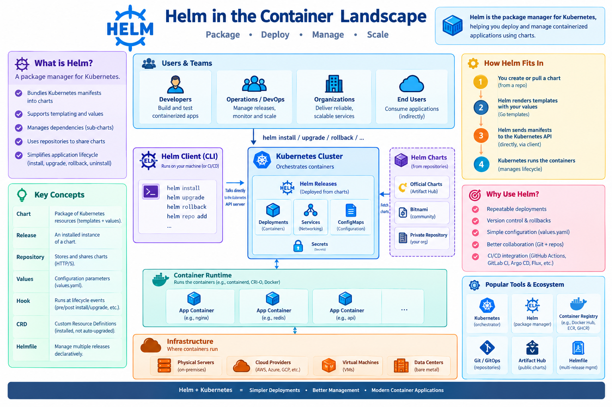
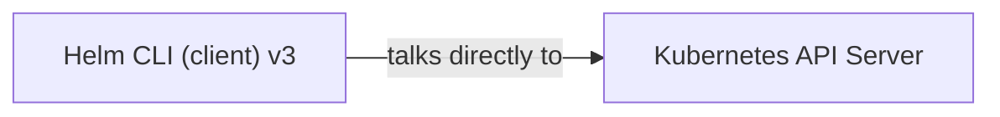

# Helm

!!! info "Learning Objectives"
    By the end of this guide, you will be able to:
    - Understand the purpose of a package manager in the Kubernetes ecosystem.
    - Differentiate between Helm Charts, Values, and Releases.
    - Install, upgrade, and rollback applications using Helm.
    - Create and customize your own basic Helm Chart.
    - Evaluate the trade-offs between Helm's templating and other configuration management methods.


*This Helm guide that covers installation, core concepts, hands‑on chart creation, repository management, best‑practices, and troubleshooting.*


<a name="what-is-helm"></a>
## 1. What is Helm?

| Feature | Description |
|---------|-------------|
| **Package manager for Kubernetes** | Helm bundles a set of Kubernetes resources (YAML) into a **Chart** that can be versioned and shared. |
| **Declarative releases** | A **Release** is an instantiated Chart with a specific set of values applied to a target cluster. |
| **Templating engine** | Uses Go‑template syntax (`{{ .Values.foo }}`) to render manifests at install/upgrade time. |
| **Dependency management** | Charts can declare other charts as **sub‑charts**, similar to npm / pip dependencies. |
| **Repository ecosystem** | Public (e.g., Artifact Hub) and private repos host thousands of ready‑made charts. |

!!! tip 
    Helm is to Kubernetes what `apt`/`yum` is to Linux: a **single source of truth** for “how to run X”.



---

## 2. Why Use Helm?

| Use‑case | Helm advantage |
|----------|----------------|
| **Repeatable deployments** | One command (`helm install`) provisions a full stack (Deployments, Services, ConfigMaps, etc.). |
| **Version control** | Charts are versioned (`1.2.3`); you can roll back (`helm rollback`). |
| **Parameterisation** | End‑users only need to edit a small `values.yaml` instead of dozens of manifests. |
| **Team collaboration** | Charts live in Git, can be reviewed via PRs, and are consumed identically across dev / prod clusters. |
| **CI/CD integration** | Helm integrates smoothly with GitHub Actions, GitLab CI, Jenkins, Argo CD, Flux, etc. |

---

## 3. Install Helm (Client‑side)

| OS | Command |
|----|---------|
| **Linux (binary)** | ```bash curl https://raw.githubusercontent.com/helm/helm/main/scripts/get-helm-3 | bash``` |
| **macOS (Homebrew)** | ```brew install helm``` |
| **Windows (Chocolatey)** | ```choco install kubernetes-helm``` |
| **Docker (no host install)** | ```docker run --rm -it -v $HOME/.kube:/root/.kube alpine/helm:3.14.0 version``` |

!!! tip
    **Verify**: `helm version` should output something like `v3.14.0+...`.

### Configure a Kubernetes Context (if not already)

```bash
# Example: using a GKE cluster
gcloud container clusters get-credentials my‑cluster --region us-central1

# Verify connection
kubectl get nodes
```

---

<a name="core-concepts"></a>
## 4. Helm Architecture & Core Concepts



### Terminology

| Term | Meaning |
|------|---------|
| **Chart** | A directory (or packaged `.tgz`) containing `Chart.yaml`, `values.yaml`, `templates/`, and optional `charts/` (sub‑charts). |
| **Release** | A deployed instance of a chart (e.g., `my‑app‑prod`). |
| **Repository** | HTTP(S) server that stores packaged charts (`index.yaml`). |
| **Values** | Configurable parameters (`values.yaml`) that get rendered into templates. |
| **Hook** | Special manifest executed at lifecycle events (`pre‑install`, `post‑upgrade`, etc.). |
| **CRD** | Custom Resource Definition – Helm can install them but does **not** upgrade them automatically. |
| **Helmfile** | Declarative wrapper to manage multiple releases with a single file. |

---

<a name="commands-cheat-sheet"></a>
## 5. Basic Helm Commands Cheat‑Sheet

| Command | Description | Example |
|---------|-------------|---------|
| `helm repo add <name> <url>` | Add a chart repo | `helm repo add bitnami https://charts.bitnami.com/bitnami` |
| `helm repo update` | Refresh local `index.yaml` cache | `helm repo update` |
| `helm search repo <keyword>` | Search charts in added repos | `helm search repo redis` |
| `helm install <release> <chart> [flags]` | Deploy a new release | `helm install my‑redis bitnami/redis --set auth.password=Secret123` |
| `helm upgrade <release> <chart> [flags]` | Upgrade an existing release | `helm upgrade my‑redis bitnami/redis --set replicaCount=3` |
| `helm rollback <release> [revision]` | Roll back to a previous revision | `helm rollback my‑redis 2` |
| `helm uninstall <release>` | Delete a release (removes all resources) | `helm uninstall my‑redis` |
| `helm list` | List all releases in current namespace | `helm list -A` |
| `helm get values <release>` | Show the values used for a release | `helm get values my‑redis -a` |
| `helm template <chart>` | Render chart locally (no install) | `helm template my‑chart ./my‑chart` |
| `helm lint <chart>` | Validate chart structure & templates | `helm lint ./my‑chart` |
| `helm package <chart>` | Package a chart directory into `.tgz` | `helm package ./my‑chart` |
| `helm repo index .` | Generate an `index.yaml` for a local repo directory | `helm repo index ./repo` |
| `helm dependency update` | Pull sub‑chart dependencies defined in `Chart.yaml` | `helm dependency update ./my‑chart` |

---

<a name="first-chart"></a>
## 6. Creating Your First Chart – “Hello‑World” Web App

### 61. Scaffold a New Chart

```bash
helm create hello-world
cd hello-world
```

The scaffold creates:
```
hello-world/
├─ .helmignore
├─ Chart.yaml
├─ values.yaml
├─ charts/                # sub‑charts go here
└─ templates/
   ├─ deployment.yaml
   ├─ service.yaml
   ├─ ingress.yaml
   └─ _helpers.tpl
```

### 62. Edit `Chart.yaml`

```yaml
apiVersion: v2         # Helm 3 uses v2 charts
name: hello-world
description: A minimal Helm chart for a static web page
type: application
version: 0.1.0
appVersion: "1.0"
```

### 63. Define Runtime Values (`values.yaml`)

```yaml
replicaCount: 2

image:
  repository: nginx
  tag: "1.25-alpine"
  pullPolicy: IfNotPresent

service:
  type: ClusterIP
  port: 80

ingress:
  enabled: false   # set true to expose via Ingress
  className: ""
  annotations: {}
  hosts:

    - host: chart-example.local
      paths:

        - path: /
          pathType: ImplementationSpecific
  tls: []          # e.g., - secretName: chart-example-tls

resources: {}
nodeSelector: {}
tolerations: []
affinity: {}
```

### 64. Templating – `templates/deployment.yaml`

```yaml
apiVersion: apps/v1
kind: Deployment
metadata:
  name: {{ include "hello-world.fullname" . }}
  labels:
    {{- include "hello-world.labels" . | nindent 4 }}
spec:
  replicas: {{ .Values.replicaCount }}
  selector:
    matchLabels:
      {{- include "hello-world.selectorLabels" . | nindent 6 }}
  template:
    metadata:
      labels:
        {{- include "hello-world.selectorLabels" . | nindent 8 }}
    spec:
      containers:

        - name: {{ .Chart.Name }}
          image: "{{ .Values.image.repository }}:{{ .Values.image.tag }}"
          imagePullPolicy: {{ .Values.image.pullPolicy }}
          ports:

            - containerPort: 80
          resources:
            {{- toYaml .Values.resources | nindent 12 }}
```

*(No need to modify the rest – the scaffold already injects the right helpers.)*

### 65. Render Locally (no cluster)

```bash
helm template hello-world .
```

You should see fully‑rendered Kubernetes manifests printed to STDOUT.

### 66. Deploy to a Cluster

```bash
helm install hello ./hello-world \
  --namespace demo --create-namespace \
  --set replicaCount=3 \
  --set service.type=LoadBalancer
```

**Verify**

```bash
kubectl -n demo get all -l app.kubernetes.io/name=hello-world
```

### 67. Upgrade Example – Enable Ingress

```bash
helm upgrade hello ./hello-world \
  --set ingress.enabled=true \
  --set ingress.hosts[0].host=hello.example.com
```

### 68. Rollback

```bash
helm rollback hello 1   # revert to revision 1 (the install)
```

### 69. Clean‑up

```bash
helm uninstall hello -n demo
kubectl delete ns demo
```

---

<a name="repo-publish"></a>
## 7. Packaging & Publishing a Chart Repository

### 71. Package the Chart

```bash
helm package ./hello-world   # creates hello-world-0.1.0.tgz
```

### 72. Create a Simple Static Repo (GitHub Pages)

1. **Create a Git repo** (e.g., `my-charts`).  
2. **Push the `.tgz`** file to the repository root (or a `charts/` sub‑folder).  
3. **Generate `index.yaml`**:

```bash
helm repo index . --url https://<username>.github.io/my-charts
git add .
git commit -m "Add hello‑world chart"
git push origin main
```

4. **Enable GitHub Pages** → **Source**: `main` branch → `/ (root)`.  
   The repo URL becomes `https://<username>.github.io/my-charts`.

### 73. Consume the Repo

```bash
helm repo add myrepo https://<username>.github.io/my-charts
helm repo update
helm search repo hello-world
helm install my-app myrepo/hello-world
```

> **Private repos** – Use an authenticated HTTP server (e.g., Nexus, ChartMuseum) or Helm’s `--username/--password` flags.

---

<a name="cicd"></a>
## 8. Using Helm in a CI/CD Pipeline (GitHub Actions Example)

```yaml
name: Deploy Helm Chart

on:
  push:
    branches: [ main ]

jobs:
  deploy:
    runs-on: ubuntu-latest
    steps:

      - name: Checkout repo
        uses: actions/checkout@v4

      - name: Set up K8s (kubeconfig)
        uses: azure/setup-kubectl@v3
        with:
          version: 'v1.28.0'

      - name: Install Helm
        run: |
          curl https://raw.githubusercontent.com/helm/helm/main/scripts/get-helm-3 | bash

      - name: Helm lint
        run: helm lint ./chart

      - name: Helm upgrade/install
        env:
          KUBECONFIG: ${{ secrets.KUBE_CONFIG }}
        run: |
          helm repo add myrepo https://example.com/charts
          helm upgrade --install my-app ./chart \
            --namespace prod --create-namespace \
            --set image.tag=${{ github.sha }}
```

*Key points*:  

- Use `helm lint` as a gate.  
- `helm upgrade --install` is idempotent.  
- Pass the commit SHA as image tag for traceability.

---

<a name="advanced"></a>
## 9. Advanced Topics

| Feature | What it solves | Quick example |
|---------|----------------|---------------|
| **Values hierarchy** | Merge defaults, `values.yaml`, `--set`, `-f` files, and chart defaults. | `helm install -f prod.yaml -f extra.yaml` |
| **Sub‑charts** | Share common components (e.g., PostgreSQL) across many applications. | `charts/postgresql/` inside main chart; parent can override `postgresql.enabled` |
| **Helm Hooks** | Run Jobs before/after install/upgrade (e.g., DB migrations). | ```yaml metadata: annotations: "helm.sh/hook": pre-upgrade ``` |
| **CRDs** | Package Custom Resource Definitions (CRDs) separate from normal templates. | `crds/` folder; Helm installs them *once* on first install. |
| **Helmfile** | Declarative multi‑release management (like a `docker‑compose` for Helm). | `helmfile.yaml` → `helmfile sync` |
| **Helm Diff Plugin** | Show diff between current release and upcoming upgrade. | `helm plugin install https://github.com/databus23/helm-diff` |
| **Helm Secrets** | Encrypt secret values (`sops` + `helm-secrets`). | `helm secrets upgrade … -f secret.yaml.enc` |
| **Using OCI Registries** | Store charts in Docker/OCI registries (`helm push`). | `helm push mychart-0.1.0.tgz oci://registry.example.com/charts` |

---

<a name="best-practices"></a>
##  Best‑Practice Checklist

|  Checklist Item | Why it matters |
|------------------|----------------|
| **Pin chart and application versions** | Guarantees reproducible releases (`appVersion`, `chart.version`). |
| **Keep Secrets out of `values.yaml`** | Use external secret managers (SealedSecrets, External Secrets, Helm Secrets). |
| **Validate with `helm lint` & `helm template --debug`** | Catches syntax errors before applying to a cluster. |
| **Use `--atomic` on CI installs** | Guarantees rollback on failure (`helm install --atomic`). |
| **Store releases in a dedicated namespace** | Prevents accidental cross‑namespace deletions. |
| **Provide a README** in each chart repo – list required values, defaults, and known limitations. |
| **Version your repo** (`helm repo index`) after each chart change. |
| **Avoid mutable tags** (`latest`) in `values.yaml`; pin exact image tag digest. |
| **Test upgrades** – bump minor version and run `helm upgrade --dry-run`. |
| **Limit chart size** – keep templates under 100 KB each for readability. |
| **Use `helm diff` in PR pipelines** – reviewers see exact changes. |
| **Document hooks** – clearly mark pre‑/post‑install jobs, and make them idempotent. |

---

<a name="troubleshooting"></a>
## 11. Common Errors & How to Fix Them

| Symptom | Likely Cause | Fix |
|---------|--------------|-----|
| `Error: no kind “Ingress” is registered` | Cluster missing the Ingress API (e.g., older K8s version). | Upgrade cluster or enable the appropriate Ingress controller CRD. |
| `Release "X" failed: cannot patch ... no such file or directory` | Helm tried to patch a resource that was deleted manually. | Run `helm rollback X` or `helm uninstall X && helm install X …`. |
| `Error: failed to download "myrepo/mychart" (hint: running `helm repo update` may help)` | Repo URL unreachable or `index.yaml` missing. | Verify repo URL, network, and that `helm repo update` succeeded. |
| `Error: rendered manifests contain a resource that already exists` | Trying to install a chart where resources already exist (e.g., previous failed install). | Use `helm upgrade --install` or delete the existing resource manually. |
| `helm lint` shows “undefined variable” | Template references a value that isn’t defined. | Add a default in `values.yaml` or guard with `{{- if .Values.foo }}`. |
| `helm upgrade` results in “no changes detected” but you changed `values.yaml` | The values file wasn’t passed (`-f`) or `--set` overridden incorrectly. | Ensure the right file is used; run `helm get values <release> -a` to verify. |
| `helm uninstall` leaves behind PVCs | PVCs aren’t deleted automatically (by design). | Add `persistentVolumeReclaimPolicy: Delete` on the PV or delete PVCs manually. |
| `helm template` prints “{{ .Release.Name }}” literally | The file isn’t in the `templates/` directory or is named with a non‑`.yaml` extension. | Move the file into `templates/` and give it a `.yaml` suffix. |

---


## Appendix

!!! note "Hands-on Challenges"
    1. **Chart Exploration**: Find a popular public chart on Artifact Hub (e.g., Redis or PostgreSQL) and install it in your local cluster.
    2. **Value Overrides**: Deploy an application using a Helm chart, but override at least three default values using a custom `my-values.yaml` file.
    3. **Lifecycle Management**: Perform a successful deployment, then update a value in your chart, upgrade the release, and finally roll it back to the previous version using `helm rollback`.
    4. **Custom Chart**: Create your own Helm chart for a simple Nginx deployment and test it locally.

### References & Further Reading

| Resource | Link |
|----------|------|
| **Official Helm Docs (v3)** | https://helm.sh/docs/ |
| **Chart Best Practices** | https://helm.sh/docs/topics/charts/ |
| **Artifact Hub (public chart repo)** | https://artifacthub.io/ |
| **Helm Plugins Directory** | https://github.com/helm/helm-plugins |
| **Helmfile** | https://github.com/helmfile/helmfile |
| **OCI Helm Registry Spec** | https://github.com/opencontainers/distribution-spec/blob/main/spec.md |
| **Helm Secrets (sops integration)** | https://github.com/jkroepke/helm-secrets |
| **Kubernetes Docs – Declarative Configuration** | https://kubernetes.io/docs/concepts/configuration/overview/ |

### Quick Start Example

```bash
helm repo add bitnami https://charts.bitnami.com/bitnami && \
helm install hello bitnami/nginx --set service.type=LoadBalancer
```

That single command pulls a ready-made NGINX chart, creates a LoadBalancer service, and gives you a running web server in seconds.

