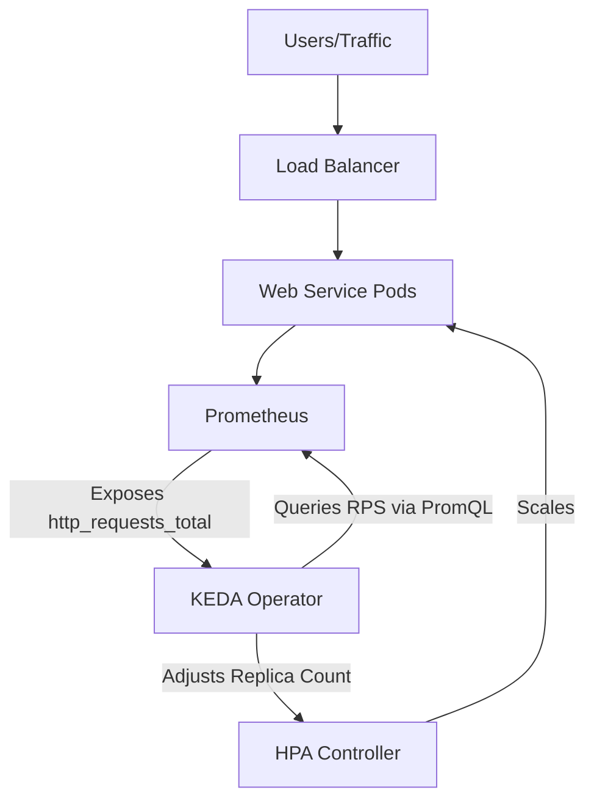

# Kubernetes Horizontal Pod Autoscaling (HPA)

!!! info "Learning Objectives"
    After completing this chapter, you will be able to:
    - Implement a Horizontal Pod Autoscaler (HPA) based on CPU utilization.
    - Configure resource requests and limits required for HPA functionality.
    - Compare reactive CPU-based scaling with proactive Request-Per-Second (RPS) scaling using KEDA.

## Overview

The Horizontal Pod Autoscaler (HPA) automatically adjusts the number of pod replicas in a deployment to maintain a target resource utilization level. 

!!! info "Why this matters"
    In AI workloads, GPU resources are extremely expensive. Over-provisioning (keeping 10 GPU pods running when only 2 are needed) wastes significant budget. Conversely, under-provisioning during a traffic spike leads to request timeouts and model crashes. HPA allows the cluster to be "elastic," scaling capacity up for peak demand and down to save costs during idle periods.

While Kubernetes can scale based on custom metrics using tools like Prometheus or KEDA, the standard approach is scaling based on CPU utilization. As request volume increases, CPU usage rises, triggering the HPA to instantiate additional pods.

## Implementation Steps

### 1. Deploy Web Service

Define the web service deployment and set resource requests and limits. HPA requires these requests to calculate percentage utilization.

```yaml
apiVersion: apps/v1
kind: Deployment
metadata:
  name: web-service
spec:
  replicas: 2
  selector:
    matchLabels:
      app: web-service
  template:
    metadata:
      labels:
        app: web-service
    spec:
      containers:
      - name: web-app
        image: nginx:latest
        ports:
        - containerPort: 80
        resources:
          requests:
            cpu: "100m"
            memory: "128Mi"
          limits:
            cpu: "500m"
            memory: "256Mi"
---
apiVersion: v1
kind: Service
metadata:
  name: web-service-svc
spec:
  selector:
    app: web-service
  ports:
  - protocol: TCP
    port: 80
    targetPort: 80
  type: ClusterIP
```

### 2. Create the Horizontal Pod Autoscaler (HPA)

Create an HPA object targeting the deployment. The following configuration maintains an average 50% CPU utilization across all pods, scaling between a minimum of 2 and a maximum of 10 replicas.

```yaml
apiVersion: autoscaling/v2
kind: HorizontalPodAutoscaler
metadata:
  name: web-service-hpa
spec:
  scaleTargetRef:
    apiVersion: apps/v1
    kind: Deployment
    name: web-service
  minReplicas: 2
  maxReplicas: 10
  metrics:
  - type: Resource
    resource:
      name: cpu
      target:
        type: Utilization
        averageUtilization: 50
```

## Scaling Process Under Load

1. **Baseline State**: The application runs with the minimum defined replicas (e.g., 2 pods).
2. **Traffic Increase**: Incoming request volume increases, causing CPU usage to exceed the 50% target.
3. **Scale Out**: The Kubernetes Metrics Server detects high CPU usage, and the HPA controller increases the replica count. The load balancer distributes traffic across the new pods.
4. **Scale In**: As traffic decreases and CPU utilization falls below the target, the HPA reduces the replica count to conserve cluster resources.

## Advanced Scaling Options

### Scaling on Request Count (RPS)

CPU-based scaling is reactive, as it waits for resource stress to occur. To scale proactively based on traffic volume, KEDA (Kubernetes Event-driven Autoscaling) or a Prometheus Adapter is used.

#### KEDA (Kubernetes Event-driven Autoscaling)

KEDA is an operator that extends HPA to allow scaling based on external events. For RPS scaling, KEDA uses the Prometheus Scaler to query the actual request rate from a Prometheus server.

**KEDA RPS Architecture:**



**Implementation Example (KEDA ScaledObject):**

The following configuration scales the `web-service` based on a Prometheus query calculating the sum of requests per second over a 2-minute window.

```yaml
apiVersion: keda.sh/v1alpha1
kind: ScaledObject
metadata:
  name: web-service-rps-scaler
spec:
  scaleTargetRef:
    name: web-service
  minReplicaCount: 2
  maxReplicaCount: 10
  triggers:
    - type: prometheus
      metadata:
        serverAddress: http://prometheus-server.monitoring.svc.cluster.local:9090
        metricName: http_requests_per_second
        query: sum(rate(http_requests_total{app="web-service"}[2m]))
        threshold: '100'
```

#### Prometheus Adapter

The Prometheus Adapter bridges Prometheus and the Kubernetes Custom Metrics API (`custom.metrics.k8s.io`).

1. **Mapping**: The adapter maps a Prometheus query (e.g., `rate(http_requests_total[2m])`) to a custom Kubernetes metric named `http_requests_per_second`.
2. **Consumption**: The standard HPA targets this custom metric instead of CPU utilization.

#### Comparison: CPU Scaling vs. RPS Scaling

| Feature | Standard HPA (CPU/Memory) | KEDA / Prometheus Adapter (RPS) |
| :--- | :--- | :--- |
| Metric Source | Internal (Metrics Server) | External (Prometheus/Event Source) |
| Scaling Logic | % of requested resources | Absolute values (e.g., 100 req/sec) |
| Responsiveness | Reactive | Proactive |
| Scaling Range | 1 to N | 0 to N (Scale-to-Zero via KEDA) |
| Primary Use Case | Compute-heavy workloads | I/O-bound or high-traffic services |

## Summary Checklist

- [ ] Resource requests and limits are defined in the Deployment.
- [ ] Metrics Server is installed in the cluster.
- [ ] HPA target utilization is aligned with application performance profiles.
- [ ] Max and min replica counts are set to prevent resource exhaustion or service unavailability.

## Assignments

1. Deploy the `web-service` and `web-service-hpa` provided in this chapter.
2. Use a load testing tool (e.g., `hey` or `ab`) to generate traffic and observe the HPA scaling via `kubectl get hpa -w`.
3. Modify the HPA target utilization to 20% and observe how the scaling speed changes.

## Self-Assessment
Test your knowledge by expanding the questions below.
??? question "Why are resource requests mandatory for CPU-based HPA?"
    HPA calculates utilization as a percentage of the requested resources. Without a defined request, the HPA cannot determine the current utilization percentage.

??? question "What is the primary difference between Standard HPA and KEDA scaling?"
    Standard HPA is primarily reactive and relies on internal resource metrics (CPU/Memory), while KEDA is proactive and can scale based on external event sources and custom metrics, including scaling to zero.

??? question "In what scenario is RPS scaling preferred over CPU scaling?"
    RPS scaling is preferred for I/O-bound services where traffic spikes may cause latency increases before CPU usage significantly rises.
