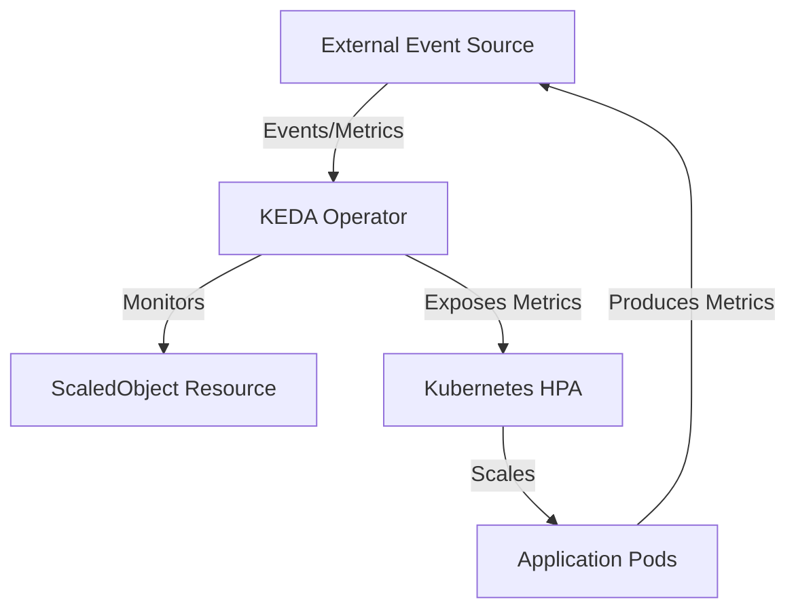

# RPS Autoscaling with KEDA

!!! info "Learning Objectives"
    After completing this chapter, you will be able to:
    * Define KEDA and its role in Kubernetes autoscaling.
    * Explain the difference between standard HPA and event-driven scaling.
    * Implement a `ScaledObject` to scale deployments based on Requests Per Second (RPS).
    * Identify suitable KEDA scalers for various event sources.

## Overview

KEDA (Kubernetes Event-driven Autoscaling) is a lightweight component that enables Kubernetes applications to scale based on the volume of events or requests from external systems. It extends the native Horizontal Pod Autoscaler (HPA) by allowing scaling based on metrics other than CPU or memory.

!!! info "Why this matters"
    CPU and memory are "lagging" indicators. By the time a GPU-heavy AI model causes CPU stress, the request queue may already be backed up, leading to high latency. Scaling based on Requests Per Second (RPS) allows the cluster to be "proactive"—adding capacity the moment traffic spikes, *before* the existing pods become overwhelmed.

## KEDA Core Concepts

## KEDA Core Concepts

KEDA allows applications to scale based on the exact volume of events coming from external systems.

### Architecture

KEDA operates as a bridge between Kubernetes and external event sources using two main components:



1. **KEDA Operator**: A controller that manages `ScaledObject` custom resources. The `ScaledObject` defines the trigger (e.g., a Prometheus metric) and the scaling parameters.
2. **Metrics Server**: KEDA exposes external metrics to the native Kubernetes HPA, which then handles the actual pod creation and deletion.

### Use Cases for KEDA

* **E-commerce Sales**: Scaling a checkout service during a flash sale based on the spike in requests per second.
* **Payment Processing**: Scaling workers based on the depth of a RabbitMQ queue to ensure timely transaction processing.
* **Batch Processing**: Scaling to zero during off-hours and scaling up automatically when a scheduled Cron trigger activates.
* **API Gateways**: Adjusting capacity based on the number of active TCP connections or HTTP request rates monitored by Prometheus.

## Implementing RPS Scaling

To scale a web service based on Requests Per Second (RPS), KEDA is paired with Prometheus to monitor request rates.

### Prerequisites

The following components must be available in the cluster:

1. KEDA installed.
2. Prometheus configured to scrape web service metrics (e.g., an `http_requests_total` counter).

### Configuring the ScaledObject

The `ScaledObject` resource tells KEDA to query Prometheus and scale the deployment based on the returned value.

```yaml
apiVersion: keda.sh/v1alpha1
kind: ScaledObject
metadata:
  name: web-service-scaler
  namespace: default
spec:
  scaleTargetRef:
    apiVersion: apps/v1
    kind: Deployment
    name: web-service
  minReplicaCount: 2
  maxReplicaCount: 10
  cooldownPeriod: 300
  pollingInterval: 15
  triggers:
  - type: prometheus
    metadata:
      serverAddress: http://prometheus-k8s.monitoring.svc.cluster.local:9090
      query: sum(rate(http_requests_total{app="web-service"}[1m]))
      threshold: '50'
```

### Scaling Workflow

1. **Metric Collection**: The web application exposes a `/metrics` endpoint. Prometheus scrapes this endpoint to track `http_requests_total`.
2. **Evaluation**: KEDA queries Prometheus every 15 seconds (`pollingInterval`) using the specified PromQL expression.
3. **Scaling Action**:
    * If the current request rate per pod exceeds the `threshold` (e.g., 50 requests/sec), KEDA increases the replica count.
    * After traffic remains low for the duration of the `cooldownPeriod`, KEDA reduces the replica count to `minReplicaCount`.

### Concrete Example: Hands-on Scaling a Python Flask API

Follow these steps to implement RPS autoscaling in your cluster.

**1. Install KEDA**
Install KEDA using Helm:
```bash
helm repo add kedacore https://kedacore.github.io/charts
helm repo update
helm install keda kedacore/keda
```

**2. Deploy the Sample Application**
Create a Flask application that exposes Prometheus metrics. Use the following deployment manifest:
```yaml
apiVersion: apps/v1
kind: Deployment
metadata:
  name: flask-api-deployment
  labels:
    app: flask-api
spec:
  replicas: 1
  selector:
    matchLabels:
      app: flask-api
  template:
    metadata:
      labels:
        app: flask-api
      annotations:
        prometheus.io/scrape: "true"
        prometheus.io/port: "8080"
    spec:
      containers:
      - name: flask-api
        image: cloudmesh/flask-prometheus-demo:latest # Replace with your actual image
        ports:
        - containerPort: 8080
---
apiVersion: v1
kind: Service
metadata:
  name: flask-api-service
spec:
  selector:
    app: flask-api
  ports:
  - port: 80
    targetPort: 8080
```

**3. Configure the ScaledObject**
Apply the `ScaledObject` to link KEDA with your Prometheus server:
```yaml
apiVersion: keda.sh/v1alpha1
kind: ScaledObject
metadata:
  name: flask-api-scaler
  namespace: default
spec:
  scaleTargetRef:
    name: flask-api-deployment
  minReplicaCount: 1
  maxReplicaCount: 20
  triggers:
  - type: prometheus
    metadata:
      serverAddress: http://prometheus-server.monitoring.svc.cluster.local:9090
      threshold: '100' 
      query: sum(rate(http_requests_total{app="flask-api"}[1m]))
```

**4. Test and Verify**
Generate load using a tool like `hey` or `fortio`:
```bash
# Send 1000 requests at 200 RPS
hey -z 5m -q 200 http://<flask-api-service-ip>
```

Observe the scaling in real-time:
```bash
kubectl get pods -w
kubectl get hpa
```

**Expected Result**:
- **Baseline**: 1 pod active.
- **Under Load**: Once the RPS exceeds 100, you will see KEDA trigger the HPA, and new pods will be created to handle the traffic.
- **Recovery**: Once the load stops, pods will scale back down to 1 after the `cooldownPeriod`.

## KEDA Scalers Reference

KEDA provides support for various event triggers.

### Messaging and Streaming

* Apache Kafka
* Apache Pulsar
* RabbitMQ
* ActiveMQ / ActiveMQ Artemis
* NATS JetStream / NATS Streaming
* AWS SQS / AWS Kinesis
* Azure Service Bus / Azure Storage Queues / Azure Event Hubs
* GCP Pub/Sub / GCP Cloud Tasks

### Databases and Caching

* PostgreSQL
* Redis
* Apache Cassandra
* Elasticsearch / OpenSearch
* ClickHouse
* Google Cloud Spanner
* CouchDB / ArangoDB
* AWS DynamoDB
* Azure Cosmos DB / Azure Data Explorer

### Observability and Telemetry

* Prometheus
* Datadog
* Dynatrace
* Grafana Loki
* Graphite
* AWS CloudWatch / Azure Monitor / GCP Stackdriver
* New Relic / Splunk / Sumo Logic

### Other Triggers

* **HTTP**: Standard HTTP/HTTPS traffic via KEDA HTTP Add-on.
* **Cloud Storage**: Azure Blob Storage, GCP Cloud Storage.
* **Automation**: GitHub Runners, Azure Pipelines.
* **General**: Cron/Schedule-based scaling, CPU/Memory consumption, and Generic API polling.

## Summary Checklist

- [ ] KEDA installed in the cluster.
- [ ] Prometheus scraping application metrics.
- [ ] `ScaledObject` defined with correct `scaleTargetRef`.
- [ ] `pollingInterval` and `cooldownPeriod` configured for stability.
- [ ] PromQL query correctly calculates the rate per pod.

## Assignments

1. **Deploy a ScaledObject**: Install KEDA in a development cluster and create a `ScaledObject` that scales a sample deployment based on a Prometheus query.
2. **Test Scale-to-Zero**: Configure a `ScaledObject` with `minReplicaCount: 0` and verify that pods are terminated when the event source is empty.
3. **Analyze Cooldown**: Modify the `cooldownPeriod` and observe how it affects the timing of scale-down events during fluctuating traffic.

## Self-Assessment
Test your knowledge by expanding the questions below.
??? question "What is the primary difference between KEDA and the standard Kubernetes HPA?"
    Standard HPA typically scales based on resource metrics like CPU and memory, while KEDA allows scaling based on external event sources such as message queues or Prometheus queries.

??? question "What is the purpose of the `cooldownPeriod` in a `ScaledObject`?"
    The `cooldownPeriod` defines the number of seconds KEDA waits after the last scale-up event before it begins scaling down, preventing "flapping" (rapidly scaling up and down).

??? question "How does KEDA achieve 'Scale to Zero'?"
    KEDA monitors the event source directly; when no events are detected, it scales the deployment to 0. When a new event arrives, KEDA triggers the creation of the first pod, which is then managed by the HPA.
