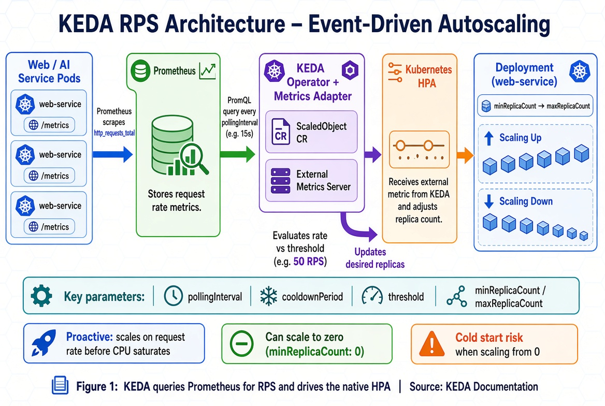

# RPS Autoscaling with KEDA

## Learning Objectives

!!! info "Learning Objectives"
    By the end of this chapter, participants will be able to:
    - Define KEDA and its role in the Kubernetes autoscaling ecosystem.
    - Contrast standard HPA (resource-based) with event-driven scaling.
    - Implement a `ScaledObject` to scale deployments based on Requests Per Second (RPS).
    - Identify and select appropriate KEDA scalers for various external event sources.
    - Tune scaling parameters (`pollingInterval`, `cooldownPeriod`) for production stability.
    - Manage the "Cold Start" problem when scaling from zero replicas.

## Overview

KEDA (Kubernetes Event-driven Autoscaling) is a lightweight component that enables Kubernetes applications to scale based on the volume of events or requests from external systems. It extends the native Horizontal Pod Autoscaler (HPA) by allowing scaling based on metrics other than CPU or memory.

!!! info "Why this matters"
    CPU and memory are "lagging" indicators. In AI inference, a model may be computationally expensive but the CPU usage might not spike until the request queue is already saturated. By the time a standard HPA triggers, the user has already experienced several seconds of latency. Scaling based on Requests Per Second (RPS) allows the cluster to be "proactive"—adding capacity the moment traffic spikes, *before* the existing pods become overwhelmed.

## Implementation

### KEDA Architecture and Concepts

KEDA allows applications to scale based on the exact volume of events coming from external systems. It acts as a bridge between an external event source and the native Kubernetes HPA.

#### How KEDA Works

1. **KEDA Operator**: A controller that manages `ScaledObject` custom resources. The `ScaledObject` defines the trigger (e.g., a Prometheus metric) and the scaling parameters.
2. **Metrics Server**: KEDA exposes external metrics to the native Kubernetes HPA, which then handles the actual pod creation and deletion.




Figure 1: KEDA RPS Architecture. KEDA queries Prometheus for request rates and adjusts the HPA replica count accordingly.

#### Common Use Cases for KEDA

- **E-commerce Sales**: Scaling a checkout service during a flash sale based on the spike in requests per second.
- **Payment Processing**: Scaling workers based on the depth of a RabbitMQ queue to ensure timely transaction processing.
- **Batch Processing**: Scaling to zero during off-hours and scaling up automatically when a scheduled Cron trigger activates.
- **AI Inference APIs**: Scaling based on the number of active inference requests to maintain a strict SLI (Service Level Indicator) for latency.

### Implementing RPS Scaling

To scale a web service based on Requests Per Second (RPS), KEDA is paired with Prometheus to monitor request rates.

#### Prerequisites

The following components must be available in the cluster:
- **KEDA**: Installed via Helm or YAML manifests.
- **Prometheus**: Configured to scrape web service metrics (e.g., an `http_requests_total` counter).

#### Configuring the ScaledObject

The `ScaledObject` resource tells KEDA to query Prometheus and scale the deployment based on the returned value.

```yaml
apiVersion: keda.sh/v1alpha1
kind: ScaledObject
metadata:
  name: web-service-scaler
  namespace: default
spec:
  scaleTargetRef:
    apiVersion: apps/v1
    kind: Deployment
    name: web-service
  minReplicaCount: 2
  maxReplicaCount: 10
  cooldownPeriod: 300
  pollingInterval: 15
  triggers:
  - type: prometheus
    metadata:
      serverAddress: http://prometheus-server.monitoring.svc.cluster.local:9090
      query: sum(rate(http_requests_total{app="web-service"}[1m]))
      threshold: '50'
```

!!! tip "Tuning the Threshold"
    To determine the correct `threshold`, perform a load test on a single pod. Find the RPS at which the p99 latency exceeds your target (e.g., > 200ms). Set your threshold slightly *below* this value to ensure the cluster scales out before performance degrades.

#### The Scaling Workflow

1. **Metric Collection**: The web application exposes a `/metrics` endpoint. Prometheus scrapes this endpoint to track `http_requests_total`.
2. **Evaluation**: KEDA queries Prometheus every 15 seconds (`pollingInterval`) using the specified PromQL expression.
3. **Scaling Action**:
    - If the current request rate per pod exceeds the `threshold` (e.g., 50 requests/sec), KEDA increases the replica count.
    - After traffic remains low for the duration of the `cooldownPeriod`, KEDA reduces the replica count to `minReplicaCount`.

::: warning "The Metrics Latency Gap"
    There is a cumulative delay in the scaling loop: `Prometheus Scrape Interval` $\rightarrow$ `KEDA Polling Interval` $\rightarrow$ `Pod Startup Time`. If your scrape interval is 30s and polling is 15s, you may have a 45-60s lag before a new pod is ready. For high-traffic AI APIs, reduce these intervals or increase your `minReplicaCount` to handle the initial burst.
:::

### Hands-on: Scaling a Python Flask API

Follow these steps to implement RPS autoscaling in your cluster.

#### 1. Install KEDA
```bash
helm repo add kedacore https://kedacore.github.io/charts
helm repo update
helm install keda kedacore/keda
```

#### 2. Deploy the Sample Application
Deploy a Flask application that exposes Prometheus metrics:

```yaml
apiVersion: apps/v1
kind: Deployment
metadata:
  name: flask-api-deployment
  labels:
    app: flask-api
spec:
  replicas: 1
  selector:
    matchLabels:
      app: flask-api
  template:
    metadata:
      labels:
        app: flask-api
      annotations:
        prometheus.io/scrape: "true"
        prometheus.io/port: "8080"
    spec:
      containers:
      - name: flask-api
        image: cloudmesh/flask-prometheus-demo:latest
        ports:
        - containerPort: 8080
---
apiVersion: v1
kind: Service
metadata:
  name: flask-api-service
spec:
  selector:
    app: flask-api
  ports:
  - port: 80
    targetPort: 8080
```

#### 3. Configure the ScaledObject
Apply the `ScaledObject` to link KEDA with your Prometheus server:

```yaml
apiVersion: keda.sh/v1alpha1
kind: ScaledObject
metadata:
  name: flask-api-scaler
  namespace: default
spec:
  scaleTargetRef:
    name: flask-api-deployment
  minReplicaCount: 1
  maxReplicaCount: 20
  triggers:
  - type: prometheus
    metadata:
      serverAddress: http://prometheus-server.monitoring.svc.cluster.local:9090
      threshold: '100' 
      query: sum(rate(http_requests_total{app="flask-api"}[1m]))
```

#### 4. Test and Verify
Generate load using a tool like `hey` or `fortio`:

```bash
# Send 1000 requests at 200 RPS
hey -z 5m -q 200 http://<flask-api-service-ip>
```

Observe the scaling in real-time:
```bash
kubectl get pods -w
kubectl get hpa
```

### KEDA Scalers Reference

KEDA provides support for a wide array of event triggers:

- **Messaging and Streaming**: Apache Kafka, RabbitMQ, AWS SQS, Azure Service Bus, GCP Pub/Sub.
- **Databases and Caching**: PostgreSQL, Redis, MongoDB, AWS DynamoDB, Azure Cosmos DB.
- **Observability**: Prometheus, Datadog, Dynatrace, Grafana Loki.
- **Other Triggers**: HTTP traffic (via KEDA HTTP Add-on), Cloud Storage (S3/Blob), and Cron/Schedule-based scaling.

!!! tip "Managing Cold Starts"
    When `minReplicaCount` is set to 0, the first request after a period of inactivity will experience a "Cold Start" (delay while the pod starts). For latency-sensitive AI models, it is better to keep `minReplicaCount: 1` or use a `Cron` trigger to pre-warm the cluster before peak hours.

### References

- KEDA Documentation: [keda.sh/docs/](https://keda.sh/docs/)
- Prometheus Documentation: [prometheus.io/docs/](https://prometheus.io/docs/)

## Self-Evaluation

??? question "What is the primary difference between KEDA and the standard Kubernetes HPA?"
    Standard HPA typically scales based on internal resource metrics like CPU and memory. KEDA extends this by allowing scaling based on external event sources (e.g., queue depth, request rates), and it can scale deployments down to zero replicas.

??? question "What is the purpose of the `cooldownPeriod` in a `ScaledObject`?"
    The `cooldownPeriod` defines the window of time KEDA waits after the last scale-up event before it begins scaling down. This prevents "flapping," where a deployment rapidly scales up and down due to minor fluctuations in traffic.

??? question "How does KEDA achieve 'Scale to Zero'?"
    KEDA monitors the event source directly. When no events are detected, it scales the deployment to 0. When a new event arrives, KEDA triggers the creation of the first pod, which then hands over the scaling management to the native HPA.

??? question "Why is RPS scaling considered 'proactive' compared to CPU scaling?"
    RPS scaling responds to the *cause* of the load (incoming requests) rather than the *effect* of the load (CPU stress). This allows the system to start scaling pods before the existing pods are actually overwhelmed, reducing the likelihood of request timeouts.

??? question "What is a 'Cold Start' in the context of KEDA, and how can it be mitigated?"
    A cold start occurs when a deployment is scaled to zero and the first incoming request must wait for a new pod to be pulled and started. Mitigation strategies include keeping a `minReplicaCount: 1` or using `Cron` triggers to pre-warm pods before expected traffic spikes.

??? question "How does the `pollingInterval` affect the responsiveness of a KEDA-scaled application?"
    The `pollingInterval` determines how often KEDA checks the event source (e.g., Prometheus). A shorter interval makes the system more responsive to spikes but increases the load on the metrics server. A longer interval reduces overhead but introduces lag into the scaling decision.

??? question "If a deployment is scaled to zero by KEDA, how does the first request actually trigger a scale-up?"
    KEDA's operator continuously polls the external metric source. When the metric crosses the threshold, KEDA communicates with the Kubernetes API to scale the deployment to 1. Depending on the trigger (e.g., HTTP Add-on), KEDA may also hold the request in a queue until the first pod is ready to process it.

## Assignments

!!! note "Assignment.1: Deploy a ScaledObject"
    Install KEDA in a development cluster and create a `ScaledObject` that scales a sample deployment based on a Prometheus query.
    
    ??? tip "Solution: ScaledObject Deployment"
        Deploy the `flask-api` and apply the `ScaledObject` manifest. Verify that `kubectl get hpa` shows a new HPA created by KEDA.

!!! note "Assignment.2: Test Scale-to-Zero"
    Configure a `ScaledObject` with `minReplicaCount: 0` and verify that pods are terminated when the event source is empty.
    
    ??? tip "Solution: Scale-to-Zero"
        Set `minReplicaCount: 0` in the `ScaledObject`. Stop all traffic to the service and observe the pods being deleted via `kubectl get pods`.

!!! note "Assignment.3: Analyze Cooldown"
    Modify the `cooldownPeriod` and observe how it affects the timing of scale-down events during fluctuating traffic.
    
    ??? tip "Solution: Cooldown Analysis"
        Change `cooldownPeriod` from 300 to 60 seconds. Generate a burst of traffic and observe that the cluster scales down much more aggressively.

## What's Next?

Now that you've mastered advanced autoscaling, you have the tools to run high-performance AI workloads at scale. To wrap up your orchestration journey, review the **[Orchestration Comparison](/section/container/orchestration/orchestration-comparison.md)** to ensure you're using the right tool for your specific production environment.
