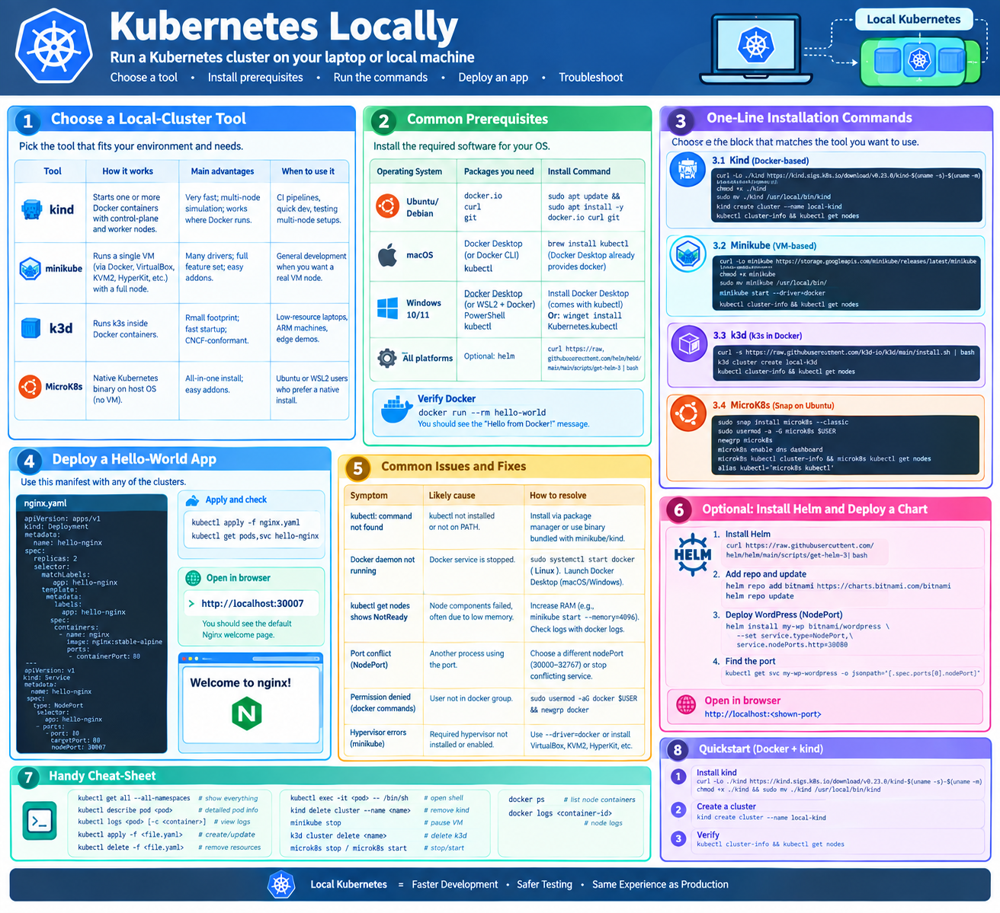

# Kubernetes locally 

Below is a plain‑text guide for creating a Kubernetes cluster that runs locally on a single machine.  
It covers the most common single‑node tools, the prerequisite software, and the exact commands you can copy‑paste. No emojis or special symbols are used.


!!! info "Learning Objectives"
    By the end of this guide, you will be able to:
    1. **Evaluate** and choose a local Kubernetes distribution (kind, minikube, k3d, or MicroK8s) based on your OS and resources.
    2. **Install** the required prerequisite tools, including Docker and kubectl.
    3. **Provision** a functional single-node or multi-node Kubernetes cluster on your local machine.
    4. **Verify** cluster health and connectivity using the Kubernetes CLI.
    5. **Deploy** a basic application and expose it to your local browser using NodePort services.
    6. **Manage** the cluster lifecycle (start, stop, and delete) for different local providers.

---




## 1. Choose a Local‑Cluster Tool

Setting up Kubernetes locally can be done using several different tools. The right choice depends on your operating system, available RAM, and whether you need a simple single-node cluster or a more complex multi-node simulation for testing.


| Tool | How it works | Main advantages | When to use it |
|------|--------------|---------|--------|
| **kind** (Kubernetes IN Docker) | Starts one or more Docker containers that host the control‑plane and worker nodes. | Very fast to start/stop; can simulate multi‑node clusters; works wherever Docker runs. | CI pipelines, quick local development, testing multi‑node configurations. |
| **minikube** | Runs a single VM (via Docker, VirtualBox, KVM2, HyperKit, etc.) that contains a full Kubernetes node. | Supports many drivers; full feature set; easy to enable addons. | General development when you want a “real” VM node. |
| **k3d** (k3s in Docker) | Runs a lightweight k3s distribution inside Docker containers. | Small memory/CPU footprint; fast startup; still CNCF‑conformant. | Low‑resource laptops, ARM machines, edge‑style demos. |
| **MicroK8s** (snap package) | Installs a native Kubernetes binary on the host OS (no VM). | All‑in‑one installation; easy to enable/disable addons. | Ubuntu or WSL2 users who prefer a native install. |

Pick the tool that best matches the software already installed on your computer and the resources you have available.

---

## 2. Common Prerequisites

Before installing any of the local Kubernetes distributions, you must ensure that your system has the necessary container runtime and command-line tools installed. Without these, the cluster tools will fail to provision the underlying nodes.


| Operating System | Packages you need | Installation command |
|-----------|-----------|--------------|
| Ubuntu / Debian | `docker.io` (or Docker CE), `curl`, `git` | `sudo apt update && sudo apt install -y docker.io curl git` |
| macOS | Docker Desktop (or Docker CLI via Homebrew), `kubectl` | `brew install kubectl` (Docker Desktop already provides `docker`) |
| Windows 10/11 | Docker Desktop **or** WSL2 + Docker Engine, PowerShell, `kubectl` | Install Docker Desktop → it includes `kubectl`. Or `winget install Kubernetes.kubectl` for a separate install. |
| All platforms | Optional but useful: `helm` (Kubernetes package manager) | `curl https://raw.githubusercontent.com/helm/helm/main/scripts/get-helm-3 | bash` |

After installing Docker, verify it works:

```bash
docker run --rm hello-world
```

If you see the “Hello from Docker!” message, Docker is ready.

---

## 3. One‑Line Installation Commands

To get your cluster up and running quickly, use the following commands. We have provided the most direct installation paths for each tool; simply copy and paste the block that matches your chosen distribution.


Below are the exact commands you can run in a terminal. Choose the block that matches the tool you want to use.

### 31. Kind (Docker‑based)

```bash
# Install kind (latest release)
curl -Lo ./kind https://kind.sigs.k8s.io/download/v0.23.0/kind-$(uname -s)-$(uname -m)
chmod +x ./kind
sudo mv ./kind /usr/local/bin/kind

# Create a single‑node cluster named "local-kind"
kind create cluster --name local-kind

# Verify the cluster
kubectl cluster-info
kubectl get nodes
```

*Optional multi‑node example*:

```bash
cat <<EOF > kind-config.yaml
kind: Cluster
apiVersion: kind.x-k8s.io/v1alpha4
nodes:
- role: control-plane
- role: worker
EOF

kind create cluster --name multi-node --config kind-config.yaml
```

### 32. Minikube (VM‑based)

```bash
# Install minikube (latest release)
curl -Lo minikube https://storage.googleapis.com/minikube/releases/latest/minikube-linux-amd64
chmod +x minikube
sudo mv minikube /usr/local/bin/

# Start a cluster using the Docker driver (fastest) or replace with another driver
minikube start --driver=docker   # alternatives: virtualbox, kvm2, hyperkit, etc.

# Verify the cluster
kubectl cluster-info
kubectl get nodes
```

You can enable useful addons, for example:

```bash
minikube addons enable ingress
minikube addons enable metrics-server
```

### 33. k3d (k3s in Docker)

```bash
# Install k3d
curl -s https://raw.githubusercontent.com/k3d-io/k3d/main/install.sh | bash

# Create a single‑node k3s cluster
k3d cluster create local-k3d

# Verify the cluster
kubectl cluster-info
kubectl get nodes
```

*Multi‑node demo*:

```bash
k3d cluster create multi-k3d --servers 1 --agents 2
```

### 34. MicroK8s (Snap on Ubuntu)

```bash
# Install MicroK8s
sudo snap install microk8s --classic

# Add your user to the microk8s group to avoid sudo for every command
sudo usermod -a -G microk8s $USER
newgrp microk8s   # refresh group membership in the current shell

# Enable common addons (DNS and the dashboard are often useful)
microk8s enable dns dashboard

# Verify the cluster
microk8s kubectl cluster-info
microk8s kubectl get nodes
```

If you prefer to use the plain `kubectl` command, add an alias to your shell profile:

```bash
alias kubectl='microk8s kubectl'
```

---

## 4. Quick “Hello‑World” Test

The following manifest deploys a simple Nginx server and exposes it via a NodePort. It works with any of the clusters created above.

```yaml
apiVersion: apps/v1
kind: Deployment
metadata:
  name: hello-nginx
spec:
  replicas: 2
  selector:
    matchLabels:
      app: hello-nginx
  template:
    metadata:
      labels:
        app: hello-nginx
    spec:
      containers:
      - name: nginx
        image: nginx:stable-alpine
        ports:
        - containerPort: 80
---
apiVersion: v1
kind: Service
metadata:
  name: hello-nginx
spec:
  type: NodePort
  selector:
    app: hello-nginx
  ports:
  - port: 80
    targetPort: 80
    nodePort: 30007
```

Apply it:

```bash
kubectl apply -f nginx.yaml
kubectl get pods,svc hello-nginx
```

Open a browser and navigate to `http://localhost:30007`. You should see the default Nginx welcome page.

---

## 5. Common Issues and Fixes

| Symptom | Likely cause | How to resolve |
|---------|--------------|--------|
| `kubectl: command not found` | `kubectl` not installed or not on PATH. | Install via package manager (`apt install -y kubectl`, `brew install kubectl`, or use the binary bundled with minikube/kind). |
| Docker daemon not running (`cannot connect to the Docker daemon`) | Docker service is stopped. | On Linux: `sudo systemctl start docker`. On macOS/Windows: launch Docker Desktop. |
| `kubectl get nodes` shows `NotReady` | Node components failed, often due to insufficient memory. | Increase allocated RAM (e.g., `minikube start --memory=4096`). Check logs with `docker logs <container-id>` for kind/k3d. |
| Port conflict when creating a NodePort service | Another process already bound to that port. | Choose a different `nodePort` (range 30000‑32767) or stop the conflicting service. |
| Permission denied when Docker commands are run (Linux) | User not in the `docker` group. | `sudo usermod -aG docker $USER && newgrp docker` (log out/in if needed). |
| Hypervisor driver errors with minikube | Required hypervisor not installed or not enabled. | Use `--driver=docker` to avoid a VM, or install the appropriate hypervisor (VirtualBox, KVM2, HyperKit, etc.). |

---

## 6. Optional: Install Helm and Deploy a Chart

While kubectl is sufficient for basic resources, Helm is the industry standard for managing complex applications. It allows you to define, install, and upgrade 'Charts' (packages) with a single command.


Helm simplifies installing complex applications.

```bash
# Install Helm (if not already installed)
curl https://raw.githubusercontent.com/helm/helm/main/scripts/get-helm-3 | bash

# Add the Bitnami chart repo and update
helm repo add bitnami https://charts.bitnami.com/bitnami
helm repo update

# Deploy WordPress (as an example) with a NodePort service
helm install my-wp bitnami/wordpress --set service.type=NodePort,service.nodePorts.http=30080

# After a minute, find the port and open it in a browser
kubectl get svc my-wp-wordpress -o jsonpath='{.spec.ports[0].nodePort}'
```

Point your browser to `http://localhost:<shown-port>` to see the WordPress installation page.

---

## 7. Handy Cheat‑Sheet

To help you work more efficiently, here is a curated list of the most frequently used commands for both the Kubernetes CLI (kubectl) and the various cluster tools.


```
kubectl get all --all-namespaces       # show everything
kubectl describe pod <pod-name>        # detailed pod info
kubectl logs <pod-name> [-c <container>]   # view container logs
kubectl apply -f <file.yaml>           # create or update resources
kubectl delete -f <file.yaml>          # remove resources
kubectl exec -it <pod-name> -- /bin/sh # open a shell inside a container

kind delete cluster --name <name>      # remove a kind cluster
minikube stop                          # pause minikube VM (state kept)
k3d cluster delete <name>              # delete a k3d cluster
microk8s stop / microk8s start         # stop/start MicroK8s
docker ps                              # list Docker containers that host the nodes
docker logs <container-id>             # view node logs for kind/k3d
```

---

## 8. Quickstart (Docker + kind)

If you are in a hurry and already have Docker installed, the combination of Docker and `kind` is the fastest way to get a functional cluster. Use the following sequence to go from zero to 'Ready'.


## 9. Alternative Runtime: Podman

While Docker is the most common runtime for local clusters, **Podman** (Pod Manager) is a powerful, daemonless alternative that is increasingly popular in enterprise and security-focused environments.

### Motivation for using Podman
Podman provides several key advantages over the traditional Docker architecture:
1. **Daemonless Architecture**: Unlike Docker, Podman does not require a background daemon (`dockerd`) to run containers. This eliminates a single point of failure and reduces system overhead.
2. **Rootless by Default**: Podman is designed to run containers without root privileges, significantly improving the security posture of your local machine.
3. **OCI Compliant**: Podman follows the Open Container Initiative (OCI) standards, meaning it can run the same images as Docker and use the same `Dockerfile` syntax.
4. **Seamless Integration**: For most users, Podman is a drop-in replacement; you can often simply `alias docker=podman` and continue using your existing workflows.

If you wish to use Podman with `kind` or `k3d`, ensure you have Podman installed and the `podman.socket` enabled.

---

## 9. Alternative Runtime: Podman

While Docker is the most common runtime for local clusters, **Podman** (Pod Manager) is a powerful, daemonless alternative that is increasingly popular in enterprise and security-focused environments.

### Motivation for using Podman
Podman provides several key advantages over the traditional Docker architecture:
1. **Daemonless Architecture**: Unlike Docker, Podman does not require a background daemon (`dockerd`) to run containers. This eliminates a single point of failure and reduces system overhead.
2. **Rootless by Default**: Podman is designed to run containers without root privileges, significantly improving the security posture of your local machine.
3. **OCI Compliant**: Podman follows the Open Container Initiative (OCI) standards, meaning it can run the same images as Docker and use the same `Dockerfile` syntax.
4. **Seamless Integration**: For most users, Podman is a drop-in replacement; you can often simply `alias docker=podman` and continue using your existing workflows.

If you wish to use Podman with `kind` or `k3d`, ensure you have Podman installed and the `podman.socket` enabled.

---
## Appendix

### Tool Comparison: Podman vs. Docker

| Feature | Docker | Podman |
|---------|--------|--------|
| **Architecture** | Client-Server (Daemon-based) | Daemonless |
| **Privileges** | Historically Root-based (Rootless available) | Rootless by default |
| **Security** | Daemon is a privileged process | No privileged daemon needed |
| **OCI Compliance** | Yes | Yes |
| **Ecosystem** | Vast, industry standard | Growing, compatible with Docker |
| **Startup Speed** | Fast | Very Fast (no daemon to wait for) |


### Assignments

!!! note "Hands-on Challenges"
    1. **Cluster Setup**: Install `kind` or `minikube` and create a cluster named `local-dev`. Verify that the node is in `Ready` status.
    2. **Multi-Node Simulation**: Use a configuration file to create a `kind` cluster with one control-plane and two worker nodes. Verify all three nodes are active.
    3. **Application Deployment**: Deploy a simple Nginx pod and create a Service of type `NodePort`. Access the Nginx welcome page via your browser.
    4. **Lifecycle Management**: Practice stopping your cluster and restarting it. If using `minikube`, try enabling a built-in addon (e.g., `ingress`).
    5. **Clean Slate**: Completely delete your cluster and all associated resources to ensure a clean environment for the next lab.

!!! tip "Solution with kind"
    ```
    # Install kind
    url -Lo ./kind https://kind.sigs.k8s.io/download/v0.23.0/kind-$(uname -s)-$(uname -m) && \
    chmod +x ./kind && sudo mv ./kind /usr/local/bin/kind
    
    # Create a single‑node cluster
    kind create cluster --name local-kind

    # Verify
    kubectl cluster-info && kubectl get nodes
    ```
