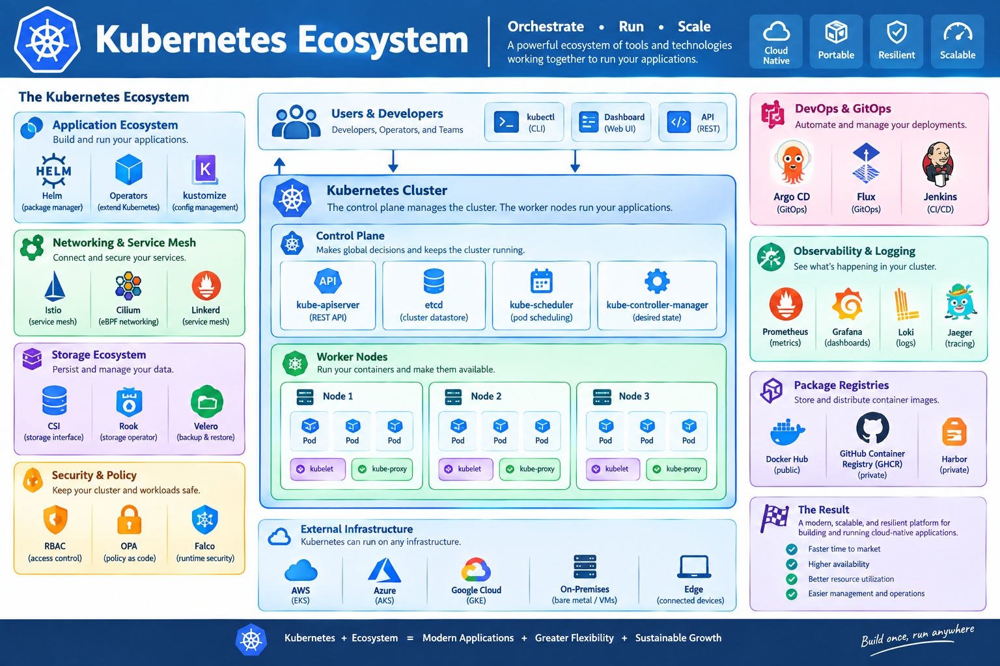
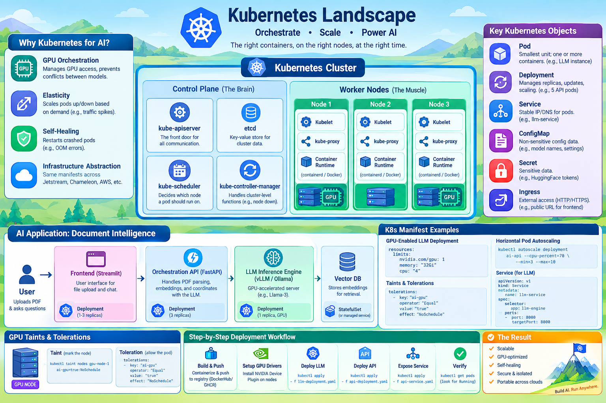

# Kubernetes (K8s) for AI: Production-Grade Orchestration

This chapter explores **Kubernetes**, the industry-standard container orchestration platform, and how it is applied to deploy, scale, and manage complex AI workloads.

!!! Info "Learning Objectives"
    By the end of this chapter, students will be able to:
    1. Explain the core architecture of Kubernetes and its role in the AI lifecycle.
    2. Distinguish between key K8s objects: Pods, Deployments, Services, and ConfigMaps.
    3. Design a production-ready architecture for an AI application.
    4. Implement GPU-aware scheduling using resource limits, taints, and tolerations.
    5. Deploy a multi-tier AI application using Kubernetes manifests.

---

## 1. Introduction to Kubernetes

While Docker provides the "container" (the package), **Kubernetes (K8s)** provides the "orchestra" (the management). In an AI context, you rarely run a single container. You typically have a pipeline: data ingestion $\rightarrow$ preprocessing $\rightarrow$ inference $\rightarrow$ frontend. 


### Why Kubernetes for AI?
AI workloads have unique requirements that make K8s indispensable:
*   **GPU Orchestration**: K8s can manage which pods get access to which GPUs, preventing multiple models from crashing the same card.
*   **Elasticity**: AI inference demand is spiky. K8s can scale the number of API pods up or down based on traffic.
*   **Self-Healing**: If an LLM process crashes due to an Out-of-Memory (OOM) error, K8s automatically restarts the pod.
*   **Infrastructure Abstraction**: Whether running on Jetstream, Chameleon, or AWS, the K8s manifests remain mostly the same.




---

## 2. Kubernetes Core Architecture

Kubernetes operates on a **Cluster** model consisting of a **Control Plane** and one or more **Worker Nodes**.

### 2.1 The Control Plane (The Brain)
The Control Plane makes global decisions about the cluster and detects/responds to cluster events.
*   **kube-apiserver**: The "front door." All communication (from users or nodes) goes through here.
*   **etcd**: A consistent and highly-available key-value store used as the backing store for all cluster data.
*   **kube-scheduler**: Decides which node a new pod should run on, considering resource requirements (e.g., "this pod needs 1 GPU").
*   **kube-controller-manager**: Handles cluster-level functions, like noticing when a node goes down and replacing the pods that were on it.

### 2.2 Worker Nodes (The Muscle)
Nodes are the machines where the containers actually run.
*   **Kubelet**: An agent that ensures containers are running in a pod as described in the pod specification.
*   **Kube-proxy**: Handles network rules on nodes, allowing pods to communicate with each other and the outside world.
*   **Container Runtime**: The software responsible for running containers (e.g., containerd, Docker).

---

## 3. Key Kubernetes Concepts

| Object | Description | AI Use Case |
|----------|-------------|----------------|
| **Pod** | The smallest deployable unit; contains one or more containers. | A single LLM instance. |
| **Deployment** | Manages a set of identical pods; handles updates and scaling. | Scaling the FastAPI backend to 5 replicas. |
| **Service** | An abstract way to expose an application running on a set of pods. | A stable IP address to call the LLM API. |
| **ConfigMap** | Stores non-confidential configuration data. | Model names, temperature settings, API endpoints. |
| **Secret** | Stores sensitive data (passwords, tokens). | HuggingFace API keys, Database passwords. |
| **Ingress** | Manages external access to services (usually HTTP). | The public URL for the AI Frontend. |

---

## 4. Compelling AI Example: "AI-Powered Document Intelligence"

To understand "Real-World" Kubernetes, let's design a **Document Intelligence System**. This system allows users to upload a PDF, indexes it into a vector database, and allows the user to ask questions about the document using a Large Language Model (LLM).

### 4.1 The Architecture
The application consists of three primary tiers:

1.  **Frontend (Streamlit)**: A Python-based GUI where users upload files and chat.
2.  **Orchestration API (FastAPI)**: The "glue" that handles PDF parsing, embeddings, and coordinates with the LLM.
3.  **LLM Inference Engine (vLLM / Ollama)**: A GPU-accelerated server that hosts the model (e.g., Llama-3).

### 4.2 Kubernetes Manifest Design
In K8s, we define the state in YAML files.

#### A. The LLM Engine (GPU-Dependent)
Because the LLM needs a GPU, we must use **Resource Limits**.

```yaml
apiVersion: apps/v1
kind: Deployment
metadata:
  name: llm-engine
spec:
  replicas: 1
  selector:
    matchLabels:
      app: llm-engine
  template:
    metadata:
      labels:
        app: llm-engine
    spec:
      containers:
      - name: vllm-container
        image: vllm/vllm-openai:latest
        resources:
          limits:
            nvidia.com/gpu: 1 # Request 1 GPU
            memory: "32Gi"
            cpu: "4"
        ports:
        - containerPort: 8000
        args: ["--model", "meta-llama/Meta-Llama-3-8B"]
```

#### B. The Orchestration API (CPU-Based)
The API is lightweight and can be scaled horizontally.

```yaml
apiVersion: apps/v1
kind: Deployment
metadata:
  name: ai-api
spec:
  replicas: 3 # Scale to 3 for high availability
  selector:
    matchLabels:
      app: ai-api
  template:
    metadata:
      labels:
        app: ai-api
    spec:
      containers:
      - name: fastapi-container
        image: my-ai-api:v1.0
        env:
        - name: LLM_ENDPOINT
          value: "http://llm-service:8000"
        ports:
        - containerPort: 80
```

#### C. The Networking (Services)
We need a way for the API to find the LLM.

```yaml
apiVersion: v1
kind: Service
metadata:
  name: llm-service
spec:
  selector:
    app: llm-engine
  ports:
    - protocol: TCP
      port: 8000
      targetPort: 8000
```

---

## 5. Advanced K8s for AI: Ensuring Stability

### 5.1 Taints and Tolerations
You don't want a simple Nginx web server to run on your expensive GPU node. 
*   **Taint**: We "mark" the GPU node so that only specific pods can land on it.
    *   `kubectl taint nodes gpu-node-1 ai-gpu=true:NoSchedule`
*   **Toleration**: We add a "pass" to the LLM pod so it is allowed to run on that node.
    ```yaml
    tolerations:
    - key: "ai-gpu"
      operator: "Equal"
      value: "true"
      effect: "NoSchedule"
    ```

### 5.2 Horizontal Pod Autoscaling (HPA)
If the API becomes slow due to many users, K8s can automatically add more pods:
```bash
kubectl autoscale deployment ai-api --cpu-percent=70 --min=3 --max=10
```

---

## 6. Step-by-Step Deployment Workflow

If you are deploying this "Real" AI app, follow these steps:

1.  **Build and Push**: Containerize your FastAPI and Streamlit apps and push them to a registry (DockerHub/GHCR).
2.  **Setup GPU Drivers**: Ensure the K8s nodes have the NVIDIA Device Plugin installed.
3.  **Deploy LLM**: `kubectl apply -f llm-deployment.yaml` (Wait for the model to load into VRAM).
4.  **Deploy API**: `kubectl apply -f api-deployment.yaml`.
5.  **Expose Service**: `kubectl apply -f api-service.yaml`.
6.  **Verify**: `kubectl get pods` to ensure everything is `Running`.


---

## Self-Assessment
!!! tip "Self-Assessment"
    Test your knowledge by expanding the questions below.

??? question "What is the primary difference between a Pod and a Deployment?"
    A Pod is a single instance of a running container (or group of containers), whereas a Deployment is a manager that ensures a specified number of Pod replicas are running and handles rolling updates.

??? question "How does Kubernetes handle GPU requests for AI models?"
    Kubernetes uses resource limits (`resources.limits`) specifically for `nvidia.com/gpu`. The scheduler then finds a node with an available GPU to place the pod.

??? question "What is the purpose of a Kubernetes Service in the AI Document Intelligence example?"
    The `llm-service` provides a stable DNS name (`http://llm-service`) that the API pods can use to communicate with the LLM engine, regardless of which node the LLM pod is actually running on or how its IP changes.

??? question "Why are Taints and Tolerations important in a mixed-resource cluster?"
    They prevent general-purpose pods (which don't need GPUs) from occupying space on expensive GPU nodes, reserving those resources exclusively for AI models.

??? question "How would you handle a scenario where the LLM engine requires a secret HuggingFace token?"
    Create a Kubernetes Secret (`kubectl create secret generic hf-token --from-literal=token=xxx`) and inject it into the LLM pod as an environment variable.

