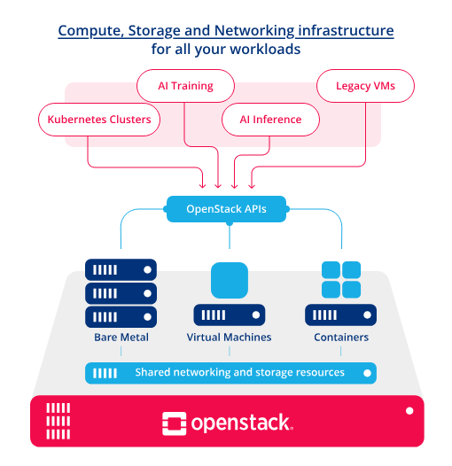

# Lecture – Introduction to OpenStack  

## 1. What Is OpenStack?  

- **Definition** – OpenStack is an open‑source cloud‑computing platform that provides an Infrastructure‑as‑a‑Service (IaaS) solution. It enables the creation and management of virtual machines, storage, and networking resources in a data‑center or across multiple sites.  

- **Goal** – To deliver the same capabilities as commercial public clouds (e.g., Amazon EC2, Google Compute Engine) while giving operators full control over the underlying hardware, software stack, and governance.  

## 2. Brief History  
| Year | Milestone |
|------|-----------|
| 2010 | OpenStack project launched by NASA and Rackspace. |
| 2011‑2013 | Rapid adoption; new core services added (Cinder, Neutron, Heat). |
| 2014‑2016 | Formation of the OpenStack Foundation; hundreds of contributors; “Icehouse”, “Juno”, “Kilo”. |
| 2017‑2020 | Consolidation of APIs, introduction of “Wallaby”, “Xena”, “Yoga”. |
| 2021‑present | Focus on Kubernetes integration (Magnum), edge computing (StarlingX), and increased use of containers for services (Kolla‑Ansible, Kolla‑Kubernetes). |

OpenStack began as a pure Infrastructure‑as‑a‑Service (IaaS) platform whose core strength lay in provisioning virtual machines (VMs) through the Nova compute service. In its early releases, the cloud controller stack was built around hypervisors such as KVM, Xen, and VMware, and most workloads were delivered as virtual instances managed by Nova’s scheduler, networking (Neutron), and storage (Cinder/Swift) services. This model gave operators the same elasticity and self‑service experience as public clouds while keeping the underlying hardware under their control.

Starting with the Icehouse and Juno releases, the OpenStack community added Ironic, a bare‑metal provisioning service that treats physical servers as first‑class resources. Ironic integrates with Nova’s scheduler so that a user can request a “bare‑metal instance” that is automatically powered on, provisioned with an operating system image (via Glance), and attached to Neutron networks, just like a VM. This extension opened OpenStack to workloads that demand direct hardware access—high‑performance computing, network function virtualization (NFV), and workloads that cannot tolerate the overhead of virtualization.

A few releases later, OpenStack introduced Magnum, a container orchestration service that abstracts Kubernetes, Docker Swarm, or Mesos clusters as OpenStack resources. With Magnum, an operator creates a “container cluster” through the same API surface used for VMs; the cluster’s control plane is instantiated on VMs (or bare metal via Ironic), and the underlying compute, networking, and storage services are reused. This integration allows OpenStack users to run containerized applications while still benefiting from OpenStack’s identity, quota, and billing mechanisms.

Together, Ironic and Magnum have transformed OpenStack from a VM‑only cloud into a heterogeneous platform that can orchestrate VMs, bare‑metal servers, and container clusters under a unified API and management plane. The evolution reflects the broader industry shift toward multi‑technology clouds, where flexibility in the type of compute resource—virtual, physical, or containerized—is essential for meeting diverse performance, security, and operational requirements.


## 3. The traditional Architecture Overview  


```
+---------------------------------------------------------------------+
|                        OpenStack Cloud (Logical View)               |
|                                                                     |
|  +-------------------+   +-------------------+   +----------------+ |
|  |   Compute         |   |  Networking       |   |  Dashboard     | |
|  |   (Nova)          |   |  (Neutron)        |   |   (Horizon)    | |
|  +-------------------+   +-------------------+   +----------------+ |
|            |                       |                     |          |
|            |                       |                     |          |
|  +-------------------+   +-------------------+   +----------------+ |
|  |  Block Storage    |   |   Object Storage  |   |  Image         | |
|  |   (Cinder)        |   |     (Swift)       |   |  (Glance)      | |
|  +-------------------+   +-------------------+   +----------------+ |
|            |                       |                     |          |
|            +-----------+-----------+---------------------+          |
|                        |                                            |
|  +-------------------+ +-------------------+   +----------------+   |
|  |   Identity        | |   Orchestration   |   |  Telemetry     |   |
|  |   (Keystone)      | |   (Heat)          |   | (Ceilometer)   |   |
|  +-------------------+ +-------------------+   +----------------+   |
|            |                       |                     |          |
|            +-----------+-----------+---------------------+          |
|                        |                                            |
|  +-------------------------------------------------------------+    |
|  |   Messaging (RabbitMQ / Qpid)   |   Database (MariaDB)      |    |
|  +-------------------------------------------------------------+    |
+---------------------------------------------------------------------+


```

- **Core services** are modular; each runs as an independent process and communicates via RESTful APIs (often over HTTP/HTTPS).  

- **Message bus** (RabbitMQ or Qpid) decouples request handling from execution.  

- **Database** (typically MariaDB) stores persistent state (service catalogs, project/user data, resource inventories).  

## 4. Detailed Look at Core Services  

| Service | Acronym | Primary Function | Key API |
|---------|---------|------------------|---------|
| Compute | **Nova** | Lifecycle management of virtual machines (instances) – create, schedule, suspend, resize, delete. | `nova-api` |
| Networking | **Neutron** | Provisioning of virtual networks, subnets, routers, load balancers, security groups. | `neutron-api` |
| Block Storage | **Cinder** | Management of persistent block devices (volumes) attached to instances. | `cinder-api` |
| Object Storage | **Swift** | Scalable, redundant storage for unstructured data (objects). Provides S3‑compatible API. | `swift-api` |
| Identity | **Keystone** | Central authentication, token issuance, service catalog, project/role management. | `keystone-api` |
| Image Service | **Glance** | Store and retrieve VM images, snapshots, metadata. | `glance-api` |
| Orchestration | **Heat** | Template‑driven automation of OpenStack resources (AWS CloudFormation‑like). | `heat-api` |
| Telemetry | **Ceilometer** | Collect usage/metering data for billing, autoscaling, monitoring. | `ceilometer-api` |
| Dashboard | **Horizon** | Web UI for administrators and end‑users; wraps other APIs. | – |
| Messaging | **RabbitMQ / Qpid** | Asynchronous communication among services. | – |
| Database | **MariaDB** | Persistent configuration and state storage. | – |
| Bare‑Metal | **Ironic** | Provisioning of physical servers as instances. | `ironic-api` |
| Container Service | **Magnum** | Managed Kubernetes, Docker Swarm, or Mesos clusters on OpenStack. | `magnum-api` |

More services can be found at 

* <https://www.openstack.org/software/>

### Service Interaction Example (Instance Launch)  

1. **User** sends a request to **Nova** via the CLI, SDK, or Horizon.  

2. **Nova** authenticates the request with **Keystone** (token).  

3. **Nova** calls **Neutron** to allocate a network port.  

4. **Nova** asks **Cinder** for a boot volume (if a volume‑backed boot).  

5. **Nova** schedules the instance on a **hypervisor** (KVM, Hyper‑V, etc.) via the **nova‑compute** service.  

6. **Nova** updates the **database** with instance state and notifies **Ceilometer** for metering.  

## 5. Deployment Options  

| Tool / Distribution | Typical Use‑Case | Characteristics |
|----------------------|------------------|-----------------|
| **DevStack** | Quick development, testing, learning | Small, single‑node, installs latest master code. |
| **Packstack** | Proof‑of‑concept or small production | Uses RPM/YUM, driven by an answer file; works on CentOS/RHEL. |
| **RDO** | Community‑supported RPM packages for Red Hat family | Provides yum repos, can be combined with Packstack or TripleO. |
| **TripleO** (OpenStack on OpenStack) | Full‑scale production, lifecycle management | Uses Heat templates to deploy OpenStack services on bare metal or VMs. |
| **Kolla / Kolla‑Ansible** | Container‑native deployment | Packs each service into Docker containers; good for immutable infrastructure. |
| **MicroStack** | Edge / desktop environments (Ubuntu) | Single‑node, snap‑based installer. |
| **Charms (Juju)** | Multi‑cloud, model‑driven deployment | Declarative service relationships, easy scaling. |

### Example: Installing a Minimal All‑In‑One OpenStack with DevStack  


```bash
# 1. Prepare a clean Ubuntu 22.04 VM
sudo apt update && sudo apt install -y git

# 2. Clone DevStack
git clone https://opendev.org/openstack/devstack.git
cd devstack

# 3. Create a local.conf (basic configuration)
cat >local.conf <<EOF
[[local|localrc]]
ADMIN_PASSWORD=secretadmin
DATABASE_PASSWORD=secretdb
RABBIT_PASSWORD=secretrabbit
SERVICE_PASSWORD=secretservice
EOF

# 4. Run the installer
./stack.sh


```

!!! note "Note"
    The script will take 30–60 minutes, install all core services, and provide URLs for Horizon and the OpenStack CLI.

## 6. Planning & Design Considerations  

1. **Hardware Sizing** – CPU, memory, and storage must be provisioned per expected VM count, network bandwidth, and storage I/O. Use the “OpenStack Capacity Planner” or simple formulas (e.g., 2 vCPU per physical core, 4 GB RAM per VM).  

2. **Network Topology** – Decide between flat networking, VLAN, VXLAN, or Geneve overlays. Neutron agents (ML2, Open vSwitch, OVN) require proper MTU and VLAN trunk support.  

3. **High Availability (HA)** – Duplicate critical components (Keystone, API services, message bus, database) behind load balancers; use Pacemaker/Corosync or keepalived.  

4. **Storage Backend** – Choose between local LVM, Ceph RBD (block), CephFS, NFS, or commercial storage arrays for Cinder; Swift can be backed by disks or object‑store appliances.  

5. **Security** – Enforce TLS for all API endpoints, token expiration, role‑based access control (RBAC) via Keystone, security groups in Neutron, and host‑based firewalls (iptables, firewalld).  

6. **Logging & Monitoring** – Centralize logs with ELK/EFK stack; use Prometheus + Grafana for metric collection from services (via Ceilometer, Gnocchi, or native exporters).  

## 7. Operational Best Practices  

| Area | Recommendation |
|------|----------------|
| **Upgrades** | Use “rolling upgrade” pattern; upgrade services individually while keeping API compatibility. |
| **Backup** | Periodically dump the MariaDB database and back up Glance images, Cinder volumes (snapshot), Swift containers. |
| **Automation** | Employ Ansible, Terraform, or OpenStack Heat for repeatable infrastructure deployment. |
| **Capacity Management** | Leverage Ceilometer/Gnocchi to track usage trends; set alerts for CPU/ RAM/ storage thresholds. |
| **Incident Response** | Keep a run‑book with steps to restart services, clear RabbitMQ queues, and recover from failed compute nodes. |
| **Documentation** | Maintain a Confluence or wiki page for custom configurations, version pins, and known issues. |

## 8. Security Model  

1. **Identity (Keystone)** – Supports password, token, PKI, LDAP, and federated SAML2 authentication.  

2. **Service Catalog** – Generates per‑project endpoint URLs; tokens embed scoped permissions.  

3. **RBAC** – Projects (tenants), roles (admin, member, reader), and policies (policy.json) define what API actions are permitted.  

4. **Network Security** – Neutron security groups act as stateful firewalls; port‑security flags prevent MAC spoofing.  

5. **Encryption** – Use TLS for API traffic; enable Cinder volume encryption and Swift server‑side encryption for sensitive data.  

## 9. Monitoring & Telemetry  

- **Ceilometer** gathers metering data from all services (CPU, network, storage).  

- **Gnocchi** stores time‑series data; **Panko** stores event data.  

- **Aodh** provides alarm/alert capabilities (auto‑scale, threshold alerts).  

- **Prometheus Exporters** exist for Nova, Neutron, Cinder, etc., giving fine‑grained metrics for Grafana dashboards.  

### Sample Prometheus Query (Nova CPU usage)


```
rate(openstack_nova_instance_cpu_seconds_total[5m]) * 100


```

This returns the average CPU usage per instance over the last 5 minutes, expressed as a percentage.

## 10. Use Cases  

| Scenario | How OpenStack Enables It |
|----------|--------------------------|
| **Private Cloud for Enterprises** | Isolate workloads, enforce compliance, integrate with existing LDAP/Active Directory. |
| **Research & HPC** | Provide massive, on‑demand compute clusters, schedule GPU‑enabled instances, share data via Swift. |
| **Telco NFV (Network Functions Virtualization)** | Deploy virtual routers, firewalls, and load balancers with Neutron’s advanced networking. |
| **Edge / IoT** | Use MicroStack or StarlingX to run OpenStack on rugged hardware at the network edge. |
| **Hybrid Cloud** | Connect to public clouds via federated Keystone or use OpenStack’s federation models (Keystone‑Federation). |

## 11. Community & Ecosystem  

- **OpenStack Foundation** – Governs the project, hosts the annual Open Infrastructure Summit.  

- **SIGs (Special Interest Groups)** – e.g., SIG‑Compute, SIG‑Networking, SIG‑Storage, each driving roadmap for their domain.  

- **Distributions** – Red Hat OpenStack Platform, Canonical Charmed OpenStack, Mirantis Cloud Platform, SUSE OpenStack Cloud.  

- **Third‑Party Integrations** – Kubernetes (via Magnum), OpenShift, Cloud‑Native CI/CD pipelines, VMware NSX, Dell EMC storage, Intel DPDK, Mellanox networking.  

## 12. Current and Future Trends  

1. **NFV & Edge** – Tight integration with accelerated networking (DPDK, SR‑IOV) and real‑time workloads.  

2. **Containers as First‑Class Citizens** – More services running in containers (Kolla‑Kubernetes), and OpenStack acting as a “control plane” for container orchestrators.  

3. **AI/ML‑Driven Operations** – Automated anomaly detection, predictive scaling, and capacity forecasting using telemetry data.  

4. **Hybrid Cloud‑Native APIs** – Unified APIs for OpenStack, Kubernetes, and public clouds (e.g., OpenStack API compatibility with AWS S3).  

5. **Security Hardening** – Zero‑Trust networking, hardware root of trust (TPM) integration, and encrypted‑in‑flight data pipelines.  


The new architecture image from openstack




## 13. Summary  

- OpenStack provides a modular, open‑source stack for building private and hybrid IaaS clouds.  

- Its core services (Compute, Networking, Block/Object Storage, Identity) cooperate via REST APIs, a message bus, and a central database.  

- A wide portfolio of deployment tools (DevStack, Packstack, TripleO, Kolla) lets operators tailor the installation to their scale and operational model.  

- Successful OpenStack projects require disciplined planning (hardware, networking, HA), robust security (Keystone, TLS, security groups), and continuous monitoring (Ceilometer, Prometheus).  

- The ecosystem continues to evolve toward container integration, edge computing, and AI‑enhanced operations.  

---  

### Further Reading & Resources  

| Resource | URL |
|----------|-----|
| Official Documentation (latest release) | https://docs.openstack.org |
| OpenStack Architecture Guide | https://docs.openstack.org/arch-design/ |
| Kolla‑Ansible Quickstart | https://docs.openstack.org/kolla-ansible/latest/user/quickstart.html |
| OpenStack Training (edX, Coursera) | https://www.openstack.org/learn |
| Community Wiki & Answers | https://ask.openstack.org |

Feel free to ask questions about any specific component, deployment scenario, or operational challenge.