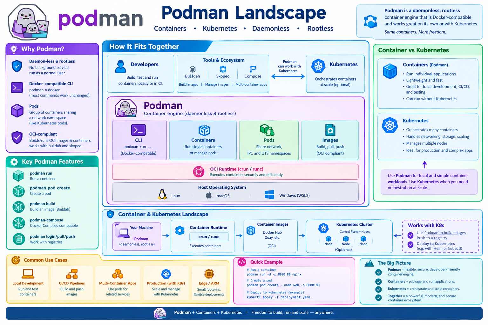

# Podman

A **comprehensive guide** to using Podman for container management, from basic installation and rootless execution to advanced concepts like Pods and architecture planning.

---

!!! info "Learning Objectives"
    By the end of this guide, you will be able to:
    1. **Install** and configure Podman on various operating systems.
    2. **Execute** container operations using the Docker-compatible CLI.
    3. **Implement** secure, rootless containers to enhance host security.
    4. **Orchestrate** groups of containers using Pods for shared networking.
    5. **Build** OCI-compliant images using Dockerfiles and Buildah.
    6. **Plan** container-based architectures using mind-mapping techniques.

---



## 1. What is Podman?

Podman (Pod Manager) is an open-source, daemonless container engine for developing, managing, and running OCI containers on your local machine. Unlike other container engines, it does not rely on a central background process to manage containers.

**Why use Podman?**
- **Daemon‑less & Rootless**: There is no background service (`dockerd`) running as root. You can run containers as a normal user, which significantly reduces the attack surface of the host.
- **Docker‑compatible CLI**: The `podman` command is designed to be a drop-in replacement for `docker`. Most commands work identically.
- **Pods**: Podman introduces the concept of "Pods"—groups of one or more containers that share the same network namespace, similar to how Kubernetes operates.
- **OCI‑compliant**: It generates and runs images that follow the Open Container Initiative (OCI) standard, making it compatible with tools like `buildah` and `skopeo`.

---

## 2. Installing Podman

Installing Podman is straightforward across most Linux distributions and is available for macOS and Windows via virtualization layers.

| OS | Command |
|----|---------|
| **Fedora / RHEL 9** | `sudo dnf -y install podman` |
| **CentOS 8 / Rocky 9** | `sudo dnf -y module enable container-tools && sudo dnf -y install podman` |
| **Ubuntu 22.04+** | `sudo apt update && sudo apt -y install podman` |
| **macOS** (Homebrew) | `brew install podman` |
| **Windows** (WSL2) | Install a Linux distro in WSL2 then follow the Linux steps. |

!!! tip "Verification"
    After installation, run `podman info`. You should see `rootless: true` in the host information if you are running as a non-privileged user.

---

## 3. Basic Commands

Because Podman aims for compatibility with the Docker CLI, the learning curve for existing Docker users is almost zero.

| Goal | Podman command |
|------|----------------|
| List images | `podman images` |
| Pull an image | `podman pull quay.io/centos/centos:stream8` |
| Run a container (interactive) | `podman run -it --rm quay.io/centos/centos:stream8 bash` |
| Run a container in background | `podman run -d --name web -p 8080:80 nginx:alpine` |
| View running containers | `podman ps` |
| Stop / remove | `podman stop web && podman rm web` |
| Show logs | `podman logs web` |
| Exec inside a running container | `podman exec -it web sh` |
| Copy files →/from container | `podman cp <src> <container>:/dest` |

If you have existing scripts that call `docker`, you can create a symbolic link (shim) to redirect those calls to Podman:
```bash
sudo ln -s $(which podman) /usr/local/bin/docker
```
*Note: Only use the shim if you do not have Docker installed, as it will override the `docker` command.*

---

## 4. Rootless Containers

One of Podman's most powerful features is the ability to run containers without root privileges. This is the default behavior for non-root users.

```bash
# Verify you are running in rootless mode
podman info | grep rootless
# Expected output: rootless: true
```

Rootless containers use user namespaces to map the user ID (UID) inside the container to your own UID on the host. This ensures that even if a process escapes the container, it does not have root access to your physical machine.

*If you require privileged operations (e.g., accessing `/dev/kmsg` or specific kernel modules), you can use the `--privileged` flag, but this should be avoided unless absolutely necessary.*

---

## 5. Working with Pods

A **Pod** is a group of one or more containers that share the same network namespace, including the IP address and ports. This is a fundamental concept in Kubernetes that Podman brings to the local environment.

```bash
# 1. Create a pod named “myapp” exposing port 8080 on the host
podman pod create --name myapp -p 8080:80

# 2. Run a container inside the pod (it inherits the pod's network)
podman run -d --name nginx --pod myapp nginx:alpine

# 3. Run a side‑car container (e.g., log collector) in the same pod
podman run -d --name logger --pod myapp \
  -v /var/log:/var/log alpine tail -F /var/log/nginx/access.log

# 4. List pods to see shared IP address
podman pod ps
```

When a pod is stopped or removed, all containers associated with that pod are also stopped/removed:
```bash
podman pod stop myapp
podman pod rm myapp
```

---

## 6. Building Images

Podman can build images using the same `Dockerfile` syntax used by Docker, but it also integrates with `buildah` for more advanced, scriptable image creation.

```bash
# Build an image from a Dockerfile in the current directory
podman build -t my-custom-app .

# Run the newly built image
podman run -it --rm my-custom-app
```

For more advanced users, `buildah` allows you to build images without a Dockerfile by interacting directly with the container filesystem, which can result in smaller, more secure images.

---

## 7. Architecture Planning with Mind-Mapping

Before containerizing an application, it is best practice to visualize the architecture. Mind-mapping helps distill complex systems into a clear hierarchy of services, dependencies, and security zones.

### Recommended Tools
| Tool | Platform | Use Case |
|------|-----------|-----------|
| **FreeMind** | Cross-platform | Classic, open-source radial maps. |
| **XMind** | Cross-platform | Professional, polished layouts and templates. |
| **MindMeister** | Web-based | Collaborative planning and sharing. |
| **Obsidian** | Desktop | For those who prefer Markdown-based knowledge graphs. |

### Mind-Map Best Practices
- **One word per branch**: Forces distillation of ideas.
- **Color Coding**: Use 2-3 colors to distinguish between different layers (e.g., Frontend, Backend, Database).
- **Radial Layout**: Let branches fan out naturally to avoid tangled lines.
- **Iterate**: Brainstorm first, then group and clean up the structure.

### Sample Structure: Deploying a Web App
```
[Deploying a Container-Based Web App]
    ├─ Architecture
    │    ├─ Front-end (NGINX)
    │    ├─ Back-end (Flask/Django)
    │    └─ Database (PostgreSQL)
    ├─ CI/CD
    │    ├─ GitHub Actions
    │    ├─ Build image (Podman)
    │    └─ Deploy to Prod (K8s/Podman-Compose)
    ├─ Security
    │    ├─ Secrets (Vault/Env-files)
    │    ├─ TLS (Let's Encrypt)
    │    └─ Scanning (Trivy)
    └─ Monitoring
         ├─ Logs (EFK)
         ├─ Metrics (Prometheus)
         └─ Alerts (Grafana/Aodh)
```

---

## 8. Summary & Workflow

The most effective way to deploy a system is to combine the **blueprint** (Mind-map) with the **engine** (Podman).

**Example Workflow:**
1. **Mind-map**: Identify all services and their relationships.
2. **Podman**: Build the images for each service and define a `podman-compose.yml` file that mirrors the mind-map branches.
3. **Export**: Embed the architecture mind-map in your project README and provide the compose file as the implementation.

---

## Appendix

### Tool Comparison: Podman vs. Docker

| Feature | Docker | Podman |
|---------|--------|--------|
| **Architecture** | Client-Server (Daemon-based) | Daemonless |
| **Privileges** | Traditionally Root-based | Rootless by default |
| **Security** | Daemon is a single point of failure | No privileged daemon needed |
| **OCI Compliance** | Yes | Yes |
| **Ecosystem** | Industry standard, vast | Growing, highly compatible |
| **Kubernetes** | Requires orchestration tool | Native support for Pods |

### References & Further Reading

| Topic | Link |
|-------|------|
| **Podman Official Docs** | https://docs.podman.io |
| **Podman Cheat Sheet** | https://github.com/containers/podman/blob/main/docs/tutorials/podman.pdf |
| **Podman-Compose GitHub** | https://github.com/containers/podman-compose |
| **OCI Specification** | https://opencontainers.org |

### Assignments

!!! note "Hands-on Challenges"
    1. **Basic Setup**: Install Podman and verify that you are running in rootless mode using `podman info`.
    2. **Image Management**: Pull an NGINX image, run it in the background on port 8080, and verify the welcome page in your browser.
    3. **Pod Orchestration**: Create a Pod named `web-stack`, and deploy both an NGINX container and a Redis container inside it. Verify they can communicate via `localhost`.
    4. **Custom Image**: Create a simple `Dockerfile` for a Python application, build it with `podman build`, and run the resulting container.
    5. **Architecture Mapping**: Create a mind-map of a three-tier application (Frontend, API, DB) and implement it using a Podman Pod.
