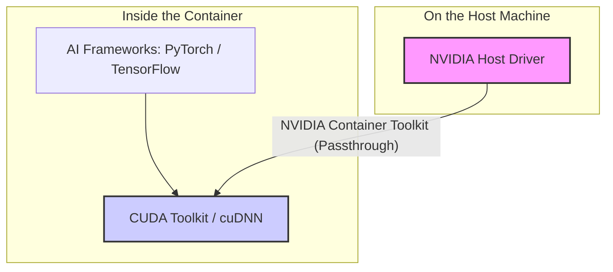

# AI Workloads in Containers

## Learning Objectives

!!! info "Learning Objectives"
    By the end of this chapter, participants will be able to:
    - Understand the technical challenges of running GPU-accelerated workloads in containers.
    - Explain the role of the NVIDIA Container Toolkit and the `nvidia-container-runtime`.
    - Implement strategies for managing CUDA version compatibility between the host and the container.
    - Apply optimization techniques to reduce the size of AI-specific container images.
    - Execute and verify GPU-accelerated containers using industry-standard tools.

## Overview

Standard containers are designed to isolate the CPU, memory, and network. However, AI and Deep Learning workloads require direct access to hardware accelerators—specifically GPUs. By default, a container cannot "see" the GPU of the host machine because the GPU device drivers are part of the host's kernel space, which containers are specifically designed to avoid accessing for security and portability reasons.

To bridge this gap, we need a mechanism that allows the container to communicate with the GPU hardware without compromising the isolation of the container itself.

!!! info "Why this matters"
    In AI development, the "CUDA mismatch" is a primary source of frustration. A researcher might develop a model using CUDA 12.1 on their workstation, but the production cluster only has drivers supporting CUDA 11.8. Without proper containerization and the correct runtime, the model will simply fail to initialize the GPU, leading to "CUDA error: no kernel image is available for execution" or similar cryptic failures.

## Implementation

### The AI Container Stack

To understand how GPU passthrough works, it is helpful to visualize the layers of the software stack. The container does not replace the host driver; it relies on it.



Figure 1: The AI Container Stack. Notice that the Host Driver remains on the host, while the CUDA Toolkit is packaged inside the image.

### The NVIDIA Container Toolkit

The solution to GPU access in containers is the **NVIDIA Container Toolkit**. This is not a replacement for the container engine (like Docker or Podman) but an extension that allows them to interface with NVIDIA GPUs.

#### How it Works: The Runtime Bridge

When you run a standard container, the engine uses a default runtime (usually `runc`). To enable GPU access, the engine must use the `nvidia-container-runtime`.

1. **Host Driver**: The physical machine must have the NVIDIA Driver installed. This driver provides the low-level interface to the hardware.
2. **The Toolkit**: The NVIDIA Container Toolkit installs a library that "hooks" into the container startup process.
3. **Device Injection**: When the container starts with the `--gpus` flag, the toolkit dynamically injects the necessary GPU device files (`/dev/nvidia*`) and driver libraries from the host into the container's filesystem.

#### Comparison: Standard vs. GPU Container

| Feature | Standard Container | AI/GPU Container |
| :--- | :--- | :--- |
| **Isolation** | Full OS isolation | OS isolation + GPU driver passthrough |
| **Runtime** | `runc` | `nvidia-container-runtime` |
| **Hardware Access** | CPU, RAM, Disk | CPU, RAM, Disk + NVIDIA GPU |
| **Key Dependency** | Base Image (e.g., Ubuntu) | Host NVIDIA Driver $\rightarrow$ Toolkit $\rightarrow$ CUDA Toolkit |

### Beyond NVIDIA: AMD and Intel Accelerators

While NVIDIA is the dominant player, production AI environments increasingly use alternative accelerators to avoid vendor lock-in and reduce costs.

#### AMD ROCm (Radeon Open Compute)
ROCm is AMD's open-source answer to CUDA. It provides the necessary libraries (hipblas, rocBLAS) to run AI frameworks like PyTorch and TensorFlow on Radeon and Instinct GPUs.
- **Containerization**: AMD uses the `rocm/dev` or `rocm/runtime` base images.
- **Runtime**: Instead of the NVIDIA Toolkit, AMD relies on the **KFD (Kernel Fusion Driver)** and specific device passthrough (`/dev/kfd` and `/dev/dri`).

#### Intel OneAPI and Gaudi
Intel uses the **OneAPI** toolkit to provide a unified programming model across CPUs, GPUs (e.g., Intel Data Center GPU Max), and AI accelerators (e.g., Gaudi).
- **Containerization**: Intel provides optimized base images that include the **oneAPI Base Toolkit**.
- **Runtime**: Uses the **Intel GPU Driver** and the `intel-device-plugins-for-kubernetes` for orchestration.

| Feature | NVIDIA (CUDA) | AMD (ROCm) | Intel (oneAPI) |
| :--- | :--- | :--- | :--- |
| **Runtime Driver** | NVIDIA Driver | AMDGPU / KFD | Intel GPU Driver |
| **Core Toolkit** | CUDA Toolkit | ROCm | oneAPI |
| **K8s Plugin** | NVIDIA Device Plugin | AMD Device Plugin | Intel Device Plugin |
| **Primary Focus** | High-end LLMs / General AI | HPC / Scientific AI | Enterprise AI / CPU+GPU |

---

### Practical Execution: Running GPU Containers

To run an AI workload, you must explicitly tell the container engine to allocate GPU resources.

#### The Command

Use the `--gpus` flag to grant the container access to the hardware:

```bash
# Grant access to all available GPUs
docker run --rm --gpus all nvidia/cuda:12.1.0-base-ubuntu22.04 nvidia-smi
```

#### Verification Workflow

Once the container is running, you should perform a two-step verification:

1. **Hardware Level**: Run `nvidia-smi` inside the container. If you see the GPU table, the **NVIDIA Container Toolkit** is working.
2. **Framework Level**: Check if your AI library (e.g., PyTorch) can actually initialize the device.

```python
# Run this inside your container
import torch
print(f"Is CUDA available? {torch.cuda.is_available()}")
print(f"Device Name: {torch.cuda.get_device_name(0) if torch.cuda.is_available() else 'None'}")
```

### Managing CUDA and cuDNN Versions

One of the most confusing aspects of AI containers is the distinction between the **Host Driver** and the **CUDA Toolkit**.

- **The Host Driver**: Installed on the physical machine. It must be a version that is compatible with the CUDA version inside the container.
- **The CUDA Toolkit**: Installed *inside* the container image. This includes the compiler (`nvcc`) and the libraries (cuBLAS, cuDNN) that the AI framework (PyTorch/TensorFlow) uses.

#### The Compatibility Rule

The general rule is: **The Host Driver version must be equal to or newer than the version required by the CUDA Toolkit inside the container.** 

If you use a container built for CUDA 12.2 on a host that only has drivers for CUDA 11.0, the container will fail. However, the NVIDIA "Forward Compatibility" feature allows some newer CUDA versions to run on older drivers, provided the drivers meet a minimum baseline.

### GPU [VRAM](../security/container-security.md) vs. System RAM: The Memory Hierarchy

One of the most common sources of confusion in AI containerization is the distinction between **System RAM** (host memory) and **GPU [VRAM](../security/container-security.md)** (Video RAM).

#### The Memory Wall
When you define resources in a [Kubernetes](../orchestration/kubernetes.md) manifest (e.g., `memory: "32Gi"`), you are limiting the **System RAM**. However, the actual AI model resides in the **GPU [VRAM](../security/container-security.md)**.

- **System RAM (Host)**: Used by the OS, the Python runtime, and the data loading pipeline. If this is exceeded, the pod is `OOMKilled` by the Linux kernel.
- **GPU [VRAM](../security/container-security.md) (Device)**: Used by the CUDA kernels and the model weights. If this is exceeded, you get a `torch.cuda.OutOfMemoryError`. 

!!! warning "The Invisible Limit"
    [Kubernetes](../orchestration/kubernetes.md) cannot natively "see" or limit GPU [VRAM](../security/container-security.md) in the same way it limits system memory. A pod might have plenty of system RAM left, but the GPU is completely full. This is why monitoring tools like `nvidia-smi` or the NVIDIA Device Plugin are critical—they provide the only visibility into the actual hardware usage.

#### [VRAM](../security/container-security.md) Optimization Case Study: Scaling LLMs
As model sizes grow (e.g., Llama-3 70B), they often exceed the [VRAM](../security/container-security.md) of a single A100 (80GB). To fit these models into containers, engineers use two primary techniques:

1. **Quantization (Precision Reduction)**:
    - **FP16 (Half Precision)**: Standard for training.
    - **INT8 / INT4 (Quantized)**: Reduces weight precision. An INT4 quantized model takes $\sim 1/4$ the [VRAM](../security/container-security.md) of the original, allowing a 70B model to fit on fewer GPUs without significant accuracy loss.
2. **PagedAttention (vLLM)**:
    - Standard attention mechanisms allocate a contiguous block of [VRAM](../security/container-security.md) for the KV (Key-Value) cache, leading to "Internal Fragmentation" (wasted space).
    - **PagedAttention** manages [VRAM](../security/container-security.md) like a virtual OS memory manager, allocating memory in small "pages." This allows nearly 100% [VRAM](../security/container-security.md) utilization and increases the number of concurrent requests (throughput) by $2\text{-}4\times$.

---

### Optimizing AI Images

AI images are notoriously large—often exceeding 10GB. This leads to slow pull times and inefficient scaling.

#### 1. Use Slim Base Images

Instead of starting from a full Ubuntu image, use official NVIDIA or framework-specific images:

- `nvidia/cuda:12.1.0-base-ubuntu22.04` (Very small, only runtime)
- `nvidia/cuda:12.1.0-runtime-ubuntu22.04` (Includes CUDA libraries)
- `nvidia/cuda:12.1.0-devel-ubuntu22.04` (Includes compiler; only needed for building custom C++ extensions)

!!! tip "Pro Tip: Use Framework Images"
    Building from `nvidia/cuda` is the "hard way." Most researchers should use official framework images (e.g., `pytorch/pytorch` or `tensorflow/tensorflow`). These images are pre-optimized and have the correct CUDA/cuDNN versions already matched to the framework version.

#### 2. Multi-Stage Builds

Use multi-stage builds to compile dependencies in a "builder" stage and copy only the final binaries to the "production" stage.

```dockerfile
# Stage 1: Build
FROM nvidia/cuda:12.1.0-devel-ubuntu22.04 AS builder
COPY requirements.txt .
RUN pip install --user -r requirements.txt

# Stage 2: Production
FROM nvidia/cuda:12.1.0-runtime-ubuntu22.04
COPY --from=builder /root/.local /root/.local
ENV PATH=/root/.local/bin:$PATH
COPY app/ /app/
WORKDIR /app
CMD ["python", "main.py"]
```

#### 3. Handling Model Weights

**Never bake large model weights (e.g., Llama-3 70B) directly into the image.**

- **Volume Mounts**: Mount weights from the host filesystem at runtime.
- **S3/Object Storage**: Download weights to a shared cache volume during the first boot.

### Troubleshooting & Common Errors

When working with GPU containers, most errors occur at the boundary between the host and the container.

| Symptom | Likely Cause | Fix |
| :--- | :--- | :--- |
| `nvidia-smi` returns `"Failed to initialize NVML"` | NVIDIA Container Toolkit not installed or configured. | Install the toolkit and restart the Docker daemon. |
| `"CUDA error: no kernel image is available for execution"` | Host Driver is too old for the CUDA version in the image. | Update the host NVIDIA driver to a newer version. |
| `torch.cuda.is_available()` is `False` but `nvidia-smi` works | Version mismatch between PyTorch and the CUDA Toolkit in the image. | Rebuild the image using a PyTorch version that matches your CUDA Toolkit. |
| Container crashes with `Out of Memory (OOM)` | [VRAM](../security/container-security.md) limit exceeded on the GPU. | Use a smaller batch size or implement MIG to isolate memory. |
| `docker run` fails with `unknown flag: --gpus` | Using an outdated Docker version or a runtime that doesn't support NVIDIA. | Update Docker to v19.03+ and ensure `nvidia-container-runtime` is installed. |

## Summary Checklist

- [ ] Explain the role of the NVIDIA Container Toolkit in GPU passthrough.
- [ ] Implement the `--gpus` flag to allocate hardware to a container.
- [ ] Verify GPU access using both `nvidia-smi` and framework-level checks (e.g., `torch.cuda`).
- [ ] Apply the compatibility rule: Host Driver $\ge$ Container CUDA Toolkit.
- [ ] Use multi-stage builds to reduce AI image size.
- [ ] Implement a strategy for loading model weights via volume mounts instead of image baking.

## Self-Evaluation

??? question "What happens if I run a GPU container on a machine without the NVIDIA Container Toolkit installed?"
    The container will likely start, but it will not have access to the GPU. Commands like `nvidia-smi` inside the container will return an error, and the AI framework will fall back to the CPU, resulting in extremely slow performance.

??? question "Can I run a container with CUDA 11.8 on a host with drivers for CUDA 12.0?"
    Yes. Newer host drivers are generally backward compatible with older CUDA toolkit versions.

??? question "Why is it recommended to use the 'runtime' image instead of the 'devel' image for production?"
    The 'devel' image contains the full CUDA compiler and header files, which are large and unnecessary for running a model. The 'runtime' image contains only the libraries needed for execution, significantly reducing the image size and attack surface.

## Assignments

!!! note "Assignment.1: Driver Compatibility Audit"
    Check the NVIDIA driver version on your local machine or cluster using `nvidia-smi`. Then, determine the oldest and newest CUDA-based container images you can run on that driver.
    
    ??? tip "Solution: Driver Audit"
        Run `nvidia-smi` and note the "CUDA Version" in the top right. Refer to the NVIDIA CUDA Compatibility matrix to see which CUDA Toolkits are supported by that specific driver version.

!!! note "Assignment.2: Image Size Comparison"
    Build two images: one using a `devel` base image and one using a `runtime` base image. Compare their final sizes using `docker images`.
    
    ??? tip "Solution: Size Comparison"
        Create two Dockerfiles, one with `FROM nvidia/cuda:12.1.0-devel-ubuntu22.04` and one with `FROM nvidia/cuda:12.1.0-runtime-ubuntu22.04`. Build and run `docker images` to see the size difference, which is typically several gigabytes.

## References

- NVIDIA Container Toolkit Documentation: [docs.nvidia.com/datacenter/cloud-native/container-toolkit/](https://docs.nvidia.com/datacenter/cloud-native/container-toolkit/)
- PyTorch Docker Hub: [hub.docker.com/r/pytorch/pytorch](https://hub.docker.com/r/pytorch/pytorch)
- CUDA Installation Guide: [docs.nvidia.com/cuda/cuda-installation-guide/](https://docs.nvidia.com/cuda/cuda-installation-guide/)

## What's Next?

Now that you know how to handle GPUs, you need to ensure your containers are secure. Head over to **[Container Security & Hardening](/section/container/security/container-security.md)** to learn how to protect your AI workloads from vulnerabilities.
