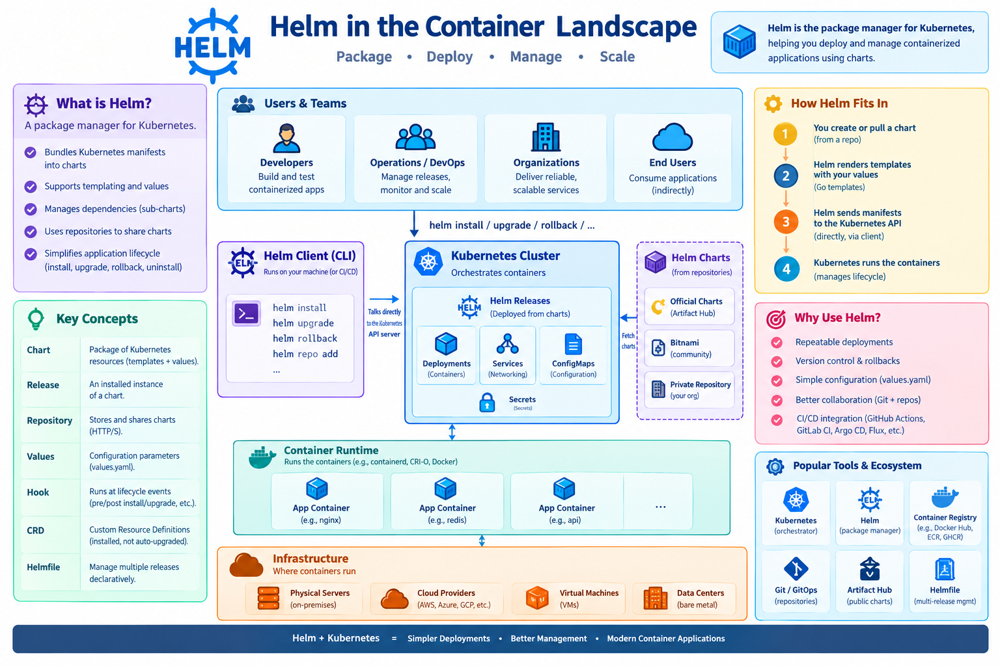

# Helm: Package Management for Kubernetes

## Learning Objectives

!!! info "Learning Objectives"
    By the end of this chapter, participants will be able to:
    - Understand the purpose of a package manager in the Kubernetes ecosystem.
    - Differentiate between Helm Charts, Values, and Releases.
    - Install, upgrade, and rollback applications using Helm.
    - Create and customize a basic Helm Chart for AI workloads.
    - Evaluate the trade-offs between Helm's templating and other configuration management methods.
    - Implement Helm hooks for custom deployment lifecycle management (e.g., DB migrations).
    - Manage sensitive data in Helm charts using secrets management tools.
    - Orchestrate complex applications using Helm dependencies (Umbrella Charts).

## Overview

As Kubernetes applications grow in complexity, managing dozens of YAML manifests becomes error-prone and tedious. Helm solves this by introducing a package management layer. 

Helm is to Kubernetes what `apt` or `yum` is to Linux: a single source of truth for "how to run" a specific application. Instead of applying individual files, Helm allows you to bundle a set of Kubernetes resources into a versioned package called a **Chart**, which can then be parameterized and deployed as a **Release**.

## Core Sections

### Helm Architecture and Terminology

Helm v3 operates as a client-side tool that communicates directly with the Kubernetes API server, eliminating the need for a server-side component (Tiller) found in earlier versions.

| Term | Meaning |
|------|---------|
| **Chart** | A directory containing `Chart.yaml`, `values.yaml`, and a `templates/` folder. |
| **Release** | A specific instance of a Chart deployed to a cluster (e.g., `my-llm-prod`). |
| **Repository** | An HTTP(S) server that stores packaged charts (`index.yaml`). |
| **Values** | Configurable parameters in `values.yaml` that are rendered into templates. |
| **Hook** | A manifest executed at specific lifecycle events (`pre-install`, `post-upgrade`). |
| **CRD** | Custom Resource Definitions that Helm can install but does not upgrade automatically. |



Figure 1: The Helm landscape and its integration with the Kubernetes ecosystem.

### Why Use Helm for AI Infrastructure?

AI workloads often require complex setups involving GPUs, persistent volumes for model weights, and specific environment variables.

- **Repeatable Deployments**: A single `helm install` can provision an entire stack (vLLM engine, Redis cache, and FastAPI frontend).
- **Version Control**: Charts are versioned, allowing for instant rollbacks (`helm rollback`) if a new model version causes a performance regression.
- **Parameterization**: Researchers can use a single chart but pass different `values.yaml` files for `dev` (CPU-only) and `prod` (Multi-GPU).
- **CI/CD Integration**: Helm integrates seamlessly with GitOps tools like ArgoCD and Flux to automate "Code to Cluster" workflows.

### Installation and Basic Operations

#### Setup

Helm is a client-side binary. Install it using the appropriate method:

| OS | Command |
|----|---------|
| **Linux** | `curl https://raw.githubusercontent.com/helm/helm/main/scripts/get-helm-3 | bash` |
| **macOS** | `brew install helm` |
| **Windows** | `choco install kubernetes-helm` |

!!! tip "Verification"

    Verify the installation by running:

    ```bash
    helm version
    ```

#### Common Commands Cheat-Sheet

| Action | Command | Example |
|--------|---------|----------------|
| **Add Repo** | `helm repo add <name> <url>` | `helm repo add bitnami https://charts.bitnami.com/bitnami` |
| **Update Cache** | `helm repo update` | `helm repo update` |
| **Install** | `helm install <release> <chart>` | `helm install my-redis bitnami/redis --set auth.password=Secret123` |
| **Upgrade** | `helm upgrade <release> <chart>` | `helm upgrade my-redis bitnami/redis --set replicaCount=3` |
| **Rollback** | `helm rollback <release> <rev>` | `helm rollback my-redis 1` |
| **Uninstall** | `helm uninstall <release>` | `helm uninstall my-redis` |
| **Render Locally** | `helm template <chart>` | `helm template my-chart ./my-chart` |
| **Validate** | `helm lint <chart>` | `helm lint ./my-chart` |

### Creating Your First Chart

A Helm chart is essentially a directory of templates that use Go-template syntax (e.g., `{{ .Values.replicaCount }}`) to inject dynamic values into YAML manifests.

#### 1. Scaffold a New Chart

```bash
helm create hello-world
cd hello-world
```

#### 2. Define Runtime Values (`values.yaml`)

The `values.yaml` file acts as the primary configuration interface for the user.

```yaml
replicaCount: 2
image:
  repository: nginx
  tag: "1.25-alpine"
  pullPolicy: IfNotPresent
service:
  type: ClusterIP
  port: 80
```

#### 3. Templating the Deployment

In `templates/deployment.yaml`, we replace static values with template calls:

```yaml
spec:
  replicas: {{ .Values.replicaCount }}
  template:
    spec:
      containers:
        - name: {{ .Chart.Name }}
          image: "{{ .Values.image.repository }}:{{ .Values.image.tag }}"
```

#### 4. Deploy and Manage

```bash
# Install the chart
helm install hello ./hello-world --namespace demo --create-namespace

# Upgrade to increase replicas
helm upgrade hello ./hello-world --set replicaCount=5
```

### Advanced Deployment Patterns

#### AI Model Deployment: Example `values.yaml`

When deploying an AI model (e.g., vLLM), the `values.yaml` must handle GPU resources and large model weights.

```yaml
# values-ai-model.yaml
replicaCount: 1
image:
  repository: vllm/vllm-openai
  tag: "v0.4.0"

resources:
  limits:
    nvidia.com/gpu: 1
    memory: "40Gi"
    cpu: "8"

model:
  name: "meta-llama/Meta-Llama-3-8B"
  tensorParallelSize: 1

persistence:
  enabled: true
  storageClass: "premium-rwo"
  size: 100Gi
  mountPath: /models
```

#### Advanced Templating for AI Workloads

Basic value replacement is often insufficient for AI infrastructure, where you may need to switch between entirely different hardware profiles (e.g., CPU vs GPU) or support multiple types of accelerators. Using advanced Go-templates allows you to avoid "YAML sprawl" by maintaining a single chart that adapts to the target environment. For a broader overview of how Helm fits into the Kubernetes orchestration landscape alongside tools like Kustomize, see **[Kubernetes (K8s) for AI](/section/container/orchestration/kubernetes.md)**.

**1. Conditional Resource Allocation**

Use `{{ if ... }} {{ else }} {{ end }}` to toggle between CPU-only and GPU-enabled configurations. This is critical for teams that develop on CPU-based environments but deploy to GPU clusters.

*Updated `values.yaml`:*
```yaml
gpuEnabled: true
```

*`templates/deployment.yaml` snippet:*
```yaml
        resources:
          limits:
            {{- if .Values.gpuEnabled }}
            nvidia.com/gpu: 1
            memory: "40Gi"
            {{- else }}
            cpu: "4"
            memory: "16Gi"
            {{- end }}
```

**2. Dynamic Accelerator Configuration**

Use `{{ range }}` to iterate over a list of required accelerators. This is useful when deploying to clusters with mixed hardware or using NVIDIA Multi-Instance GPU (MIG) profiles.

*Updated `values.yaml`:*
```yaml
accelerators:
  - name: "nvidia.com/gpu"
    count: 1
  - name: "nvidia.com/mig-1g.10gb"
    count: 2
```

*`templates/deployment.yaml` snippet:*
```yaml
        resources:
          limits:
            {{- range .Values.accelerators }}
            {{ .name }}: {{ .count }}
            {{- end }}
```

#### Advanced Concepts

- **Umbrella Charts**: A master chart that declares other charts as dependencies. Used to deploy an entire AI platform as a single unit.
- **Helm Hooks**: Special annotations (e.g., `pre-install`) that trigger a Kubernetes Job to run database migrations before the application pods start.
- **OCI Registries**: Modern Helm versions allow you to store charts in the same OCI registry as your Docker images (`helm push`).

## Summary Checklist

- [ ] Distinguish between a Helm Chart, a Release, and a Repository.
- [ ] Install the Helm CLI and add a public chart repository.
- [ ] Deploy an application using `helm install` and override values via the CLI.
- [ ] Create a custom chart using `helm create` and implement basic templating.
- [ ] Perform a `helm upgrade` and a `helm rollback` to manage a release lifecycle.
- [ ] Design a `values.yaml` file that handles GPU resource limits and model weight paths.

## Assignments

!!! note "Assignment.1: Chart Exploration"
    Find a popular public chart on Artifact Hub (e.g., Redis or PostgreSQL). Install it in your local cluster, then use `helm get values <release>` to see the default configuration.
    
    ??? tip "Solution: Exploration"
        Search Artifact Hub, run `helm repo add`, then `helm install`. Use the `get values` command to identify how the maintainers structured the configuration.

!!! note "Assignment.2: Value Overrides"
    Deploy a sample application using a Helm chart, but override at least three default values (e.g., replica count, image tag, and service port) using a custom `my-values.yaml` file.
    
    ??? tip "Solution: Value Overrides"
        Create a file `my-values.yaml` with the specific keys you want to change. Run `helm install my-app <chart> -f my-values.yaml`.

!!! note "Assignment.3: Lifecycle Management"
    Perform a successful deployment, then update a value in your chart. Upgrade the release, verify the change, and finally roll back to the previous version using `helm rollback`.
    
    ??? tip "Solution: Lifecycle"
        Use `helm install`, then `helm upgrade` with a changed value. Check the pod status with `kubectl get pods`. Finally, run `helm rollback <release> 1` to return to the initial state.

## References

- Official Helm Documentation: [helm.sh/docs/](https://helm.sh/docs/)
- Chart Best Practices: [helm.sh/docs/topics/charts/](https://helm.sh/docs/topics/charts/)
- Artifact Hub: [artifacthub.io](https://artifacthub.io/)

## Self-Evaluation

??? note "What is a Helm 'Chart' and how does it differ from a 'Release'?"
    A **Chart** is a package containing a collection of Kubernetes resource templates and a `values.yaml` file. A **Release** is a specific instance of a Chart deployed to a cluster with a unique name and set of configuration values.

??? note "How does Helm use Go templates to allow for parameterization of Kubernetes manifests?"
    Helm uses Go-template syntax (e.g., `{{ .Values.replicaCount }}`) within its YAML files. When `helm install` is run, Helm replaces these placeholders with actual values from the `values.yaml` file or command-line overrides.

??? note "What is the benefit of using `helm rollback` in a production environment?"
    `helm rollback` allows an administrator to instantly revert a deployment to a previous stable version by updating the release state in Kubernetes, minimizing downtime after a failed upgrade.

??? note "What is an 'Umbrella Chart' and when should it be used?"
    An Umbrella Chart is a chart that does not contain its own templates but instead declares other charts as dependencies. It is used to manage and deploy a complex application composed of multiple independent services as a single unit.

??? note "How do Helm hooks allow for custom deployment lifecycle management?"
    Helm hooks are special annotations (e.g., `pre-install`) that tell Helm to run a specific resource (like a Job) at a certain point in the release lifecycle, ensuring tasks like database migrations are completed before the app starts.

## What's Next?

You have now mastered the art of packaging and deploying containers, from the local Docker/Podman level up to enterprise-scale Kubernetes and OpenShift clusters. 

To tie everything together, head over to **[Bridging Containers and CI/CD](/section/container/security/containers-in-pipeline.md)** to learn how to automate this entire flow into a production-ready pipeline.
