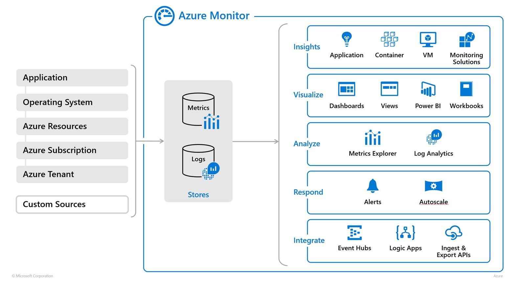

# Observability with Azure Monitor

!!! info "Learning Objectives"
    - Define the role of Azure Monitor in a DevOps workflow.
    - Implement Application Insights for deep application-level telemetry.
    - Use Azure Monitor to track infrastructure health and diagnostics.
    - Create proactive alerts and visualizations using Azure Dashboards.

In the cloud, knowing that a server is "up" is not enough. Modern DevOps requires **observability**—the ability to understand the internal state of a system by looking at its external outputs. Microsoft provides **Azure Monitor** as a unified tool for end-to-end monitoring of both the underlying infrastructure and the applications running on it.

!!! info "Why this matters"
    Monitoring is reactive (telling you that something is broken), but observability is proactive. By using detailed telemetry, DevOps teams can identify "performance degradation" *before* it becomes a "system outage." Azure Monitor allows teams to move from "the site is down" to "the database query in the checkout service has slowed down by 200ms over the last hour."

{#fig:azuremonitor}

## End-to-End Monitoring with Azure Monitor

Azure Monitor collects and analyzes telemetry from a wide range of sources, providing a holistic view of the system's health.

- **Infrastructure Monitoring**: It automatically tracks platform metrics for VMs, Containers, Storage, and Network resources.
- **Diagnostic Logs**: It gathers activity logs (who did what) and diagnostic logs (what happened inside the service) to help with auditing and troubleshooting.
- **Cross-Platform Support**: It supports applications written in .NET, Java, Node.js, Python, and more.

## Application Insights: Deep Dive Telemetry

While platform metrics tell you about the CPU and RAM, **Azure Application Insights** tells you about the *user experience*. By incorporating the Application Insights SDK into your code, you gain access to:

- **Request Tracking**: See exactly which API endpoints are being called and how long they take to respond.
- **Exception Tracking**: Automatically capture stack traces and crash reports from production.
- **Dependency Mapping**: Visualize how your application interacts with external databases, APIs, and other microservices.
- **Usage Analytics**: Track how many unique users are visiting your site and which features they use most.

!!! info "Why this matters"
    Integrating telemetry directly into the application allows developers to "debug in production." Instead of trying to reproduce a bug locally, you can search Application Insights for the exact request that failed and see the state of the system at that moment.

## Proactive Alerts and Visualization

Data is only useful if it leads to action. Azure Monitor provides tools to turn raw metrics into actionable insights.

### Programmatic Access and Querying
Azure Monitor allows you to query logs using powerful tools (like Kusto Query Language - KQL). You can also access these logs programmatically via PowerShell scripts to automate reports or trigger custom cleanup scripts.

### Dashboards and Visualization
Azure Monitor Dashboards allow you to create a "single pane of glass" for your operation. You can combine:
- **Tabular Widgets**: For listing the top 10 most failing requests.
- **Graphical Widgets**: For visualizing traffic spikes or memory leaks over time.
- **Health Tiles**: For an at-a-glance view of the status of your critical services.

### Proactive Notifications
Instead of watching a dashboard, you can set up alerts that notify the team via email or SMS when critical conditions are met, such as:
- Reaching a cloud quota limit.
- A sudden spike in 500-series HTTP errors.
- A failed health check on a critical VM.

# Self-Assessment

!!! tip "Self-Assessment"
    Test your knowledge by expanding the questions below.

??? question "What is the difference between monitoring and observability?"
    **Monitoring** is reactive; it tells you *that* something is broken based on predefined metrics (e.g., \"the CPU is at 95%\" or \"the site is down\"). **Observability** is proactive; it is the ability to understand the internal state of a system by analyzing its external outputs (telemetry), allowing you to understand *why* something is behaving unexpectedly before it leads to a failure.

??? question "What is the purpose of Azure Application Insights?"
    **Azure Application Insights** provides deep application-level telemetry. It allows developers to track individual requests, capture detailed exception stack traces, visualize dependency maps between microservices, and analyze user behavior, effectively allowing them to \"debug in production.\"

??? question "How do I use Azure Monitor to track infrastructure health?"
    **Azure Monitor** tracks infrastructure health by automatically collecting platform metrics for Azure resources (such as VMs, Containers, and Storage). It also gathers activity logs (who made a change) and diagnostic logs (internal service events) to provide a holistic view of the underlying system health.

??? question "How do dashboards help in visualizing telemetry data?"
    Dashboards provide a \"single pane of glass\" for operations. They combine tabular widgets for listing failures, graphical widgets for visualizing trends like memory leaks, and health tiles for an at-a-glance status of critical services, turning raw telemetry into actionable visual insights.

??? question "How do proactive alerts reduce the 'Mean Time to Recovery' (MTTR)?"
    Proactive alerts notify the operations team via email or SMS the moment a critical threshold is breached (e.g., a sudden spike in 500-series errors), often before the end-user even notices a problem. This immediate notification allows the team to begin troubleshooting and fixing the issue faster, which directly reduces the **Mean Time to Recovery (MTTR)**.

!!! note "Assignment 1: Telemetry Integration"
    You are developing a Python FastAPI application. Describe the steps required to integrate Azure Application Insights. What specific metrics would you track to ensure your "payment processing" endpoint is healthy?

!!! note "Assignment 2: Designing a Dashboard"
    Imagine you are the SRE (Site Reliability Engineer) for a global e-commerce site. Design a dashboard for "Black Friday." List the five most critical metrics you would put on the front page and explain why each is important.

!!! note "Assignment 3: Alerting Logic"
    Create a logic flow for a proactive alert system. For example: *If [Metric X] exceeds [Threshold Y] for [Z minutes], then [Action A] and [Notify Person B].* Apply this logic to a scenario where your application's memory usage is steadily climbing (a memory leak).
