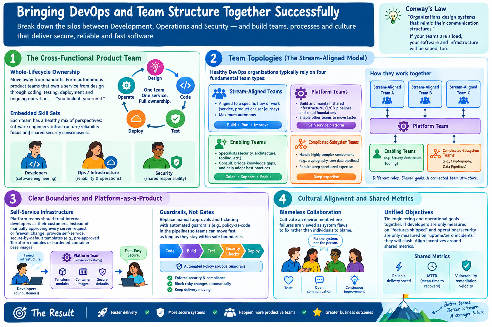
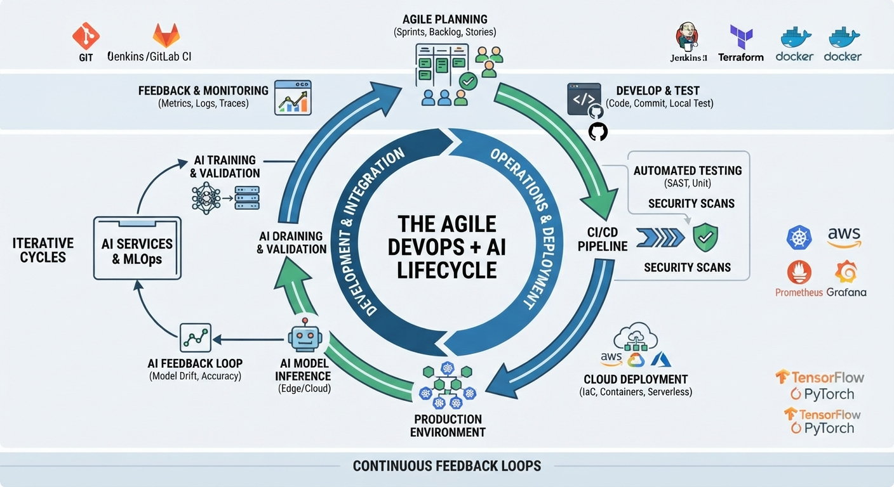
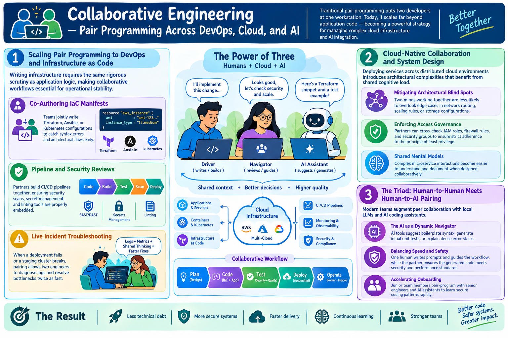

# DevOps and Teamwork

!!! info "Learning Objectives"
    - Analyze the impact of organizational communication on system architecture (Conway's Law).
    - Implement cross-functional team patterns to reduce handoffs and increase ownership.
    - Apply the Team Topologies framework (Stream-Aligned, Platform, Enabling, and Complicated-Subsystem teams) to optimize flow.
    - Transition from manual "gates" to automated "guardrails" using a Platform-as-a-Product approach.
    - Establish shared metrics to align Development, Operations, and Security incentives.

## Integrating Devops into the Organization

Bringing DevOps and team structure together successfully is all about how organizations break down the traditional silos between Development (Dev), Operations (Ops), and Security (Sec). Conway's Law states that organizations design systems that mimic their communication structures—so if your teams are siloed, your software and infrastructure will be siloed, too.

Industry-accepted patterns for organizing teams around a secure DevOps model include:

## The Cross-Functional Product Team

**Whole-Lifecycle Ownership**: Move away from handoffs (e.g., developers throw code over the wall to QA, who throws it to Ops, who throws it to Security). Instead, form autonomous product teams that own a service from design through coding, testing, deployment, and ongoing operations ("you build it, you run it").

**Embedded Skill Sets**: Ensure each team has a healthy mix of perspectives, including software engineers, infrastructure/reliability focus, and shared security consciousness.

!!! tip "Self-Assessment"
    ??? question "What is 'Whole-Lifecycle Ownership' and why does it reduce the 'wall' between teams?"
        It is the "you build it, you run it" mentality where a single team owns a service from design through operations. This eliminates the friction and delays caused by handoffs to separate QA, Ops, or Security teams.

## Team Topologies (The Stream-Aligned Model)
According to the widely adopted Team Topologies framework, healthy DevOps organizations typically rely on four fundamental team types:

**Stream-Aligned Teams**: The core product teams aligned to a specific flow of work (a service, product, or user journey). They operate with maximum autonomy.

**Platform Teams**: A specialized internal team that builds and maintains shared infrastructure, CI/CD pipelines, and cloud foundations so stream-aligned teams don't have to reinvent the wheel.

**Enabling Teams**: Specialists (often in security, architecture, or new tooling) who consult with stream-aligned teams, bridge knowledge gaps, and help them adopt best practices.

**Complicated-Subsystem Teams**: Dedicated groups that handle highly complex components (like cryptography algorithms or core data pipelines) requiring deep specialized expertise.

!!! tip "Self-Assessment"
    ??? question "In the Team Topologies framework, what is the primary difference between a Platform Team and an Enabling Team?"
        Platform Teams build the shared internal tools and infrastructure (treated as a product) that other teams consume. Enabling Teams are specialists who act as consultants to bridge knowledge gaps and help other teams adopt new capabilities.

## Clear Boundaries and Platform-as-a-Product
**Self-Service Infrastructure**: Platform teams should treat internal developers as their customers. Instead of manually approving every server request or firewall change, the platform team provides self-service, secure-by-default templates (like pre-approved Terraform modules or hardened container base images).

**Guardrails, Not Gates**: Traditional ticketing systems and manual review boards slow delivery to a crawl. Effective DevOps teams replace these with automated guardrails (e.g., automated policy-as-code checks in the pipeline) that allow teams to move fast as long as they stay within safe boundaries.

!!! tip "Self-Assessment"
    ??? question "How does a 'guardrail' differ from a 'gate' in a CI/CD pipeline?"
        A "gate" is a manual checkpoint (e.g., a Change Advisory Board meeting) that stops the flow of work for approval. A "guardrail" is an automated check (e.g., an automated security scan) that allows work to proceed automatically as long as it meets predefined safety criteria.

## Cultural Alignment and Shared Metrics
**Blameless Collaboration**: Cultivate an environment where failures are viewed as system flaws to fix rather than individuals to blame.

**Unified Objectives**: Tie engineering and operational goals together. If developers are only measured on "features shipped" and operations/security are only measured on "uptime/zero incidents," they will constantly clash. Align incentives around shared metrics like reliable delivery speed, mean time to recovery (MTTR), and vulnerability remediation velocity.

!!! tip "Self-Assessment"
    ??? question "Why are shared metrics like MTTR (Mean Time to Recovery) better for alignment than 'uptime' or 'number of bugs'?"
        MTTR encourages collaboration between Dev and Ops to restore service quickly. Conversely, "uptime" can make Ops teams resist all changes (to avoid outages), and "number of bugs" can lead Devs to hide issues or argue over bug definitions rather than collaborating on quality.

## Agile Methodologies in the Era of DevOps, Cloud Computing, and AI Services

Traditional software engineering methodologies often struggle to keep pace with the dynamic demands of modern cloud-native architectures and artificial intelligence integration. Agile programming—historically anchored in iterative development, short feedback loops, and cross-functional collaboration—provides the foundational framework needed to bridge this gap.

### 1. The Core Principles of Agile Development

At its core, Agile breaks complex engineering projects into manageable increments called sprints. Rather than waiting for a monolithic release, teams prioritize backlogs, deliver incremental value, and incorporate stakeholder feedback continuously. When applied to modern systems, these principles scale upward from simple code modules to encompass entire cloud environments and machine learning pipelines.

### 2. Bridging Agile and DevOps

DevOps extends Agile from code creation into operational deployment. By automating the Software Development Life Cycle (SDLC) through Continuous Integration and Continuous Deployment (CI/CD) pipelines, teams eliminate the friction of handoffs between developers and operators.

* **Infrastructure as Code (IaC):** Treat server configurations, networking, and security policies as version-controlled code, allowing infrastructure changes to follow the exact same agile pull-request workflows as application logic.
* **Automated Guardrails:** Integrate Static Application Security Testing (SAST) and unit tests directly into the pipeline to enforce quality standards automatically.

### 3. Incorporating AI Services and MLOps

The introduction of AI and large language models introduces unique lifecycle challenges, merging traditional software engineering with statistical experimentation. MLOps adapts Agile principles to manage these complexities:

* **Iterative Training and Validation:** Model training is inherently experimental; Agile sprints help structure dataset versioning, hyperparameter tuning, and automated model evaluations.

* **Continuous Monitoring and Feedback Loops:** Post-deployment AI services require ongoing tracking for data drift, inference latency, and accuracy degradation, feeding real-world data back into the next development cycle.

As illustrated in the lifecycle framework below, successful modern engineering unites agile planning, automated deployment, and AI feedback loops into a continuous, cohesive ecosystem.

]

## Collaborative Engineering—Pair Programming Across DevOps, Cloud, and AI

Traditional pair programming involves two developers sharing a workstation: one acts as the "driver" writing code, while the other acts as the "navigator" reviewing logic in real-time. In modern engineering, this collaborative practice scales far beyond basic application code, becoming a critical strategy for managing complex cloud infrastructure and AI integration.

### 1. Scaling Pair Programming to DevOps and Infrastructure as Code

Writing infrastructure requires the same rigorous scrutiny as application logic, making collaborative workflows essential for operational stability:

* **Co-Authoring IaC Manifests:** Teams jointly write Terraform, Ansible, or Kubernetes configurations to catch syntax errors and architectural flaws early.
* **Pipeline and Security Reviews:** Partners build CI/CD pipelines together, ensuring that automated security scans, secret management, and linting tools are properly embedded.
* **Live Incident Troubleshooting:** When a deployment fails or a staging cluster breaks, pairing allows two engineers to diagnose logs and resolve bottlenecks twice as fast.

### 2. Cloud-Native Collaboration and System Design

Deploying services across distributed cloud environments introduces architectural complexities that benefit immensely from shared cognitive load:

* **Mitigating Architectural Blind Spots:** Two minds working together are less likely to overlook edge cases in network routing, scaling rules, or storage configurations.
* **Enforcing Access Governance:** Partners can cross-check IAM roles, firewall rules, and security groups to ensure strict adherence to the principle of least privilege.
* **Shared Mental Models:** Complex microservice interactions become easier to understand and document when designed collaboratively.

### 3. The Triad: Human-to-Human Meets Human-to-AI Pairing

Modern engineering teams frequently augment traditional peer collaboration with local Large Language Models and AI coding assistants:

* **The AI as a Dynamic Navigator:** AI tools act as a virtual companion that suggests boilerplate syntax, generates initial unit tests, or explains dense error stacks.
* **Balancing Speed and Safety:** While one human driver writes prompts and guides the workflow, the human navigator ensures the generated code meets security and performance standards.
* **Accelerating Onboarding:** Junior team members pair-program alongside both senior engineers and AI assistants to learn secure coding patterns rapidly.

By integrating peer collaboration into cloud automation and AI workflows, engineering teams reduce technical debt, foster continuous learning, and deliver resilient software safely.

## Learning Wrap-up

## Assignments

!!! warning
    Do not reveal any information from your current or past employer. Keep it hypothetical. You may not be able to share this information based on your contract. 

!!! note "Assignment 1: Team Topology Mapping"
    Analyze your current organizational structure. Map your teams to the four Team Topologies types (Stream-Aligned, Platform, Enabling, and Complicated-Subsystem). Identify one "bottleneck" team where requests often pile up and suggest how to transition them toward a Platform or Enabling model.

!!! note "Assignment 2: Guardrail Design"
    Identify one manual approval process ("gate") currently existing in your software delivery lifecycle. Design a specific automated policy ("guardrail")—including the tool and the logic—that could replace this gate while maintaining the same level of security/quality.

!!! note "Assignment 3: Metric Dashboard"
    Draft a mockup of a shared dashboard containing 3 metrics that would force a developer and a security engineer to collaborate on the same goal. Explain why these specific metrics discourage siloed thinking.

