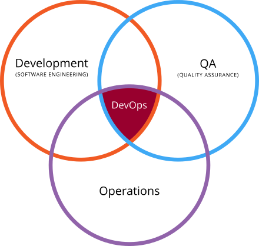
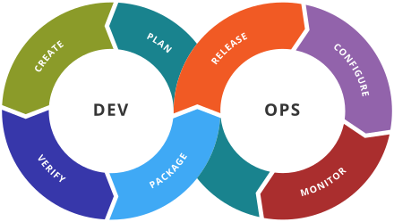
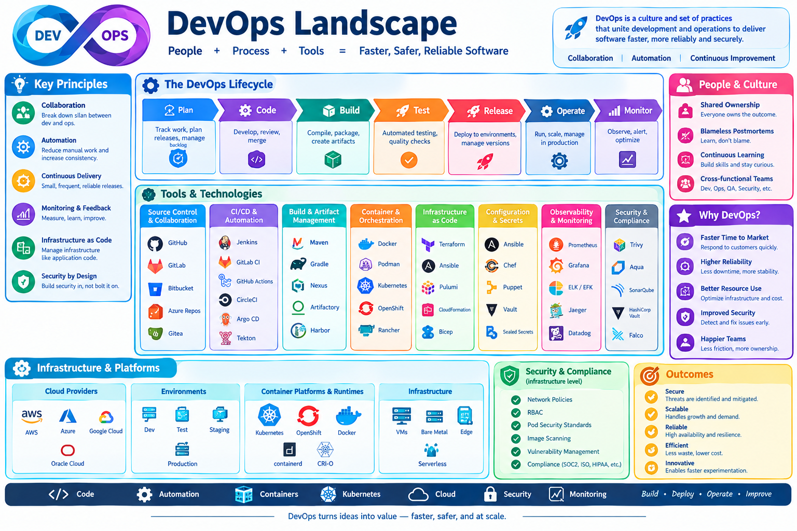

# Introduction to DevOps

!!! info "Learning Objectives"
    - Define DevOps and explain its core goals in a modern software lifecycle.
    - Analyze the interaction between development (Dev) and operations (Ops) in a toolchain cycle.
    - Understand the role of reproducibility and multi-cloud strategies in DevOps.
    - Identify key components of the DevOps landscape.

When working with cloud infrastructure and deploying platforms and software, developers essentially become their own system administrators. In the modern era, the responsibility of a developer is not limited to designing an algorithm; they must also understand how that algorithm is effectively deployed, scaled, and monitored on a production infrastructure. This intersection of skills is a critical challenge for Data Scientists, Data Engineers, and Cloud researchers.

The field of study designed to address these challenges is called DevOps.

As defined by industry standards, DevOps is a set of practices intended to reduce the time between committing a change to a system and the change being placed into normal production, while ensuring high quality.

!!! info "Why this matters"
    In traditional software development, a "wall" often existed between developers (who wrote the code) and operations teams (who managed the servers). This siloed approach led to "it works on my machine" syndrome, where code failed in production due to environment mismatches. DevOps breaks this wall, integrating the two roles to create a continuous, reliable delivery pipeline.

## The DevOps Lifecycle

DevOps is best visualized as a continuous loop of interactions between development and operations, often referred to as the toolchain cycle.

### The Development (Dev) Phase

The "Dev" portion of the cycle focuses on the creation and validation of the software:

- **Planning**: Defining requirements, user stories, and sprint goals.
- **Creating**: Writing the actual code and implementing features.
- **Verifying**: Performing unit tests, integration tests, and code reviews.
- **Packaging**: Bundling the code into deployable artifacts (e.g., Docker images, JAR files).

### The Operations (Ops) Phase

The "Ops" portion focuses on the stability and delivery of the software to the end user:

- **Releasing**: Deploying the package to staging or production environments.
- **Configuring**: Managing environment variables, secrets, and infrastructure settings.
- **Monitoring**: Tracking system health, performance metrics, and error logs.
- **Ops Planning**: Using monitoring data to influence the next cycle of development planning.

!!! info "Why this matters"
    By treating operations as part of the development loop, teams can implement "Feedback Loops." For example, if monitoring reveals a performance bottleneck in production, that information immediately informs the next planning phase, allowing the team to prioritize optimization over new features.

## Reproducibility and Multi-Cloud Strategies

A primary advantage of adopting a DevOps approach is the ability to ensure reproducibility across the entire product chain. If technologies are applied correctly, a solution should not only work on a single cloud provider but be portable across multiple clouds.

This is achieved by creating common underlying layers:
- **Infrastructure as Code (IaC)**: Defining servers and networks in text files.
- **Containerization**: Packaging software with all its dependencies.
- **Platform Abstraction**: Using tools that interface with multiple cloud APIs.

!!! info "Why this matters"
    Avoiding "cloud lock-in" is a strategic business requirement. By building DevOps pipelines that are cloud-agnostic, organizations can shift workloads to the most cost-effective provider or implement a multi-cloud strategy for higher availability and disaster recovery.

## The DevOps Landscape

The ecosystem of DevOps tools is vast, spanning everything from version control and CI/CD to observability and security (DevSecOps). This landscape is continuously evolving, with new tools emerging to solve specific problems in container orchestration, serverless deployments, and automated testing.

## 🎓 Learning Wrap-up

!!! tip "Self-Assessment"
    Test your knowledge by expanding the questions below.

??? question "How do I define DevOps and why is it necessary for modern cloud development?"
    DevOps is a set of practices designed to reduce the time between committing a change and placing it into production while ensuring high quality. It is necessary because it breaks down the "wall" between developers and operations, eliminating the "it works on my machine" syndrome by integrating the two roles into a continuous, reliable delivery pipeline.

??? question "What are the stages of the Dev phase?"
    The Dev phase focuses on the creation and validation of software through these stages: **Planning** (defining requirements), **Creating** (writing code), **Verifying** (unit tests and code reviews), and **Packaging** (bundling code into deployable artifacts like Docker images).

??? question "What are the stages of the Ops phase?"
    The Ops phase focuses on stability and delivery through: **Releasing** (deploying to environments), **Configuring** (managing settings and secrets), **Monitoring** (tracking health and performance), and **Ops Planning** (using monitoring data to inform the next development cycle).

??? question "What is the 'Feedback Loop' between Ops and Dev?"
    The Feedback Loop is the process where real-world performance data from the Monitoring stage (Ops) is used to influence the Planning stage (Dev). This allows teams to prioritize optimizations or bug fixes based on real production data.

??? question "How does reproducibility enable multi-cloud strategies?"
    Reproducibility, achieved through Infrastructure as Code (IaC) and containerization, ensures that an environment can be recreated identically regardless of the underlying provider. This prevents "cloud lock-in" and allows organizations to move workloads between providers (e.g., AWS to Azure) for cost or availability reasons.

!!! note "Exercise 1: Mapping your Workflow"
    Identify a software project you are currently working on. List the tools you use for each stage of the DevOps cycle (e.g., Git for version control, GitHub Actions for verification, Docker for packaging). Identify one \"gap\" where manual effort is still required and suggest a tool to automate it.

!!! note "Exercise 2: Analyzing the Feedback Loop"
    Imagine a scenario where a production application is experiencing intermittent 500 errors. Trace the path of this issue through the DevOps cycle: from Monitoring (Ops) $\rightarrow$ Ops Planning $\rightarrow$ Dev Planning $\rightarrow$ Creating $\rightarrow$ Verifying $\rightarrow$ Releasing.

!!! note "Exercise 3: Reproducibility Audit"
    Review a deployment script or configuration file you use. Determine if it contains hard-coded values (IP addresses, paths) that would prevent it from running on a different cloud provider or a different region. Propose a way to make these values dynamic using environment variables.

## References

- DevOps tools collection: [GitHub - devops-tools](https://github.com/collections/devops-tools)
- Tox: [tox.readthedocs.io](https://tox.readthedocs.io/en/latest/)
- Travis CI: [about.travis-ci.com](https://about.travis-ci.com/)
