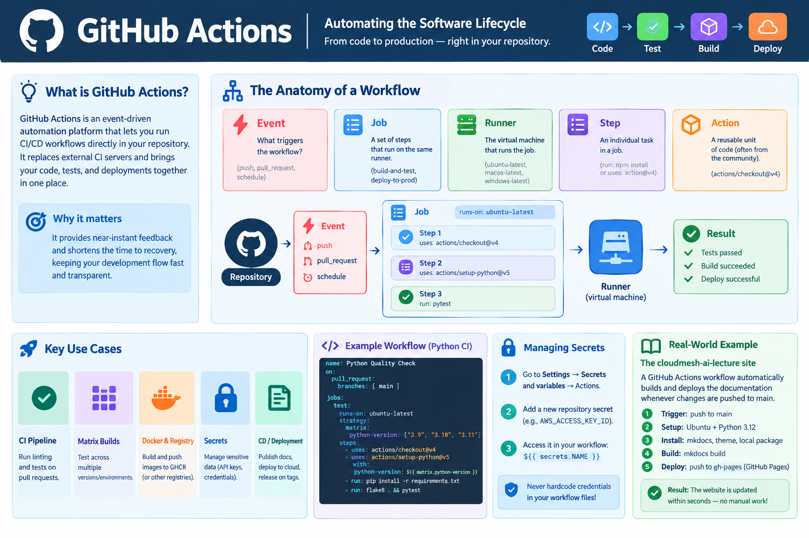

# Automating the Software Lifecycle with GitHub Actions

!!! info "Learning Objectives"
    - Define GitHub Actions and its role in modern CI/CD.
    - Understand the core components of a workflow: Events, Jobs, Steps, and Actions.
    - Implement a basic automation pipeline for testing and linting.
    - Create a complex workflow including Docker image builds and registry pushes.
    - Utilize Matrix builds to test across multiple environments.
    - Manage sensitive data using GitHub Secrets.

In the modern DevOps era, the "integration" part of Continuous Integration (CI) has moved from dedicated servers (like Jenkins) directly into the source control platform. **GitHub Actions** is a powerful event-driven automation platform that allows you to run complex workflows directly in your repository. Whether it is running a test suite every time a developer pushes code or deploying a website to a cloud provider, GitHub Actions eliminates the need for external CI infrastructure.

!!! info "Why this matters"
    The "Time to Feedback" is the most critical metric in software development. If a developer has to wait hours to know if their change broke the build, productivity plummets. GitHub Actions provides near-instant feedback by triggering automation on every \`git push\` or \`pull_request\`. By integrating the CI/CD pipeline directly into the GitHub UI, the "code" and the "test" live in the same place, making the path to production transparent and auditable.

## 1. The Anatomy of a Workflow

A GitHub Action is defined by a **Workflow** file—a YAML document located in the \`.github/workflows/\` directory of your repository.

### Core Components

| Component | Description | Example |
| :--- | :--- | :--- |
| **Event** | The trigger that starts the workflow. | \`push\`, \`pull_request\`, \`schedule\` (cron) |
| **Job** | A set of steps that execute on the same runner. | \`build-and-test\`, \`deploy-to-prod\` |
| **Runner** | The virtual machine executing the job. | \`ubuntu-latest\`, \`macos-latest\`, \`windows-latest\` |
| **Step** | An individual task within a job. | \`run: npm install\` or \`uses: actions/checkout@v4\` |
| **Action** | A reusable unit of code (often shared by the community). | \`actions/setup-python@v5\` |

### A Minimal Example
Here is a simple workflow that greets the user and checks the Python version:

\`\`\`yaml
name: Hello World Workflow
on: [push] # Trigger on every push

jobs:
  greet:
    runs-on: ubuntu-latest
    steps:
      - name: Say Hello
        run: echo "Hello, CloudMesh AI Student!"
      - name: Check Python
        run: python --version
\`\`\`

## 2. Implementing a Professional CI Pipeline

In a real-world scenario, a CI pipeline doesn't just say "Hello"; it ensures code quality through linting and testing.

### Example: Python Testing Pipeline
This workflow triggers on every Pull Request to the \`main\` branch. It installs dependencies, runs a linter (\`flake8\`), and executes tests (\`pytest\`).

\`\`\`yaml
name: Python Quality Check

on:
  pull_request:
    branches: [ main ]

jobs:
  test:
    runs-on: ubuntu-latest
    steps:
      - name: Checkout code
        uses: actions/checkout@v4

      - name: Set up Python
        uses: actions/setup-python@v5
        with:
          python-version: '3.11'

      - name: Install dependencies
        run: |
          pip install flake8 pytest
          pip install -r requirements.txt

      - name: Lint with flake8
        run: flake8 . --count --select=E9,F63,F7,F82 --show-source --statistics

      - name: Run tests
        run: pytest
\`\`\`

### 2.2 Building and Publishing Container Images

Integrating container builds into your CI pipeline ensures that every verified commit is automatically packaged into an image ready for deployment.

\`\`\`yaml
name: Containerized Build

on:
  push:
    branches: [ main ]

jobs:
  build-image:
    runs-on: ubuntu-latest
    steps:
      - name: Checkout code
        uses: actions/checkout@v4

      - name: Set up Docker Buildx
        uses: docker/setup-buildx-action@v3

      - name: Login to GitHub Container Registry
        uses: docker/login-action@v3
        with:
          registry: ghcr.io
          username: \${{ github.actor }}
          password: \${{ secrets.GITHUB_TOKEN }}

      - name: Build and push
        uses: docker/build-push-action@v5
        with:
          push: true
          tags: ghcr.io/\${{ github.repository }}:latest
\`\`\`

### 3.3 Managing Secrets
Never hardcode API keys or passwords in your YAML files. Use **GitHub Secrets**:
1. Go to **Settings** $\rightarrow$ **Secrets and variables** $\rightarrow$ **Actions**.
2. Add a new repository secret (e.g., \`AWS_ACCESS_KEY_ID\`).
3. Access it in your workflow using the \`${{ secrets.NAME }}\` syntax.

---

## 🎓 Learning Wrap-up

# Self-Assessment

!!! tip "Self-Assessment"
    Test your knowledge by expanding the questions below.

??? question "What is the difference between a Workflow, a Job, and a Step?"
    A **Workflow** is the overall automated process defined in a YAML file. A **Job** is a set of steps that run on the same runner (VM), allowing them to share a filesystem. A **Step** is an individual task within a job, which can either be a shell command (\`run\`) or a reusable action (\`uses\`).

??? question "How do I trigger a workflow using push and pull_request?"
    Workflows are triggered by events defined in the \`on:\` section. \`on: [push]\` triggers the workflow whenever code is pushed to any branch. \`on: [pull_request]\` triggers it when a PR is opened, synchronized, or reopened. You can further refine these triggers to specific branches or tags.

!!! tip "Self-Assessment"
    Test your knowledge by expanding the questions below.

??? question "What are community actions and how are actions/checkout and actions/setup-python used?"
    Community actions are reusable units of code shared by the community to perform common tasks. \`actions/checkout@v4\` is used to clone the repository onto the runner so that the workflow can access the code. \`actions/setup-python@v5\` is used to install a specific version of Python on the runner, ensuring a consistent environment for tests.

??? question "How does a Matrix build help in testing multiple environments?"
    A **Matrix** allows you to run the same job across multiple combinations of variables (e.g., multiple Python versions or multiple operating systems) without duplicating the job definition. GitHub Actions spawns a separate job for each combination in the matrix, ensuring the code works across all target environments.

??? question "How do I securely manage credentials using GitHub Secrets?"
    Credentials should be stored in **GitHub Secrets** (found in repository settings). These are encrypted and not visible in the YAML file. They are accessed using the \`${{ secrets.SECRET_NAME }}\` syntax, and GitHub automatically masks them in the workflow logs to prevent accidental exposure.

!!! note "Assignment 1: The Linting Guard"
    Create a GitHub Actions workflow for a repository that prevents a Pull Request from being merged if the code doesn't pass a linter check (e.g., \`black\` or \`flake8\`).

!!! note "Assignment 2: The Image Factory"
    Design a workflow that builds a Docker image only when a new **Tag** (e.g., \`v1.0.0\`) is pushed to the repository, and then pushes that tagged image to a container registry.

---

## Appendix: Publishing the cloudmesh-ai-lecture

The \`cloudmesh-ai-lecture\` website is automatically published using a specialized GitHub Actions workflow located at [.github/workflows/docs.yml](https://github.com/cloudmesh-ai/cloudmesh-ai-lecture/blob/main/.github/workflows/docs.yml). This is a prime example of **Continuous Deployment (CD)**.

### How it Works
Whenever a change is pushed to the \`main\` branch, the following sequence occurs:

1.  **Trigger**: The \`on: push: branches: [main]\` event fires.
2.  **Environment Setup**: A virtual machine (\`ubuntu-latest\`) is provisioned, and Python 3.12 is installed.
3.  **Dependency Installation**:
    - The workflow installs \`mkdocs\` and \`mkdocs-material\`.
    - It installs the custom \`cloudmesh-ai-theme\` directly from GitHub.
    - It installs the local package in editable mode (\`pip install -e .\`) so that \`mkdocstrings\` can automatically extract documentation from the Python source code.
4.  **Site Generation**: The \`mkdocs build\` command transforms the Markdown files into a static HTML website.
5.  **Deployment**: The \`peaceiris/actions-gh-pages\` action takes the generated \`./site\` folder and pushes it to a special branch called \`gh-pages\`. GitHub then automatically hosts this branch as a website.

### Key Takeaway
This automation ensures that the documentation is always in sync with the code. If you fix a typo in a Markdown file and push to \`main\`, the live website is updated within seconds without any manual intervention.

---

!!! note "Assignment: The Open Source Contribution"
    The best way to learn GitHub Actions is to participate in a real project. 
    1. Identify a small improvement, a typo fix, or a new documentation section in the \`cloudmesh-ai-lecture\` repository.
    2. Create a new branch and commit your changes.
    3. Open a **Pull Request (PR)**.
    4. Observe how the \`docs.yml\` workflow automatically triggers to validate your changes.
    5. Engage with the maintainer in the PR comments and refine your contribution until it is approved and merged.
