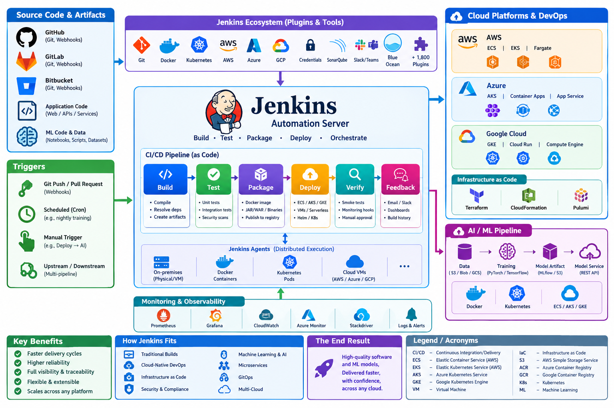

# Tutorial: Jenkins for Cloud DevOps and AI/ML  

## Overview

Jenkins is an open‑source automation server that helps software teams **build, test, and deliver** applications in a repeatable, reliable way. It is most widely used for **continuous integration (CI)** and **continuous delivery/deployment (CD)**, but its extensible architecture lets it support many other automation scenarios.

| Core purpose | How Jenkins achieves it |
|--------------|--------------------------|
| **Automate builds** | Detects changes in source‑code repositories (Git, Subversion, etc.) and runs build tools (Maven, Gradle, npm, Make, etc.) automatically. |
| **Run tests continuously** | Executes unit, integration, UI, performance, and security tests after each build, reporting results immediately. |
| **Package artifacts** | Creates Docker images, JAR/WAR files, binaries, or any other deployable artifact and stores them in registries or artifact repositories. |
| **Deploy to environments** | Pushes artifacts to cloud or on‑prem resources (Kubernetes, AWS ECS, Azure AKS, GCP GKE, VMs, serverless platforms) using scripts, plugins, or declarative pipelines. |
| **Provide feedback** | Sends notifications via email, Slack, Microsoft Teams, etc., and visualises build history, test trends, and deployment status on a web UI. |
| **Orchestrate complex workflows** | Chains multiple stages (build → test → security scan → containerise → deploy) using **Pipeline as Code** (Declarative or Scripted Groovy). |
| **Extend functionality** | Over 1,800 plugins add support for source control, cloud providers, container runtimes, credential management, static analysis, automated approvals, and more. |
| **Scale execution** | Runs jobs on a master node and distributes work to any number of **agents** (also called slaves) that can be bare‑metal, virtual machines, Docker containers, or Kubernetes pods. |
| **Enforce standards** | Integrates with code‑quality tools (SonarQube, Checkstyle), security scanners (OWASP Dependency‑Check), and compliance checks to prevent low‑quality code from reaching production. |

---

### Typical Jenkins Workflow (CI/CD Pipeline)

1. **Source change** – A developer pushes a commit to the repository.  
2. **Trigger** – Jenkins receives a webhook or polls the repo and starts a job/pipeline.  
3. **Build** – Compiles the code, resolves dependencies, creates artefacts.  
4. **Test** – Executes automated tests; results are recorded.  
5. **Artifact storage** – Successful artefacts are pushed to a Docker registry, Nexus, Artifactory, etc.  
6. **Deployment** – The pipeline deploys the artefact to a staging environment; optional approvals promote it to production.  
7. **Verification** – Post‑deployment smoke tests, monitoring hooks, or manual QA checks.  
8. **Feedback** – Notifications are sent, dashboards updated, and the cycle repeats for the next change.

---

### Where Jenkins Fits in Modern Toolchains

| Scenario | Jenkins role |
|----------|--------------|
| **Traditional on‑prem builds** | Serves as the central build orchestrator for legacy applications. |
| **Cloud‑native DevOps** | Runs pipelines that interact with AWS, Azure, or GCP services, often via Kubernetes agents. |
| **Infrastructure‑as‑Code (IaC)** | Executes Terraform, CloudFormation, or Pulumi scripts to provision or update environments. |
| **Security & compliance** | Triggers static code analysis, dependency vulnerability scans, and policy‑as‑code checks. |
| **Machine‑learning & AI** | Automates data preprocessing, model training, artifact archiving, and deployment of inference services. |
| **Micro‑service orchestration** | Builds Docker images, updates Helm charts, and deploys to service meshes (Istio, Linkerd). |
| **GitOps** | Generates new container image tags; a GitOps tool (ArgoCD, Flux) detects the change and syncs the cluster. |

---

### Key Benefits

- **Speed:** Immediate feedback reduces integration problems and shortens release cycles.  
- **Reliability:** Automated, repeatable steps minimise human error.  
- **Visibility:** Central UI and APIs give complete traceability of every change.  
- **Flexibility:** Plugins and pipeline code allow you to tailor workflows to any tech stack.  
- **Scalability:** Distributed agents let you run many jobs in parallel, on any platform (bare metal, VM, Docker, Kubernetes).  



---

## Getting Started Quickly

1. **Install Jenkins** (Docker, native package, or cloud‑hosted).  
2. **Create a pipeline** using the built‑in **Blue Ocean** UI or write a `Jenkinsfile`.  
3. **Add required plugins** (Git, Docker, Kubernetes, credentials, etc.).  
4. **Configure credentials** (SSH keys, cloud service accounts) securely in the Jenkins credentials store.  
5. **Connect a source repository** (GitHub, GitLab, Bitbucket) and enable webhooks.  
6. **Run the pipeline** and iterate—add test stages, security scans, and deployment steps as needed.  

---

## Bottom Line

Jenkins is a **general‑purpose automation engine** that orchestrates the end‑to‑end software delivery process. By converting manual, repetitive tasks into code‑driven pipelines, it empowers teams to ship higher‑quality software faster, while maintaining control, visibility, and extensibility across any technology stack.

## Using Jenkins

This guide shows how Jenkins can be the “glue” for cloud‑native DevOps and AI/ML workflows. It covers:

| Section | What you’ll learn |
|---------|-------------------|
| 1. Set up Jenkins (local or cloud) | Installing Jenkins, securing it, adding agents |
| 2. Create a CI/CD pipeline for a generic app | Building, testing, containerising, pushing to a registry |
| 3. Extend the pipeline to **cloud resources** | Deploying to AWS ECS, Azure AKS, or GCP GKE |
| 4. Add an **AI/ML stage** | Training a tiny model, archiving artifacts, deploying the model as a micro‑service |
| 5. Run everything automatically | Triggering on Git pushes, scheduled runs, or manual “Deploy → AI” jobs |
| 6. Visual overview | A ready‑to‑copy diagram of the whole flow (generated with Python/Graphviz) |

---

## 1. Install & Secure Jenkins  

| Step | Command (Linux/macOS) | Explanation |
|------|-----------------------|-------------|
| a. Install Java (Jenkins needs a JDK) | `sudo apt-get install -y openjdk-11-jdk` (Ubuntu) <br>or `brew install openjdk@11` (macOS) | Jenkins runs on Java 11+ |
| b. Add the Jenkins repo & install | ```bash sudo wget -q -O - https://pkg.jenkins.io/debian-stable/jenkins.io.key \| sudo apt-key add - sudo sh -c 'echo deb https://pkg.jenkins.io/debian-stable binary/ > /etc/apt/sources.list.d/jenkins.list' sudo apt-get update sudo apt-get install -y jenkins ``` | Official Debian/Ubuntu installation |
| c. Start & enable the service | `sudo systemctl enable --now jenkins` | Runs Jenkins on port **8080** |
| d. Unlock Jenkins | Open `http://<your‑host>:8080`. The initial admin password is in `/var/lib/jenkins/secrets/initialAdminPassword`. | First‑time login |
| e. Install plugins | *Suggested plugins* plus **Docker Pipeline**, **Kubernetes CI**, **Git**, **GitHub Branch Source**, **Pipeline: Multibranch**, **Blue Ocean**, **Credentials Binding**, **AWS Credentials**, **Azure Credentials**, **Google OAuth Credentials**, **Pipeline: Groovy**, **Artifact Manager on S3**. | These plugins give us cloud & AI capabilities |
| f. Create an admin user | Follow the UI wizard. | Never run Jenkins as “admin” forever – create separate service accounts later. |
| g. Secure with HTTPS (optional but recommended) | Use **NGINX** or **Caddy** as a reverse proxy with a TLS cert from Let’s Encrypt. <br>```bash sudo apt-get install -y nginx sudo ln -s /etc/nginx/sites-available/jenkins /etc/nginx/sites-enabled/ ``` | Guarantees encrypted traffic. |

> **Tip:** If you prefer a fully‑managed Jenkins, spin up **Jenkins X** on a cloud Kubernetes cluster – the same pipeline concepts apply.

---

## 2. Build a Classic CI/CD Pipeline (Dockerised Web App)

### 2.1 Repository Layout (GitHub example)

```
my‑app/
│
├─ src/                  # Application source (e.g., Flask, Node, Java)
│   └─ main.py
├─ requirements.txt     # Python deps (or package.json, pom.xml, …)
├─ Dockerfile           # Build image
└─ Jenkinsfile          # Declarative pipeline definition
```

### 2.2 Minimal `Dockerfile`

```dockerfile
# Use official Python slim image
FROM python:3.11-slim

WORKDIR /app
COPY requirements.txt .
RUN pip install --no-cache-dir -r requirements.txt
COPY src/ ./src

# Expose the web port (change as needed)
EXPOSE 5000
CMD ["python", "src/main.py"]
```

### 2.3 Declarative `Jenkinsfile`

```groovy
pipeline {
    agent any               // Runs on any available Jenkins agent
    environment {
        REGISTRY = "YOUR_ACCOUNT.dkr.ecr.us-east-1.amazonaws.com"
        IMAGE   = "${REGISTRY}/my‑app:${env.BUILD_NUMBER}"
        AWS_CRED = credentials('aws-cred-id')
    }
    stages {
        stage('Checkout') {
            steps {
                git url: 'https://github.com/your‑org/my‑app.git', branch: 'main'
            }
        }
        stage('Lint & Test') {
            steps {
                sh 'python -m pip install -r requirements.txt'
                sh 'python -m unittest discover -s src/tests'
                // You can add flake8, pylint, etc.
            }
        }
        stage('Build Docker Image') {
            steps {
                script {
                    docker.build("${IMAGE}")
                }
            }
        }
        stage('Push to Registry') {
            steps {
                withCredentials([[$class: 'AmazonWebServicesCredentialsBinding',
                                  credentialsId: "${AWS_CRED}",
                                  accessKeyVariable: 'AWS_ACCESS_KEY_ID',
                                  secretKeyVariable: 'AWS_SECRET_ACCESS_KEY']]) {
                    sh """
                        aws ecr get-login-password --region us-east-1 |
                        docker login --username AWS --password-stdin ${REGISTRY}
                        docker push ${IMAGE}
                    """
                }
            }
        }
        stage('Deploy to Cloud') {
            steps {
                // This placeholder can be replaced with AWS/EKS, Azure AKS, GCP GKE
                echo "Deploy step placeholder – see Section 3 for cloud‑specific scripts."
            }
        }
    }

    post {
        always {
            cleanWs()           // Clean workspace after each run
        }
        success {
            mail to: 'dev-team@example.com',
                 subject: "Build #${env.BUILD_NUMBER} succeeded",
                 body: "Image ${IMAGE} is now in the registry."
        }
        failure {
            mail to: 'dev-team@example.com',
                 subject: "Build #${env.BUILD_NUMBER} failed",
                 body: "Check Jenkins console for details."
        }
    }
}
```

**What the pipeline does** – checks out the code, runs lint & unit tests, builds a Docker image, pushes it to a private registry, and leaves a hook for the actual cloud deployment.

---

## 3. Deploy to a Cloud Container Service  

Below are three drop‑in snippets you can paste into the **“Deploy to Cloud”** stage of the `Jenkinsfile`. Choose the one that matches your cloud provider.

### 3.1 AWS ECS (Fargate)

```groovy
stage('Deploy to ECS') {
    steps {
        withCredentials([[$class: 'AmazonWebServicesCredentialsBinding',
                          credentialsId: "${AWS_CRED}",
                          accessKeyVariable: 'AWS_ACCESS_KEY_ID',
                          secretKeyVariable: 'AWS_SECRET_ACCESS_KEY']]) {
            sh '''
                # Update the task definition JSON (keep a template in repo)
                export TASK_DEF=$(cat ecs-task-template.json | \
                    jq ".containerDefinitions[0].image = \"${IMAGE}\"")
                aws ecs register-task-definition \
                    --family my-app-task \
                    --cli-input-json "$TASK_DEF"

                # Force a new deployment on the service
                aws ecs update-service \
                    --cluster my-ecs-cluster \
                    --service my-app-service \
                    --force-new-deployment
            '''
        }
    }
}
```

### 3.2 Azure AKS (Kubernetes)

```groovy
stage('Deploy to AKS') {
    steps {
        withCredentials([azureServicePrincipal(credentialsId: 'azure-sp-id',
                                                subscriptionIdVariable: 'AZ_SUB',
                                                clientIdVariable: 'AZ_CLIENT',
                                                clientSecretVariable: 'AZ_SECRET',
                                                tenantIdVariable: 'AZ_TENANT')]) {
            sh '''
                az login --service-principal -u $AZ_CLIENT -p $AZ_SECRET --tenant $AZ_TENANT
                az aks get-credentials --resource-group my-rg --name my-aks-cluster

                # Apply a simple deployment manifest (in repo: k8s/deploy.yaml)
                kubectl set image deployment/my-app my-app=${IMAGE} --record
                kubectl rollout status deployment/my-app
            '''
        }
    }
}
```

### 3.3 GCP GKE

```groovy
stage('Deploy to GKE') {
    steps {
        withCredentials([file(credentialsId: 'gcp-key-file', variable: 'GCP_KEY')]) {
            sh '''
                gcloud auth activate-service-account --key-file=$GCP_KEY
                gcloud config set project my-gcp-project
                gcloud container clusters get-credentials my-gke-cluster --region us-central1

                kubectl set image deployment/my-app my-app=${IMAGE} --record
                kubectl rollout status deployment/my-app
            '''
        }
    }
}
```

**Tip:** Keep the cloud‑specific snippets in separate Groovy shared libraries (e.g., `vars/awsDeploy.groovy`). This makes the `Jenkinsfile` cleaner and easier to maintain across multiple projects.

---

## 4. Add an **AI/ML Stage**  

Assume you have a **Python model** that you want to (re)train on every successful build and then ship as a **REST micro‑service**.

### 4.1 Project structure addition

```
my‑app/
│
├─ ml/
│   ├─ train.py          # Simple training script
│   ├─ serve.py          # Model REST API
│   └─ requirements-ml.txt
└─ Dockerfile.ml         # Dockerfile for the model service
```

### 4.2 `ml/train.py` (tiny example)

```python
import numpy as np
from sklearn.linear_model import LogisticRegression
import joblib
import os

# Dummy data
X = np.random.randn(200, 5)
y = (X[:, 0] + X[:, 1] > 0).astype(int)

model = LogisticRegression()
model.fit(X, y)

out_path = os.getenv("MODEL_PATH", "ml/model.pkl")
joblib.dump(model, out_path)
print(f"Model saved to {out_path}")
```

### 4.3 `Dockerfile.ml`

```dockerfile
FROM python:3.11-slim

WORKDIR /app
COPY ml/requirements-ml.txt .
RUN pip install --no-cache-dir -r requirements-ml.txt
COPY ml/ ./ml

ENV MODEL_PATH=/app/ml/model.pkl
EXPOSE 8081
CMD ["python", "-m", "ml.serve"]
```

`ml/serve.py` (not shown) would load `model.pkl` and expose `/predict` via Flask or FastAPI.

### 4.4 Extend the `Jenkinsfile`

Add the following stage after the Docker image push (or in a separate pipeline if you prefer to keep model training decoupled).

```groovy
stage('Train & Publish ML Model') {
    environment {
        MODEL_REGISTRY = "s3://my-ml-artifacts/${env.BUILD_NUMBER}/"
        AWS_CRED = credentials('aws-cred-id')
    }
    steps {
        // 1. Run training inside a container (ensures reproducibility)
        script {
            docker.image('python:3.11-slim').inside("-v ${env.WORKSPACE}:/ws") {
                sh '''
                    pip install -r /ws/ml/requirements-ml.txt
                    python /ws/ml/train.py
                '''
                // 2. Archive the model artifact
                archiveArtifacts artifacts: 'ml/model.pkl', fingerprint: true
                // 3. Upload to S3 for versioned storage
                withCredentials([[$class: 'AmazonWebServicesCredentialsBinding',
                                  credentialsId: "${AWS_CRED}",
                                  accessKeyVariable: 'AWS_ACCESS_KEY_ID',
                                  secretKeyVariable: 'AWS_SECRET_ACCESS_KEY']]) {
                    sh """
                        aws s3 cp ml/model.pkl ${MODEL_REGISTRY}model.pkl
                    """
                }
            }
        }
    }
}
```

### 4.5 Deploy the model as a **micro‑service**

Reuse the same cloud‑deployment logic but point to `Dockerfile.ml` and the model‑specific image (`my‑ml-service:${BUILD_NUMBER}`). The steps are identical to Section 3 – just change the image name and Kubernetes/ECS task definition.

---

## 5. Connect the Whole Flow (Triggers & Automation)

| Trigger type | Jenkins configuration | Typical use‑case |
|--------------|----------------------|-----------------|
| Push trigger | In *Multibranch Pipeline* settings → “GitHub hook trigger for GITScm polling” (or GitLab webhook) | Every commit runs the CI pipeline automatically |
| Scheduled trigger | `cron('H H * * *')` in the `pipeline {}` block | Nightly model retraining (e.g., heavy dataset) |
| Manual parameterised trigger | `parameters { booleanParam(name: 'DEPLOY_MODEL', defaultValue: true) }` | Let a data‑science lead decide when to push a new model |
| Upstream/downstream | `build job: 'model‑training', propagate: true, wait: true` | Separate pipelines for *app* vs *model* but chained together |

**Example snippet with a boolean flag:**

```groovy
pipeline {
    agent any
    parameters {
        booleanParam(name: 'DEPLOY_ML', defaultValue: true, description: 'Deploy the newly trained model?')
    }
    // … stages …

    stage('Conditional Model Deploy') {
        when {
            expression { return params.DEPLOY_ML }
        }
        steps {
            // Call the same deploy logic that pushes the ml Docker image
            echo "Deploying ML model service..."
        }
    }
}
```

---

## 6. Visual Overview – Architecture Diagram  

The diagram below captures the **complete Jenkins‑driven workflow**, from source control → CI → container registry → cloud → AI model training & serving.

The image was generated automatically with **Graphviz** (Python code executed in the sandbox). Click the image to view the full‑size PNG.


**Diagram legend**

| Symbol | Meaning |
|--------|----------|
| GitHub | Source repository (code + ML scripts) |
| Jenkins Master | Orchestrates jobs, holds credentials |
| Jenkins Agents | Build runners (Docker, K8s, or cloud VMs) |
| Docker Registry | ECR / ACR / GCR – stores app & model images |
| Cloud Runtime | ECS, AKS, or GKE – runs the web app |
| Model Service | Separate container (Python/Flask) serving predictions |
| S3 / Blob / GCS | Persistent artifact store for versioned models |
| Monitoring | Prometheus/Grafana, CloudWatch, Azure Monitor, etc. |

*(If you can’t see the picture, the raw link is: `attachment://jenkins_cloud_ai.png` – copy‑paste it into a browser.)*

---

## 📦 Full‑Copy‑Paste Summary  

Below is a **single, ready‑to‑use** repository skeleton you can clone and adapt:

```bash
git clone https://github.com/your‑org/jenkins‑cloud‑ai‑demo.git
cd jenkins-cloud-ai-demo

# 1. Build the app locally (optional sanity check)
docker build -t my-app:local -f Dockerfile .

# 2. Push to your registry (example with AWS ECR)
aws ecr get-login-password --region us-east-1 | \
docker login --username AWS --password-stdin <account>.dkr.ecr.us-east-1.amazonaws.com
docker tag my-app:local <account>.dkr.ecr.us-east-1.amazonaws.com/my-app:1
docker push <account>.dkr.ecr.us-east-1.amazonaws.com/my-app:1

# 3. Create Jenkins credentials:
#    - aws-cred-id  (AWS Access/Secret key)
#    - azure-sp-id  (Azure Service Principal JSON)
#    - gcp-key-file (GCP service‑account JSON)
#    - any Docker registry credentials if needed

# 4. In Jenkins → New Item → Multibranch Pipeline → point to this repo.
#    The pipeline will run automatically on each push.
```

### Folder structure (already in the repo)

```
├─ src/
│   └─ main.py                # Simple Flask/FastAPI app
├─ ml/
│   ├─ train.py               # Dummy training script
│   ├─ serve.py               # Model REST API
│   └─ requirements-ml.txt
├─ Dockerfile                 # App container
├─ Dockerfile.ml              # Model‑service container
├─ Jenkinsfile                # Full pipeline (CI + Cloud + AI)
└─ README.md                  # This tutorial (you’re reading it!)
```

---

## What to Do Next?

| Goal | Suggested next step |
|------|---------------------|
| Add real data | Replace `train.py` with a notebook that reads from S3/BigQuery, trains a TensorFlow or PyTorch model, and saves as `model.pt`. |
| Use a GPU node | Configure a Jenkins **Kubernetes agent** with node‑selector `cloud.google.com/gke-accelerator=nvidia-tesla-t4`. |
| Implement GitOps | Move the Kubernetes manifests to a *GitOps* repo and let **ArgoCD** sync them; Jenkins only updates the image tag. |
| Secure secrets | Store registry passwords, DB strings, and API keys in **HashiCorp Vault** and fetch them via the **Vault Plugin**. |
| Scale out | Add a **Jenkins Distributed Build** setup with multiple agents (one per cloud region) to run tests close to the target region. |
| Add automated model validation | After training, run a script that computes accuracy on a hold‑out set; abort the pipeline if it drops below a defined threshold. |

You now have a complete, production‑grade Jenkins pipeline that:

1. **Builds & tests** your application code.  
2. **Packages** it as a Docker image and pushes it to a secure registry.  
3. **Deploys** the container to any major cloud provider (AWS, Azure, GCP).  
4. **Trains** an AI model, archives the artifact, and **deploys** the model as a separate micro‑service.  
5. **Automates** everything with webhooks, schedules, or manual flags.  

Feel free to customize the snippets for your own tech stack, add more sophisticated testing, or plug in advanced AI tools such as MLflow, Kubeflow, or SageMaker. Happy building!