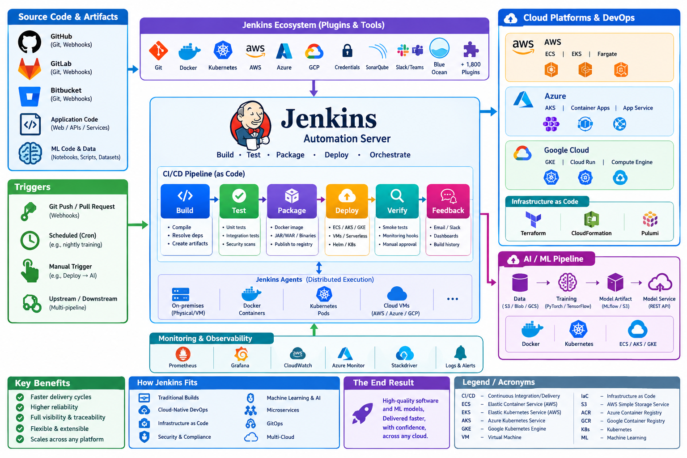

# Orchestrating CI/CD with Jenkins

## Learning Objectives

!!! info "Learning Objectives"
    - Define Jenkins and its role as a universal automation orchestrator.
    - Understand the Jenkins Master-Agent architecture for scalable execution.
    - Implement "Pipeline as Code" using the `Jenkinsfile`.
    - Integrate Jenkins with cloud providers (AWS, Azure, GCP) and AI/ML workflows.
    - Distinguish between Declarative and Scripted pipelines.
    - Design a production-grade pipeline that spans from source control to AI model deployment.

## Overview

Jenkins is the most widely used open-source automation server in the world. Unlike specialized tools that do one thing well, Jenkins is designed as an extensible engine. Through a massive ecosystem of over 1,800 plugins, Jenkins can be adapted to almost any workflow, from legacy on-premise monoliths to modern, cloud-native microservices.

!!! info "Why this matters"
    While newer "cloud-native" CI tools exist, Jenkins remains a cornerstone because of its flexibility. It allows organizations to build highly complex, customized orchestration logic that spans multiple clouds, security scanners, and deployment targets, all controlled from a single central point.



Figure 1: Jenkins Cloud AI Workflow.

## Fundamentals of Jenkins

### Core Purpose and Capabilities

Jenkins focuses on automating the repetitive parts of software delivery. Its extensibility allows it to handle a vast array of automation scenarios:

| Core purpose | How Jenkins achieves it |
| :--- | :--- |
| **Automate builds** | Detects changes in source-code repositories (Git, Subversion, etc.) and runs build tools (Maven, Gradle, npm, Make, etc.) automatically. |
| **Run tests continuously** | Executes unit, integration, UI, performance, and security tests after each build, reporting results immediately. |
| **Package artifacts** | Creates Docker images, JAR/WAR files, binaries, or any other deployable artifact and stores them in registries or artifact repositories. |
| **Deploy to environments** | Pushes artifacts to cloud or on-prem resources (Kubernetes, AWS ECS, Azure AKS, GCP GKE, VMs, serverless platforms) using scripts, plugins, or declarative pipelines. |
| **Provide feedback** | Sends notifications via email, Slack, Microsoft Teams, etc., and visualises build history, test trends, and deployment status on a web UI. |
| **Orchestrate complex workflows** | Chains multiple stages (build &rarr; test &rarr; security scan &rarr; containerise &rarr; deploy) using **Pipeline as Code** (Declarative or Scripted Groovy). |
| **Extend functionality** | Over 1,800 plugins add support for source control, cloud providers, container runtimes, credential management, static analysis, automated approvals, and more. |
| **Scale execution** | Runs jobs on a master node and distributes work to any number of **agents** (also called slaves) that can be bare-metal, virtual machines, Docker containers, or Kubernetes pods. |
| **Enforce standards** | Integrates with code-quality tools (SonarQube, Checkstyle), security scanners (OWASP Dependency-Check), and compliance checks to prevent low-quality code from reaching production. |

### The Master-Agent Architecture

To avoid performance bottlenecks and ensure environment isolation, Jenkins uses a distributed architecture:

- **Jenkins Master**: The "brain" of the operation. It handles the UI, manages plugin configurations, schedules jobs, and monitors the agents.

- **Jenkins Agents**: The "workers." These are separate machines or containers that actually execute the build steps. This allows you to run a Linux build on a Linux agent and a Windows build on a Windows agent, all orchestrated by one master.

### Typical Jenkins Workflow (CI/CD Pipeline)

A typical Jenkins pipeline follows a rigorous path from code commit to production:

1. **Source change** - A developer pushes a commit to the repository.

2. **Trigger** - Jenkins receives a webhook or polls the repo and starts a job/pipeline.

3. **Build** - Compiles the code, resolves dependencies, and creates artefacts.

4. **Test** - Executes automated tests; results are recorded and reported.

5. **Artifact storage** - Successful artefacts are pushed to a Docker registry, Nexus, Artifactory, etc.

6. **Deployment** - The pipeline deploys the artefact to a staging environment; optional approvals promote it to production.

7. **Verification** - Post-deployment smoke tests, monitoring hooks, or manual QA checks.

8. **Feedback** - Notifications are sent, dashboards updated, and the cycle repeats for the next change.

### Key Benefits

- **Speed:** Immediate feedback reduces integration problems and shortens release cycles.

- **Reliability:** Automated, repeatable steps minimise human error.

- **Visibility:** Central UI and APIs give complete traceability of every change.

- **Flexibility:** Plugins and pipeline code allow you to tailor workflows to any tech stack.

- **Scalability:** Distributed agents let you run many jobs in parallel, on any platform (bare metal, VM, Docker, Kubernetes).

### Where Jenkins Fits in Modern Toolchains

| Scenario | Jenkins role |
| :--- | :--- |
| **Traditional on-prem builds** | Serves as the central build orchestrator for legacy applications. |
| **Cloud-native DevOps** | Runs pipelines that interact with AWS, Azure, or GCP services, often via Kubernetes agents. |
| **Infrastructure-as-Code (IaC)** | Executes Terraform, CloudFormation, or Pulumi scripts to provision or update environments. |
| **Security & compliance** | Triggers static code analysis, dependency vulnerability scans, and policy-as-code checks. |
| **Machine-learning & AI** | Automates data preprocessing, model training, artifact archiving, and deployment of inference services. |
| **Micro-service orchestration** | Builds Docker images, updates Helm charts, and deploys to service meshes (Istio, Linkerd). |
| **GitOps** | Generates new container image tags; a GitOps tool (ArgoCD, Flux) detects the change and syncs the cluster. |

## Getting Started and Technical Setup

### Quick Start Guide

1. **Install Jenkins** (Docker, native package, or cloud-hosted).

2. **Create a pipeline** using the built-in **Blue Ocean** UI or write a `Jenkinsfile`.

3. **Add required plugins** (Git, Docker, Kubernetes, credentials, etc.).

4. **Configure credentials** (SSH keys, cloud service accounts) securely in the Jenkins credentials store.

5. **Connect a source repository** (GitHub, GitLab, Bitbucket) and enable webhooks.

6. **Run the pipeline** and iterate - add test stages, security scans, and deployment steps as needed.

### Installation & Security Guide

To set up a production-ready Jenkins instance, follow these steps:

1. **Install Java**
   Jenkins requires Java 11 or later.
   ```bash
   sudo apt-get install -y openjdk-11-jdk
   ```

2. **Install Jenkins**
   Add the official repository and install the server.
   ```bash
   sudo wget -q -O - https://pkg.jenkins.io/debian-stable/jenkins.io.key | sudo apt-key add -
   sudo sh -c 'echo deb https://pkg.jenkins.io/debian-stable binary/ > /etc/apt/sources.list.d/jenkins.list'
   sudo apt-get update
   sudo apt-get install -y jenkins
   ```

3. **Start the Service**
   Enable Jenkins to start on boot and start it immediately.
   ```bash
   sudo systemctl enable --now jenkins
   ```
   Jenkins will now be available on port **8080**.

4. **Unlock Jenkins**
   Open `http://<your-host>:8080` in your browser. You will be asked for an initial admin password, which can be found at:
   `/var/lib/jenkins/secrets/initialAdminPassword`

5. **Install Essential Plugins**
   During the setup wizard, install the suggested plugins and add these for cloud and AI capabilities:
   - **Docker Pipeline**
   - **Kubernetes CI**
   - **Git** & **GitHub Branch Source**
   - **Pipeline: Multibranch**
   - **Blue Ocean**
   - **Credentials Binding**
   - **AWS / Azure / Google OAuth Credentials**
   - **Artifact Manager on S3**

6. **Secure the Connection**
   Use a reverse proxy like **NGINX** or **Caddy** with a TLS certificate from Let's Encrypt to ensure encrypted traffic.
   ```bash
   sudo apt-get install -y nginx
   sudo ln -s /etc/nginx/sites-available/jenkins /etc/nginx/sites-enabled/
   ```

> **Tip:** If you prefer a fully-managed Jenkins, spin up **Jenkins X** on a cloud Kubernetes cluster - the same pipeline concepts apply.

## Building a Classic CI/CD Pipeline (Dockerised Web App)

### Repository Layout

```text
my-app/
│
├─ src/                  # Application source (e.g., Flask, Node, Java)
│   └─ main.py
├─ requirements.txt     # Python deps (or package.json, pom.xml, …)
├─ Dockerfile           # Build image
└─ Jenkinsfile          # Declarative pipeline definition
```

### Minimal `Dockerfile`

```dockerfile
# Use official Python slim image

FROM python:3.11-slim

WORKDIR /app
COPY requirements.txt .
RUN pip install --no-cache-dir -r requirements.txt
COPY src/ ./src

# Expose the web port (change as needed)

EXPOSE 5000
CMD ["python", "src/main.py"]
```

### Complete Declarative `Jenkinsfile`

```groovy
pipeline {
    agent any               // Runs on any available Jenkins agent
    environment {
        REGISTRY = "YOUR_ACCOUNT.dkr.ecr.us-east-1.amazonaws.com"
        IMAGE   = "\${REGISTRY}/my-app:\${env.BUILD_NUMBER}"
        AWS_CRED = credentials('aws-cred-id')
    }
    stages {
        stage('Checkout') {
            steps {
                git url: 'https://github.com/your-org/my-app.git', branch: 'main'
            }
        }
        stage('Lint & Test') {
            steps {
                sh 'python -m pip install -r requirements.txt'
                sh 'python -m unittest discover -s src/tests'
            }
        }
        stage('Build Docker Image') {
            steps {
                script {
                    docker.build("\${IMAGE}")
                }
            }
        }
        stage('Push to Registry') {
            steps {
                withCredentials([[$class: 'AmazonWebServicesCredentialsBinding',
                                  credentialsId: "\${AWS_CRED}",
                                  accessKeyVariable: 'AWS_ACCESS_KEY_ID',
                                  secretKeyVariable: 'AWS_SECRET_ACCESS_KEY']]) {
                    sh """
                        aws ecr get-login-password --region us-east-1 |
                        docker login --username AWS --password-stdin ${REGISTRY}
                        docker push ${IMAGE}
                    """
                }
            }
        }
        stage('Deploy to Cloud') {
            steps {
                echo "Deploy step placeholder - see Section 4 for cloud-specific scripts."
            }
        }
    }

    post {
        always {
            cleanWs()           // Clean workspace after each run
        }
        success {
            mail to: 'dev-team@example.com',
                 subject: "Build #\${env.BUILD_NUMBER} succeeded",
                 body: "Image ${IMAGE} is now in the registry."
        }
        failure {
            mail to: 'dev-team@example.com',
                 subject: "Build #\${env.BUILD_NUMBER} failed",
                 body: "Check Jenkins console for details."
        }
    }
}
```

## Deploying to a Cloud Container Service

Below are three drop-in snippets you can paste into the **"Deploy to Cloud"** stage of the `Jenkinsfile`. Choose the one that matches your cloud provider.

### AWS ECS (Fargate)

```groovy
stage('Deploy to ECS') {
    steps {
        withCredentials([[$class: 'AmazonWebServicesCredentialsBinding',
                          credentialsId: "\${AWS_CRED}",
                          accessKeyVariable: 'AWS_ACCESS_KEY_ID',
                          secretKeyVariable: 'AWS_SECRET_ACCESS_KEY']]) {
            sh '''
                # Update the task definition JSON (keep a template in repo)
                export TASK_DEF=$(cat ecs-task-template.json | \\
                    jq ".containerDefinitions[0].image = \\\"${IMAGE}\\\"")
                aws ecs register-task-definition \\
                    --family my-app-task \\
                    --cli-input-json "$TASK_DEF"

                # Force a new deployment on the service
                aws ecs update-service \\
                    --cluster my-ecs-cluster \\
                    --service my-app-service \\
                    --force-new-deployment
            '''
        }
    }
}
```

### Azure AKS (Kubernetes)

```groovy
stage('Deploy to AKS') {
    steps {
        withCredentials([azureServicePrincipal(credentialsId: 'azure-sp-id',
                                                subscriptionIdVariable: 'AZ_SUB',
                                                clientIdVariable: 'AZ_CLIENT',
                                                clientSecretVariable: 'AZ_SECRET',
                                                tenantIdVariable: 'AZ_TENANT')]) {
            sh '''
                az login --service-principal -u $AZ_CLIENT -p $AZ_SECRET --tenant $AZ_TENANT
                az aks get-credentials --resource-group my-rg --name my-aks-cluster

                # Apply a simple deployment manifest (in repo: k8s/deploy.yaml)
                kubectl set image deployment/my-app my-app=${IMAGE} --record
                kubectl rollout status deployment/my-app
            '''
        }
    }
}
```

### GCP GKE

```groovy
stage('Deploy to GKE') {
    steps {
        withCredentials([file(credentialsId: 'gcp-key-file', variable: 'GCP_KEY')]) {
            sh '''
                gcloud auth activate-service-account --key-file=$GCP_KEY
                gcloud config set project my-gcp-project
                gcloud container clusters get-credentials my-gke-cluster --region us-central1

                kubectl set image deployment/my-app my-app=${IMAGE} --record
                kubectl rollout status deployment/my-app
            '''
        }
    }
}
```

**Tip:** Keep the cloud-specific snippets in separate Groovy shared libraries (e.g., `vars/awsDeploy.groovy`). This makes the `Jenkinsfile` cleaner and easier to maintain across multiple projects.

## Extending for AI/ML

Assume you have a **Python model** that you want to (re)train on every successful build and then ship as a **REST micro-service**.

### Project structure addition

```text
my-app/
│
├─ ml/
│   ├─ train.py          # Simple training script
│   ├─ serve.py          # Model REST API
│   └─ requirements-ml.txt
└─ Dockerfile.ml         # Dockerfile for the model service
```

### `ml/train.py` (Example)

```python
import numpy as np
from sklearn.linear_model import LogisticRegression
import joblib
import os

# Dummy data

X = np.random.randn(200, 5)
y = (X[:, 0] + X[:, 1] > 0).astype(int)

model = LogisticRegression()
model.fit(X, y)

out_path = os.getenv("MODEL_PATH", "ml/model.pkl")
joblib.dump(model, out_path)
print(f"Model saved to {out_path}")
```

### `Dockerfile.ml`

```dockerfile
FROM python:3.11-slim

WORKDIR /app
COPY ml/requirements-ml.txt .
RUN pip install --no-cache-dir -r requirements-ml.txt
COPY ml/ ./ml

ENV MODEL_PATH=/app/ml/model.pkl
EXPOSE 8081
CMD ["python", "-m", "ml.serve"]
```

### Extending the `Jenkinsfile`

Add the following stage after the Docker image push to automate the ML lifecycle:

```groovy
stage('Train & Publish ML Model') {
    environment {
        MODEL_REGISTRY = "s3://my-ml-artifacts/\${env.BUILD_NUMBER}/"
        AWS_CRED = credentials('aws-cred-id')
    }
    steps {
        // 1. Run training inside a container (ensures reproducibility)
        script {
            docker.image('python:3.11-slim').inside("-v \${env.WORKSPACE}:/ws") {
                sh '''
                    pip install -r /ws/ml/requirements-ml.txt
                    python /ws/ml/train.py
                '''
                // 2. Archive the model artifact
                archiveArtifacts artifacts: 'ml/model.pkl', fingerprint: true
                // 3. Upload to S3 for versioned storage
                withCredentials([[$class: 'AmazonWebServicesCredentialsBinding',
                                  credentialsId: "\${AWS_CRED}",
                                  accessKeyVariable: 'AWS_ACCESS_KEY_ID',
                                  secretKeyVariable: 'AWS_SECRET_ACCESS_KEY']]) {
                    sh """
                        aws s3 cp ml/model.pkl ${MODEL_REGISTRY}model.pkl
                    """
                }
            }
        }
    }
}
```

### Deploy the model as a micro-service

Reuse the cloud-deployment logic from the "Deploying to a Cloud Container Service" section, but point to `Dockerfile.ml` and the model-specific image (e.g., `my-ml-service:\${BUILD_NUMBER}`). The steps are identical - just change the image name and the Kubernetes/ECS task definition.

## Automation and Triggers

| Trigger type | Jenkins configuration | Typical use-case |
| :--- | :--- | :--- |
| **Push trigger** | In *Multibranch Pipeline* settings &rarr; "GitHub hook trigger for GITScm polling" | Every commit runs the CI pipeline automatically |
| **Scheduled trigger** | `cron('H H * * *')` in the `pipeline { ... }` block | Nightly model retraining (e.g., heavy dataset) |
| **Manual parameterised trigger** | `parameters { booleanParam(name: 'DEPLOY_MODEL', defaultValue: true) }` | Let a data-science lead decide when to push a new model |
| **Upstream/downstream** | `build job: 'model-training', propagate: true, wait: true` | Separate pipelines for *app* vs *model* but chained together |

**Example snippet with a boolean flag for conditional deployment:**

```groovy
pipeline {
    agent any
    parameters {
        booleanParam(name: 'DEPLOY_ML', defaultValue: true, description: 'Deploy the newly trained model?')
    }
    stages {
        // ... other stages ...
        stage('Conditional Model Deploy') {
            when {
                expression { return params.DEPLOY_ML }
            }
            steps {
                echo "Deploying ML model service..."
            }
        }
    }
}
```

## Architecture Overview

The complete Jenkins-driven workflow spans from source control &rarr; CI &rarr; container registry &rarr; cloud &rarr; AI model training & serving.

**Diagram legend**

| Symbol | Meaning |
| :--- | :--- |
| **GitHub** | Source repository (code + ML scripts) |
| **Jenkins Master** | Orchestrates jobs, holds credentials |
| **Jenkins Agents** | Build runners (Docker, K8s, or cloud VMs) |
| **Docker Registry** | ECR / ACR / GCR - stores app & model images |
| **Cloud Runtime** | ECS, AKS, or GKE - runs the web app |
| **Model Service** | Separate container (Python/Flask) serving predictions |
| **S3 / Blob / GCS** | Persistent artifact store for versioned models |
| **Monitoring** | Prometheus/Grafana, CloudWatch, Azure Monitor, etc. |

## Local Deployment with Jenkins

While Jenkins is usually a centralized server, you can use it to orchestrate local deployments by running a **Jenkins Agent** on your own machine. This allows you to use the same pipeline logic for your local development as you do for production.

### Local Deployment Pipeline

Create a `Jenkinsfile` in the root of the project. This pipeline uses a Declarative syntax to prepare the environment and launch the site.

```groovy
pipeline {
    agent any
    
    stages {
        stage('Environment Setup') {
            steps {
                echo 'Installing MkDocs and Plugins...'
                sh 'pip install mkdocs-material mkdocs-video mkdocs-slides mkdocs-caption mkdocs-blog pymdown-extensions'
            }
        }
        
        stage('Deploy and Serve') {
            steps {
                echo 'Launching Site on Port 8000...'
                // Use nohup to keep the server running after the job finishes
                sh 'nohup mkdocs serve -a 0.0.0.0:8000 > jenkins_mkdocs.log 2>&1 &'
            }
        }
        
        stage('Open Browser') {
            steps {
                echo 'Opening browser to http://localhost:8000'
                sh 'open http://localhost:8000 || xdg-open http://localhost:8000'
            }
        }
    }
    
    post {
        success {
            echo 'Site is now live at http://localhost:8000'
        }
    }
}
```

## Summary Checklist

- [ ] Jenkins installed and accessible on port 8080.
- [ ] Necessary plugins installed (Git, Docker, Cloud Credentials).
- [ ] Jenkins Master-Agent architecture configured for scalability.
- [ ] `Jenkinsfile` created and stored in the source repository.
- [ ] Pipeline stages defined for Build, Test, and Push to Registry.
- [ ] Cloud-specific deployment logic integrated (AWS, Azure, or GCP).
- [ ] AI/ML training and model archiving stages implemented.
- [ ] Webhooks configured for automatic trigger on push.

## Assignments

!!! note "Assignment.1: Basic Pipeline"
    Create a simple `Jenkinsfile` (Declarative syntax) for a project of your choice. The pipeline should have three stages: `Build`, `Test`, and `Deploy`. Ensure that the `Deploy` stage only runs if the `Test` stage passes.

??? tip "Solution: Basic Pipeline"
    Define a `pipeline` block with `agent any`. Create three `stage` blocks. In the `Deploy` stage, use the `when` directive or simply rely on the default behavior where a failure in `Test` stops the pipeline before it reaches `Deploy`.

!!! note "Assignment.2: Agent Configuration"
    Research how to configure a **Kubernetes pod as a Jenkins agent**. Describe the benefits of this approach compared to using a static virtual machine as an agent, especially regarding resource utilization and scaling.

??? tip "Solution: Agent Configuration"
    The Kubernetes plugin allows Jenkins to spawn pods dynamically for each job. This provides "ephemeral" environments that are deleted after the job finishes, ensuring a clean state and allowing the cluster to scale based on current demand.

!!! note "Assignment.3: AI/ML Integration"
    Design a Jenkins pipeline that incorporates a "Model Validation" step. After the training stage, the pipeline should run a script that calculates the model's accuracy. If the accuracy is below 80%, the pipeline should fail and send a notification to the team.

??? tip "Solution: AI/ML Integration"
    Add a stage `Model Validation` after `Train`. Use a shell script to run the validation code. Use a conditional `error "Accuracy too low!"` if the output of the script is below the threshold.

!!! note "Assignment.4: Secret Management"
    Research the **HashiCorp Vault plugin** for Jenkins. Describe how it improves security over using Jenkins' built-in "Credentials" store, particularly in a multi-cluster environment.

??? tip "Solution: Secret Management"
    HashiCorp Vault provides centralized secret management with dynamic secrets, better auditing, and strict access control policies, reducing the risk of secret leakage across multiple Jenkins instances.

!!! note "Assignment.5: Local Setup"
    In Jenkins, create a new "Pipeline" job. Select "Pipeline script from SCM," choose Git, and point it to your repository. Click "Build Now" to execute the stages and launch the server locally.

## References

- [Jenkins Official Documentation](https://www.jenkins.io/doc/)
- [Jenkins Pipeline Syntax Guide](https://www.jenkins.io/doc/book/pipeline/)
- [Docker Hub](https://hub.docker.com/)
- [Cloud Provider Documentation (AWS/Azure/GCP)](https://docs.aws.amazon.com/)

## Self-Evaluation

??? note "What is the difference between the Jenkins Master and its Agents?"
    The **Jenkins Master** is the "brain" of the operation; it manages the web UI, stores configurations, schedules jobs, and coordinates the workflow. **Jenkins Agents** (or slaves) are the "workers" that actually execute the build and test steps on specific environments (e.g., a Linux agent for Bash scripts, a Windows agent for .NET builds), allowing for parallel execution and environment isolation.

??? note "Can you describe the typical 8 stages of a CI/CD pipeline?"
    A comprehensive CI/CD pipeline typically includes: 1) **Source Control** (triggering on commit), 2) **Build/Compile** (creating binaries/artifacts), 3) **Unit Testing** (verifying small code blocks), 4) **Static Analysis** (checking code quality/security), 5) **Integration Testing** (verifying module interaction), 6) **Packaging** (containerizing the app), 7) **Staging Deployment** (deploying to a pre-prod environment), and 8) **Production Deployment** (releasing to the end user).

??? note "What is the benefit of using a `Jenkinsfile` (Pipeline as Code)?"
    **Pipeline as Code** allows the CI/CD definition to be stored in the repository alongside the application code. This means the pipeline is versioned, can be peer-reviewed via Pull Requests, is easily reproducible across different Jenkins instances, and allows for a clear audit trail of how the deployment process has evolved.

??? note "How do you distinguish between a Declarative and a Scripted pipeline?"
    **Declarative Pipelines** use a strictly defined, simplified structure (starting with the `pipeline` block) that is easier to write and maintain, with built-in syntax validation. **Scripted Pipelines** use a flexible Groovy-based DSL, allowing for complex logic, loops, and conditional branching, but they are more difficult to manage and prone to errors.

??? note "How do Jenkins roles map to modern scenarios like IaC, AI/ML, and Cloud-native?"
    Jenkins acts as the orchestrator: for **IaC**, it triggers Terraform/Ansible to provision infra; for **AI/ML**, it manages the lifecycle of data ingestion, model training on GPU agents, and validation; for **Cloud-native**, it builds Docker images and manages deployments to Kubernetes (K8s) clusters via Helm or kubectl.

??? note "Can you outline a pipeline that trains a model and deploys it as a microservice?"
    An AI/ML pipeline consists of: 1) **Data Prep** (fetching and cleaning data), 2) **Training** (executing training scripts on a specialized GPU agent), 3) **Validation** (checking accuracy against a threshold), 4) **Containerization** (packaging the model into a Docker image with an API wrapper), and 5) **Deployment** (deploying the image to a production K8s cluster).
