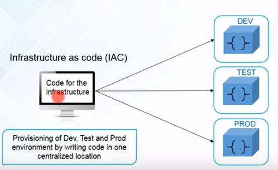
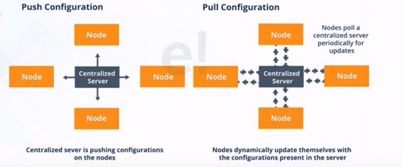
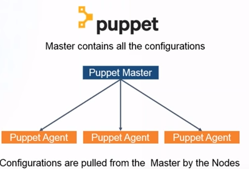
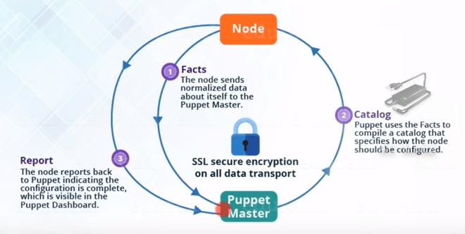
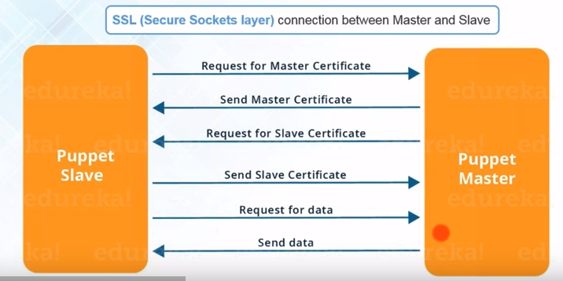

# Enterprise Configuration Management with Puppet

!!! info "Learning Objectives"
    - Define configuration management and its role in Infrastructure as Code (IaC).
    - Compare Puppet's "pull-based" architecture with Ansible's "push-based" approach.
    - Understand the Puppet Master-Agent workflow, including Manifests and Catalogs.
    - Implement and configure both Open Source and Puppet Enterprise installations.
    - Distinguish between monolithic and split installation architectures.

Managing a handful of servers is easy; managing ten thousand is a different challenge entirely. When infrastructure reaches a certain scale, manual updates become impossible, and even simple scripts can fail. Puppet is a powerful configuration management tool designed to solve this problem by ensuring that every server in a large cluster remains in its desired state.

!!! info "Why this matters"
    The core philosophy of Puppet is **state enforcement**. While some tools simply run a list of commands (procedural), Puppet defines what the server *should* look like (declarative). If a user manually changes a configuration file on a server, Puppet will detect this "drift" during its next check and automatically change it back to the correct state. This makes Puppet an industry standard for high-compliance enterprise environments.

## Puppet's Architecture: The Pull Model

One of the most significant differences between Puppet and tools like Ansible is how they communicate with target nodes.

### Push vs. Pull Configuration

- **Push Model (e.g., Ansible)**: A central server "pushes" configurations to the nodes via SSH. The nodes are passive until the server tells them to do something.
- **Pull Model (e.g., Puppet)**: Each node runs a **Puppet Agent** that "pulls" its configuration from the central **Puppet Master** at regular intervals.

{#fig:InfrastructureAsCode}

{#fig:push-pull-config}

### Comparison: Puppet vs. Ansible

| Feature | Puppet | Ansible |
| :--- | :--- | :--- |
| **Architecture** | Master-Agent (Client-Server) | Agentless (SSH) |
| **Communication** | Pull-based (Agents poll Master) | Push-based (Master pushes to Node) |
| **State** | Strong state enforcement | Task-based execution |
| **Complexity** | Higher initial setup (Server/Agent) | Low setup (only Python needed) |
| **Ideal Use Case** | Large-scale, high-compliance enterprises | Rapid deployment, cloud-native agility |

## The Puppet Master-Agent Workflow

Puppet operates through a structured cycle that ensures security and consistency.

### The Lifecycle of a Configuration
1.  **Fact Collection**: The Puppet Agent sends "Facts" (IP address, OS version, hardware details) to the Master.
2.  **Catalog Compilation**: The Master uses these facts and the defined **Manifests** (code) to compile a **Catalog**—a specific list of resources the agent must manage.
3.  **Configuration Application**: The Master sends the Catalog to the Agent. The Agent applies the changes locally to reach the desired state.
4.  **Reporting**: The Agent sends a report back to the Master confirming what was changed or if any errors occurred.

{#fig:master-slave}

{#fig:master-slave1}

### Security via SSL
Because the Master sends critical configuration data, all communication between the Master and Agent is encrypted using SSL certificates. The agent must be "signed" by the Master before it can receive its catalog.

{#fig:master-slave-connection}

## Deploying Puppet

Puppet is available in two primary versions: **Open Source Puppet** and **Puppet Enterprise (PE)**.

### Installation Types in Puppet Enterprise
Depending on the size of the organization, PE can be installed in two ways:

1.  **Monolithic Installation**: The Puppet Master, PuppetDB, and the Console are all installed on a single node.
    - **Pros**: Easy to install, simple to troubleshoot.
    - **Scale**: Supports up to 20,000 managed nodes.
    - **Best For**: Small to mid-sized organizations.
2.  **Split Installation**: The Master, PuppetDB, and Console are installed on separate nodes.
    - **Pros**: Highly scalable, better performance for massive fleets.
    - **Best For**: Large-scale enterprises with more than 20,000 nodes.

### Configuring the Environment
The primary configuration for Puppet is handled in the `puppet.conf` file. Key settings include:
- `certname`: The unique identifier for the node.
- `server`: The hostname of the Puppet Master.
- `runinterval`: How often the agent polls the master (e.g., `4h` for every four hours).

!!! tip "Self-Assessment"
    Test your knowledge by expanding the questions below.

??? question "What is the difference between 'Push' and 'Pull' configuration management?"
    A **Push Model** (e.g., Ansible) involves a central server pushing configurations to nodes via SSH; the nodes are passive until told to act. A **Pull Model** (e.g., Puppet) involves an agent running on each node that periodically polls the central Master to pull its configuration and apply it locally.

??? question "What are the roles of the Puppet Master and the Puppet Agent?"
    The **Puppet Master** acts as the central authority that stores manifests and compiles catalogs (the lapped-out desired state) for each node. The **Puppet Agent** runs on target nodes, sends its local facts to the Master, retrieves its specific catalog, applies the changes locally, and reports the results.

??? question "Can you describe the process of Fact $\rightarrow$ Catalog $\rightarrow$ Application?"
    The process starts with **Fact Collection**, where the Agent sends system details (OS, IP, etc.) to the Master. The Master then performs **Catalog Compilation**, using those facts and the manifests to create a tailored list of resources for that node. Finally, the Agent performs **Configuration Application**, implementing the resources in the catalog to reach the desired state.

??? question "What is the difference between a monolithic and a split Puppet Enterprise installation?"
    A **monolithic** installation hosts all Puppet services (Master, CA, etc.) on a single server, which is suitable for smaller environments. A **split** installation distributes these components across multiple servers, providing better scalability, redundancy, and higher availability for enterprise-scale infrastructure.

??? question "What is the purpose of SSL certificates in a Puppet architecture?"
    **SSL certificates** ensure that all communication between the Master and Agents is encrypted and authenticated. A new Agent must have its certificate signed by the Master's Certificate Authority (CA) before it can securely retrieve its configuration catalog, preventing unauthorized nodes from accessing the infrastructure.

!!! note "Exercise 1: Architecture Design"
    You are designing the infrastructure for a company with 50,000 servers across three global data centers. Would you choose a monolithic or split Puppet installation? Justify your answer based on scalability and availability.

!!! note "Exercise 2: Drift Detection"
    Imagine a developer manually changes the permissions of `/etc/passwd` on a production server to `777` for a quick fix. Describe exactly how Puppet detects this and what it does to resolve the issue.

!!! note "Exercise 3: Tool Selection"
    You have a choice between Ansible and Puppet for a new project. The project requires:
    1. Rapid prototyping (setup in 1 hour).
    2. No software installed on target nodes.
    3. Occasional updates to a few servers.
    Which tool do you choose and why?

---

## Appendix: Local Deployment with Puppet

### 0. Clone the Repository
Before running the automation, clone the course repository to your local machine:

```bash
git clone https://github.com/cloudmesh-ai/cloudmesh-ai-lecture.git
cd cloudmesh-ai-lecture
```


Puppet is designed for "state enforcement." While it's typically used for thousands of servers, you can use it locally to ensure your development environment is always correctly configured to serve the course site.

### 1. The Puppet Manifest
Create a file named `site.pp`. This manifest ensures that Python is installed, the required MkDocs plugins are present, and the server is running as a system service.

```puppet
# Ensure Python and Pip are installed
package { 'python3-pip':
  ensure => installed,
}

# Install MkDocs and Plugins using a shell command
exec { 'install_mkdocs_plugins':
  command => '/usr/bin/pip3 install mkdocs-material mkdocs-video mkdocs-slides mkdocs-caption mkdocs-blog pymdown-extensions',
  require => Package['python3-pip'],
}

# Define a systemd unit to run mkdocs serve in the background
file { '/etc/systemd/system/mkdocs.service':
  ensure  => file,
  content => "
[Unit]
Description=MkDocs Course Site Server
After=network.target

[Service]
Type=simple
User=ubuntu
WorkingDirectory=/home/ubuntu/cloudmesh-ai-lecture
ExecStart=/usr/local/bin/mkdocs serve -a 0.0.0.0:8000
Restart=always

[Install]
WantedBy=multi-user.target
",
}

# Ensure the service is started and enabled
service { 'mkdocs':
  ensure    => running,
  enable    => true,
  subscribe => File['/etc/systemd/system/mkdocs.service'],
}
```

### 2. Execution
Run the manifest locally using the `puppet apply` command:

```bash
sudo puppet apply site.pp
```

Once applied, you can open your browser and visit `http://localhost:8000`.

### Why use Puppet for this?
The power of Puppet lies in **drift detection**. If you accidentally uninstall a plugin or stop the server, running `puppet apply` will immediately detect that the system is not in the "desired state" and will automatically reinstall the dependencies and restart the server, ensuring your environment is always stable.
