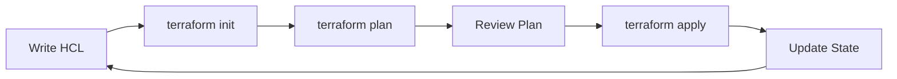

# Provisioning Infrastructure with Terraform

!!! info "Learning Objectives"
    - Define Infrastructure as Code (IaC) and the role of Terraform in the DevOps ecosystem.
    - Master the Terraform lifecycle: `init`, `plan`, `apply`, and `destroy`.
    - Write HCL (HashiCorp Configuration Language) to provision cloud resources.
    - Implement infrastructure using multiple providers, including AWS, Docker, and Multipass.
    - Understand the importance of the Terraform state file.

In a modern cloud environment, manually creating servers, databases, and networks through a web console is inefficient and impossible to audit. Terraform, created by HashiCorp, solves this by allowing you to define your entire infrastructure as code. 

Written in Go, Terraform uses a declarative language called HCL (HashiCorp Configuration Language). Unlike procedural scripts that list a sequence of steps, HCL allows you to describe the *desired end-state* of your infrastructure, and Terraform figures out the most efficient way to achieve that state.

 The most critical feature of Terraform is the **State File** (`.tfstate`). Terraform keeps track of every resource it creates. When you change your code, Terraform compares the code against the state file and the actual cloud environment to determine exactly what needs to be added, modified, or deleted. This prevents the accidental duplication of resources and allows for precise infrastructure management.

### Remote Backends for Teams
By default, the state file is stored locally on your computer. In a team environment, this is dangerous because two people might try to change the infrastructure at the same time, leading to state corruption. 

To solve this, Terraform supports **Remote Backends** (such as AWS S3, Azure Blob Storage, or Terraform Cloud). A remote backend stores the state file in a shared location and provides **State Locking**, ensuring that only one person can apply changes at a time.

## The Terraform Workflow

Terraform operates on a consistent four-step lifecycle that ensures changes are predictable and safe.



### 1. Initialization (`terraform init`)

Before running any scripts, you must initialize the project directory. This command downloads the necessary **Providers** (the plugins that allow Terraform to talk to AWS, Azure, etc.) and sets up the backend for the state file.

### 2. Validation and Formatting (`terraform fmt` & `terraform validate`)

Before planning, professional workflows include two cleanup steps:
- `terraform fmt`: Automatically rewrites configuration files to a canonical format and style.
- `terraform validate`: Verifies that the configuration is syntactically correct and internally consistent.

### 3. Planning (`terraform plan`)

The plan command is a "dry run." It compares your current code against the real-world infrastructure and generates an execution plan.

```bash
terraform plan -out project.tfplan

```
The output shows exactly what will happen (e.g., `+ create`, `~ update`, `- destroy`). Saving the plan to a file ensures that the exact same changes are applied in the next step.

### 3. Application (`terraform apply`)

The apply command executes the plan and makes the changes in the cloud.

```bash
terraform apply project.tfplan

```
Terraform spawns multiple background jobs to create resources in parallel, significantly speeding up the provisioning process.

### 4. Destruction (`terraform destroy`)

When resources are no longer needed, Terraform can tear them down cleanly.

```bash
terraform plan -destroy -out destroy.tfplan
terraform apply destroy.tfplan

```

!!! info "Why this matters"
 The plan &rarr; apply workflow is a safety mechanism. In production environments, the plan output is often attached to a Pull Request and reviewed by another engineer before the apply command is ever run, preventing costly or catastrophic infrastructure mistakes.

!!! tip "AI Insight"
    LLMs are exceptional at generating HCL boilerplate and translating architectural requirements into Terraform resources. However, because infrastructure changes are high-risk, always use the `terraform plan` output to verify AI-generated code before applying it. See [[ai-devops]] for best practices on AI-driven provisioning.

## AI-Assisted Infrastructure as Code

The emergence of Large Language Models (LLMs) has fundamentally changed how we write HCL (HashiCorp Configuration Language).

### Using AI for HCL Generation
Modern DevOps engineers use AI as a "first-draft" engine for infrastructure. Instead of writing every resource from scratch, you can use LLMs to:
- **Draft Resource Blocks**: "Create a Terraform module for a highly available VPC in AWS with 3 private subnets across 3 AZs."
- **Translate Requirements**: Turn a natural language architectural description into a valid `.tf` file.
- **Refactor for Modules**: Provide an existing flat Terraform file and ask the AI to restructure it into a reusable module.

!!! tip "Prompting for IaC"
    To get the best results, provide the AI with:
    1. The specific provider version (e.g., `aws ~> 5.0`).
    2. The desired naming convention.
    3. A list of required tags for cost tracking.
    4. Constraints (e.g., "use only t3.micro instances").

### Policy-as-Code (Governance)
To prevent AI-generated (or human-written) infrastructure from creating security holes or massive costs, we use **Policy-as-Code**.

**Open Policy Agent (OPA)** and **Terraform Sentinel** allow you to define rules that are checked *before* `terraform apply` runs.

**Example Policy: Prevent Oversized GPU Instances**
If an AI suggests a `p4d.24xlarge` instance for a simple test, a policy can automatically block the merge:
```rego
# OPA Policy snippet
deny[msg] {
  input.resource_type == "aws_instance"
  input.instance_type == "p4d.24xlarge"
  msg = "Instance type p4d.24xlarge is restricted to Production environments only."
}
```

By integrating these policies into your CI pipeline (e.g., via a GitHub Action), you ensure that AI-driven speed does not compromise security or budget.

## Practical Example: AWS EC2 Provisioning

To provision a basic virtual machine on AWS, create a file named `main.tf` with the following configuration:

```hcl
provider "aws" {
  # It is a security risk to hardcode keys. 
  # Terraform will automatically look for AWS_ACCESS_KEY_ID 
  # and AWS_SECRET_ACCESS_KEY environment variables.
  region = "us-east-1"
}

resource "aws_instance" "myec2instance" {
  ami = "ami-2757f631"
  instance_type = "t2.micro"
}

```

**Key Concepts:**
- **Provider**: The plugin that connects Terraform to the AWS API.
- **Resource**: The specific object you want to create (in this case, an `aws_instance`).
- **Arguments**: Parameters like `ami` and `instance_type` that define the resource's properties.

## Terraform for AI Infrastructure

When provisioning for AI workloads, the infrastructure requirements differ from standard web servers. Terraform allows you to standardize these complex environments.

### Provisioning GPU Instances
AI training and inference require specialized hardware. In Terraform, this is handled by choosing specific `instance_type` values (e.g., AWS `p3.2xlarge` or `g4dn.xlarge`).

```hcl
resource "aws_instance" "gpu_node" {
  ami           = "ami-gpu-optimized-id" 
  instance_type = "p3.2xlarge" # NVIDIA V100 GPU
  
  tags = {
    Name = "AI-Training-Node"
  }
}
```

### Vector Database Provisioning
Many AI architectures rely on vector databases (like Pinecone, Weaviate, or Milvus) to store embeddings. Terraform providers for these services allow you to manage your indexes as code:

```hcl
# Example conceptual block for a Vector DB index
resource "pinecone_index" "knowledge_base" {
  name = "ai-lecture-index"
  dimension = 1536 # Matches OpenAI embedding dimensions
  metric = "cosine"
}
```

## Alternative Providers: Docker and Multipass

Terraform is not limited to the cloud; it can manage any resource with an API, including local containers and virtual machines.

### Local Docker Provisioning

You can use Terraform to manage local Docker containers, which is excellent for testing infrastructure code locally.

```hcl
provider "docker" {}

resource "docker_image" "nginx" {
  name = "nginx:latest"
}

resource "docker_container" "nginx" {
  image = docker_image.nginx.image_id
  name = "tutorial-nginx"
  ports {
    internal = 80
    external = 80
  }
}

```

### Local VM Provisioning with Multipass

Canonical Multipass allows you to spin up Ubuntu VMs on your local machine. Using the `larstobi/multipass` provider, you can manage these VMs declaratively.

```hcl
terraform {
  required_providers {
    multipass = {
      source = "larstobi/multipass"
      version = "~> 1.4.0"
    }
  }
}

provider "multipass" {}

resource "multipass_instance" "ubuntu_vm" {
  name = "dev-vm"
  cpus = 2
  memory = "2GiB"
  disk = "10GiB"
  image = "lts"
}

output "vm_ip" {
  value = multipass_instance.ubuntu_vm.ipv4
}

```

!!! info "Why this matters"
 Using local providers like Docker and Multipass allows developers to "shift-left" their infrastructure testing. You can verify that your HCL logic is correct on your laptop before applying it to a production cloud environment, reducing the risk of deployment failures.

## Variables and Outputs: Parameterizing Your Code

To make infrastructure reusable, you shouldn't hardcode values like region or instance size. Instead, use **Variables** for input and **Outputs** for exporting data.

### Input Variables
Variables allow you to pass different values into your configuration depending on the environment (e.g., a `t2.micro` for Dev and `t2.large` for Prod).

```hcl
variable "instance_type" {
  description = "The size of the EC2 instance"
  type        = string
  default     = "t2.micro"
}

resource "aws_instance" "myec2instance" {
  ami           = "ami-2757f631"
  instance_type = var.instance_type
}
```

### Output Values
Outputs are like return values for your infrastructure. They are useful for displaying the IP address of a created server or passing data to another Terraform project.

```hcl
output "instance_public_ip" {
  description = "Public IP of the server"
  value       = aws_instance.myec2instance.public_ip
}
```

## Advanced HCL Patterns

To move beyond basic resources, professional Terraform code uses logic to handle scale and complexity.

### Scaling with `count` and `for_each`
Instead of defining ten separate servers, you can use `count` or `for_each` to create multiple identical resources.

```hcl
# Create 3 identical web servers
resource "aws_instance" "web_servers" {
  count         = 3
  ami           = "ami-2757f631"
  instance_type = "t2.micro"
  
  tags = {
    Name = "WebServer-${count.index}"
  }
}
```

### Local Values (`locals`)
`locals` allow you to assign a name to an expression. This is useful for avoiding repetition and making your code easier to read.

```hcl
locals {
  common_tags = {
    Project     = "AI-Lecture"
    Environment = var.env
    ManagedBy   = "Terraform"
  }
}

resource "aws_instance" "myec2instance" {
  # ... other config ...
  tags = local.common_tags
}
```

### Understanding Drift Detection
Infrastructure "drift" occurs when someone manually changes a resource in the cloud console (e.g., changing an instance type from `t2.micro` to `t2.small` via the AWS GUI). 

When you next run `terraform plan`, Terraform detects that the real-world state differs from your code. It will propose a change to **revert** the manual edit and bring the infrastructure back to the desired state defined in your HCL.

## Terraform Modules: Scaling Infrastructure

As infrastructure grows, repeating the same resource blocks across different environments (Development, Staging, Production) becomes error-prone. Terraform **Modules** allow you to group multiple resources into a single logical unit that can be called multiple times.

### What is a Module?
A module is simply a directory containing one or more `.tf` files. You can use the "root module" (your main project) or "child modules" (external directories or remote Git repositories).

### Benefits of Modularization
- **Reusability**: Define a standard "Web Server" pattern once and reuse it across ten projects.
- **Consistency**: Ensure that every VPC created in the organization follows the same security tagging and subnetting rules.
- **Maintainability**: Update a module in one place, and all infrastructure using that module can be updated via a simple version bump.

### Example: Using a Module
Instead of defining 50 lines of VPC code, you can call a module:

```hcl
module "vpc" {
  source = "./modules/aws-vpc"
  cidr   = "10.0.0.0/16"
  env    = "production"
}
```

!!! info "Why this matters"
    Modularization is the difference between "scripts" and "infrastructure engineering." By treating infrastructure components as versioned libraries, teams can collaborate more effectively and reduce the risk of configuration drift.

## The DevOps Pipeline: From Code to Cloud

In a professional setting, Terraform is rarely run from a local laptop. Instead, it is integrated into a CI/CD pipeline (like GitHub Actions, GitLab CI, or Jenkins).

### CI/CD Integration
A typical automated pipeline follows these steps:
1. **Trigger**: A developer pushes code to a `feature` branch.
2. **Plan**: The CI runner executes `terraform plan` and posts the output as a comment on the Pull Request.
3. **Review**: A senior engineer reviews the plan to ensure no critical resources (like production databases) are being deleted.
4. **Apply**: Once merged to `main`, the pipeline executes `terraform apply` to update the environment.

### The Hand-off: Terraform $\rightarrow$ Ansible
A common point of confusion for beginners is where Terraform ends and Ansible begins. The industry standard is the **"Build vs. Configure"** split:

| Stage | Tool | Responsibility | Analogy |
| :--- | :--- | :--- | :--- |
| **Provisioning** | **Terraform** | Creates the VM, VPC, Security Groups, and Storage. | Building the house (walls, plumbing, electricity). |
| **Configuration** | **Ansible** | Installs Nginx, configures users, and deploys the AI model code. | Interior design (painting walls, installing furniture). |

By separating these concerns, you can destroy and rebuild your infrastructure (with Terraform) without losing your configuration logic (with Ansible).

## Self-Assessment

## Self-Assessment

Test your knowledge by expanding the questions below.

??? question "What is the difference between declarative (Terraform) and procedural (Scripts) IaC?"
    **Declarative IaC** (Terraform) describes the *desired end-state* of the infrastructure (e.g., \"I want 3 web servers and 1 database\"), and the tool automatically determines the most efficient way to reach that state. **Procedural IaC** (Scripts) specifies a precise sequence of steps to perform (e.g., \"Create VM 1, then create VM 2, then install Nginx\"), which can be brittle and prone to errors if run multiple times.

??? question "Can you explain the `init` &rarr; `plan` &rarr; `apply` workflow?"
    The workflow ensures changes are safe and predictable: `init` downloads the necessary provider plugins and initializes the state backend; `plan` performs a \"dry run\" by comparing the code to the existing state and printing the exact changes to be made; and `apply` executes those changes in the real-world environment.

??? question "What is the role of the `.tfstate` file in tracking infrastructure?"
    The **`.tfstate` file** acts as Terraform's memory. It maps the resources defined in your HCL code to the actual IDs of the resources created in the cloud. This allows Terraform to determine if a resource needs to be created, updated, or destroyed without having to query the entire cloud API on every run.

??? question "How do you distinguish between a Provider and a Resource in Terraform?"
    A **Provider** is a plugin that allows Terraform to communicate with a specific API (e.g., the `aws` provider for Amazon Web Services or the `docker` provider for Docker). A **Resource** is the specific object managed by that provider (e.g., an `aws_instance` represents a virtual machine, while a `docker_container` represents a container).

??? question "How can Terraform be used to provision both cloud and local resources?"
    Terraform is provider-agnostic, meaning it can use different providers in the same configuration. You can use an AWS provider to provision a cloud-based VPC and EC2 instance, while simultaneously using a Docker or Multipass provider to provision local containers or VMs on your own machine, all using the same HCL language and workflow.

## Assignments

!!! note "Assignment 1: The Lifecycle Challenge"
    Create a Terraform script to provision a local Docker container. Run the `init`, `plan`, and `apply` commands. Once verified, use `terraform destroy` to remove the container and explain what happens to the `.tfstate` file after destruction.

!!! note "Assignment 2: Multi-Provider Architecture"
    Design a Terraform configuration that uses two different providers simultaneously (e.g., one to create a local Multipass VM and another to create a Docker container inside that VM). Describe how Terraform handles the dependencies between these two providers.

!!! note "Assignment 3: State Recovery"
    Imagine your `.tfstate` file was accidentally deleted, but your resources still exist in AWS. Research the `terraform import` command and describe the steps you would take to recover the state file without destroying the existing infrastructure.

!!! note "Assignment 4: Using Terraform on your local computer"

    * Create a terraform local installation script and instructions are provided.
    * Verify if it works on your computer.
    * Contrast your experience with the docker based terraform.
    * Enhance the multipass script with the same services exposed to in the docker example.

## Further Reading

- **Terraform Up and Running**: A comprehensive guide to Terraform patterns.
- **HashiCorp Learn**: Official tutorials and certification paths for Terraform.

---

## What's Next?

Now that you can provision infrastructure, the next step is to configure the software inside those machines. Head over to **Automating Infrastructure with Ansible** to learn how to manage the internal state of your servers.

Visit the [Local Lab](/section/devops/local-lab.md) for instructions on how to run Terraform locally with Docker.
