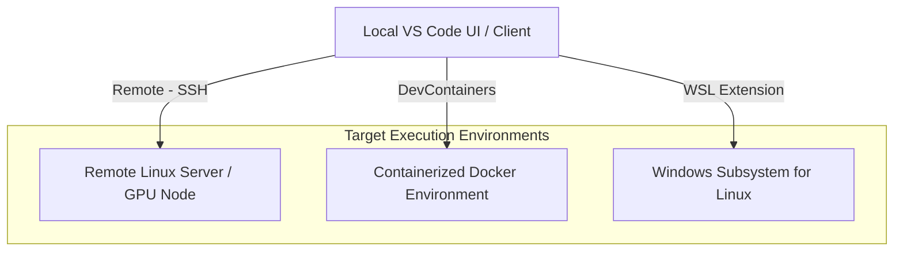

# Visual Studio Code for AI-Driven Development

!!! info "Learning Objectives"
    By the end of this section, you will be able to:
    * **Master** the fundamentals of editing, previewing, and formatting Markdown and Python files within VS Code.
    * **Install and configure** AI coding extensions, specifically **Continue** (for inline assistance) and **Cline** (for autonomous agency).
    * **Connect** local and remote Large Language Models (LLMs) via providers like Ollama.
    * **Utilize** VS Code Remote extensions to develop inside containers, remote servers, or WSL environments.
    * **Critically evaluate** AI assistant outputs by identifying and mitigating LLM hallucinations.

---

## Introduction
Visual Studio Code (VS Code) is more than just a text editor; it is an extensible platform that serves as the industry standard for AI-assisted development. Its strength lies in its massive ecosystem of extensions, which allow it to transform from a simple code editor into a full-featured IDE capable of managing remote GPU clusters and orchestrating autonomous AI agents.

---

## 1. The Basics: Markdown and Python

VS Code provides a streamlined workspace for combining documentation and code, which is essential for technical research and AI experimentation.

### Working with Markdown (`.md`)
Documentation is as important as code. VS Code offers a seamless way to write and preview Markdown:
* **Live Preview:** Open any `.md` file and click the **Open Preview to the Side** icon (split-editor symbol) in the top-right corner.
* **Shortcut:** Press `Ctrl+Shift+V` (Windows/Linux) or `Cmd+Shift+V` (macOS) to open the preview in a dedicated tab.
* **Tip:** Use a Markdown extension (like "Markdown All in One") to add automatic table of contents and better formatting shortcuts.

### Python Development (`.py`)
To turn VS Code into a powerful Python IDE:
1. **Install the Python Extension:** Search for "Python" by Microsoft in the Extensions view (`Ctrl/Cmd+Shift+X`).
2. **Select Interpreter:** Open the Command Palette (`Ctrl/Cmd+Shift+P`) $\rightarrow$ `Python: Select Interpreter` $\rightarrow$ Choose your desired virtual environment or global installation.
3. **Run & Debug:** Run scripts directly in the integrated terminal (`Ctrl + ` `) or use the "Run" button in the top-right corner.

---

## 2. Enhancing with AI: Continue and Cline

Modern development involves a partnership between the human coder and AI. VS Code allows you to integrate different types of AI assistance.

### A. Inline Assistance with Continue
**Continue** is an open-source assistant designed for inline edits, tab-autocomplete, and side-panel chat.

1. **Installation:** Install **Continue** from the Extensions Marketplace.
2. **Connecting a Local LLM (via Ollama):**
    * Install [Ollama](https://ollama.com).
    * Pull a model: `ollama run llama3.1:8b`.
    * Open the Continue config file (`~/.continue/config.yaml`) and add your model:
      ```yaml
      models:
        - name: Local Chat
          provider: ollama
          model: llama3.1:8b
      ```
3. **Core Workflow:**
    * `Ctrl/Cmd + L`: Open the chat panel to discuss code.
    * `Ctrl/Cmd + I`: Trigger inline modifications to a highlighted block of code.

### B. Autonomous Agency with Cline
**Cline** takes AI a step further by acting as an autonomous agent that can actually "do" work rather than just suggesting it.

1. **Installation:** Install **Cline** from the Extensions Marketplace.
2. **Configuration:** Open the Cline panel $\rightarrow$ Gear Icon $\rightarrow$ Select your provider (Anthropic, OpenRouter, or local OpenAI-compatible endpoints like Ollama).
3. **Core Workflow:** Give Cline a high-level objective (e.g., *"Implement a logging system for this project and ensure it's tested"*). Cline will:
    * Analyze the repository structure.
    * Draft necessary file changes.
    * Execute terminal commands to run tests and verify the fix.
    * Prompt you for approval before making critical changes.

---

## 3. Advanced Environments: Remote Development

The **Remote Development** extension pack allows you to keep your UI local while your code executes in a powerful remote environment.

### Core Use Cases
* **Remote Servers & GPU Nodes:** Connect via **SSH** to develop directly on multi-GPU servers without the need to manually sync files via SCP or FTP.
* **DevContainers:** Use **Docker** to spin up isolated environments. This ensures that every team member has the exact same version of Python, libraries, and OS tools.
* **WSL (Windows Subsystem for Linux):** The best of both worlds—Windows UI with a native Linux kernel for running Linux-only tools.


### The Remote Explorer
Once the Remote Development extension pack is installed, VS Code provides a dedicated **Remote Explorer** view in the Activity Bar (the sidebar on the left). This serves as a centralized dashboard for managing all your remote targets.

* **How to Access:** Click the monitor/computer icon in the Activity Bar.
* **Key Features:**
    * **SSH Targets:** Manage your known SSH hosts. You can quickly connect to a server, edit the SSH config file, or remove old hosts.
    * **Dev Containers:** View and launch containers defined by `devcontainer.json` in your project.
    * **WSL:** Easily switch between different installed Linux distributions on your Windows machine.


### Architecture Overview


---

## 4. Critical Thinking: Understanding AI Hallucinations

As you rely more on AI, you must develop a critical eye for **hallucinations**—instances where the AI confidently generates false information.

### Identifying Hallucinations
* **Fake Libraries:** Suggesting a Python module that doesn't exist (e.g., `import fast_ai_magic_optimizer`).
* **Incorrect API Parameters:** Inventing a parameter for a function that was deprecated years ago or never existed.
* **Logical Gaps:** Writing code that looks correct but contains a subtle "off-by-one" error or a race condition.

### Mitigation Strategies
1. **Verification:** Always cross-reference AI-generated imports and API calls with official documentation.
2. **Agentic Verification:** Use tools like **Cline** that can run the code and see the actual error message, forcing the AI to correct its own hallucinations.
3. **Workspace Scoping:** Provide the AI with only the relevant files to prevent it from getting "confused" by irrelevant context.

---

## Assignments

!!! note "Assignment 1: Basic Setup & Workflow"
    **Task:** 
    1. Create a project folder containing `notes.md` and `utils.py`.
    2. In `notes.md`, create a table of contents and a list of goals using Markdown.
    3. In `utils.py`, implement a function that calculates the Fibonacci sequence.
    4. Use the **Split View** to keep the Markdown preview open on the right while you code on the left.
    **Deliverable:** A screenshot of your VS Code workspace showing the split-view with both the code and the rendered Markdown.

!!! note "Assignment 2: Local AI Integration"
    **Task:** 
    1. Install **Continue** and connect it to a local model via **Ollama**.
    2. Use the `Ctrl/Cmd + L` chat to ask the AI to explain how your Fibonacci function works.
    3. Use `Ctrl/Cmd + I` to refactor the function to be more efficient (e.g., using memoization).
    **Deliverable:** A copy of the chat history or a screenshot showing the "Before" and "After" of the refactored code.

!!! note "Assignment 3: The Autonomous Agent Challenge"
    **Task:** 
    1. Install **Cline**.
    2. Task Cline with: *"Write a comprehensive set of unit tests using `pytest` for `utils.py`, and run them to ensure they all pass."*
    3. Review the proposed changes and approve the execution of the tests.
    **Deliverable:** A screenshot of the terminal showing the `pytest` results (all green) and the newly created test file.
