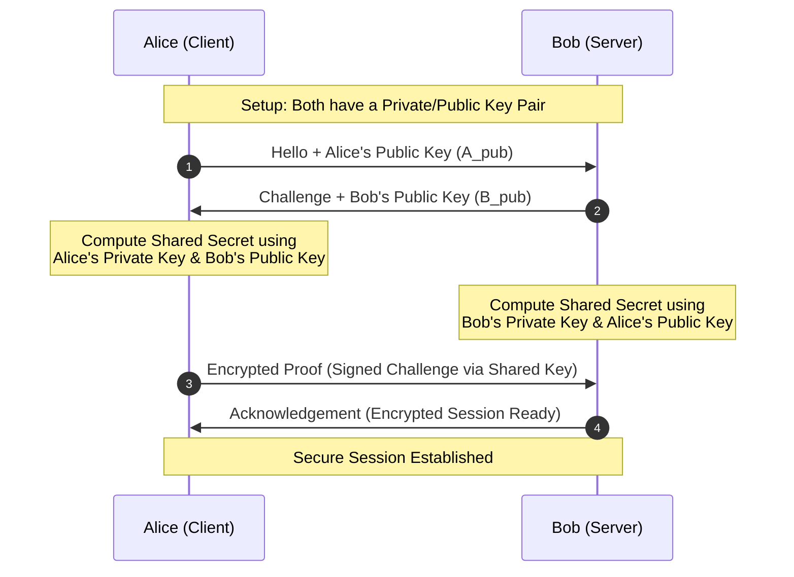
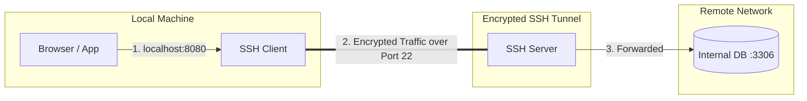
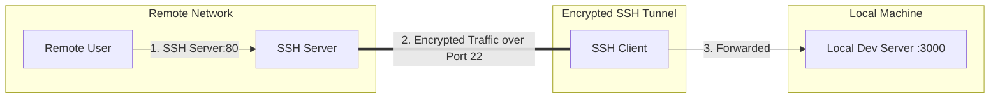
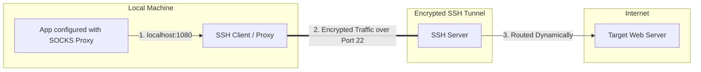

# Secure Shell (SSH)

---

!!! info "Learning Outcomes"
    - Learn how to use SSH keys securely.
    - Master `ssh-add` and agent configuration so you only have to type your passphrase once per session.
    - Understand why each computer requires its own unique SSH key pair.
    - Recognize the critical importance of protecting private keys with strong passphrases.

---

## The Concept

[Secure Shell](http://openssh.com/manual.html) is a network protocol allowing users to securely connect to remote resources over the internet. It ensures that all messages exchanged between communicating entities remain confidential and tamper-proof. 

Secure Shell relies on public-key cryptography:

1. **Key Generation:** A public-private key pair is generated on your local computer.
2. **Key Distribution:** The public key is uploaded to the remote machine(s) you wish to access.
3. **Authentication:** During connection establishment, the client and server test the key pair. If they match, access is granted.

To illustrate the concept of key authentication we use the typical diagram



Use code with caution.Handshake Steps

* Step 1: Alice sends her public key to Bob.
* Step 2: Bob replies with a challenge and his public key.
* Step 3 & 4: Both sides use math to combine their own private key with the other person's public key to make the same shared secret key.
* Step 5 & 6: Alice proves she knows the key, and Bob confirms the secure link.

## Using SSH

Most important for using ssh in practice is the `.ssh` directory.


Because multiple users may share a computer, servers maintain a list of authorized public keys (`~/.ssh/authorized_keys`), allowing multiple authorized computers to connect safely.

---

!!! warning "Security Best Practice"
    **Never copy your private key to another machine, and always protect your private key with a strong passphrase.** 

---

## 1. Generating Keys (`ssh-keygen`)

Before creating new keys, check whether an existing key pair is already available on your machine:

```bash
$ ls ~/.ssh

```

If files named `id_rsa.pub` or `id_ed25519.pub` exist, your keys are already set up. If you know the passphrase, you can reuse them. Otherwise, you will need to generate a new key pair.

### Key Generation Steps

To generate a new RSA key pair, execute:

```bash
$ ssh-keygen -t rsa -b 4096 -C "your_email@example.com"

```

1. **File Location:** The program prompts:

```text
Enter file in which to save the key (/home/localname/.ssh/id_rsa):
```

Press **Enter** to accept the default location (`~/.ssh/id_rsa`).

2. **Passphrase:** You will be prompted for a passphrase:

```text
Enter passphrase (empty for no passphrase):
Enter same passphrase again:
```


**You MUST provide a strong passphrase.** Leaving it blank creates a major security vulnerability: if an unauthorized person gains access to your computer, they instantly gain access to every remote server and cloud resource tied to your public key.

### Verification

Once generated, verify your public key contents:

```bash
$ cat ~/.ssh/id_rsa.pub
```

Your `~/.ssh` directory should contain:

* `id_rsa` (**Private key** — keep secret, never share or copy).
* `id_rsa.pub` (**Public key** — safe to share and upload to servers).
* `authorized_keys` (List of allowed public keys on a server).
* `known_hosts` (Fingerprints of servers you have connected to).

To change your passphrase later without re-generating keys, run:

```bash
$ ssh-keygen -p
```

---

## 2. Managing Keys (`ssh-agent` and `ssh-add`)

Using a passphrase protects your keys, but typing it for every connection can be tedious. The `ssh-agent` and `ssh-add` tools solve this by caching your decrypted key in memory for your current terminal session.

### Starting the Agent

Start the SSH agent in your shell session:

```bash
$ eval "$(ssh-agent -s)"
```

### Adding Your Key

Add your private key to the agent:

```bash
$ ssh-add ~/.ssh/id_rsa
```

You will be prompted for your passphrase **once**. For the remainder of your session, remote connections will authenticate automatically through the agent.

### Useful `ssh-add` Options

| Option | Description |
| --- | --- |
| `-l` | Lists fingerprints of all identities currently represented by the agent. |
| `-L` | Lists public key parameters of all identities in the agent. |
| `-d` | Removes a specific identity from the agent. |
| `-D` | Deletes all identities from the agent. |
| `-x` / `-X` | Locks / unlocks the agent with a password. |

### Persistent Configuration (macOS / Linux)

To automatically add keys to your macOS keychain or Linux SSH agent on startup, configure `~/.ssh/config`:

```text
Host *
  UseKeychain yes
  AddKeysToAgent yes
  IdentityFile ~/.ssh/id_rsa
```

---

## 3. Accessing Remote Machines

To log into a remote server using your key pair, you must copy your public key to the remote host's `authorized_keys` file.

The easiest method is using `ssh-copy-id`:

```bash
$ ssh-copy-id user@host
```

*(Note: You will be asked for your remote account password the first time).*

If `ssh-copy-id` is unavailable, you can append it manually over SSH:

```bash
$ cat ~/.ssh/id_rsa.pub | ssh user@host 'cat >> .ssh/authorized_keys'
```

Once configured, connect securely without password prompts:

```bash
$ ssh user@host
```

---

## 4. SSH Port Forwarding (Tunneling)

SSH tunneling creates an encrypted connection between a local and remote computer, allowing you to securely relay unencrypted traffic or access private networks.

### Server Prerequisites

To permit port forwarding, ensure the OpenSSH server configuration (`/etc/ssh/sshd_config`) allows it:

```text
AllowTcpForwarding yes
GatewayPorts yes
```

Restart the SSH daemon afterward (e.g., `sudo systemctl restart sshd` on Linux).

---

### A. Local Port Forwarding (`-L`)

Connects a local port to a destination service accessible from the remote SSH server.

* **Command Structure:**

```bash
ssh -L [LOCAL_PORT]:[DESTINATION_IP]:[DESTINATION_PORT] [USER]@[SSH_SERVER_IP]
```


* **Common Use Case:** Accessing a private database behind a jump server or firewall.



---

### B. Remote Port Forwarding (`-R`)

Allows users on the remote network to access a service running on your local machine.

* **Command Structure:**

```bash
ssh -R [REMOTE_PORT]:[LOCAL_DESTINATION_IP]:[LOCAL_DESTINATION_PORT] [USER]@[SSH_SERVER_IP]

```


* **Common Use Case:** Exposing a local development server (`localhost:3000`) to a public server or client.



---

### C. Dynamic Port Forwarding (`-D`)

Turns your local machine into a SOCKS proxy server, routing any application traffic dynamically through the remote SSH server.

* **Command Structure:**

```bash
ssh -D [LOCAL_PROXY_PORT] [USER]@[SSH_SERVER_IP]
```


* **Common Use Case:** Secure browsing over public Wi-Fi or bypassing restrictive network filters.



---

## 5. Security Summary & Best Practices

* **Never use blank passphrases** for production or cloud keys (such as Chameleon Cloud or FutureSystems); doing so violates course security policies and risks academic penalties.
* **Isolate your keys:** Generate a distinct key pair for each server or cluster you manage rather than duplicating a single private key everywhere.
* **Protect offline backups:** If you store key backups on an external drive or USB stick, ensure the storage medium is fully encrypted.


## References

* [The Secure Shell: The Definitive Guide, 2 Ed (O'Reilly and
  Associates)](http://shop.oreilly.com/product/9780596008956.do)

## Exercises

!!! assignment "SSH.1 Keypair"
    Create an SSH key pair

!!! assignment "E.SSH.2 Key upload"
    Upload the public key to git repository you use. 

!!! assignment "E.SSH.3 githib.com"
    Get an account on. Upload your key. Provide a guide in md.

!!! assignment "E.SSH.4 access-ci.org"
    Get an account on access-ci.org (if you are authorized to do
    so). Upload your key. Provide a guide.

!!! assignment "E.SSH.5 chamelopncloud.org"
    Get an account on (if you are authorized to do
    so). Upload your key. Provide a guide.

!!! assignment "E.SSH.6: Private key handeling"
    What can happen if you copy your private key to a machine on the network?

!!! assignment "E.SSH.6: Private key sharing"
    Should I share my provate key with others?

!!! assignment "E.SSH.7: Private key via video"
    Assume I participate in a video conference call and I accidently share
    my private key. What should I do?

!!! assignment "E.SSH.8: Public key via video"
    Assume I participate in a video conference call and I accidently share
    my public key. What should I do?

!!! assignment "E.SSH.8: Can i share my ?ublic key?"
    Am I allowed to share my public key?
