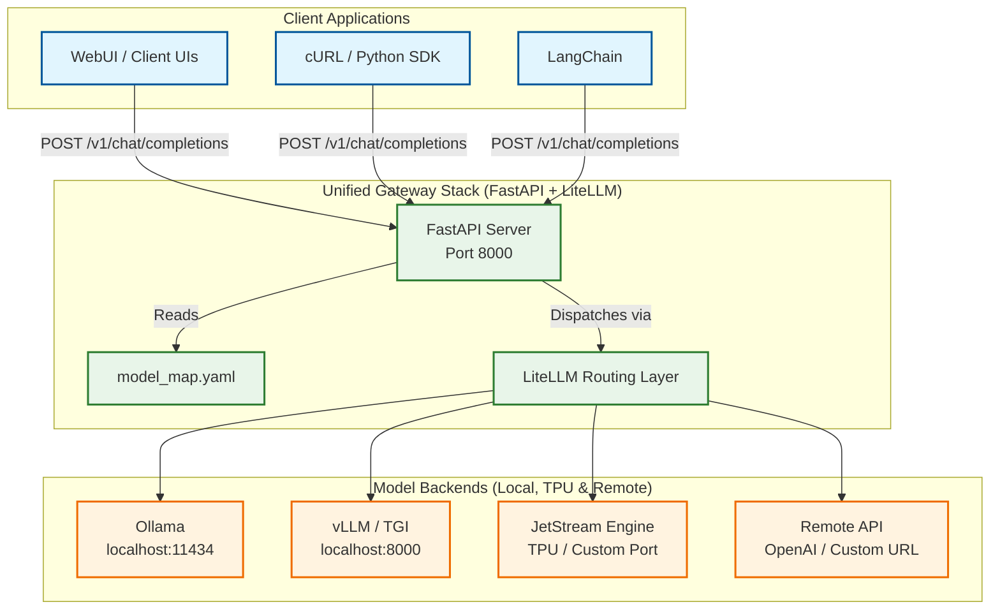

# Zero-Cost Unified LLM Gateway & Router Architecture

A single HTTP endpoint (`POST /v1/chat/completions`) that acts as a universal router for any number of locally-hosted LLMs, high-throughput TPU inference engines like **JetStream**, and remote models.

---

## 1. Executive Summary & Stack Breakdown

| Layer | Tool | Why it fits the "pay-nothing" requirement |
| --- | --- | --- |
| **Router / Gateway** | **LiteLLM** (MIT-licensed Python package) | Provides a unified OpenAI-style API, forwards to any provider, adds cheap routing, fallback, token-counting, and optional caching. |
| **Model Servers & Backends** | **Ollama**, **vLLM**, **TGI**, **JetStream** | Whichever high-performance engine you already run; all expose simple HTTP endpoints (`/v1/completions` or `/v1/chat/completions`). Free to run locally. |
| **Web Server** | **FastAPI** (with Uvicorn) | A thin wrapper that turns LiteLLM into an OpenAI-compatible endpoint that any UI, SDK, or client can call. Runs on any containerized port. |

---

## 2. Complete Architecture Diagram (Mermaid)



---

## 3. Installation Checklist (One-Time)

Create a fresh virtual environment and install the minimal required packages:

```bash
# Create and activate virtual environment
python3 -m venv .venv
source .venv/bin/activate

# Install LiteLLM + FastAPI + Uvicorn + PyYAML
pip install --upgrade litellm fastapi uvicorn pyyaml

```

---

## 4. Configuration File (`model_map.yaml`)

This file tells LiteLLM how to reach each local, TPU, or remote backend.

```yaml
# model_map.yaml
# -----------------------------------------------------------------
# 1️⃣ Locally-hosted Ollama models (HTTP port 11434)
ollama/llama3.1:8b:
  litellm_params:
    model: "ollama/llama3.1:8b"
    api_base: "http://localhost:11434/v1"
    api_key: "dummy"                 # Ollama ignores key; LiteLLM requires non-empty string

ollama/mistral:
  litellm_params:
    model: "ollama/mistral"
    api_base: "http://localhost:11434/v1"
    api_key: "dummy"

# 2️⃣ Locally-hosted vLLM model (HTTP port 8000)
vllm/mistral-7b-instruct:
  litellm_params:
    model: "vllm/mistral-7b-instruct"
    api_base: "http://localhost:8000/v1"
    api_key: "dummy"

# 3️⃣ JetStream Engine (High-throughput TPU inference backend)
jetstream/gemma-7b:
  litellm_params:
    model: "openai/gemma-7b"
    api_base: "http://localhost:9000/v1" # Adjust to your JetStream port
    api_key: "dummy"

# 4️⃣ Remote OpenAI model (Free tier / Paid key via environment)
openai/gpt-4o:
  litellm_params:
    model: "gpt-4o"
    # LiteLLM automatically picks up OPENAI_API_KEY from environment

# 5️⃣ Arbitrary remote OpenAI-compatible endpoint
custom/remote-model:
  litellm_params:
    model: "my-remote-model"
    api_base: "http://my-remote-model.com/v1"
    api_key: "my-remote-token"       # Omit or set to dummy if public

```

---

## 5. Router Server Implementation (`litellm_router.py`)

Save the following file in the same directory as your `model_map.yaml`:

```python
# litellm_router.py
import os
import yaml
from fastapi import FastAPI, Request, HTTPException
from fastapi.responses import JSONResponse
from litellm import acompletion, BadRequestError, ServiceUnavailableError

# ---------------------------------------------------------------
# 1️⃣ Load the model map
MODEL_MAP_PATH = "model_map.yaml"
if not os.path.exists(MODEL_MAP_PATH):
    raise FileNotFoundError(f"{MODEL_MAP_PATH} not found")

with open(MODEL_MAP_PATH, "r") as f:
    model_cfg = yaml.safe_load(f)

def get_litellm_params(model_name: str) -> dict:
    """Return the LiteLLM kwargs for a given model name."""
    if model_name not in model_cfg:
        raise HTTPException(status_code=404, detail=f"Model '{model_name}' not defined")
    return model_cfg[model_name]["litellm_params"].copy()

# ---------------------------------------------------------------
# 2️⃣ FastAPI – OpenAI-compatible endpoint
app = FastAPI(title="Unified LiteLLM Router", version="0.1")

@app.post("/v1/chat/completions")
async def chat_completion(request: Request):
    payload = await request.json()
    model_name = payload.get("model")
    if not model_name:
        raise HTTPException(status_code=400, detail="Missing 'model' field")

    # Build LiteLLM request payload
    llm_params = get_litellm_params(model_name)
    llm_params.update({k: v for k, v in payload.items() if k != "model"})

    try:
        litellm_response = await acompletion(**llm_params)
    except BadRequestError as e:
        raise HTTPException(status_code=400, detail=str(e))
    except ServiceUnavailableError as e:
        raise HTTPException(status_code=503, detail=str(e))
    except Exception as e:
        raise HTTPException(status_code=500, detail=f"Unexpected error: {e}")

    # Ensure response echoes the alias name used by the caller
    litellm_response["model"] = model_name
    return JSONResponse(content=litellm_response)

# ---------------------------------------------------------------
# 3️⃣ Health check endpoint
@app.get("/health")
def health():
    return {"status": "ok", "available_models": list(model_cfg.keys())}

```

---

## 6. Running the Router & Client Usage

Start the FastAPI server via Uvicorn:

```bash
export OPENAI_API_KEY="sk-...your-key..."
uvicorn litellm_router:app --host 0.0.0.0 --port 8000

```

### Python SDK Example (Calling JetStream)

```python
import openai

openai.api_base = "http://localhost:8000/v1"
openai.api_key = "any-string"

resp = openai.ChatCompletion.create(
    model="jetstream/gemma-7b",
    messages=[{"role": "user", "content": "Explain tensor parallelism briefly."}],
    temperature=0.2,
    max_tokens=150,
)

print(resp.choices[0].message.content)

```

---

## 7. Containerized Deployment (Docker Compose)

```yaml
# docker-compose.yml
version: "3.9"

services:
  ollama:
    image: ollama/ollama:latest
    container_name: ollama
    restart: unless-stopped
    ports:
      - "11434:11434"
    volumes:
      - ollama_data:/root/.ollama
    command: ["ollama", "serve"]

  router:
    build: .
    container_name: litellm_router
    restart: unless-stopped
    depends_on:
      - ollama
    environment:
      - OPENAI_API_KEY=${OPENAI_API_KEY}
    ports:
      - "8000:8000"
    volumes:
      - ./model_map.yaml:/app/model_map.yaml:ro
    command: ["uvicorn", "litellm_router:app", "--host", "0.0.0.0", "--port", "8000"]

volumes:
  ollama_data:

```

---


## Self-Assessment
!!! tip "Self-Assessment"
    Test your knowledge by expanding the questions below.

??? question "What is the role of LiteLLM in the unified gateway architecture?"
    LiteLLM acts as the universal routing layer. It provides a unified OpenAI-style API that can forward requests to any number of backends (Ollama, vLLM, JetStream, or remote APIs), while handling routing, fallback, token counting, and optional caching.

??? question "Why is FastAPI used in this stack?"
    FastAPI serves as a thin web server wrapper. It turns the LiteLLM routing logic into a production-ready, OpenAI-compatible HTTP endpoint that can be called by any standard UI, SDK, or client.

??? question "How does the `model_map.yaml` file function in the routing process?"
    The `model_map.yaml` file is the configuration registry. It maps a friendly model alias (e.g., `jetstream/gemma-7b`) to the specific backend parameters required by LiteLLM, such as the `api_base` (URL) and the actual `model` identifier used by the backend server.
